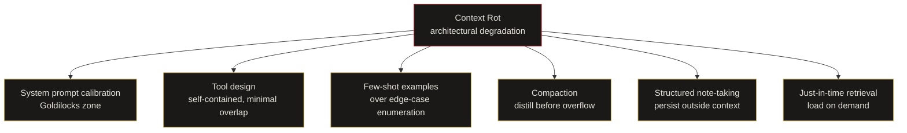
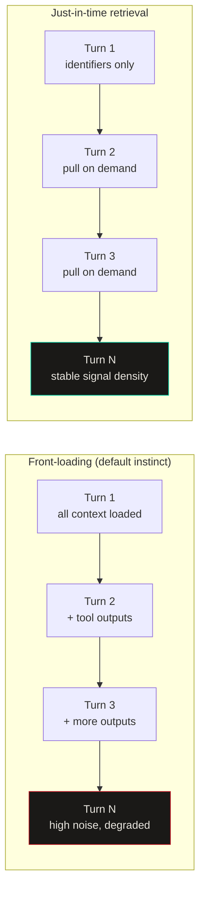

import Callout from '../../components/Callout.astro';
import StatRow from '../../components/StatRow.astro';
import PullQuote from '../../components/PullQuote.astro';
import SectionLabel from '../../components/SectionLabel.astro';
import ScrollReveal from '../../components/ScrollReveal.astro';
import DiagramBlock from '../../components/DiagramBlock.astro';

Most coverage of Anthropic's context engineering post treated it as a tip sheet. Six recommendations, skim the headers, move on. What got dropped was the load-bearing claim underneath all six: context degrades with length as an architectural property, not a configuration problem, and the recommendations are responses to a structural failure mode that hits every long-horizon agent on a predictable curve.

If you build agents that run longer than a single turn, that distinction matters. A tip sheet is optional. A structural failure mode is not.

---

<SectionLabel text="The Failure Mode" />

## Context rot is not a bug

The transformer architecture creates pairwise attention relationships between every token in the context window. Double the context length and you quadruple the number of relationships the model must weigh. At scale, attention becomes diffuse. The model's ability to retrieve specific information and maintain long-range reasoning degrades measurably before the context window overflows.[^1]

Anthropic states this plainly. Models maintain capable performance at longer contexts, but show "reduced precision for information retrieval and long-range reasoning" compared to shorter sequences. The mechanism is the architecture itself: every token attends to every other token, and as the window grows, the attention budget spreads thinner.[^2]

<ScrollReveal>
<PullQuote>
Context rot is not a configuration problem and no amount of better prompting fixes it at scale. The degradation is baked into transformer architecture. The six recommendations exist because the window is finite in a way that matters before you hit the limit.
</PullQuote>
</ScrollReveal>

This is the claim most coverage stripped out. Without it, the six recommendations read as style preferences. With it, they read as what they are: a set of mitigations for a failure mode that compounds as your agent runs longer.

The practical implication is uncomfortable. A 200K token context window does not mean 200K tokens of equal utility. The effective working space is smaller, and it shrinks as the session accumulates noise, redundant tool outputs, and processed results the agent no longer needs. You are not racing against an overflow. You are managing a degradation curve.

<Callout variant="insight">
The question is not "will we hit the context limit?" The question is "at what token count does output quality drop below acceptable?" For most production agents, that threshold arrives well before the window fills.
</Callout>

---

<SectionLabel text="The Six" />

## One problem, six responses

The six recommendations form a coherent response to the degradation curve, not a checklist of independent tips. System prompt calibration, tool design, few-shot examples, compaction, structured note-taking, and just-in-time retrieval all address the same problem from different angles: how do you keep the context window populated with signal instead of noise?

<ScrollReveal>
<DiagramBlock caption="Six context engineering strategies mapped to the degradation problem each addresses">

</DiagramBlock>
</ScrollReveal>

Anthropic's framing on system prompts is worth pausing on. They call the target zone "Goldilocks": specific enough to guide behavior, flexible enough to provide strong heuristics. The anthropomorphism is doing work. The real constraint is simpler: system prompt tokens are always in context, and every one of them is a token that cannot carry task-relevant content. Over-specification burns budget on rules that rarely fire. Under-specification burns it later when the agent has to reason through ambiguous cases in-flight. The calibration problem is real and task-dependent.

Tool design is the same pressure from a different angle. A bloated tool set with functional overlap forces the model to resolve ambiguity at every tool call. That resolution costs tokens and compounds with context length.

---

<SectionLabel text="Sub-Agents" />

## The most underreported recommendation

The sub-agent architecture is the only mechanism on the list that offers an actual escape from context rot for long-horizon tasks rather than a slower path toward it.

The structure: a coordinating agent maintains the high-level plan and delegates focused tasks to sub-agents with isolated context windows. Each sub-agent runs deep, consuming tens of thousands of tokens for technical work or tool-heavy exploration, then returns a distilled summary of 1,000 to 2,000 tokens to the coordinator.[^3] The detailed search context stays isolated inside the sub-agent. The coordinator's window stays clean.

<ScrollReveal>
<StatRow stats={[
  { value: "10K+", label: "Tokens a sub-agent may consume" },
  { value: "1-2K", label: "Tokens returned to coordinator" },
  { value: "5-10x", label: "Context compression per delegation" }
]} />
</ScrollReveal>

This changes agent system design from the start. If you are building a long-horizon agent as a single context thread, you are on the degradation curve for the full run. If you are building it as a coordinator-plus-specialists architecture, each specialist runs a fresh context for its task and compresses on return. The coordinator operates at a fraction of the token density it would otherwise accumulate.

Most summaries named the sub-agent pattern as one of six tips. It is not a tip in the same category as "use XML tags." It is an architectural decision that determines whether your agent is fighting context rot or sidestepping it.

<Callout variant="warning">
Designing a long-horizon agent as a single thread and then adding compaction is the equivalent of running up a down escalator. You can do it, but you are working against the structure. Sub-agents are not an optimization; they are a different structural choice.
</Callout>

---

<SectionLabel text="Memory and Retrieval" />

## Where the floor shows

Structured note-taking and just-in-time retrieval are the two recommendations where the Anthropic post is both most useful and most incomplete.

On structured note-taking: agents maintain notes persisted outside the context window and retrieve them on demand. Anthropic cites Claude Code's to-do lists and custom agents that maintain progress files tracking state across complex tasks. They also note a memory tool in public beta that enables agents to build knowledge bases over time and reference previous work without keeping everything in context.

This validates the pattern. It also exposes the floor. A file-based notes system works until it needs to answer questions about what to retrieve, when to retrieve it, and whether the retrieved content is still accurate. Without a memory layer that enforces schema, tracks decay, and distinguishes between a decision made last session and a gotcha discovered three months ago, structured note-taking is a text file that grows until you stop trusting it.

Agents built on typed, decaying memory stores operate differently. A fact typed as a decision retrieves differently than a fact typed as an incident. The type controls recall. The decay weight controls whether the fact surfaces in a fresh session or stays buried until queried. The Anthropic recommendation points at this architecture without specifying it.

On just-in-time retrieval: the recommendation is to maintain lightweight identifiers at session start, file paths and stored queries and links, and load full content dynamically during execution rather than front-loading it. Anthropic calls this progressive disclosure.

Most builders front-load context because it feels safer. Everything the agent might need is present at turn one. The problem is that most of what was front-loaded is not what the task actually required, and it sits in context as noise for the full run. Progressive disclosure through runtime tool calls is harder to design. It requires the agent to know what it does not know and to ask for it at the right moment. That is operationally harder and more reliable at scale.

<ScrollReveal>
<DiagramBlock caption="Front-loading versus progressive disclosure: context density over a multi-turn session">

</DiagramBlock>
</ScrollReveal>

---

<SectionLabel text="Counterarguments" />

## The objections worth taking seriously

**Few-shot examples are not always cheaper than explicit rules at the same token count.** Anthropic recommends examples over edge-case enumeration on the grounds that examples are more expressive per token. This is true for common behavior and recognized patterns. It is not reliably true for unusual edge cases. A rule that says "never do X in state Y" is one token-efficient statement. A few-shot example demonstrating the same requires the full setup: the state, the wrong action, the correction, the context that makes the correction legible. For conditionals with unusual state, explicit enumeration is sometimes cheaper and more reliable. The guidance is directional, not universal.

**Compaction loses information by design, and the tuning guidance is vague.** Anthropic is honest about this: compaction distills the context window in a "high-fidelity manner," and the recommended approach is to start by maximizing recall and then iterate to improve precision by eliminating what is superfluous. The risk they name is "overly aggressive compaction," which can lose subtle context whose importance only becomes apparent later. What the post does not provide is a principled method for deciding what is subtle but critical versus what is safely discarded. The guidance is "iterate." For production agents running tasks where subtle context matters, iterate is not an engineering specification. Compaction is a lossy operation and the loss function is not specified.

**File-based structured note-taking is operationally fragile without a memory layer that enforces schema and decay.** The recommendation to maintain NOTES.md files or similar persistence is valid as a starting point. It becomes fragile at scale because nothing in a flat file enforces structure, prevents staleness, or enables typed retrieval. An agent that reads its entire notes file back into context at every session has not solved the context problem: it has deferred it. Without schema enforcement and decay tracking, the notes file eventually becomes the same noise problem as the unmanaged context window.

<Callout variant="note">
The employment disclaimer applies here: these are the author's views, not those of any employer.
</Callout>

---

<SectionLabel text="What Holds" />

## The argument that survives the objections

The counterarguments above do not undermine the core claim. They constrain it.

Context rot is real, architectural, and compounds over session length. The six recommendations are genuine responses to a structural problem. Most agent systems treat them as optional style improvements. That gap between what the post argues and what the coverage reported is the thing worth knowing.

The sub-agent pattern is the most underbuilt piece in the systems I see. Single-thread is the default because it is simpler to build. Sub-agents require a coordinator that decomposes work, delegates, and integrates compressed results. That design cost is real. So is the compounding cost of skipping it.

Just-in-time retrieval and structured note-taking are pointing at the same requirement: a memory layer external to the context window, typed for retrieval, designed to stay accurate over time. The Anthropic post identifies this requirement. It does not specify the implementation. That gap is where the actual engineering work lives.

What I am watching: whether the sub-agent pattern becomes a first-class abstraction in the frameworks, or stays something individual teams implement differently and debug independently. The architecture is sound. The tooling is not there yet.

*Casey Gager builds a personal AI orchestration system. He writes about what works, what breaks, and what he is still figuring out. Views are his own, not those of any employer.*

[^1]: Chroma's 2025 benchmark study tested 18 frontier models and found measurable output quality degradation well before context window overflow, attributed to the quadratic complexity of transformer attention computation. See also: "Context Rot & Token Budget Management Research," T549-R5 (2026-04-13).
[^2]: Anthropic, "Effective Context Engineering for AI Agents," anthropic.com/engineering, 2026.
[^3]: Anthropic, ibid. The specific figures (10K+ tokens consumed per sub-agent, 1,000-2,000 tokens returned) are drawn directly from the post.
