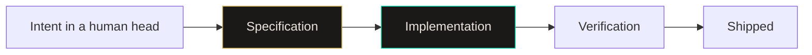
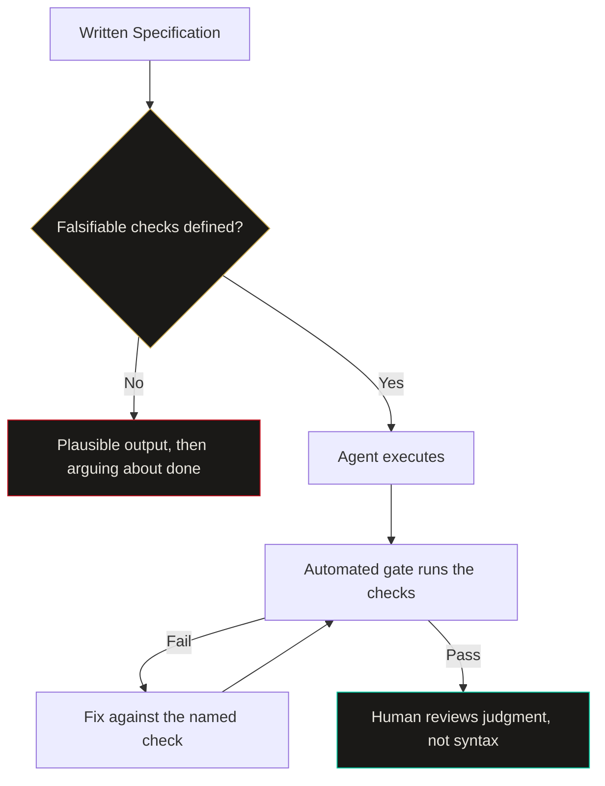

import Callout from '../../components/Callout.astro';
import StatRow from '../../components/StatRow.astro';
import PullQuote from '../../components/PullQuote.astro';
import SectionLabel from '../../components/SectionLabel.astro';
import ScrollReveal from '../../components/ScrollReveal.astro';
import DiagramBlock from '../../components/DiagramBlock.astro';

In July 2025, METR ran a randomized controlled trial on 16 experienced open source developers working in repositories they had maintained for years. With AI tools, they finished tasks 19% slower. They estimated they had been 20% faster.[^1]

A 39-point gap between how fast you feel and how fast you are. Obviously this is fine.

<ScrollReveal>
<StatRow stats={[
  { value: "19%", label: "Slower with AI tools" },
  { value: "20%", label: "Faster they felt" },
  { value: "66%", label: "Hit almost right output" }
]} />
</ScrollReveal>

---

<SectionLabel text="The Inversion" />

## What actually got cheap

Everyone wanted a code-generating genie. Nobody reread the part where genies are famously literal.

The thing that got cheap is typing. Syntax, boilerplate, the glue between two libraries, the test scaffold, the migration script you have written 40 times. All of it collapsed toward free. That was the expensive part for most of software history, so watching it evaporate feels like the whole job got easier.

It did not. The cost moved.

<ScrollReveal>
<DiagramBlock caption="The pipeline did not get shorter, the expensive step moved left">

</DiagramBlock>
</ScrollReveal>

Green is the cheap step now. Gold is where your day goes. Implementation used to be the wall everything piled up against, so we built an entire professional identity around scaling it: better frameworks, better editors, better hiring filters for people who can invert a binary tree under fluorescent lighting.

Now the wall is upstream. Getting from "what I actually want" to "a description precise enough that a machine cannot misread it" is the work. Nobody built an identity around that, because until recently it did not pay.

<Callout variant="insight" label="The move">
When implementation cost goes to zero, the quality of the output is bounded entirely by the quality of the input. Not the model. The input. A better model executes a vague spec faster and produces a wrong thing sooner.
</Callout>

---

<SectionLabel text="The Evidence" />

## The gap is not model intelligence

The most common complaint developers report about AI output is not that it fails. It is that it almost works. In the 2025 Stack Overflow survey, 66% of respondents named "AI solutions that are almost right, but not quite" as a top frustration, and debugging AI-generated code ranked high on the list of things that eat more time than they save.[^2]

Almost right is the signature of a specification problem, not a capability problem. A model that lacks the ability to solve your problem produces something obviously broken. A model that has the ability but not the constraints produces something that compiles, passes a smoke test, reads well in review, and is quietly wrong in the two places you never wrote down.

<PullQuote>
Vague input plus a capable model does not give you a vague result. It gives you a confident, well-formatted, fully-tested result that solves a problem adjacent to yours.
</PullQuote>

I watched this happen on my own content pipeline. Early dispatches against my agent fleet produced articles that were structurally perfect: valid frontmatter, correct component imports, clean build, zero syntax errors. They were also written in the wrong voice and contained internal tool names that were never supposed to leave the building. Every automated check I had at the time passed. The output was garbage. The model was fine.

The monkey's paw does not curl because the wish was too ambitious. It curls because the wish was underspecified.

---

<SectionLabel text="Brooks Was Right" />

## Essence and accident, 40 years later

Fred Brooks split software difficulty into two categories in 1987.[^3] Accidental complexity is the stuff that comes from your tools: memory management, build systems, the seventeen ways to configure a bundler. Essential complexity is the irreducible difficulty of specifying what the thing must do and how its pieces relate.

His argument was that no single tool would deliver an order-of-magnitude gain, because tooling only ever attacks accidents, and accidents were already a shrinking fraction of the total cost.

AI is the strongest attack on accidental complexity anyone has ever built. It is also, so far, a complete non-answer to essential complexity. Brooks called this in advance and everyone quoted the "no silver bullet" headline while skipping the part that mattered.

<Callout variant="note" label="What this predicts">
If AI eliminates accidental complexity and leaves essential complexity untouched, then essential complexity becomes 100% of the remaining cost. Specification is essential complexity wearing a work shirt. That is the entire thesis, and Brooks published it before most current engineers were born.
</Callout>

There is a second-order effect worth watching. GitClear's analysis of AI-assisted commits found duplicated code blocks rising and refactoring activity falling as assistant adoption grew.[^4] That is what happens when generation is free and comprehension is not. It is cheaper to ask for a new function than to understand and reuse the one you have. The spec absorbs the cost of that decision or nobody does.

---

<SectionLabel text="The Receipt" />

## Two dispatches, same model, different spec

Here is the anchor, with dates, because a theory about specification that has no specification attached to it is just a vibe.

On 2026-08-31 I wrote a formal spec for the content pipeline that produces this site. Not a prompt. A document with a completion gate of 12 falsifiable checks, a naming conventions table mapping 11 internal names to their public equivalents, an explicit out-of-scope list, and a failure modes table pairing each anticipated failure with its detection command and its fix.[^5]

<ScrollReveal>
<StatRow stats={[
  { value: "12", label: "Falsifiable gate checks" },
  { value: "11", label: "Naming rules mapped" },
  { value: "2", label: "Named rejection tests" }
]} />
</ScrollReveal>

The two named tests are the part I would steal if I were you.

**The stranger test.** Read the opening paragraph aloud. Would a person with no context understand within 10 seconds why they should keep reading? If no, rewrite. This is a rejection criterion, not advice. It has a pass and a fail.

**The grounding test.** The piece must contain at least one real anchor: a dated incident, a named version, an actual error message, a specific study. Purely theoretical articles get rejected on sight. Again, pass or fail, no judgment call left dangling.

Same model as the earlier dispatches. Same repository, same components, same style guide sitting in the same folder it always sat in. The difference was that "done" stopped being a conversation and started being a list you can run.

<ScrollReveal>
<DiagramBlock caption="A spec with falsifiable checks turns review into an assertion, a spec without them turns review into an argument">

</DiagramBlock>
</ScrollReveal>

Notice what the left branch costs. When there is no falsifiable check, the output is not rejected. It is *discussed*. A human reads 2,000 words, forms an impression, writes "this feels off," and now two parties negotiate what the task was after the work is finished. That negotiation is the single most expensive thing in an AI-assisted workflow and it is invisible on every dashboard.

---

<SectionLabel text="Falsifiable Or Bust" />

## The line between works and done

"The article is well written" is not a check. It is a preference with a suit on.

"`grep` for the em dash character returns zero matches in this file" is a check. It runs, it returns a number, and the number is either zero or it is not. No taste required, no meeting required, no seniority required.

<PullQuote>
The measurable distance between "works" and "done" is entirely a specification problem. Implementation closed that gap years ago. Specification never did.
</PullQuote>

Every criterion in a spec worth writing has the same shape: a command someone can run, or an observation someone can make, that returns a binary. Some worked examples from the pipeline that produced this page:

- Weak: "no internal system names in the article." Strong: "a case-insensitive search for each of the 11 banned patterns returns zero matches, and continuous integration fails the pull request if it does not."
- Weak: "include diagrams." Strong: "at least one diagram block containing valid Mermaid, with a caption, using functional node labels only."
- Weak: "address the other side of the argument." Strong: "a heading-2 section titled Counterarguments containing a minimum of three substantive points."

That last one is why the section below exists in the shape it does. I did not include counterarguments because I am a generous thinker. I included them because a document told me the piece would be rejected without three of them, and the document does not care how I feel about it.

<Callout variant="warning" label="The seductive failure">
Falsifiable checks are addictive, and the trap is that you start writing only the criteria that are easy to automate. A spec made entirely of grep commands produces content that is technically compliant and completely dead. The checks are a floor for correctness, never a ceiling for quality. Keep at least one criterion in the spec that requires a human to actually read the thing.
</Callout>

---

<SectionLabel text="Counterarguments" />

## Counterarguments

**"This is just waterfall with extra steps."**

The strongest objection, and it lands partway. Big design up front failed because the feedback loop between specification and working software was measured in months, so specs rotted before anyone could test them against reality. That constraint is gone. The loop is now minutes. Writing a precise spec, running it, and rewriting it after seeing the output is not waterfall; it is iteration where the artifact you iterate on happens to be the spec instead of the code. Waterfall's sin was the loop length, not the writing.

**"Models will get good enough to infer intent, and this whole skill evaporates."**

They will absolutely get better at inference. They will not get better at reading a mind that has not decided yet. Most underspecification is not a communication failure between human and model; it is a human who has not resolved the tradeoff. Should the retry back off exponentially or fail fast and page someone? A model that infers an answer to that has not saved you work, it has made a business decision on your behalf and hidden it in a code path. Better inference makes the wrong guess more plausible and therefore harder to catch.

**"Writing a full spec costs more than just doing the task."**

For a one-line fix, correct. Do not write a spec to rename a variable. The economics flip on two axes: repetition and delegation. A spec that runs once is overhead. A spec dispatched 30 times, or handed to somebody who is not you, or reread by an agent six months from now with zero memory of the conversation, amortizes immediately. The break-even point is lower than it feels, and it drops every time execution gets cheaper.

**"Good engineers already do this, you just renamed design docs."**

Partly true, and that is the point rather than a rebuttal. The practice is old. What changed is who consumes the artifact and what happens when it is imprecise. A design doc read by a colleague survives ambiguity because the colleague asks a question in the hallway. An agent does not ask. It picks, commits, and opens a pull request. Removing the hallway is what promoted specification from good hygiene to the load-bearing skill.

---

<SectionLabel text="What Changes" />

## Where this leaves the value chain

If specification is the constraint, the real influence on a team is not distributed the way the org chart says it is.

The person who writes the sharpest spec now moves more work than the person who types the fastest. That is not a motivational poster; it is a straightforward consequence of one input being free and the other one not. Two builders with identical model access and identical repositories ship different quality, and the delta is a document.

<Callout variant="critical" label="The uncomfortable version">
If your team's output quality is now bounded by specification precision, then your hiring loop, your promotion criteria, and your interview process are all measuring the input that stopped being scarce. Nobody is running a whiteboard exercise on writing falsifiable acceptance criteria. Somebody should.
</Callout>

The skills that transfer into this are not the ones I expected. Test-driven development transfers, because writing a failing test first *is* writing a falsifiable criterion. Threat modeling transfers, because enumerating what must not happen is exactly the negative-criteria muscle. Technical writing transfers hardest of all, and it has been the most consistently undervalued skill in engineering for 30 years. The people who were quietly good at writing things down are about to have a decade.

---

<SectionLabel text="Where This Breaks" />

## Where this breaks

Three places I am watching, none of which I have solved.

**Specs are not free and nobody has measured the crossover.** I know a 12-check completion gate pays for itself across repeated dispatches. I do not know the break-even for a single one-off task, and I have not seen anyone publish a real number. Right now every practitioner is guessing, including me.

**Nothing prevents spec rot.** A spec that has drifted from reality is worse than no spec, because an agent follows it with total confidence and produces work that is wrong in a way that passes every check you wrote. The document is not the territory, and unlike a colleague, the agent will never notice the difference and say something.

**Generating the spec is the obvious next move and the obvious next failure.** Writing precise specs by hand does not scale past a few dozen. Asking a model to generate the spec from a loose intent description recreates the original problem one level up: now the vague thing is the meta-prompt, and you have added a layer of laundering between what you meant and what gets built. If the answer to "specification is the bottleneck" is "have the machine write the specification," the bottleneck has not moved. It has just gotten harder to see.

Which is the part I would bet money gets sold to us as a feature.

---

[^1]: METR, "Measuring the Impact of Early-2025 AI on Experienced Open-Source Developer Productivity," July 2025. Randomized controlled trial with 16 experienced developers across 246 real tasks in repositories they already maintained. AI-assisted tasks took 19% longer on average, while participants self-reported an approximately 20% speedup.

[^2]: Stack Overflow, 2025 Developer Survey, AI section. 66% of respondents selected "AI solutions that are almost right, but not quite" as a leading frustration with AI tooling, with debugging AI-generated code cited as a significant time cost.

[^3]: Brooks, F. P. (1987). "No Silver Bullet: Essence and Accidents of Software Engineering." *IEEE Computer*, 20(4), 10-19. The essential and accidental complexity distinction, and the argument that tooling improvements only ever attack the accidental fraction.

[^4]: GitClear, "AI Copilot Code Quality" research series, analyzing changed lines across public and private repositories. Reported rising code duplication and declining refactoring activity correlating with AI assistant adoption.

[^5]: The content pipeline specification referenced here is my own, written 2026-08-31, covering article production for this site. The completion gate, naming conventions table, and named rejection tests described in this article are the actual contents of that document.
