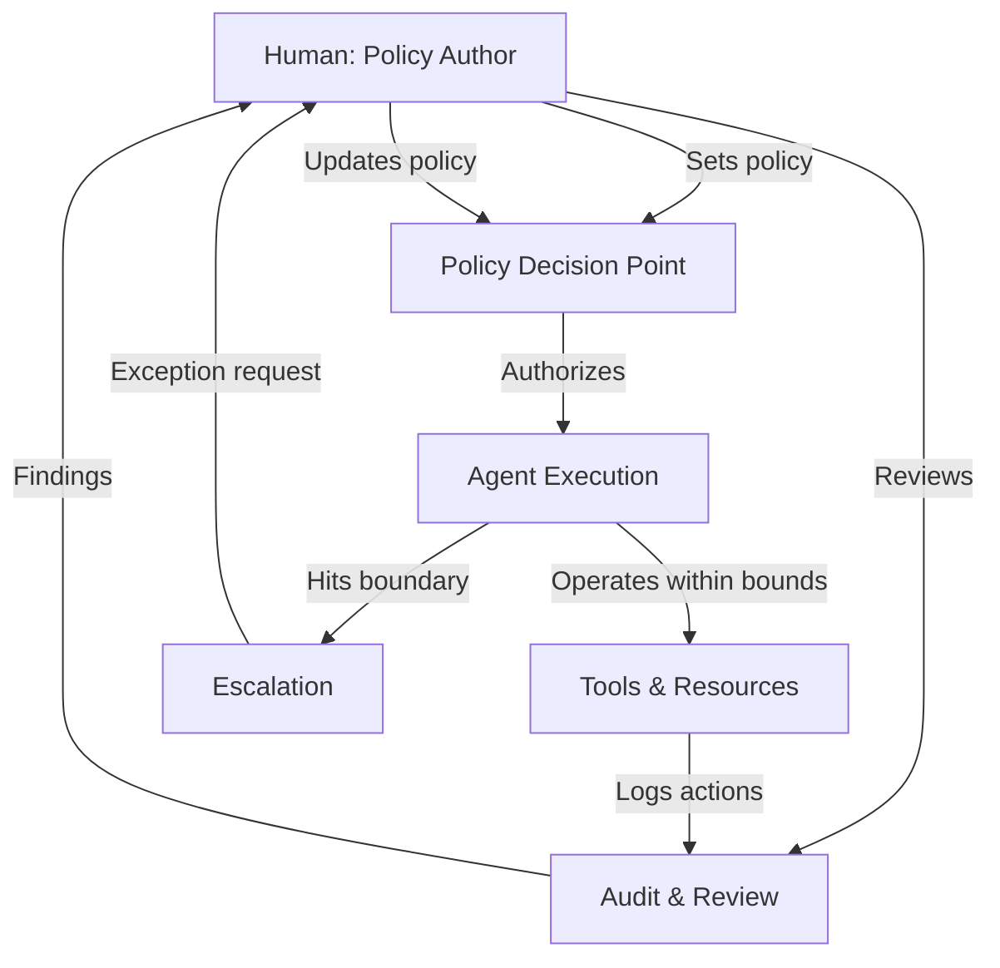
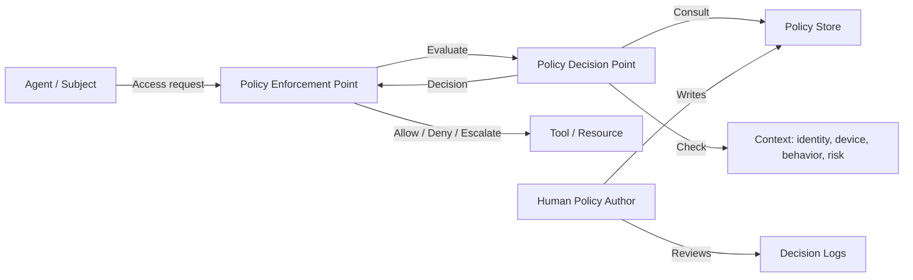
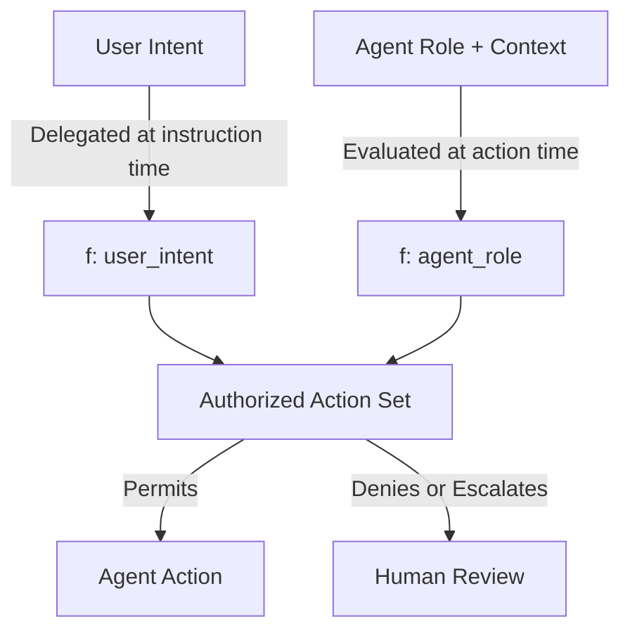

import Callout from '../../components/Callout.astro';
import StatRow from '../../components/StatRow.astro';
import PullQuote from '../../components/PullQuote.astro';
import SectionLabel from '../../components/SectionLabel.astro';
import ScrollReveal from '../../components/ScrollReveal.astro';
import DiagramBlock from '../../components/DiagramBlock.astro';

<SectionLabel text="The Problem" />

## The problem with "in the loop"

"Human in the loop" sounds responsible. It sounds like governance. It is neither.

In practice, human-in-the-loop means a person clicking "approve" on a queue of actions they don't have time to evaluate. It means a compliance checkbox that converts a human being into a rubber stamp. It means every agentic system pausing for confirmation at every step, which destroys the value proposition of having agents in the first place.

<ScrollReveal>
The fundamental tension is real: agents need autonomy to be useful, but humans need oversight to stay safe. The AI governance community has framed this as a spectrum between full autonomy and full human control, then planted a flag somewhere in the middle and called it "human in the loop."

That framing is wrong. It treats the human as a component inside the execution path. A gear in the machine. The human becomes a bottleneck at best and a liability at worst.
</ScrollReveal>

<PullQuote>
You don't put the CEO in the assembly line. You put the CEO above it, setting policy and reviewing outcomes. The same principle applies to AI.
</PullQuote>

<Callout variant="insight" label="The core problem">
Human-in-the-loop assumes the human can evaluate every action in real time. At agent speed and scale, they cannot. The result is either: (a) the human becomes a rubber stamp, approving what they can't evaluate, or (b) the system slows to human speed, eliminating the reason you built an agent.
</Callout>

---

<SectionLabel text="Automation Bias" />

## The psychology nobody wants to talk about

This is not a theoretical concern. Automation bias is one of the most well-documented phenomena in human factors research.[^1]

<ScrollReveal>
<StatRow stats={[
  { value: "73%", label: "Operators who follow incorrect automated recommendations" },
  { value: "< 30s", label: "Median review time for AI-generated outputs under workload" },
  { value: "Milgram", label: "Same deference pattern as authority obedience studies" }
]} />
</ScrollReveal>

Humans over-trust automated systems. They under-scrutinize outputs. They fail to intervene even when intervention is possible and the automated recommendation is demonstrably wrong. This is the Milgram experiment wearing a product interface: people defer to systems the same way they defer to authority figures.

Put a human "in" a loop that runs hundreds of actions per hour, and within the first day they're approving everything. Not because they're lazy. Because the cognitive load of genuine evaluation at that throughput exceeds human capacity. The approval becomes a formality. The governance becomes theater.

<Callout variant="warning" label="The rubber stamp failure">
When a human approves 200 agent actions per hour with a median review time of 4 seconds, the word "approval" has lost its meaning. That is not oversight. That is a liability trail with a human signature on it.
</Callout>

---

<SectionLabel text="Above the Loop" />

## The model: human above the loop

The answer is not "remove humans." The answer is "reposition humans."

<ScrollReveal>
Humans belong **above** the loop, not inside it. Above means:

1. **Policy authoring**: humans define the rules agents operate within
2. **Boundary setting**: humans specify what agents can and cannot do, under what conditions
3. **Exception handling**: when an agent hits a boundary it cannot resolve, it escalates to a human
4. **Audit review**: humans review outcomes, patterns, and anomalies after the fact
5. **Continuous adjustment**: humans update policy based on what they learn from audit
</ScrollReveal>

<DiagramBlock caption="Human-above-the-loop: policy flows down, exceptions escalate up, audit closes the feedback loop">

</DiagramBlock>

The human never touches the execution path during normal operation. The agent runs within its authorized bounds. When something falls outside those bounds, the system escalates. The human resolves the exception, updates policy if needed, and the loop continues.

<PullQuote>
The human above the loop governs. The human in the loop operates. Governance scales. Operations don't.
</PullQuote>

---

<SectionLabel text="Prior Art" />

## This is not a new idea

The AI governance community is treating "how do humans oversee autonomous systems" as a novel problem. It is not. Three established domains solved this decades ago.

### Military: mission-type orders

The German military concept of *Auftragstaktik* (mission-type tactics) is the clearest precedent.[^2] The commander issues the mission objective and the boundaries. The subordinate commander has full authority to execute within those boundaries using their own judgment. No radio calls to headquarters for every tactical decision.

<ScrollReveal>
The structure works because:
- **Intent is specified, method is not.** The mission is "take that hill by 0600." How the subordinate takes it is their call.
- **Boundaries are hard.** "Do not cross this line. Do not engage civilians. Do not exceed this ammunition expenditure." Constraints are explicit and non-negotiable.
- **Escalation paths are defined.** If the situation changes beyond the scope of the original order, the subordinate reports and requests updated guidance.
- **After-action review closes the loop.** What happened, what worked, what needs to change.
</ScrollReveal>

<Callout variant="insight" label="The military parallel">
A brigade commander does not approve every rifle shot. They set rules of engagement, define the mission, specify constraints, and review the outcome. The soldiers execute. The commander governs. This is human-above-the-loop, battle-tested for two centuries.
</Callout>

### Corporate: board governance

A board of directors does not run the company. They set strategy, approve major decisions, define risk appetite, and review performance. The CEO and management team execute within those parameters. When something falls outside the delegated authority (a major acquisition, a strategic pivot), it escalates to the board.

This is separation of duties. Governance and execution are different functions performed by different roles at different cadences. The board meets quarterly. The company operates daily. Governance does not require real-time presence in the operational loop.

### Zero Trust Architecture: PDP/PEP split

NIST SP 800-207 defines the core Zero Trust Architecture as a split between the **Policy Decision Point** (PDP) and the **Policy Enforcement Point** (PEP).[^3]

<ScrollReveal>
<DiagramBlock caption="Zero Trust PDP/PEP architecture applied to agentic systems">

</DiagramBlock>
</ScrollReveal>

The PDP evaluates every access request against policy. The PEP enforces the decision. The human writes the policy. The human is not in the evaluation loop; they're above it.

This is the same pattern. Policy authoring is a human function. Policy enforcement is automated. The human governs the system that governs access.

<StatRow stats={[
  { value: "Military", label: "Mission-type orders" },
  { value: "Corporate", label: "Board governance" },
  { value: "ZTA", label: "PDP/PEP split" }
]} />

Three domains. Same architecture. Governance above, execution below, escalation in between.

---

<SectionLabel text="What 'Above' Means" />

## What "above the loop" means in practice

The abstraction is clean. The implementation details matter.

### Policy authoring

The human above the loop writes policy. In concrete terms, this means:

- **Allowed actions**: this agent can read files, call these APIs, write to these databases
- **Denied actions**: this agent cannot send emails, cannot delete records, cannot access PII
- **Conditional constraints**: this agent can approve purchases under $500 but must escalate above that threshold
- **Temporal bounds**: this agent operates during business hours, this authorization expires after 4 hours
- **Behavioral constraints**: if the agent's actions deviate more than N% from its baseline behavioral pattern, pause and escalate

<Callout variant="note" label="Policy is not prompting">
System prompts are not policy. A system prompt is a suggestion in natural language to a probabilistic model. Policy is a formal, enforceable constraint evaluated at runtime. The distinction matters. If your "governance" layer is a system prompt, you don't have governance.
</Callout>

### Exception handling

The agent hits a boundary. A user asks it to do something outside its authorized action set. The resource it needs requires higher privileges than it holds. The context has changed in a way the original policy didn't anticipate.

The system does not fail silently. It does not hallucinate an answer. It escalates to the human with: what was requested, why it's outside bounds, what policy applies, and what the options are. The human resolves it and optionally updates policy so the same exception doesn't recur.

### Audit review

After-the-fact review of agent behavior. Not real-time approval, but pattern analysis:

- Are agents operating within their authorized bounds?
- Are there clusters of escalations that suggest a policy gap?
- Are there behavioral drift patterns that suggest the agent's context has shifted?
- Are there actions that were technically authorized but shouldn't have been?

This is where Behavioral Drift Detection matters: agents accumulate subtle instruction drift across long sessions. Detect it via embedding distance from baseline at regular intervals. The audit layer catches what the real-time policy enforcement layer misses.

---

<SectionLabel text="DIRA" />

## Where DIRA fits

Dual-Intent Runtime Authorization is the authorization layer that makes human-above-the-loop work at the technical level.[^4]

The core formula:

**authorized_action_set = f(user_intent) ∩ f(agent_role)**

Evaluated at every tool call. Not at session start. Not at login. At the moment the agent attempts an action.

<ScrollReveal>
<DiagramBlock caption="DIRA: the intersection of user intent and agent role evaluated at every action">

</DiagramBlock>
</ScrollReveal>

This addresses the fundamental identity problem: the agent is NOT the same principal as the human, even when acting on the human's behalf. You need to model both the delegating human's intent at instruction time and the agent's role and context at execution time. The authorized action set is the intersection.

<Callout variant="insight" label="Why DIRA requires human-above-the-loop">
DIRA works because the human authored the policy that defines both f(user_intent) and f(agent_role). The human is not evaluating every action. The human defined the constraints within which every action is evaluated. The authorization system enforces; the human governs.
</Callout>

The existing IAM model (one principal, one session, authorization at login) cannot express this. Agents break the model because they act on BEHALF of humans, not AS humans. DIRA is the authorization primitive that closes the gap, and it only works if the human is positioned above the loop, not inside it.

---

<SectionLabel text="The Separation" />

## The AI governance community is reinventing separation of duties

Separation of duties is a foundational security control. The person who authorizes a transaction should not be the same person who executes it. The person who writes the code should not be the same person who deploys it to production. The person who creates an account should not be the same person who approves its access.

<PullQuote>
The person who writes the policy should not be the same entity that executes the actions. That is separation of duties. That is human-above-the-loop. That is the same principle.
</PullQuote>

Every conversation about "AI alignment" and "AI safety" and "responsible AI" is circling around a principle that security and governance practitioners have been implementing for decades. The vocabulary is different. The architecture is the same.

<ScrollReveal>
<StatRow stats={[
  { value: "Separation of Duties", label: "Security control since the 1970s" },
  { value: "PDP/PEP Split", label: "NIST SP 800-207 since 2020" },
  { value: "Auftragstaktik", label: "Military doctrine since the 1800s" },
  { value: "Board Governance", label: "Corporate law since... always" }
]} />
</ScrollReveal>

The AI governance community doesn't need to invent a new framework. It needs to read the ones that already exist, understand why they work, and apply them. The principles are proven. The implementation needs to catch up.

---

<SectionLabel text="Objections" />

## Common objections

**"But what about high-stakes decisions? Don't those need human approval?"**

Yes. And that is what escalation is for. The policy defines which decisions are high-stakes and routes them to a human. The agent handles the 95% of actions that are routine. The human handles the 5% that matter. That is the point.

**"What if the policy is wrong?"**

Then the audit layer catches it. Bad outcomes are reviewed, root-caused to policy gaps, and the policy is updated. This is the same continuous improvement loop that every mature governance program runs. It's not perfect. Nothing is. It's better than a human rubber-stamping 200 actions per hour.

**"What about emergent behavior?"**

Behavioral drift detection. Monitor the agent's action patterns against a baseline. When the pattern shifts beyond a threshold, flag it for review. You cannot prevent emergent behavior. You can detect it, and you can respond.

<Callout variant="critical" label="The real risk">
The greatest risk is not removing humans from the loop. The greatest risk is leaving humans "in" the loop in a way that creates the illusion of oversight without the reality. A rubber stamp with a human signature is more dangerous than no stamp at all, because it creates a false audit trail and a liability that nobody actually earned.
</Callout>

---

<SectionLabel text="The Stakes" />

## What's actually at stake

The current trajectory of AI governance is building a world where every agentic system has a "human in the loop" checkbox, and the checkbox means nothing. Compliance auditors will check it. Regulators will require it. Organizations will implement it. And the humans in the loop will be clicking "approve" as fast as they can so they can get through their queue.

We've seen this before. It's called security theater. And the cure for it has been known for a very long time: put the human where they can actually govern, not where they'll be ground into a component.

Above the loop. Not in it.

---

[^1]: Parasuraman, R., & Manzey, D. (2010). Complacency and bias in human use of automation: An attentional integration. *Human Factors*, 52(3), 381-410. The seminal review of automation bias literature, documenting consistent patterns of over-trust in automated systems across domains.

[^2]: Shamir, E. (2011). *Transforming Command: The Pursuit of Mission Command in the U.S., British, and Israeli Armies*. Stanford University Press. Comprehensive analysis of mission-type orders (Auftragstaktik) and their evolution across military organizations.

[^3]: Rose, S., Borchert, O., Mitchell, S., & Connelly, S. (2020). Zero Trust Architecture. NIST Special Publication 800-207. National Institute of Standards and Technology. The foundational ZTA reference defining PDP/PEP architecture.

[^4]: Dual-Intent Runtime Authorization (DIRA) is original research by Casey Gager. The architecture evaluates `authorized_action_set = f(user_intent) ∩ f(agent_role)` at every tool call, addressing the authorization gap in agentic systems where the agent acts on behalf of, but is not the same principal as, the delegating human.
