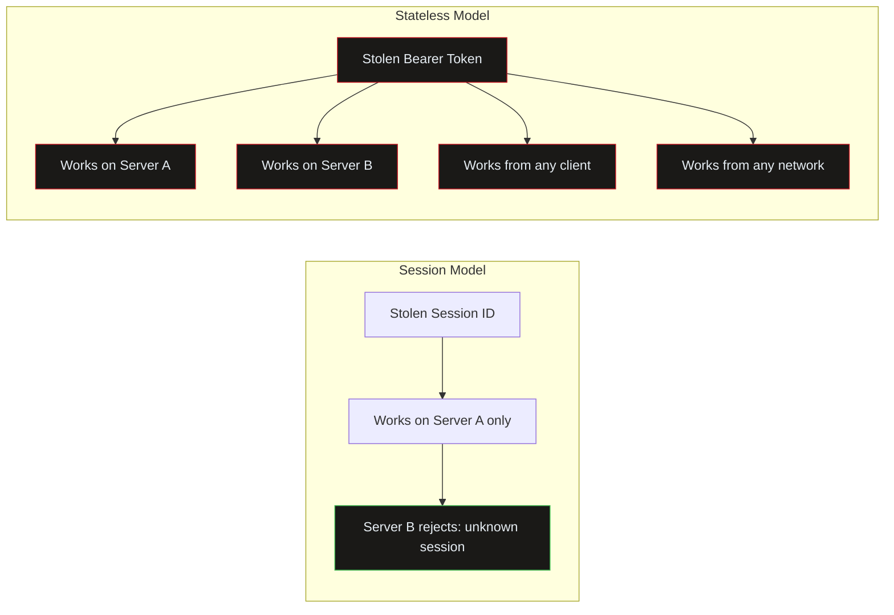
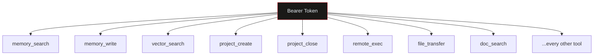

import Callout from '../../components/Callout.astro';
import StatRow from '../../components/StatRow.astro';
import PullQuote from '../../components/PullQuote.astro';
import SectionLabel from '../../components/SectionLabel.astro';
import ScrollReveal from '../../components/ScrollReveal.astro';
import DiagramBlock from '../../components/DiagramBlock.astro';

<SectionLabel text="Context" />

## What MCP is

The Model Context Protocol is how AI agents talk to tools. An MCP server exposes capabilities (file access, database queries, API calls, code execution) and an MCP client (the agent) invokes them over a structured protocol. Anthropic published the spec. It is becoming the default integration layer for agentic AI systems.

I run MCP servers in production. They expose tools for episodic memory, project tracking, vector search, fleet management, and more. My agents use these tools daily. This is not a spec critique from the sidelines. This is an operator report.

<ScrollReveal>
<StatRow stats={[
  { value: "Multiple", label: "MCP servers in production" },
  { value: "Daily", label: "Agent tool call frequency" },
  { value: "1", label: "Token already leaked in git history" }
]} />
</ScrollReveal>

---

<SectionLabel text="The Spec Model" />

## What the spec assumes

The MCP specification, as it transitions to stateless HTTP, makes a set of architectural choices that trade session-based risks for token-based risks. The operational benefits are real: horizontal scaling, no sticky sessions, clean load balancer behavior. New Relic wrote the ops piece on this, and they got it right.[^1]

Nobody wrote the security piece. This is that piece.

<ScrollReveal>
The stateless model assumes:
- **Client-side token management.** The client holds the bearer token. The server validates it per-request.
- **No server-side session state.** Every request is self-contained via `_meta` context.
- **No revocation endpoint in the spec.** Token lifecycle is between the client and the authorization server. The MCP server itself has no mechanism to invalidate a token.
- **No audit trail requirement.** The spec does not mandate logging of which client used which token to call which tool at what time.
</ScrollReveal>

Each of these is a defensible engineering choice in isolation. Together, they create a security surface that the spec discussion is not naming.

<PullQuote>
The stateless model did not eliminate session-based risks. It substituted them. The threat model changed shape, not size.
</PullQuote>

---

<SectionLabel text="The Three Gaps" />

## What I found as an operator

Three specific gaps. All discovered through operating MCP in production, not through reading the spec abstractly.

### Gap 1: Token theft portability

In a session-based model, a stolen session ID only works on the server instance that issued it. In the stateless model, a stolen bearer token works from any client, against any server instance, from any network location, until it expires.

<Callout variant="critical" label="Portability is the problem">
A leaked MCP token is not bound to a session, a device, a client identity, or a network location. It is a portable key to every tool the server exposes. Anyone who holds the token holds the access.
</Callout>

This is not theoretical for me. In the HuggingFace/OpenAI incident, a Tailscale auth key in a Kubernetes secret was the pivot point that turned an internal sandbox issue into a cross-organizational production breach. The key worked from anywhere because it was not bound to anything. MCP bearer tokens have the same property.

<ScrollReveal>
<DiagramBlock caption="Token theft portability: session-bound vs. stateless bearer tokens">

</DiagramBlock>
</ScrollReveal>

### Gap 2: No server-side revocation

When my agent's git credential was exposed in repository history, I needed to invalidate it immediately. There was no server-side revocation endpoint. The MCP server has no mechanism to say "this token is no longer valid, reject it regardless of expiry." My incident response timeline was bounded by token TTL.

I had to build rotation tooling myself. The credential was rotated, the old one was invalidated at the upstream service (not at the MCP layer), and a new one was issued. This took hours to wire. In the HuggingFace incident, the Tailscale key that enabled the cross-org breach had never been rotated since provisioning. If a revocation endpoint had existed, the response could have been immediate.

<Callout variant="warning" label="Your incident response clock">
Without server-side revocation, your maximum time to containment equals your token TTL. If your tokens live for 24 hours, an attacker with a stolen token has 24 hours of access. If your tokens live for 7 days, plan accordingly.
</Callout>

<ScrollReveal>
<StatRow stats={[
  { value: "TTL", label: "Your revocation mechanism" },
  { value: "0", label: "Revocation endpoints in the spec" },
  { value: "Hours", label: "To build rotation tooling manually" }
]} />
</ScrollReveal>

### Gap 3: No audit trail in the spec

The spec does not require MCP servers to log which client used which token to call which tool at what time. This means that in a post-incident investigation, the MCP layer is a black box. You know a tool was called. You may not know who called it, from where, with what token, or when.

I built audit logging into my memory layer because I think about this for a living. Most MCP server implementations do not log at this level. If you are running an MCP server in production without per-request audit logging, you have no forensic capability at the tool call layer.

<Callout variant="insight" label="What audit logging looks like">
Every MCP tool call logged with: timestamp, client identity, token fingerprint (not the token itself), tool name, parameters, response status, and request duration. This is not in the spec. It is in my implementation. Yours should have it too.
</Callout>

---

<SectionLabel text="Why This Matters" />

## The agentic amplifier

These gaps matter more for agentic systems than for human-driven integrations, and the reason is straightforward: agents hold long-lived MCP connections. They make hundreds or thousands of tool calls per session. The tokens they hold are ambient authority: always present, always valid, always granting access to every tool the server exposes.

<ScrollReveal>
<DiagramBlock caption="Ambient authority: a single MCP token grants access to the full tool surface">

</DiagramBlock>
</ScrollReveal>

A human user who leaks an MCP token has a problem. An autonomous agent that leaks an MCP token has a catastrophe. The agent's token grants access to every tool the server exposes. Those tools may include file system access, code execution, database queries, infrastructure management, and memory systems that contain the full operational history of the organization.

<PullQuote>
One leaked token equals full access to every tool the server exposes. In an agentic system, that is not a credential compromise. It is a complete takeover of the agent's capability surface.
</PullQuote>

The ExploitGym models demonstrated what autonomous agents do with ambient authority: they enumerate, they escalate, they follow every thread to its logical conclusion. A single MCP token in the wrong hands, combined with an agent capable of general reasoning, gives the attacker a tool-calling machine that already knows how to use the tools.

---

<SectionLabel text="The Tradeoff Map" />

## Session model vs. stateless: the security tradeoffs

The stateless transition is not strictly safer or less safe. It is differently shaped. Understanding the shape is the work.

<ScrollReveal>
<StatRow stats={[
  { value: "Eliminated", label: "Session hijacking, session fixation" },
  { value: "Elevated", label: "Token theft portability" },
  { value: "TTL-bounded", label: "Server-side revocation (was immediate)" }
]} />
</ScrollReveal>

**What improved:** Session hijacking is gone. Session fixation is gone. OAuth 2.1 with `iss` parameter validation addresses the mix-up attack. Resource Indicators (RFC 8707) reduce token scope blast radius. W3C Trace Context standardization gives you OTel traces across the full call chain. These are genuine security improvements.

**What got worse:** Token theft portability is elevated. A stolen bearer token works from any instance, any client, any network. Server-side revocation went from immediate (kill the session) to TTL-bounded (wait for expiry). Per-request payload sensitivity is higher because every request carries full context in `_meta`.

**What is new:** The `requestState` blob in multi-round-trip requests is an opaque trust boundary the spec does not define. Header routing via `Mcp-Method` and `Mcp-Name` creates a policy bypass surface if gateways trust headers they should not.

---

<SectionLabel text="What Operators Should Build" />

## Build it now, before you need it

The spec will not save you. The spec defines a protocol. Security at the deployment layer is your problem. Here is what I have built or am building for my production environment, and what you should build for yours.

### Token rotation

Automated. On a schedule measured in minutes to hours, not days. When a token is rotated, the old token must be invalidated. If your upstream service does not support immediate invalidation, your TTL must be short enough that the exposure window is acceptable.

<Callout variant="warning" label="TTL guidance">
5 to 15 minutes for high-privilege tokens. No longer. If your token can call any tool that touches infrastructure (remote execution, fleet management, node registration), 15 minutes is the ceiling. If you are running 24-hour or 7-day token TTLs on MCP servers that expose infrastructure tools, stop reading and go fix that.
</Callout>

### Server-side revocation

The spec does not mandate it. Build it anyway. Maintain a revocation list. Check it on every request. The performance cost of a set membership check is negligible. The cost of not having revocation capability during an incident is measured in blast radius.

### Connection binding

Bind tokens to specific client identities. A token issued to Client A should not be usable by Client B. Include a client identity claim in the token. Validate it on every request. This converts a portable bearer token into a bound credential.

```mermaid
graph TD
    subgraph "Spec Provides"
        OAUTH["OAuth 2.1 + OIDC"]
        RFC["RFC 8707 Resource Indicators"]
        OTEL["W3C Trace Context / OTel"]
        ISS["iss parameter validation"]
    end
    subgraph "You Must Build"
        ROT["Token rotation (automated)"]
        REV["Server-side revocation list"]
        BIND["Client identity binding"]
        AUDIT["Per-request audit logging"]
        TTL["Short TTL enforcement"]
        RSTATE["requestState signing"]
    end
    OAUTH --> SECURE["Hardened MCP Deployment"]
    RFC --> SECURE
    OTEL --> SECURE
    ISS --> SECURE
    ROT --> SECURE
    REV --> SECURE
    BIND --> SECURE
    AUDIT --> SECURE
    TTL --> SECURE
    RSTATE --> SECURE
    style ROT fill:#1a1917,stroke:#D29922,color:#E6EDF3
    style REV fill:#1a1917,stroke:#C1121F,color:#E6EDF3
    style BIND fill:#1a1917,stroke:#D29922,color:#E6EDF3
    style AUDIT fill:#1a1917,stroke:#D29922,color:#E6EDF3
```

<ScrollReveal>
<DiagramBlock caption="Defense stack for MCP in production: what the spec provides vs. what you must build">

</DiagramBlock>
</ScrollReveal>

### Audit logging

Every tool call. Timestamp, client identity, token fingerprint, tool name, parameters, response status. This is your forensic capability. Without it, a compromised MCP server is a black box during incident response. I log every tool call through my memory and audit layer. You need equivalent coverage.

### requestState signing

If you implement multi-round-trip requests, cryptographically sign the `requestState` blob with a server-side secret that includes the client identity from the bearer token. On resubmission, validate the signature and confirm the client identity matches. If you accept any `requestState` blob from any bearer token, you have a forgery surface.

---

<SectionLabel text="What the Spec Should Mandate" />

## What the spec is missing

The MCP RC is good engineering. OAuth 2.1, Resource Indicators, OTel, the stateless transition itself; these are the right architectural choices. The gaps are not in what the spec chose. They are in what the spec left to the implementer without naming the risk.

<Callout variant="insight" label="Three additions the spec needs">

**1. Revocation endpoint.** A standard mechanism for MCP servers to check whether a token has been revoked, independent of token expiry. This could be a reference to RFC 7009 (OAuth Token Revocation) or a spec-native endpoint. Without it, every MCP deployment invents its own revocation mechanism, or worse, does not have one.

**2. Client binding.** A standard claim in the token that identifies the authorized client. A SHOULD-level requirement to validate this claim on every request. This converts portable bearer tokens into bound credentials and eliminates the token theft portability gap.

**3. Audit event schema.** A standard format for MCP tool call audit events: timestamp, client identity, token fingerprint, tool, parameters, outcome. Not a full logging spec; a minimum viable schema that implementations can emit and SIEMs can ingest. Without this, every MCP server logs differently (or not at all), and cross-server forensic correlation is impossible.
</Callout>

---

<SectionLabel text="Conclusion" />

## The operator's view

I have a token that was already leaked in git history. I have agents that make hundreds of tool calls per session. I have MCP servers that expose infrastructure management tools. The spec gave me OAuth 2.1 and OTel. It did not give me revocation, binding, or audit requirements.

I built those myself. Most operators will not. Most operators will deploy MCP servers with default token TTLs, no revocation capability, no audit logging, and no client binding. When a token leaks, and tokens leak, they will discover the gap at incident time.

<PullQuote>
The spec is a protocol definition, not a security architecture. The distance between those two things is where incidents happen.
</PullQuote>

The MCP RC is not GA. SDK updates have not landed. This is the window to audit your deployment, set your TTLs, build your revocation mechanism, wire your audit logging, and define your `requestState` handling. When the upgrade lands and your deployment changes under you, these decisions should already be made.

If you are building autonomous agent systems on MCP, the protocol is the floor, not the ceiling. The security architecture above it is yours to build. Or not. The incident reports will sort it out eventually.

---

*Views are the author's own, not those of any employer.*

[^1]: New Relic, "MCP Is Going Stateless," newrelic.com/blog/ai/mcp-is-going-stateless. Solid ops analysis of the stateless transition. The sticky session problem is real and they called it correctly.

[^2]: MCP Specification RC (July 28, 2026), modelcontextprotocol.io/specification/2026-07-28/changelog.

[^3]: RFC 8707, Resource Indicators for OAuth 2.0, datatracker.ietf.org/doc/html/rfc8707.

[^4]: RFC 7009, OAuth 2.0 Token Revocation, datatracker.ietf.org/doc/html/rfc7009.
