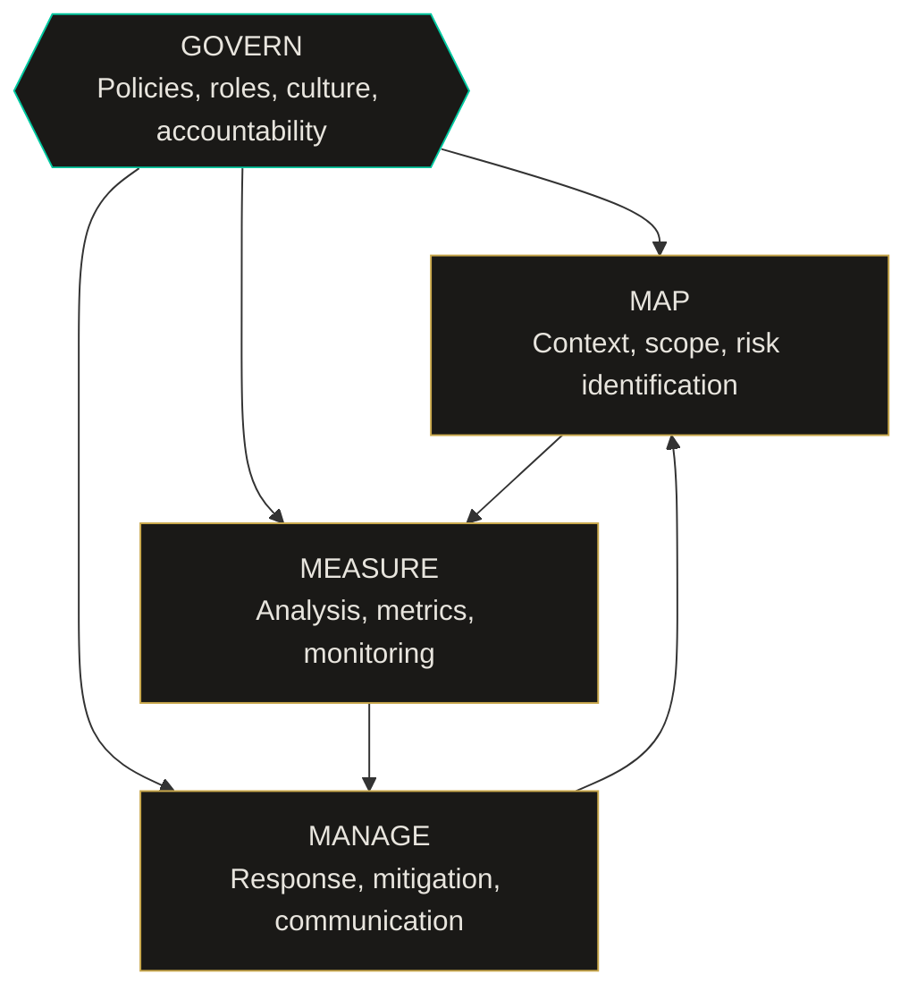
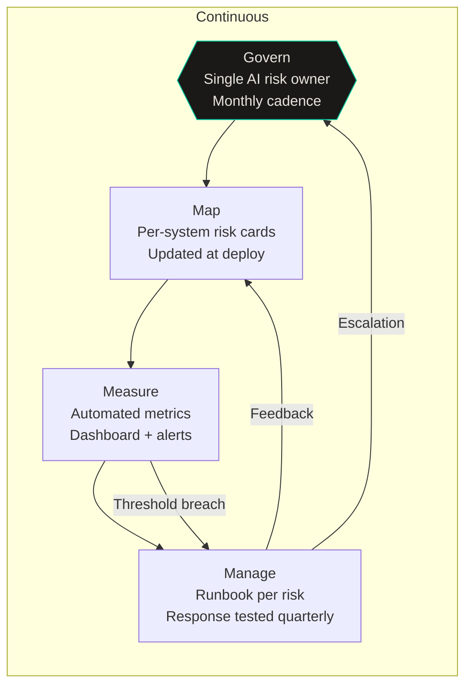

import Callout from '../../components/Callout.astro';
import StatRow from '../../components/StatRow.astro';
import PullQuote from '../../components/PullQuote.astro';
import SectionLabel from '../../components/SectionLabel.astro';
import ScrollReveal from '../../components/ScrollReveal.astro';
import DiagramBlock from '../../components/DiagramBlock.astro';

<Callout variant="note" label="Disclosure">
The views in this article are my own. I hold CISSP, CISM, CRISC, AAIA, and AAISM
certifications. I was a beta tester for ISACA's Advanced AI Audit certification. I
recommend NIST frameworks to enterprise clients as part of my day job. I am saying
this because the article is going to be critical, and you should know that the
criticism comes from someone who uses the framework professionally, not from someone
who read the executive summary and formed an opinion.
</Callout>

---

<SectionLabel text="The Framework" />

## What NIST AI RMF actually says

NIST AI 100-1 (January 2023) defines a voluntary framework for managing risks
associated with AI systems. It is organized around four core functions: Govern, Map,
Measure, Manage.[^1]

<ScrollReveal>
<DiagramBlock caption="NIST AI RMF core functions: Govern wraps everything, Map-Measure-Manage operate within it">

</DiagramBlock>
</ScrollReveal>

<StatRow stats={[
  { value: "4", label: "Core functions" },
  { value: "19", label: "Categories" },
  { value: "72", label: "Subcategories" }
]} />

The structure is sound. Govern sits at the top and wraps the other three functions
because governance is the precondition for everything else. Map identifies risks in
context. Measure quantifies them. Manage responds to them. The cycle is continuous. The
framework explicitly acknowledges that AI risk is not a one-time assessment.

The companion document, the AI RMF Playbook (NIST AI 100-1 Playbook), provides
suggested actions and references for each subcategory. The NIST AI RMF Profiles
document allows organizations to select relevant subcategories based on their specific
use case.

<PullQuote>
The framework is well-designed. The problem is not the framework. The problem is what
happens when the framework meets an organization.
</PullQuote>

---

<SectionLabel text="The Govern Problem" />

## Where the Govern function goes to die

Govern is where every AI RMF implementation either succeeds or fails. It never fails
spectacularly. It fails quietly, through delegation without authority, through committees
that meet quarterly, through policies that exist on SharePoint and nowhere else.

<ScrollReveal>
GOVERN 1 requires organizations to establish policies, processes, procedures, and
practices for AI risk management. In practice, this means someone has to answer the
question: **who owns AI risk?**

Not "who is interested in AI risk." Not "who has AI in their job title." Who owns it.
Who is accountable when the model makes a decision that costs the organization money,
reputation, or regulatory standing. Who gets the 2am call.
</ScrollReveal>

<Callout variant="warning" label="The pattern">
In most organizations, AI risk ownership looks like this: the CISO "owns" AI security
risk. The CDO "owns" AI data risk. The CTO "owns" AI operational risk. Legal "owns" AI
regulatory risk. Nobody owns AI risk as a unified concern. The framework assumes
integrated governance. Organizations deliver siloed governance and call it done.
</Callout>

The result is a governance structure where every function can point to someone else.
Security says the model output is a data quality issue. Data says the model behavior is
an operations issue. Operations says the model risk is a legal issue. Legal says
the model selection was a technology decision.

This is not hypothetical. This is what the conversation looks like in most
organizations that have attempted AI RMF implementation. The framework's GOVERN 1.1
subcategory explicitly calls for "legal and regulatory requirements involving AI are
understood, managed, and documented." But understanding, managing, and documenting
cross-functional requirements requires a single point of accountability. The framework
assumes that point exists. Most organizations do not have it.

<PullQuote>
GOVERN 1 is the load-bearing wall. If nobody owns AI risk as a unified concern, every
other function in the framework operates without a foundation.
</PullQuote>

---

<SectionLabel text="The Map Function" />

## Map: context is harder than it sounds

MAP is the identification function. MAP 1 says: understand the context in which the
AI system operates. MAP 2 says: categorize the AI system. MAP 3 says: identify known
and foreseeable risks.

<ScrollReveal>
In a traditional risk framework (NIST CSF, ISO 27001), context is relatively stable.
You have assets, you have threats, you have vulnerabilities. The asset inventory changes
slowly. The threat landscape evolves, but the categories are familiar.

AI systems break this assumption. The "asset" is a model that behaves differently
depending on its inputs. The "threat" is not just an external adversary; it includes
the model's own behavior under distribution shift. The "vulnerability" might be a
training data bias that nobody can detect until production output reveals it.
</ScrollReveal>

<Callout variant="insight" label="What MAP gets right">
MAP 3 explicitly includes "impacts to individuals, groups, communities, organizations,
and society." Most traditional risk frameworks stop at organizational impact. The AI
RMF acknowledges that AI risk radiates outward in ways that organizational risk
frameworks are not designed to capture. This is genuinely forward-looking.
</Callout>

Where MAP breaks down in practice: organizations map what they know. AI systems produce
risks from what organizations do not know. The emergent behavior problem is real. A
model performing well on benchmarks can produce harmful output on edge cases that
nobody included in the test set. MAP assumes you can identify risks before they
materialize. For AI systems, some risks only become visible in production.

**The agentic AI problem specifically.** MAP was written before agentic AI became a
deployment pattern. An AI agent that takes actions (makes API calls, writes files,
sends messages) has a fundamentally different risk profile than an AI model that
produces text. The risk is not just "wrong output." The risk is "wrong action." MAP's
risk identification categories do not cleanly accommodate the difference between a model
that says something incorrect and a model that does something incorrect. The action
surface is not in the framework.

---

<SectionLabel text="The Measure Problem" />

## Measure: the metrics maturity gap

MEASURE is where the AI RMF should shine. This is the quantification function. MEASURE 1
says: select appropriate metrics. MEASURE 2 says: assess AI systems against those
metrics. MEASURE 3 says: track metrics over time.

<ScrollReveal>
<StatRow stats={[
  { value: "72", label: "Subcategories defined" },
  { value: "~5", label: "With mature metrics" },
  { value: "67", label: "Aspirational today" }
]} />
</ScrollReveal>

The problem: AI metrics are immature. For most of the framework's subcategories, there
is no industry-accepted metric, no established measurement methodology, and no
benchmark against which to evaluate. The framework says "measure bias." With what
instrument? Against what standard? Measured when, by whom, and validated how?

<PullQuote>
The Measure function describes what a mature AI risk program would measure. It does not
describe how to measure it. For most organizations, that gap is the entire problem.
</PullQuote>

Specific measurement gaps that practitioners encounter:

**Fairness metrics.** MEASURE 2.6 requires assessment of "the AI system's fairness and
bias." Multiple competing fairness definitions exist (demographic parity, equalized
odds, predictive parity). They are mathematically incompatible. You cannot satisfy all
of them simultaneously. The framework does not specify which definition to use. This
is arguably correct (context should determine the definition) but in practice it means
organizations pick whichever definition produces the best-looking numbers.

**Explainability metrics.** MEASURE 2.8 references "the interpretability and
explainability of AI system outputs." There is no agreed-upon metric for explainability.
SHAP values, LIME, attention visualization, counterfactual explanations, all measure
different things. The framework requires explainability without defining what
explainability means in operational terms.

**Behavioral drift.** MEASURE 4.2 references monitoring for "changes and degradation."
Drift detection in production LLMs is a real and unsolved measurement problem. Existing
ML monitoring assumes access to the model's internals (weights, activations, loss
curves). Prompted LLMs running on third-party inference APIs give you none of that. You
are measuring behavioral output, not model state. The measurement methodology for
this does not exist at scale.[^2]

---

<SectionLabel text="The Manage Function" />

## Manage: the strongest function in the framework

MANAGE is where the AI RMF is most practical. MANAGE 1 says: prioritize risks. MANAGE 2
says: plan responses. MANAGE 3 says: manage risks from third-party AI. MANAGE 4 says:
document and communicate.

<ScrollReveal>
This function works because it maps to practices that organizations already have.
Risk prioritization, response planning, vendor management, documentation, communication
chains. These are mature organizational capabilities. The AI-specific overlay is
thin enough that existing risk management processes can absorb it.
</ScrollReveal>

<Callout variant="insight" label="MANAGE 3">
MANAGE 3 (third-party AI risk) is the most underrated section of the entire framework.
Most organizations using AI are using someone else's models. The risk does not
originate in the organization; it originates in the vendor's training pipeline, the
vendor's RLHF decisions, the vendor's model updates. MANAGE 3 explicitly requires
organizations to extend their risk management to the AI supply chain. Most do not.
</Callout>

The weakness of MANAGE: it assumes MAP and MEASURE have done their jobs. If risk
identification was incomplete (MAP) and risk quantification was aspirational (MEASURE),
then risk response (MANAGE) is operating on incomplete data. You cannot manage what you
have not measured. The framework's linear dependency chain means that weaknesses in
upstream functions propagate forward.

---

<SectionLabel text="The Checkbox Problem" />

## What the checkbox version looks like

Here is how most organizations "implement" the AI RMF:

<ScrollReveal>

1. A governance committee is formed. It meets quarterly. Minutes are taken.
2. An AI risk register is created. It lists risks at the category level (bias,
   explainability, security, privacy). No specific metrics. No measurement plan.
3. Each risk is assigned an owner. The owner is a function (Legal, Security, Data
   Science), not a person.
4. An annual assessment is scheduled. The assessment consists of a questionnaire
   distributed to risk owners. The questionnaire asks whether policies exist. It does
   not ask whether policies are enforced.
5. The results are compiled into a report. The report says the organization has
   "aligned to NIST AI RMF." The report is shared with the board.
6. Nothing operational changes.

</ScrollReveal>

This is not a caricature. This is the median outcome. The framework is treated as a
compliance artifact, not an operational practice. The governance committee provides
cover. The risk register provides documentation. The annual assessment provides a
date stamp. None of it changes how AI systems are built, deployed, or monitored.

<Callout variant="critical" label="The gap">
The distance between "aligned to NIST AI RMF" and "implementing NIST AI RMF" is
the distance between having a fire escape plan posted on the wall and conducting
quarterly fire drills. One is a document. The other is an operational capability.
</Callout>

---

<SectionLabel text="What Real Looks Like" />

## What a real implementation looks like

I have seen organizations get this right. Not many, but enough to know what the
pattern looks like.

<ScrollReveal>
<DiagramBlock caption="Operational AI RMF: continuous cycle with feedback loops, not an annual checkbox">

</DiagramBlock>
</ScrollReveal>

**Govern: a single human owns AI risk.** Not a committee. A named person with authority
to stop a deployment, require a re-evaluation, or escalate to the board. The committee
advises. The person decides.

**Map: risk cards per AI system, not per category.** Each AI system in production has
its own risk card that identifies the specific risks to that system in its specific
deployment context. "Bias" at the category level is not useful. "Model X producing
disparate rejection rates for protected class Y in use case Z" is useful. The risk card
is updated every time the system is modified.

**Measure: automated, continuous, dashboarded.** Whatever metrics exist (and they are
few), they run automatically in the deployment pipeline. Fairness metrics on batch
inference. Drift detection on production outputs. Latency and error rate monitoring.
The dashboard exists. Thresholds produce alerts. Alerts produce responses.

**Manage: runbooks, not reports.** Each identified risk has a response runbook. The
runbook says: who is notified, what is the initial response, what is the escalation
path, what is the rollback procedure. Runbooks are tested. "We have documented the
risk" is not the same as "we know what to do when the risk materializes."

---

<SectionLabel text="Agentic AI" />

## Where the framework does not account for agentic AI

The AI RMF was published in January 2023. Agentic AI, where models take actions through
tool use, was not a mainstream deployment pattern at that time. The framework assumes
a model that produces output. Agentic AI produces actions.

<ScrollReveal>
The implications for each function:

**Govern:** Authorization for tool use is not covered. Who approves the set of tools an
agent can access? Who reviews that approval? How often? The governance model for
"the model can write to the database" is fundamentally different from "the model can
produce a report." The framework has no language for this.

**Map:** The risk surface of an agentic system includes every system the agent can
touch. If the agent has API access to a CRM, a ticketing system, and a code repository,
the risk map must include the downstream impact of incorrect actions in all three. This
is a combinatorial expansion that MAP's risk identification approach was not designed for.

**Measure:** How do you measure whether an agent is making correct decisions? Output
correctness for a text model is evaluable (the text is right or wrong). Action
correctness for an agent depends on context, intent, and downstream state. There is no
metric for "the agent made the right API call given the user's intent."

**Manage:** Rollback for an agentic system is not the same as rollback for a model.
You can retract a text output. You cannot un-send an email, un-delete a record, or
un-execute a financial transaction. The irreversibility of agent actions makes MANAGE's
response planning significantly more complex.
</ScrollReveal>

<PullQuote>
Agentic AI does not need a new framework. It needs the existing framework extended with
an authorization function that the original authors did not anticipate. The question is
not "should we manage AI risk?" It is "how do we manage the risk of AI that acts?"
</PullQuote>

<Callout variant="insight" label="The authorization gap">
The missing function is runtime authorization: continuous, per-action verification that
an agent's behavior is within the bounds of what its operator intended and what its
deployment context permits. This is an identity and access management problem, not
an AI safety problem. The tooling exists in IAM. It has not been adapted for
agentic systems. The framework does not yet recognize this as a category.
</Callout>

---

<SectionLabel text="What the Framework Gets Right" />

## What the framework gets right that nobody is using

Despite the criticism above, the AI RMF contains several genuinely excellent ideas that
most implementations ignore:

<ScrollReveal>

**GOVERN 6: pre-deployment testing.** The framework explicitly requires testing before
deployment. Not "we ran the benchmarks." Testing in the deployment context, with
real-world inputs, against the specific risk profile of the specific system. Most
organizations skip this because it is expensive and slow. It is also the single
highest-leverage control in the entire framework.

**MAP 5: stakeholder engagement.** The framework requires engaging affected communities
in the risk identification process. Not surveying them after deployment. Engaging them
during design. This is a genuinely progressive position for a government standards body.
Almost nobody does it.

**MEASURE 2.9: human oversight.** The framework requires assessment of "the effectiveness
of human oversight." Not "is there a human in the loop." Is the human's oversight
actually effective? Does the human catch the errors, or does the human rubber-stamp the
output? This is an empirically testable question. Automation bias research (Parasuraman
and Riley, 1997) tells us the answer is usually "rubber stamp."[^3] The framework
acknowledges this. Implementations ignore it.

</ScrollReveal>

---

<SectionLabel text="Recommendations" />

## What I recommend to organizations

Three things. Not twelve. Twelve means none of them happen.

<ScrollReveal>
<StatRow stats={[
  { value: "1", label: "Name the AI risk owner" },
  { value: "2", label: "Risk cards per system" },
  { value: "3", label: "Test the runbooks" }
]} />
</ScrollReveal>

**First: name the AI risk owner.** A human. Not a committee. Someone who can say "no"
and have it stick. This single action will do more for your AI governance posture than
the rest of the framework combined.

**Second: create risk cards per AI system, not per category.** Stop managing "AI bias"
as an abstract concept. Start managing "Model X's rejection rate disparity in Use Case
Y." Specific, measurable, tied to a system, updated when the system changes.

**Third: test the runbooks.** If your AI system produces a harmful output tomorrow, do
you know what happens? Not in theory. In practice. Run the drill. Find out if the
escalation path works, if the rollback procedure is documented, if the person who is
supposed to get the call actually gets the call. The drill will teach you more about
your AI risk posture than the assessment ever will.

---

[^1]: National Institute of Standards and Technology. (2023). *AI Risk Management Framework (AI RMF 1.0)* (NIST AI 100-1). U.S. Department of Commerce.

[^2]: The behavioral drift detection problem for prompted LLMs is an active research area. Existing approaches include output structural features analysis (measuring how a model responds rather than what it says) and rolling statistical baselines. The methodology is immature and not yet standardized.

[^3]: Parasuraman, R., & Riley, V. (1997). Humans and automation: Use, misuse, disuse, abuse. *Human Factors*, 39(2), 230-253. The foundational paper on automation bias and the conditions under which human oversight fails.
