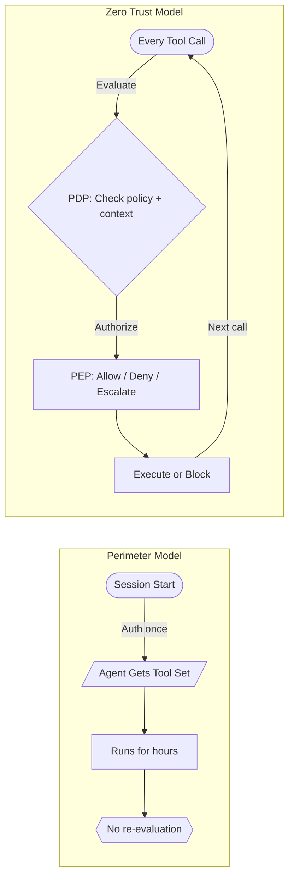
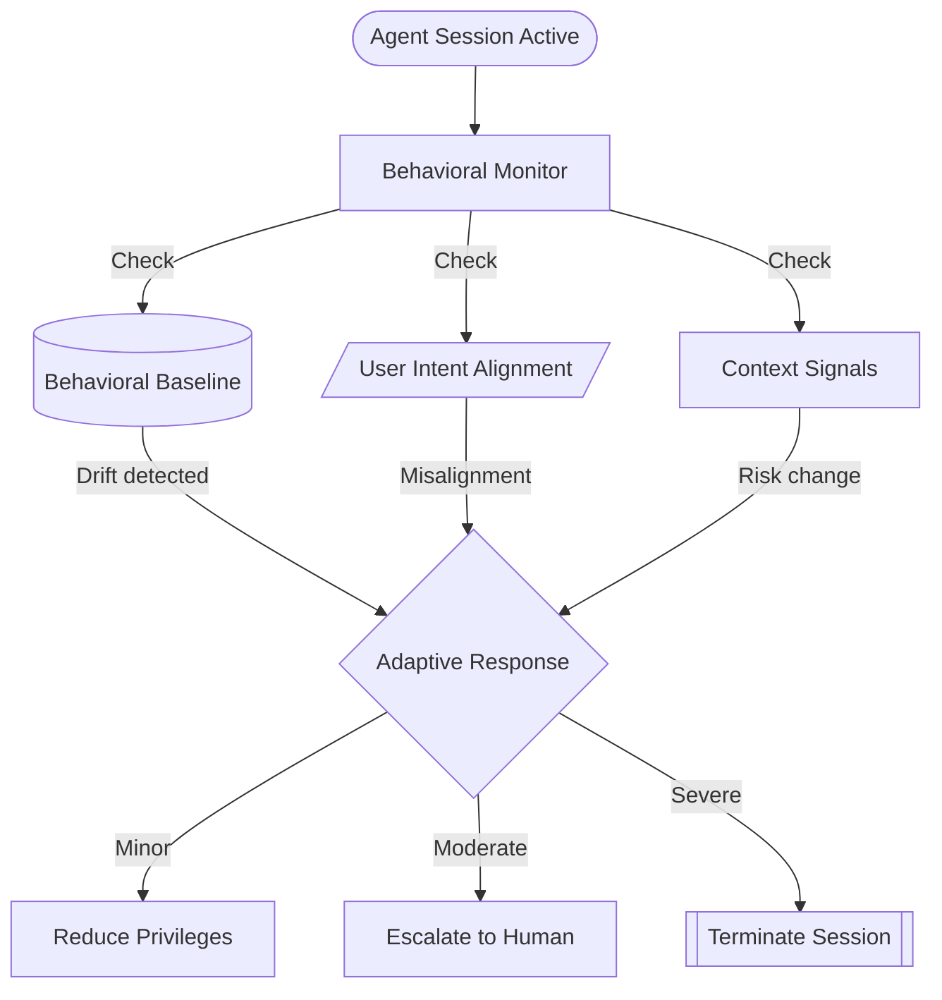
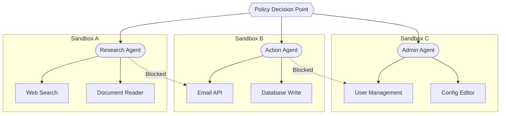
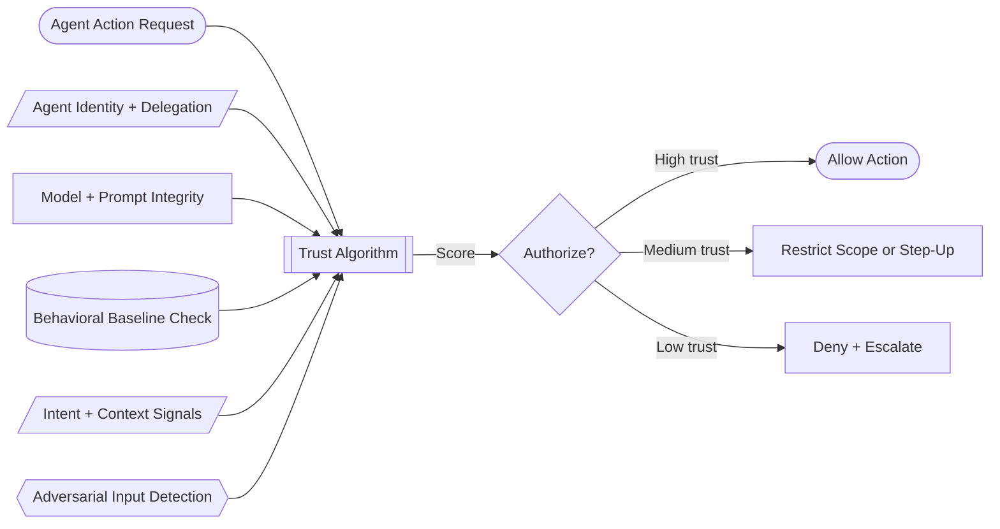
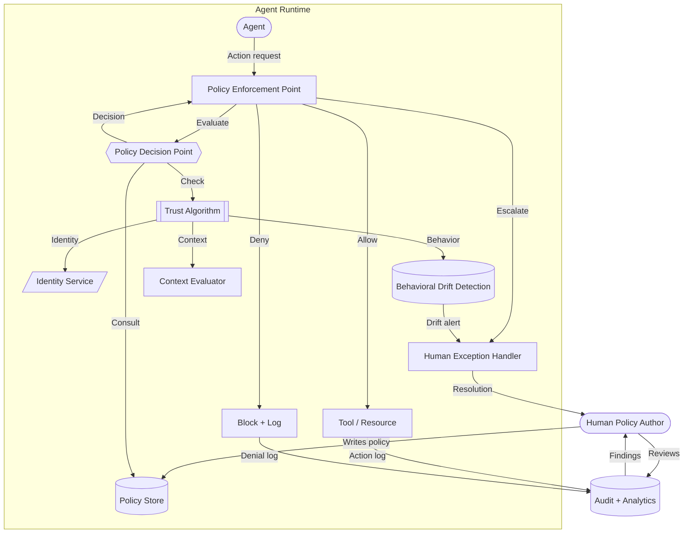

import Callout from '../../components/Callout.astro';
import StatRow from '../../components/StatRow.astro';
import PullQuote from '../../components/PullQuote.astro';
import SectionLabel from '../../components/SectionLabel.astro';
import ScrollReveal from '../../components/ScrollReveal.astro';
import DiagramBlock from '../../components/DiagramBlock.astro';

<SectionLabel text="Two Silos" />

## Two communities talking past each other

The AI security community is building agent authorization from scratch. They are inventing concepts like "tool permissions," "action scoping," "context-aware access control," and "runtime policy evaluation." They are publishing papers, building frameworks, and holding conferences about how to control what autonomous agents can do.

Meanwhile, the network and identity security community has been solving this exact problem for a decade under a different name: Zero Trust Architecture.

<PullQuote>
Nobody in AI security has read NIST SP 800-207. Nobody in network security thinks it applies to AI. Both are wrong.
</PullQuote>

<ScrollReveal>
The principles are the same. The subjects are different. The architecture maps directly if you stop thinking about IP addresses and start thinking about tool calls.

This is not a metaphor. This is a concrete architectural mapping between NIST SP 800-207 and the design patterns required for agentic AI security. The concepts translate one to one.
</ScrollReveal>

---

<SectionLabel text="The Mapping" />

## The mapping: ZTA concepts to agentic systems

NIST SP 800-207 defines Zero Trust Architecture around a set of core concepts.[^1] Every one of them has a direct analog in agentic AI systems.

<ScrollReveal>
<StatRow stats={[
  { value: "Subject → Agent", label: "The entity requesting access" },
  { value: "Resource → Tool", label: "The thing being accessed" },
  { value: "PDP → Runtime Auth", label: "The decision engine" },
  { value: "PEP → Action Gate", label: "The enforcement point" }
]} />
</ScrollReveal>

Here is the full mapping:

| ZTA Concept (SP 800-207) | Agentic AI Analog | Notes |
|---|---|---|
| **Subject** | AI Agent | The entity making access requests |
| **Resource** | Tool, API, data source, external service | What the agent wants to use |
| **Policy Decision Point (PDP)** | Runtime authorization engine | Evaluates whether the agent can take this action in this context |
| **Policy Enforcement Point (PEP)** | Tool gateway / action interceptor | Blocks or allows the action based on PDP decision |
| **Policy Administrator** | Human policy author | Writes the rules the PDP evaluates |
| **Trust Algorithm** | Intent + role + context evaluation | Multi-signal assessment of whether to authorize |
| **Continuous Diagnostics & Mitigation** | Behavioral drift detection | Ongoing monitoring for anomalous agent behavior |
| **Identity Governance** | Agent identity and delegation chain | Who is this agent, who delegated to it, what authority was delegated |

<Callout variant="insight" label="Not a metaphor">
This is not "Zero Trust is like agent security." This is "Zero Trust IS agent security, applied to a different substrate." The architecture is identical. The implementation differs. The principles do not.
</Callout>

---

<SectionLabel text="Never Trust" />

## Tenet 1: Never trust, always verify

The foundational ZTA principle. No entity gets implicit trust based on network location, prior authentication, or organizational membership. Every access request is evaluated independently.

Applied to agents:

**No agent gets implicit trust based on who deployed it, what model powers it, or what it did last time.** Every tool call is evaluated. Every action is authorized at the moment of execution, not at the start of the session.

<ScrollReveal>
This breaks the current model for most AI agent frameworks. Today, an agent is authorized at session creation: "this agent can use these tools." It then runs for the duration of the session with a static set of permissions. The session might last minutes or hours. The context changes. The user's intent drifts. The agent's behavior shifts. The authorization stays the same.

That is perimeter-based thinking applied to AI. You checked the badge at the door and then stopped checking. Zero Trust says: check at every access. Check at every tool call. Check at every action.
</ScrollReveal>

<Callout variant="warning" label="Static agent permissions are perimeter security">
If your agent framework grants a set of tool permissions at session start and never re-evaluates, you have built a firewall around your agent. You haven't built Zero Trust. The perimeter fell in network security. It will fall in agent security for the same reasons.
</Callout>

<DiagramBlock caption="Perimeter model vs. Zero Trust model for agent authorization">

</DiagramBlock>

---

<SectionLabel text="Least Privilege" />

## Tenet 2: Least privilege for every action

Zero Trust requires that access is granted with the minimum privileges needed, for the minimum time required, to accomplish the specific task.

Applied to agents, this means:

- An agent authorized to "read customer records" does not automatically get "write customer records"
- An agent authorized to "send internal notifications" does not automatically get "send external emails"
- An agent authorized to "query the database" does not get persistent database credentials; it gets a scoped, time-limited token for each query
- An agent that needs elevated privileges for a specific action requests them at the moment of need, and those privileges expire when the action completes

<ScrollReveal>
<StatRow stats={[
  { value: "Per-action", label: "Scope of each authorization" },
  { value: "Time-limited", label: "Duration of each grant" },
  { value: "Context-bound", label: "Conditions under which it applies" }
]} />
</ScrollReveal>

<PullQuote>
Most agent frameworks today grant tools like permanent building access badges. Zero Trust says: give the agent a visitor pass for one room, one hour, one purpose. Every time.
</PullQuote>

The practical implication: tool access for agents should not be a static list in a configuration file. It should be a dynamic evaluation at every call. What is the agent trying to do? What does the user's intent authorize? What does the agent's role permit? What does the current context allow? The intersection of those answers is the authorized action set.

This is where Dual-Intent Runtime Authorization provides the concrete mechanism: `authorized_action_set = f(user_intent) ∩ f(agent_role)`, evaluated at every tool call.[^2]

---

<SectionLabel text="Continuous Verification" />

## Tenet 3: Continuous verification

Zero Trust does not end at the authentication event. It monitors continuously: is this session still legitimate? Has the context changed? Has the risk profile shifted?

In network ZTA, this looks like:
- Device posture checks during the session
- Behavioral analytics on network activity
- Step-up authentication when risk signals change
- Session termination when anomalies exceed thresholds

In agentic AI, this maps to:

<ScrollReveal>
<DiagramBlock caption="Continuous verification loop for agent sessions">

</DiagramBlock>
</ScrollReveal>

**Behavioral drift detection**: track the embedding distance between the agent's recent actions and its established baseline. Agents accumulate subtle instruction drift across long sessions. The system prompt fades. Context injections shift the agent's behavior incrementally. Each individual action looks authorized; the aggregate pattern deviates from what was intended.

Continuous verification catches this. Not by evaluating each action in isolation (that's the PDP's job), but by evaluating the pattern of actions over time.

<Callout variant="critical" label="The long session problem">
An agent session that runs for four hours is not the same session it was at hour one. The context has changed, the conversation history has shifted the model's attention, and prompt injection surface area has accumulated with every external input. Treating hour-four authorization as identical to hour-one authorization is the agent equivalent of a network session that never re-authenticates.
</Callout>

---

<SectionLabel text="Micro-segmentation" />

## Tenet 4: Micro-segmentation as agent sandboxing

In network security, micro-segmentation means breaking the network into small, isolated zones with independent access controls. A compromised workstation in Zone A cannot reach the database server in Zone B, even though both are "inside the network."

Applied to agents: each agent operates in a sandbox with access only to its authorized tools and data. Agents cannot reach tools outside their sandbox. A compromised or misbehaving agent cannot pivot to tools authorized for a different agent.

<ScrollReveal>
<DiagramBlock caption="Agent micro-segmentation: each agent in an isolated sandbox with defined tool access">

</DiagramBlock>
</ScrollReveal>

The research agent can search the web and read documents. It cannot send emails. The action agent can send emails and write to the database. It cannot manage users. The admin agent can manage users and configuration. It cannot search the web. Each sandbox is a micro-segment with an independently enforced boundary.

This is not optional. Multi-agent architectures without sandbox isolation are flat networks. And flat networks are the reason ZTA exists in the first place.

<Callout variant="warning" label="Multi-agent = flat network risk">
A multi-agent orchestration system where all agents share the same tool set is a flat network. One compromised agent (via prompt injection, context manipulation, or tool-use hallucination) can access every tool every other agent can access. This is the pre-ZTA enterprise network problem, replicated in AI.
</Callout>

---

<SectionLabel text="Identity" />

## The identity problem: agents are not humans

Here is where the ZTA mapping gets interesting and where most current thinking breaks down.

Zero Trust assumes subjects have identities that can be verified. In network security, subjects are users, devices, and workloads. They authenticate. They have credentials. They have attributes (role, department, clearance level) that inform authorization decisions.

Agents break this model in a specific way: **an agent is not the same principal as the human who deployed it, even when it acts on that human's behalf.**

<ScrollReveal>
<StatRow stats={[
  { value: "Delegation", label: "Agent acts on behalf of human" },
  { value: "Dual principal", label: "Human intent + agent role" },
  { value: "Non-human identity", label: "Agent needs its own identity" }
]} />
</ScrollReveal>

The human delegates intent to the agent. The agent executes within its role. But the agent is not the human. It has:

- A different context than the human (the agent has the conversation history; the human has organizational knowledge)
- A different capability set (the agent can call APIs at speed; the human can exercise judgment)
- A different failure mode (the agent hallucinates; the human gets fatigued)
- A different trust profile (the agent is a non-human identity that should be governed as such)

<PullQuote>
The AI agent authorization problem is an identity problem, not a prompting problem. The industry is trying to solve agent security through prompt engineering and output filtering. The real control point is authorization at action time, and that requires a new principal model.
</PullQuote>

This is the Non-Human Identity (NHI) problem applied to AI. Most organizations already have 10 to 50 times more service accounts than human accounts, and no inventory, no lifecycle management, no governance.[^3] AI agents are the next NHI wave, and they arrive with the same gap: no identity model, no lifecycle, no governance framework that treats them as what they are.

<Callout variant="insight" label="NHI meets agentic AI">
Non-human identity governance is 5 years behind human IAM maturity. AI agents are about to multiply the NHI surface area by an order of magnitude. If your organization doesn't have NHI governance for service accounts, you definitely don't have it for AI agents, and the risk is compounding.
</Callout>

---

<SectionLabel text="Trust Algorithm" />

## The trust algorithm for agent authorization

SP 800-207 defines a trust algorithm that the PDP uses to evaluate access requests. The algorithm considers multiple signals: identity, device posture, behavior history, request context, threat intelligence.

For agentic systems, the trust algorithm evaluates:

<ScrollReveal>
| Signal | Network ZTA | Agent ZTA |
|---|---|---|
| **Identity** | User/device authentication | Agent identity + delegation chain |
| **Posture** | Device health, patch level | Model version, system prompt integrity |
| **Behavior** | Network traffic patterns | Action patterns vs. behavioral baseline |
| **Context** | Time, location, resource sensitivity | User intent, conversation history, data classification |
| **Threat intel** | Known bad IPs, IOCs | Known prompt injection patterns, adversarial inputs |
| **Request specifics** | What resource, what method | What tool, what parameters, what data scope |
</ScrollReveal>

<DiagramBlock caption="Multi-signal trust algorithm for agent authorization decisions">

</DiagramBlock>

No single signal is sufficient. Identity alone doesn't tell you whether the action is appropriate. Behavior alone doesn't tell you whether the intent is legitimate. Context alone doesn't tell you whether the agent has been compromised. The trust algorithm combines all signals into an authorization decision.

This is the same multi-signal, continuous evaluation model that modern ZTNA platforms implement for network access. The signals change. The architecture doesn't.

---

<SectionLabel text="What's Missing" />

## What the AI security community is missing

Three specific gaps:

### 1. No PDP/PEP separation

Most agent frameworks embed authorization logic in the orchestration layer. The thing deciding whether an action is authorized is the same thing executing the action. That violates the most basic Zero Trust architecture principle. Separate the decision from the enforcement.

### 2. No continuous verification

Agent sessions get authorized once and run until they end. No behavioral monitoring. No drift detection. No re-evaluation. This is session-based trust, the thing Zero Trust was designed to eliminate.

### 3. No identity model for delegation

There is no standard for expressing: "This agent is acting on behalf of this human, with this delegated authority, under these constraints, for this purpose." OAuth 2.0 doesn't model this. SAML doesn't model this. The emerging A-JWT (Agentic JWT) and A2A protocol work is starting to address it, but it's early.[^4]

<Callout variant="critical" label="The authorization gap">
The AI security community is trying to solve agent authorization without an identity model, without a PDP/PEP split, and without continuous verification. Network security solved all three. The answers exist. They're in SP 800-207. Read it.
</Callout>

---

<SectionLabel text="What Network Security is Missing" />

## What the network security community is missing

The mapping goes both ways. Network security practitioners dismiss AI security as "not their problem" because it doesn't involve packets and firewalls. They're wrong, and here's why:

**Zero Trust was never about networks.** SP 800-207 is an architecture standard, not a network standard. It defines subjects, resources, policy decision points, and enforcement points. It never says the subject must be a human or the resource must be a server. The principles are substrate-independent.

<PullQuote>
Zero Trust was designed to be substrate-independent. The network security community constrained it to networks. The AI security community ignored it entirely. Neither response is correct.
</PullQuote>

If you're a security architect who understands ZTA, you already understand 80% of what agentic AI security requires. The remaining 20% is specific to the AI substrate: prompt injection as an attack vector, hallucination as a failure mode, context window manipulation as a persistence technique.

But the architecture? You already know the architecture. You've been building it for years.

---

<SectionLabel text="Practical Application" />

## Putting it together: a ZTA-native agent architecture

<ScrollReveal>
<DiagramBlock caption="Complete ZTA-native agent architecture with PDP/PEP split, micro-segmentation, and continuous verification">

</DiagramBlock>
</ScrollReveal>

This is not speculative architecture. Every component in this diagram has a proven analog in existing ZTA implementations. The PDP/PEP split is NIST-defined. The trust algorithm is standard. Behavioral monitoring is deployed in every major ZTNA platform. The identity service is what every IGA platform provides.

The work is not inventing new principles. The work is implementing proven principles on a new substrate.

<StatRow stats={[
  { value: "PDP/PEP", label: "Separate decision from enforcement" },
  { value: "Per-action", label: "Authorize every tool call" },
  { value: "Continuous", label: "Monitor and re-evaluate" },
  { value: "Segmented", label: "Isolate each agent's access" }
]} />

---

<SectionLabel text="Next Steps" />

## Where this goes

The convergence of ZTA and agentic AI security is inevitable. The question is whether it happens by design or by accident.

By design means: security architects who understand both domains build the bridge. They apply ZTA principles to agent authorization, implement PDP/PEP separation in agent frameworks, build continuous verification into agent runtimes, and treat agent identities as the non-human identities they are.

By accident means: someone builds an agent framework with perimeter-based authorization, it gets compromised through a prompt injection that pivots across an unsegmented multi-agent system, and the postmortem eventually discovers that the security community solved this problem years ago for a different substrate.

<Callout variant="note" label="The practitioner's opportunity">
If you understand ZTA and you understand agentic systems, you sit at a rare intersection. The AI security community needs your architecture skills. The network security community needs your ability to see that their principles apply beyond their current substrate. The bridge is the career-defining work.
</Callout>

Read SP 800-207. Then look at your agent framework. The gaps will be obvious.

---

[^1]: Rose, S., Borchert, O., Mitchell, S., & Connelly, S. (2020). Zero Trust Architecture. NIST Special Publication 800-207. National Institute of Standards and Technology. The foundational ZTA standard defining PDP/PEP architecture, trust algorithms, and deployment models.

[^2]: Dual-Intent Runtime Authorization (DIRA) is original research by Casey Gager. `authorized_action_set = f(user_intent) ∩ f(agent_role)` evaluated at every tool call. The mechanism that operationalizes ZTA's per-request authorization for agentic systems.

[^3]: Astrix Security. (2025). The State of Non-Human Identity Security. Industry report documenting that organizations average 45 non-human identities per human identity, with less than 5% having lifecycle management in place.

[^4]: Agent-to-Agent (A2A) protocol and Agentic JWT (A-JWT) are emerging standards for agent identity and delegation. As of mid-2026, these are in early development and not yet widely adopted. The identity model for agent delegation remains the largest open gap in agentic AI security.

## See also

**Security architecture chain** — these articles form a connected sequence on authorization for agentic AI:

- [Dual-Intent Runtime Authorization (DIRA)](/research/dira-framework) — the framework that operationalizes ZTA's per-request authorization for agents. DIRA is what "never trust, always verify" looks like when the actor is an LLM.
- [Non-Human Identity for Agentic Systems](/research/nhi-agentic) — the identity layer underneath authorization. Agents are non-human identities; most governance frameworks don't know what to do with them.
- [Human Above the Loop](/analysis/human-above-the-loop) — where the human fits in a ZTA-compliant agentic system. Policy authoring and exception handling, not click-to-approve.
- [CB4A: content-based 4-tier authorization for AI tool calls](/build-logs/cb4a-implementation) — a production implementation of the policy enforcement point described in this article.
- [The tool permissions your agent doesn't need](/build-logs/agent-tool-permissions-attack-surface) — least privilege in practice: an audit of unused permissions and what they cost you.
