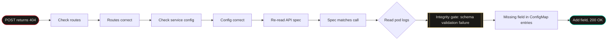

import Callout from '../../components/Callout.astro';
import StatRow from '../../components/StatRow.astro';
import PullQuote from '../../components/PullQuote.astro';
import SectionLabel from '../../components/SectionLabel.astro';
import ScrollReveal from '../../components/ScrollReveal.astro';
import DiagramBlock from '../../components/DiagramBlock.astro';

{/*
image_specs:
  - intent: "Schema drift between two versions of the same config: one complete, one missing a required field. Visualizes the gap between in-container defaults and ConfigMap-mounted content."
    style_notes: "Dark minimal. Two YAML documents side-by-side: one with all fields including ai_disclosure highlighted in teal, one missing that field with a visible red gap. No UI chrome, abstract technical mood."
    alt_text: "Two persona config schemas side by side — the in-container default on the left with all fields present, the ConfigMap version on the right with a highlighted missing field in red"
    aspect_ratio: "16:9"
    placement: "after-intro"
    output_path: /public/images/404-gate-eating-the-error/01-schema-drift.webp
  - intent: "Kubernetes volume mount override mechanism: how a ConfigMap replaces an entire directory rather than merging into it, leaving the container with less than it started with."
    style_notes: "Dark background, minimal diagram style. Two states: before mount (in-container defaults folder, complete) and after mount (ConfigMap replaces the folder, missing the field). Arrow showing replacement, not merge. Clean, technical."
    alt_text: "Diagram showing a container's persona directory before and after a ConfigMap volume mount: the mount replaces all contents, not just the files defined in the ConfigMap"
    aspect_ratio: "16:9"
    placement: "section-why-the-config-was-wrong"
    output_path: /public/images/404-gate-eating-the-error/02-volume-mount-replacement.webp
*/}

In April 1970, Apollo 13's crew heard a bang and saw a caution light. The initial read: instrument malfunction. The actual problem: an oxygen tank had ruptured. The instrument wasn't lying. It reported exactly what it saw. But the mental model in the room didn't include a ruptured tank, so the signal went to the wrong slot and the crew spent critical time debugging the wrong layer.

I spent an hour debugging a 404 that had nothing to do with the endpoint I was calling.

---

<SectionLabel text="The Symptom" />

## What the error said

I was wiring a new stage into the blog pipeline, the part that calls a persona enrichment service before drafting. The call is simple: POST to the enrichment endpoint with a persona ID, get back a voice enrichment blob, inject into the draft prompt.

The call returned 404.

My first read: routing problem. The service had recently been updated. New stages meant new paths. The obvious explanation was that I was calling a path that didn't exist or had moved.

<Callout variant="note">
A 404 means "not found." That is a routing concept. The route doesn't match, or the resource at that path doesn't exist. The 404 response gave me no body, no error detail, nothing beyond the status code. The obvious interpretation was: wrong path.
</Callout>

So I checked the routes. They matched. I checked the service configuration. Everything looked right. I re-read the API spec. My call matched the spec. Three checks, three dead ends, forty minutes gone.

<ScrollReveal>
<StatRow stats={[
  { value: "3", label: "Route checks before reading logs" },
  { value: "~1 hour", label: "Debugging the wrong layer" },
  { value: "1 log line", label: "That revealed the actual cause" }
]} />
</ScrollReveal>

---

<SectionLabel text="Wrong Track" />

## The debugging path before the right one

The problem with a 404 is that it's a complete sentence. It says: what you asked for doesn't exist here. It doesn't say: what you asked for exists, but we rejected it for a validation reason we're not going to tell you about.

I kept looking at routes because that's what 404 means. My mental model didn't include "validation gate returning a routing error code." So the signal kept going to the wrong slot.

<ScrollReveal>
<DiagramBlock caption="The actual debugging path: wrong track first, root cause only after reading pod logs">

</DiagramBlock>
</ScrollReveal>

What finally got me to the right layer: I read the pod logs. Not "checked if the service was running" logs. Actually read the log lines from the moment of the failed request.

There it was. Not a routing error. A formation integrity gate (a validation layer that runs on startup and on every request, checking that persona config meets a required schema before allowing enrichment) was rejecting the request. The error message named the specific field it couldn't find.

---

<SectionLabel text="The Root Cause" />

## What the gate was actually saying

The persona enrichment service requires a specific field in every persona YAML config: a disclosure marker that signals the persona's behavior on sincere questions. The formation integrity gate (think of it as a schema contract enforcer sitting in front of the enrichment logic) checks for this field before processing. If the field is absent, the gate rejects the request.

Here is the part that matters: the gate returned 404, not 422, not a validation error response. A 404. No body. No error detail. The gate's rejection looked identical to "this route doesn't exist."

<ScrollReveal>
<PullQuote>
A validation gate that returns 404 on schema rejection will get debugged as a routing problem every time. The error code is the bug, not the missing field.
</PullQuote>
</ScrollReveal>

The missing field wasn't a typo in my call. The persona config files I was using were schema-incomplete. And the reason they were schema-incomplete is the part that actually mattered.

---

<SectionLabel text="Why the Config Was Wrong" />

## The volume mount doesn't merge, it replaces

The persona enrichment service ships with default persona config files baked into the container image. Complete schema, all required fields present. When running locally or in development, those defaults serve as the runtime config. Everything works.

When deployed to the cluster, persona config is managed as a Kubernetes ConfigMap, mounted into the container at the personas directory path. This is standard practice: externalizing config from the image so you can update personas without rebuilding.

Here is what I didn't track carefully enough: when you mount a ConfigMap as a directory inside a container, the mount replaces the entire directory. It isn't merged. The in-container defaults are gone. The ConfigMap is the directory.

<Callout variant="warning">
A ConfigMap volume mount replaces the target directory entirely. Files baked into the image at that path are not preserved. If your image defaults have fields your ConfigMap entries don't, those fields disappear at runtime without any warning.
</Callout>

The in-container defaults had the disclosure field. The ConfigMap entries didn't. The mount wiped the defaults. The gate checked for the field. The gate returned 404. I debugged routes for an hour.

The fix was one field added to every persona YAML in the ConfigMap, then redeployed. POST returned 200. Pipeline stage wired.

---

<SectionLabel text="Counterarguments" />

## Where I'm wrong

**"Validate your config before deploying."** Correct. A schema validation step in the deploy process would have caught the missing field before the gate did. The lesson isn't just "read the pod logs." It's "don't let a runtime gate be your first schema validator." The fix here was operational. The better fix is structural: schema validation at deploy time, not at request time.

**"You should know how Kubernetes volume mounts work."** Fair. This is documented behavior. The mount replaces the directory, it doesn't merge. I knew this in principle. I didn't track that my ConfigMap entries had drifted from the in-container schema over time. The knowledge existed. The discipline of keeping ConfigMap entries in sync with the image schema did not.

**"The gate's 404 response is the real bug, and you glossed over it."** This is the strongest objection. A validation failure is not a routing failure. Returning 404 for a missing schema field is a design error in the gate: it obscures the nature of the failure and creates exactly the debugging dead end I hit. The argument "fix your config" is valid, but the gate's error response is independently broken. Callers who send syntactically valid requests to a live endpoint and receive 404 will always assume routing first. The gate should return 422 (unprocessable entity) with the missing field named in the response body. That's a PR for another day.

---

<SectionLabel text="What I Watch Now" />

## The question that stays open

The pipeline stage is wired. The config is complete. The gate works.

What I'm still thinking about: how many other places in the system have a similar drift between image defaults and deployed config? The volume mount behavior isn't unique to this service. Any service that ships with defaults baked into the image and overrides those defaults with an external mount is a candidate for the same gap.

I don't have a good answer yet. I have the question, which is more than I had before I spent an hour on routes that were never the problem.

*Casey Gager builds a personal AI orchestration system on personal time and equipment. He writes about what works, what breaks, and what he's still figuring out. Views are his own.*
