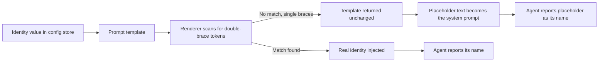
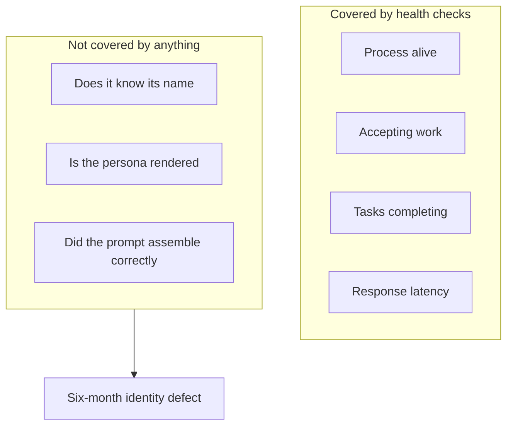

import Callout from '../../components/Callout.astro';
import StatRow from '../../components/StatRow.astro';
import PullQuote from '../../components/PullQuote.astro';
import SectionLabel from '../../components/SectionLabel.astro';
import ScrollReveal from '../../components/ScrollReveal.astro';
import DiagramBlock from '../../components/DiagramBlock.astro';

For roughly six months, one of my autonomous agents thought its own name was `{AGENT_ID}`. Not a variable holding a name. The literal characters, braces included, pasted into every message it sent.

<Callout variant="note" label="Build log">
The agent fleet injects per-agent identity through a prompt template rendered at container
startup. The template author wrote single-brace placeholders. The renderer only substitutes
double-brace placeholders. Nothing threw. Nothing logged. The unsubstituted placeholder
sailed straight through into the system prompt, and the agent dutifully reported its name as
the placeholder for months before anyone noticed.
</Callout>

---

<SectionLabel text="The Bug" />

## One brace, six months

The mechanic is embarrassingly small. A config store holds a prompt template. A task runner reads that template, walks it looking for placeholders, swaps in the real values, and hands the finished string to the agent as its system prompt.

The renderer's placeholder syntax is `{{AGENT_ID}}`. The template said `{AGENT_ID}`.

<ScrollReveal>
That is it. That is the whole defect. The renderer scanned for double braces, found none, decided there was nothing to substitute, and returned the template unchanged. Which is, technically, exactly what a correct string-replacement function does when it finds no matches. It did its job perfectly. Its job was just aimed at the wrong grammar.

The agent then read a system prompt that said, in effect, "your name is `{AGENT_ID}`," and did what any well-behaved language model does with an unambiguous instruction: it believed it.
</ScrollReveal>

<ScrollReveal>
<DiagramBlock caption="The identity injection path, and the exact point where it silently degrades">

</DiagramBlock>
</ScrollReveal>

<ScrollReveal>
<PullQuote>
The template rendered successfully. The container started successfully. The agent ran successfully. The only thing that failed was the meaning, and nothing in the stack measures meaning.
</PullQuote>
</ScrollReveal>

---

<SectionLabel text="Silent Failure" />

## Why string templating fails quieter than almost anything else

Most infrastructure bugs announce themselves. A bad port refuses connections. A malformed config file crashes the parser. A missing secret throws on startup and the container dies in a restart loop that shows up on a dashboard within ninety seconds.

<ScrollReveal>
String substitution has none of those properties. Consider what "failure" even looks like for a function whose contract is "find these tokens, replace them, return the result":

- Zero matches is a legal outcome. Plenty of templates have no variables.
- The output is still a valid string. It still has the right type, roughly the right length, and the right shape.
- The consumer is a language model, which is the single most forgiving parser ever built. It will not reject malformed input. It will interpret it.

Three properties that individually are fine, and together produce a failure mode with no detectable surface. There is no exception to catch, no exit code to alert on, no log line to grep, because from the renderer's point of view nothing went wrong.
</ScrollReveal>

<Callout variant="warning" label="The general shape">
Any time you pipe a template through a renderer and into a model, you have built a channel
where a syntax error downgrades to a semantic error. Syntax errors are loud. Semantic errors
are a wrong answer delivered confidently. Moving a bug across that line is the most expensive
thing a templating layer can do to you.
</Callout>

---

<SectionLabel text="The Blind Spot" />

## Every health check was green, and every health check was right

This is the part that actually stings. I have monitoring. The agent fleet reports liveness, readiness, task throughput, and error rates. During the entire six-month window, all of it was green, and none of it was lying.

<ScrollReveal>
<StatRow stats={[
  { value: "6 months", label: "Time to detection" },
  { value: "0", label: "Failed health checks" },
  { value: "1 brace", label: "Size of the actual fix" }
]} />
</ScrollReveal>

<ScrollReveal>
Go down the list and ask what each signal is actually measuring:

- **Liveness**: is the process running? It was. The identity bug does not affect process health.
- **Readiness**: can it accept work? It could. It accepted and completed work the entire time.
- **Error rate**: are tasks failing? They were not. The agent finished its assignments.
- **Latency**: is it slow? No. Reading a wrong name costs zero milliseconds.

Every one of those checks answered its question correctly. The problem is that none of them was asking the question that mattered, which is "does this agent know who it is?" That question has exactly one place it can be answered: the agent's output.
</ScrollReveal>

<ScrollReveal>
<DiagramBlock caption="What operational monitoring observes versus where the identity defect actually lives">

</DiagramBlock>
</ScrollReveal>

<ScrollReveal>
<PullQuote>
Uptime tells you an agent is running. It tells you nothing about whether the thing that is running is the thing you deployed.
</PullQuote>
</ScrollReveal>

The only instrument that could have caught this is the one that reads what the agent says and compares it against what the agent is supposed to say. I already run behavioral drift detection against persona output, comparing live responses to a recorded baseline using structural features like response length, lexical diversity, and sentences per response.[^1] It was tuned to catch personality drift, the slow slide where a character's voice degrades over weeks. It was never pointed at a hard identity assertion, because "the agent will correctly state its own name" is the kind of assumption you do not think to write down.

<Callout variant="insight" label="The assertion I was missing">
Behavioral drift detection is a statistical instrument. It watches distributions and flags
deviation from a baseline. What was missing was the dumbest possible complement to it: a
literal assertion that the rendered system prompt contains no unsubstituted placeholder
tokens, and that the agent's self-identification matches the value it was assigned. That is a
substring check. It would have caught this on day one.
</Callout>

---

<SectionLabel text="Startup Injection" />

## Container startup is a single point of failure with no receipt

The deeper issue is architectural. Agent identity arrived exactly once, at container startup, through one channel, with no confirmation step.

<ScrollReveal>
Compare that to how you would handle any other critical value. A database connection string gets validated by connecting. A certificate gets validated by a handshake. A feature flag gets read repeatedly and can be corrected without a restart. Identity injection had none of those properties: injected once, never re-read, never echoed back, never verified.

It is worth naming why this pattern is so easy to build. Startup injection is genuinely good design for configuration. It is fast, it is stateless, and it keeps the running process simple. The mistake was treating identity as configuration. Configuration is a value the process uses. Identity is a claim the process makes about itself, and claims need verification.
</ScrollReveal>

<Callout variant="critical">
If a value shapes what your agent believes about itself, it is not configuration. Configuration
that is wrong produces an error. Identity that is wrong produces a confident, articulate,
fully operational agent that is not the agent you think you are talking to.
</Callout>

---

<SectionLabel text="The Fix" />

## Three changes, zero new services

The repair took one afternoon and deployed no new infrastructure, which is its own small indictment of how long it sat there.

<ScrollReveal>
1. **Fix the template syntax.** Single braces became double braces. This is the one-brace change, and on its own it resolves the specific incident and prevents exactly nothing in the future.
2. **Assert on the rendered prompt.** After rendering, scan the output for leftover placeholder tokens. Any survivor is a hard failure at startup, not a warning. A template that renders to a string still containing brace-wrapped tokens is a broken template, full stop.
3. **Add a behavioral identity check.** Point the drift baseline at a fixed self-identification probe. Ask the agent who it is on a schedule and compare the answer against the assigned value. This is the check that catches the next variant of this bug, whatever shape it takes.
</ScrollReveal>

<ScrollReveal>
<StatRow stats={[
  { value: "3", label: "Follow-up work items" },
  { value: "0", label: "New services deployed" },
  { value: "1 afternoon", label: "Total repair time" }
]} />
</ScrollReveal>

Item two is the one that generalizes. The template syntax fix is a patch. The post-render assertion is a class-of-bug eliminator, and it costs one regular expression evaluated once per container start. There is no reason not to have it, and I did not have it, and that is the actual lesson.

---

<SectionLabel text="Counterarguments" />

## Counterarguments

I have opinions about this incident. Here are the strongest arguments against them.

<ScrollReveal>
**"This is a linting problem, not an observability problem."** The fair version of this critique: a schema check on the template, or a renderer that fails loudly on unknown brace syntax, catches the bug before it ever ships. No behavioral testing required. I mostly agree, and post-render assertion is exactly that fix. Where it falls short is coverage. Static validation catches the failures you anticipated well enough to write a rule for. It does not catch a correctly rendered template that injects the wrong agent's identity, or a value that is valid but stale, or a prompt that assembles fine and gets truncated downstream. Linting narrows the failure surface. It does not close it.

**"Six months of nobody noticing means the identity did not matter."** This one has real teeth. If an agent completes tasks correctly for half a year while confused about its own name, the honest reading is that the identity field was decorative. Partly true: task execution never depended on it. What did depend on it was every downstream system that routes, attributes, and audits by agent identity. Messages were attributed to a placeholder. Memory entries were tagged inconsistently. Anyone auditing "which agent did this" got a string that pointed nowhere. The tasks worked. The accountability trail did not, and accountability is the part you only need after something has gone wrong.

**"You are overfitting a monitoring strategy to one embarrassing bug."** Behavioral testing is expensive. It needs a baseline, it needs maintenance, it produces false positives, and my own drift detector has already fired on in-character behavior that turned out to be perfectly correct.[^2] Building a whole behavioral test suite to catch one brace is bad economics. The counter to the counter: I am not proposing behavioral testing as a replacement for operational monitoring. I am proposing one probe, on one assertion, asking one question. Scope it to identity and the maintenance cost is close to zero.

**"Just do not build identity injection this way."** Pass the identity through a channel the agent has to acknowledge, and the failure becomes loud by construction. This is the strongest argument on the list and I do not have a good rebuttal. It is more work up front and it makes the failure impossible rather than detectable, which is a better class of solution than anything else here.
</ScrollReveal>

---

<SectionLabel text="What I Am Watching" />

## The bugs that make your agent confidently wrong

The thing I keep turning over is that this bug had no adversary and no complexity. Nobody attacked anything. There was no race condition, no distributed systems edge case, no clever exploit. Someone typed one brace where two were needed, and a system that was working perfectly at every layer produced an agent that was wrong about the most basic fact available to it.

Language models will interpret anything you hand them. That is the feature. It also means every layer that assembles a prompt is a place where a mechanical error converts into a confident wrong belief, with no crash to mark the transition. Template rendering is one such layer. Context assembly is another. Retrieval is another. Tool output parsing is another. Each one is a spot where "the code worked" and "the agent is correct" quietly stop being the same statement.

So the question I am carrying into the next build: for every value that reaches an agent's context, what would it look like if that value were silently wrong, and is there anything in my stack that would notice? For identity, the answer was no for six months. I would like the list of values where the answer is still no to be short, and I would like to know what is on it.

[^1]: Internal persona drift study, 2026-07-18. Structural feature comparison (average response length, lexical diversity, sentences per response) replaced token-overlap scoring after the overlap metric was found to have a natural floor at low temperature and short response lengths, making it unusable as a threshold.

[^2]: Internal drift signal review, resolved 2026-08-01. Repeated medium-severity drift signals were classified as false positives after review confirmed the triggering behaviors were authentic expressions of the configured persona rather than degradation.
