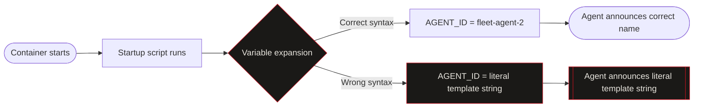
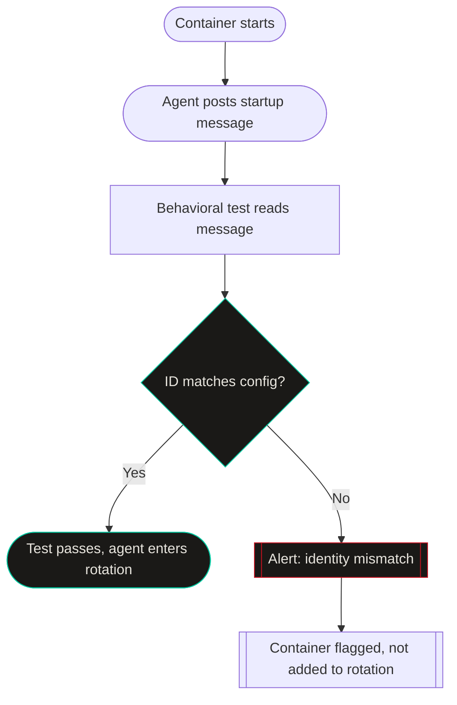

import Callout from '../../components/Callout.astro';
import StatRow from '../../components/StatRow.astro';
import PullQuote from '../../components/PullQuote.astro';
import SectionLabel from '../../components/SectionLabel.astro';
import ScrollReveal from '../../components/ScrollReveal.astro';
import DiagramBlock from '../../components/DiagramBlock.astro';

For several months in early 2026, every agent in my fleet announced its name as a literal template string in the coordination channel. Not the agent's actual name. The template placeholder. The thing that was supposed to be substituted before the agent said anything.

Health checks: passing. Uptime: 100%. Agents: completing tasks, posting updates, closing work items. None of that surfaced the problem. A human happened to read the output and noticed something was wrong.

---

<SectionLabel text="The Bug" />

## What broke and how

Agent identity in this system is injected at container startup via environment variable. Each agent has an ID, a role, and a persona description. These get passed in when the container launches, and the startup script uses them to configure how the agent presents itself in messages, logs, and work item updates.

The startup script uses shell variable expansion: `${AGENT_ID}` becomes the actual agent ID when the script runs. Standard shell behavior. This worked fine for a long time.

At some point, a change to the startup script introduced the wrong template syntax. Instead of `${AGENT_ID}`, the variable reference used double curly braces: `{{AGENT_ID}}`. Shell does not expand `{{AGENT_ID}}`. It treats the outer braces as grouping and the inner string as a literal. The variable was never substituted.

Every agent started up, read its identity configuration, found `{{AGENT_ID}}` where its name should be, and reported that string as its name. Not an error. Not a warning. Just wrong.

<ScrollReveal>
<DiagramBlock caption="Identity injection path and where the break occurred">

</DiagramBlock>
</ScrollReveal>

<Callout variant="warning">
Shell template syntax errors do not produce error messages. The shell sees `{{AGENT_ID}}` and interprets it as best it can. No exit code. No log entry. The agent starts successfully. The startup script completes without complaint. The only evidence is in what the agent says.
</Callout>

---

<SectionLabel text="Why It Hid" />

## The detection gap

This bug hid because the monitoring I had in place was watching for the wrong signals.

Operational monitoring answers one question: is the system up? Health endpoints return 200. Containers restart on schedule. Memory usage is in range. Tasks are completing. The system is "healthy" by every definition I had instrumented.

The bug did not affect any of those things. The agents were completing tasks correctly. They were posting updates correctly. They were opening pull requests and writing memory entries and running checks. The only thing wrong was what they said when they introduced themselves or referenced their own identity in messages.

<ScrollReveal>
<StatRow stats={[
  { value: "Several months", label: "Before detection" },
  { value: "0", label: "Health check failures during that period" },
  { value: "1", label: "Human who happened to read the output" }
]} />
</ScrollReveal>

<ScrollReveal>
<PullQuote>
Health checks answer "is the system running." Behavioral tests answer "is the system doing what it is supposed to do." These are different questions. Running tests do not catch behavioral drift. You need both.
</PullQuote>
</ScrollReveal>

The class of bug this represents: presence of wrong content rather than absence of expected content. Most monitoring detects absence. A service is down (absent). An error rate spikes (absent responses). A health check fails (absent signal). Detecting that a thing which exists is wrong requires actively inspecting what the thing contains, not just whether the thing responded.

Agent identity falls squarely into this class. The agents were responding. The responses were wrong.

---

<SectionLabel text="Why Identity Matters" />

## What breaks without reliable agent identity

The immediate reaction to this bug is "so what, the name was wrong, did it matter?"

It mattered more than it appeared. In a multi-agent system where agents coordinate through a shared channel and work tracking system, identity is the audit trail. When two agents are working on related tasks, they reference each other. When something goes wrong, you trace back to which agent did what. When an agent makes a decision, its identity is in the record.

If an agent reports its identity as `{{AGENT_ID}}`, the audit trail is broken. You know a message was posted. You do not know which instance posted it. In a fleet that runs multiple agents concurrently, this makes post-incident reconstruction significantly harder.

<Callout variant="insight">
Agent identity is infrastructure, not personality. A fleet where you cannot tell which agent did what is not observable. Not observable means not debuggable when something goes wrong.
</Callout>

There is also a subtler problem: agent self-reference. Agents in this system sometimes need to describe their own role, reference their own previous actions, or coordinate with other agents by identifying themselves. If an agent cannot correctly report who it is, these coordination tasks degrade silently. The agent does its best with wrong inputs.

---

<SectionLabel text="The Fix and Lesson" />

## What changed

The immediate fix was obvious: correct the template syntax. That took minutes. The bug was in one line of one file.

The non-obvious fix was behavioral testing. Not "is the agent up" checks. Tests that actually read what agents say and verify it matches expected patterns. For identity: on startup, the agent posts a message to the coordination channel. A test reads that message and checks that the agent ID in the message matches the configured agent ID for that container.

This is a small test. It would have caught the bug on the first deployment after the bad change. It was not in place because I had not thought about this failure mode before it happened.

<ScrollReveal>
<DiagramBlock caption="Behavioral test added after the incident: identity verification on startup">

</DiagramBlock>
</ScrollReveal>

The broader lesson is about what you have to test in agent systems that you do not have to test (or test differently) in conventional software.

In a conventional service, you test that the API returns the right response. The service does not have a persona, does not announce its identity in prose, does not describe its own role in natural language. None of those things are in scope for typical testing.

In an agent system, all of those things are in scope, and they are all behavioral. They do not fail with exit codes. They fail with wrong text in places that humans are not necessarily reading on every run.

<Callout variant="critical">
Any property that the agent expresses in natural language, rather than through a structured return value, requires behavioral testing to verify. The test has to read what the agent says. There is no other way to catch this class of bug.
</Callout>

---

<SectionLabel text="Counterarguments" />

## The obvious objections

**"Just write the startup script correctly."** Yes. And yet. The bug was introduced by a change that made sense in isolation. Template syntax mistakes happen in every codebase. The question is not whether you write perfect code; it is whether you detect when imperfect code produces wrong behavior. The test catches it regardless of how the bug got in.

**"Your monitoring was just inadequate."** Also true, and the lesson is precisely that "adequate monitoring" for agent systems includes behavioral coverage that is not necessary for conventional services. The scope of what needs monitoring is different.

**"This is a trivially small fleet. The problem is proportionality."** Fair point on scope. This system runs a handful of agents, not thousands. At scale, the behavioral test layer becomes significantly more complex. I am not claiming this is a solved enterprise problem. I am claiming the monitoring gap is real at any scale, and the smallest version of the lesson is: if your agents say things, test what they say.

---

<SectionLabel text="What I Watch Now" />

## The residual question

The behavioral test is in place. The identity injection is working. The audit trail is reliable.

What I am still thinking about: other ambient properties the agents express that I have not written tests for. Identity was the obvious one once it broke. What are the less obvious ones?

Agent confidence, for instance. When an agent says "I have completed step 3," is that accurate? When it says "this approach failed for reason X," is that diagnosis correct? These are behavioral properties that affect the reliability of the whole system, and they are much harder to test than identity.

I do not have good answers. I have the question, which is more than I had before a human noticed that one of my agents was introducing itself as `{{AGENT_ID}}`.

*Casey Gager builds a personal AI orchestration system. He writes about what works, what breaks, and what he is still figuring out. Views are his own.*

## See also

- [Strip your agent to voice and guitar](/analysis/strip-agent-voice-guitar) — agent identity is the "voice" in that metaphor. This failure shows what happens when the load-bearing element silently corrupts.
- [prom-memory: building episodic memory for an AI system that actually remembers](/build-logs/prom-memory) — the memory layer that carries identity context. The attribution tooling prom-memory shipped was a direct response to this class of silent failure.
- [Writing to the Next Session](/build-logs/writing-to-the-next-session) — session handoff depends on the agent knowing who it is. A broken identity injection breaks the entire recovery chain.
- [The Elliot Probe](/research/bdd-persona-drift) — structural baseline detection. The Elliot Probe was designed to catch exactly this: behavioral drift that health checks miss.
- [My AI system builds itself, that's the point](/build-logs/ai-system-builds-itself) — the self-modification capability that makes identity injection correctness critical. An agent writing specs needs to know which agent it is.
