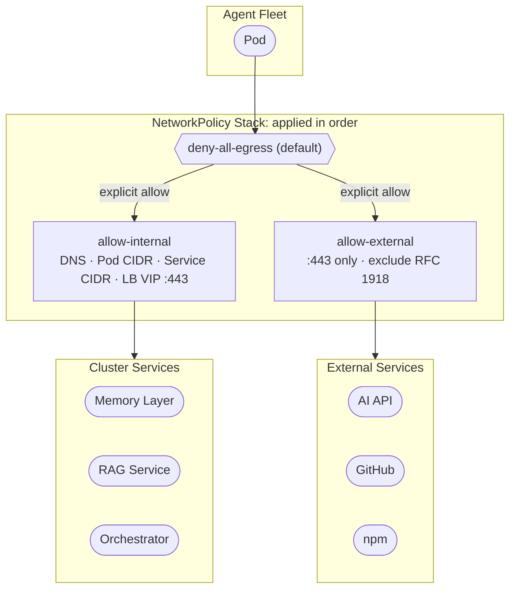

import Callout from '../../components/Callout.astro';
import PullQuote from '../../components/PullQuote.astro';
import SectionLabel from '../../components/SectionLabel.astro';
import DiagramBlock from '../../components/DiagramBlock.astro';

An autonomous build agent that can reach arbitrary endpoints is an autonomous build agent you don't fully control. The credentials it holds are valid. It authenticates normally. Your access logs look fine. But if the pod's network egress is unconstrained, a compromised agent can do things you didn't authorize from infrastructure your defenses weren't watching.

That's the problem this sprint was built to close.

Five changes shipped to a four-pod autonomous build agent cluster. None of them are novel. All of them were overdue.

---

<SectionLabel text="The Setup" />

## What we were working with

The cluster runs four autonomous build agents as separate pods. Each pod holds OAuth credentials for an external AI API, has access to an internal memory layer and code repository, can dispatch tasks autonomously, and writes results back to shared state. Before this sprint, all four pods were running as root with no egress restriction.

Running as root with unconstrained egress is the default for container workloads that were built fast. It's also a hard-to-defend posture when the pod can autonomously authenticate to external services and write code. The audit backlog had been visible for two months. This sprint closed it.

---

<SectionLabel text="What Shipped" />

## Five changes

<Callout variant="insight" label="Sprint scope">
All five shipped and confirmed across all pods before the session closed. No partial states. The smoke test ran clean: task dispatched, memory writes confirmed, exit 0.
</Callout>

**1. Deny-all egress with explicit allows**

A three-policy structure: deny all egress by default, then explicit allows for cluster-internal services and external HTTPS only.

<DiagramBlock caption="Three-policy egress structure: deny-all base, explicit internal and external allows layered on top">

</DiagramBlock>

External port 80 is blocked. RFC 1918 space is excluded from the external allow, with explicit cluster CIDR carve-outs for the internal allow. The internal allow covers cluster DNS, pod and service CIDRs, and the load balancer VIP on port 443.

Smoke test after apply: port 80 to an external address timed out; HTTPS to the AI API returned a response; the internal memory layer returned healthy.

**2. Non-root execution and read-only root filesystem**

All four pods confirmed running as a non-privileged user with a read-only root filesystem. The workspace volume is mounted writable; the container root is not. This limits blast radius for container escapes and removes the trivial path to host filesystem access.

Side effect worth noting: the init container that sets ownership on the workspace volume runs a recursive chown across a directory that had accumulated several hundred installed packages. On the pod with the largest workspace, this took over fourteen minutes. The deployment controller's deadline fired and marked a failure, but the pod completed. The fix is to clean the workspace after builds, not to extend the deadline. Until that's wired into the task completion lifecycle, the problem will recur.

**3. IDS log rotation**

The intrusion detection system writes a continuous event log that was unbounded. On a busy node this creates disk pressure that cascades into pod evictions. An hourly rotation job now truncates the log before it can cause storage issues. Simple fix, real risk eliminated.

**4. OAuth credential expiry monitoring**

The external AI API authenticates via OAuth. Tokens expire. Before this sprint, the agent would attempt to start a session with an expired token, fail silently, and exit.

Two blocks added to the startup sequence:

- Startup check: parse the stored token's expiry timestamp, compare to current time. If expired or within sixty minutes of expiry, post an alert to the messaging channel and wait in a loop for a credential refresh.
- Background watcher: after startup, a subprocess polls every thirty minutes and alerts if expiry is approaching.

All four pods confirmed with the watcher process running on the same session the change shipped.

**5. ISA availability gate**

A precondition check added to the task dispatch endpoint: before accepting a new build task, the agent verifies the specification document for that task is reachable and valid. If the specification is absent or corrupted, the agent refuses the task and returns a structured error instead of attempting to execute against a missing document. This closes the class of failures where an agent starts executing against stale or partial state and produces garbage output that looks like a real result.

---

<SectionLabel text="The Routing Discovery" />

## What we found that we didn't expect

The alert integration -- the agent posting status updates to the messaging channel -- started failing silently after the egress policy was applied. The messaging platform runs on the LAN, not in the cluster. Pods couldn't reach it.

Initial hypothesis: the egress policy was blocking the route. That was wrong.

The egress policy explicitly allows internal cluster ranges. The LAN range is excluded from the external allow, but that exclusion should have been irrelevant because LAN traffic exits via the cluster's default gateway, not the external allow path. The NetworkPolicy was correct.

<PullQuote>
The packet was being dropped before the policy could allow it. The policy layer was working correctly. The problem was one layer below it.
</PullQuote>

The actual cause is in the container network interface layer. The CNI classifies pod-to-LAN traffic as a specific internal identity, "remote node," and drops it before the traffic reaches the bridge interface. The drop happens in the BPF TC programs attached to the pod's virtual interface. NetworkPolicy never sees the packet.

The obvious next step was to enable masquerade on the CNI. That doesn't work either. Masquerade is deliberately disabled in this configuration because enabling it in chaining mode causes the CNI's postrouting chain to block the prior CNI's postrouting table. Manual ConfigMap fixes get reverted by the GitOps controller within approximately three minutes of application. You cannot patch around this at the ConfigMap level.

The actual fix is a CNI upgrade or an explicit BPF CIDR policy entry that teaches the controller to route specific address ranges as external traffic rather than remote-node traffic. That's a more invasive change, deferred to a dedicated workstream. The alert failures are non-fatal: the agents continue operating when they can't post to the messaging channel.

The broader lesson is the one worth taking forward. Pod egress behavior in a CNI-chained configuration is determined by two independent policy layers: the Kubernetes NetworkPolicy layer and the CNI's own BPF identity-based enforcement. They are not redundant. A packet can be allowed by one and dropped by the other, and the failure is silent. Debugging it requires knowing which layer to look at, and the NetworkPolicy audit tools will tell you nothing useful when the problem is BPF.

---

<SectionLabel text="What's Next" />

## What's still open

**Credential auto-refresh.** The watcher alerts but can't refresh the token without external tooling. If the refresh endpoint supports a plain HTTP request, a scheduled cluster job can handle it without additional dependencies. Under investigation.

**Per-pod secret scoping.** All four pods currently use the same credentials. The architectural preference is one credential set per pod with independent rotation. The specification for this work is written; execution is blocked on the auto-refresh infrastructure being in place first.

**Intent escalation path.** Currently there is no mechanism for an agent to escalate when a task exceeds its authorized scope. The agent either completes the task or fails. A structured escalation path, where the agent can surface a scope ambiguity and wait for resolution, is specified but not yet built.

---

<SectionLabel text="Counterarguments" />

## Counterarguments

**Egress controls are theater if the external allow is too broad.** Fair. Allowing all port 443 outbound to non-RFC-1918 destinations is a wide aperture. It blocks port 80 and non-standard ports, which stops a class of exfiltration, but it doesn't stop data leaving over HTTPS to an attacker-controlled server with a valid certificate. The correct long-term control is explicit destination allow-listing. That requires stable external IPs from the service providers, which is an external dependency.

**Non-root is not a security boundary.** True in the general case. Kernel exploits don't respect UID. Non-root with a read-only root filesystem raises the floor for container escape paths but doesn't eliminate them. It's a layer, not a wall.

**The credential watcher adds availability risk.** Correct. If the expiry check miscalculates or the alert channel is unreachable, the agent stalls at startup. The current implementation treats a stall as preferable to executing a session with expired credentials. If that preference is wrong for your availability requirements, the startup gate needs a timeout or bypass path.

**The workspace chown problem is not a mitigation.** Also correct. Cleaning the workspace after builds is the right fix, but it requires the task execution process to enforce a cleanup step that doesn't currently exist. Until the clean step is wired into the task completion lifecycle, workspace accumulation will recur and the init container will keep taking fourteen minutes.
