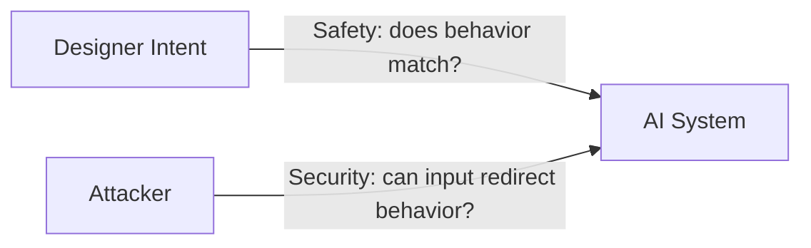

import Callout from '../../components/Callout.astro';
import PullQuote from '../../components/PullQuote.astro';
import SectionLabel from '../../components/SectionLabel.astro';
import ScrollReveal from '../../components/ScrollReveal.astro';
import DiagramBlock from '../../components/DiagramBlock.astro';

Here's what happens in a lot of AI risk conversations right now. Someone asks about securing an AI deployment. Someone else pulls up a responsible AI framework. The next hour covers model bias, transparency requirements, and alignment governance. Nobody talks about prompt injection, memory poisoning, or what the model does when it processes attacker-controlled input.

That is a security failure. It started with a category error.

I see this in client conversations constantly. An enterprise deploys an AI-powered document assistant. Security asks for a risk assessment. The framework on the table is an AI ethics policy. Ninety minutes later, no one has discussed what happens when an attacker embeds malicious instructions in a contract the assistant processes. The wrong discipline ate the whole meeting.

AI safety and AI security are not synonyms. They share two words and almost nothing else. Treating them as interchangeable gives you the wrong threat models, the wrong controls, and the wrong people in the room.

---

<DiagramBlock caption="Two distinct threat models: safety tracks intent against behavior; security tracks attacker input against behavior">

</DiagramBlock>

<SectionLabel text="What AI Safety Is" />

## What AI Safety Is

AI safety is a research and governance discipline. Its core question: does this system do what its designers intended, and does that intent produce good outcomes for humanity?

Safety researchers work on alignment, the problem of getting AI systems to pursue goals their designers actually want. They study RLHF (Reinforcement Learning from Human Feedback) and Constitutional AI, techniques for shaping model behavior toward human values. They think about long-horizon risks: what happens if a sufficiently advanced system optimizes for a proxy goal rather than the real one?

Safety frameworks also address misuse prevention. The EU AI Act's prohibited-use provisions, restrictions on generating child sexual abuse material, and controls on dual-use biological information all belong to safety. So do bias audits, fairness testing, and model transparency disclosures.

<PullQuote>AI safety asks whether your system does what you intended. AI security asks whether an attacker can make it do something you didn't.</PullQuote>

These are legitimate concerns. They require serious institutional attention. They are just not what a red team or an incident responder handles. Safety is about the designer's intent versus the system's behavior. Security is about the designer's intent versus the attacker's intent.

---

<SectionLabel text="What AI Security Is" />

## What AI Security Is

<ScrollReveal>

AI security is the adversarial discipline. Its core question: what can an attacker do to a deployed AI system, or through it?

The attack surface is specific. Prompt injection is the class of attacks where an attacker embeds instructions in content the model processes, hijacking its behavior. Direct injection arrives through user input. Indirect injection arrives via documents, emails, or web content the model reads as part of its task. Recent research has traced how prompt injection has evolved from a single-session exploit into a multi-step malware delivery mechanism, what some researchers call the Promptware Kill Chain.

Memory poisoning extends prompt injection into persistent state. In agentic systems with long-term memory, an attacker can corrupt the agent's stored context across sessions. The agent cannot distinguish between memories it formed from legitimate interactions and memories planted by an attacker. Research from Palo Alto's Unit 42 demonstrated this against Amazon Bedrock Agents: indirect prompt injection via a malicious webpage corrupted the agent's long-term memory, enabling persistent behavior modification that survived session boundaries.

Model theft covers the extraction of model behavior or weights without authorization. Membership inference attacks determine whether specific records appeared in a model's training set, a serious privacy concern when models train on sensitive enterprise data. Model inversion reconstructs training data from model outputs.

</ScrollReveal>

<Callout variant="warning">
These attacks are active and adversarial. They require threat modeling, detection, and incident response. An ethics review board does not stop prompt injection. An alignment audit does not detect memory poisoning.
</Callout>

MITRE ATLAS catalogs adversarial machine learning tactics against AI systems the same way ATT&CK catalogs adversarial tactics against traditional infrastructure. Supply chain compromise, training data poisoning, model evasion, and adversarial examples all appear in that taxonomy. This is not a research agenda. It is a living threat catalog, and attackers are using it.

---

<SectionLabel text="Why the Conflation Fails You" />

## Why the Conflation Fails You

When you apply safety frameworks to security problems, three things go wrong.

**Wrong threat model.** Safety frameworks assume accidental harm: a biased output, an unexpected capability, a misuse the developer didn't anticipate. Security requires adversarial threat modeling, which assumes an intelligent attacker who probes, adapts, and escalates. These produce fundamentally different control designs. A safety review optimizes for edge-case model behavior. A security review asks: where does attacker input enter the system, and what can it cause?

**Wrong controls.** Content filters and RLHF fine-tuning are safety controls. They reduce the probability of unintended model outputs. They do not stop an attacker who knows the model's guardrails and crafts input to route around them. Memory isolation, input validation, output sanitization, and agent sandboxing are security controls. The two categories are not interchangeable. A system can pass every safety evaluation and still be trivially compromised through indirect prompt injection.

**Wrong people in the room.** AI safety conversations belong to machine learning engineers, ethicists, policy teams, and governance leads. AI security conversations belong to architects, red teams, incident responders, and the security operations center. Mixing these audiences dilutes both disciplines. A CISO sitting through an alignment discussion is not getting risk addressed. A researcher presenting fairness metrics to a SOC team is in the wrong meeting.

<PullQuote>The conflation isn't just a vocabulary problem. It delays real security work while organizations perform safety theater.</PullQuote>

I've watched organizations spend quarters on AI governance frameworks, bias audits, and responsible use policies while their AI-integrated applications had no input validation, no prompt injection controls, and no detection for anomalous model behavior. They were safe. They were not secure. Those are two different statements.

---

<SectionLabel text="The Operational Answer" />

## The Operational Answer

On the security side, the response to AI threats follows the same pattern as any operational security problem. Detect anomalous behavior. Isolate the affected component. Respond to the incident. Adapt controls based on what you learned.

<Callout variant="insight">
That four-step loop, Detect, Isolate, Respond, Adapt (DIRA), is the operational framework I apply to AI security incidents. This series will go deeper on each phase and how they map to specific AI attack classes, starting with prompt injection detection in the next post.
</Callout>

The distinction between safety and security is not a pedantic vocabulary argument. It determines what you build, what you test, who you call when something goes wrong, and whether your organization is actually protected against the threats targeting deployed AI systems today.

Get the category right first. Everything else follows from that.

---

## Where I'm wrong

The sharpest objection is that the framing is too clean. In practice, safety and security failures overlap — a misaligned model is easier to manipulate, and a successfully attacked model starts behaving in misaligned ways. The categories are analytically distinct but causally entangled. Treating them as separate silos could lead to gaps at the boundary.

There is also an institutional argument against separating teams by category. If the safety team and the security team never talk, the safety team won't think about adversarial inputs when setting behavioral guidelines, and the security team won't think about alignment drift when assessing incident scope. The separation I'm arguing for is about mental models and controls, not necessarily about org structure.

---

*Views are my own, not those of my employer.*
