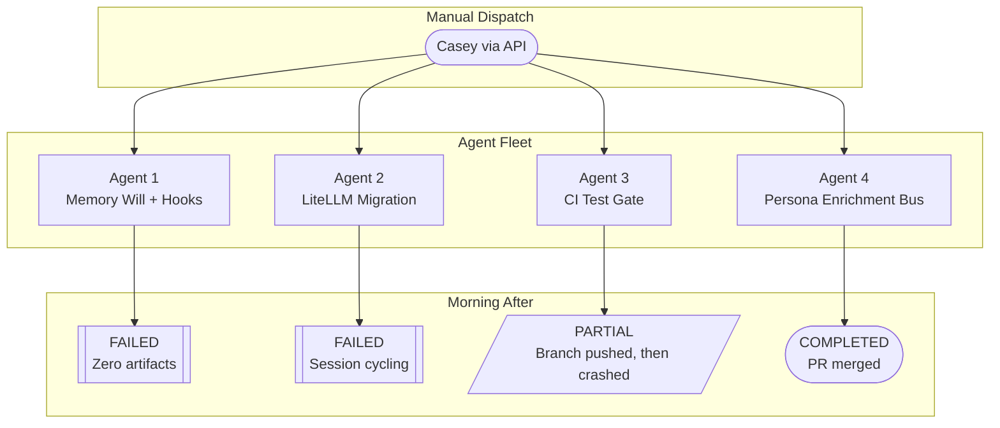
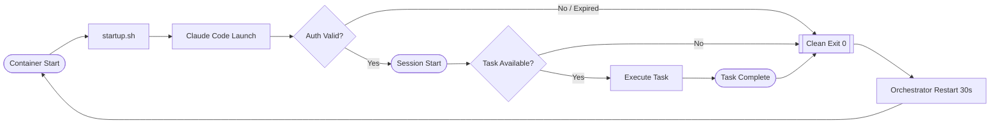
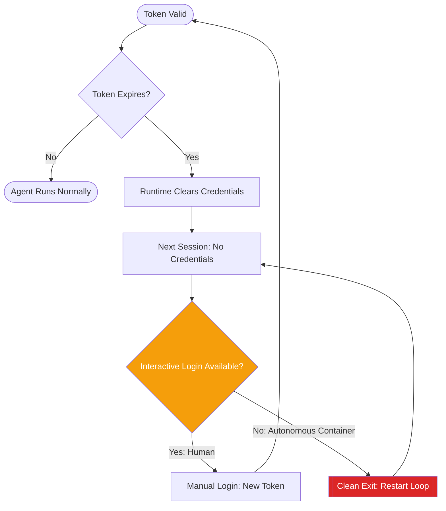

import Callout from '../../components/Callout.astro';
import StatRow from '../../components/StatRow.astro';
import PullQuote from '../../components/PullQuote.astro';
import SectionLabel from '../../components/SectionLabel.astro';
import ScrollReveal from '../../components/ScrollReveal.astro';
import DiagramBlock from '../../components/DiagramBlock.astro';

<Callout variant="note" label="Build log">
This is a failure report. Four agent fleet instances were dispatched overnight to work on
real tasks across real repositories. One completed its task and opened a clean PR.
One pushed good work and then crashed. Two produced nothing. If you're building
autonomous agent fleets, this is the part nobody publishes.
</Callout>

---

<SectionLabel text="The Dispatch" />

## What we sent into the night

Four agent containers, each running an isolated Claude Code session. Each one assigned
a real work item from the sprint backlog, each targeting a different repository, each
expected to clone, build, commit, open a PR, and report back.

<ScrollReveal>
The dispatch was manual: four API calls to four task runner endpoints, each carrying
a work item ID and an ISA (Implementation Spec and Approach) document that tells the
agent what to build. The containers had been scaled to four instances earlier that
session. Git auth was wired. Memory services were reachable. The startup bugs from
earlier sessions were fixed. Everything looked ready.
</ScrollReveal>

<ScrollReveal>
<DiagramBlock caption="Dispatch: four work items to four isolated agent containers">

</DiagramBlock>
</ScrollReveal>

The expectation: wake up to four PRs in the review queue and a notification channel
full of completion messages. The reality was more educational.

---

<SectionLabel text="The Results" />

## One out of four

In baseball, .250 is a respectable batting average. In autonomous agent fleet
reliability, it is a data point that tells you exactly where the infrastructure
breaks.

<StatRow stats={[
  { value: "1", label: "Completed" },
  { value: "1", label: "Partial" },
  { value: "2", label: "Failed" },
  { value: "25%", label: "Success rate" }
]} />

<ScrollReveal>

| Instance | Task | Result | Artifacts |
|----------|------|--------|-----------|
| Agent 1 | Memory persistence + interrupt objects | **FAILED** | Zero. Container never wired correctly. |
| Agent 2 | Semantic LiteLLM migration | **FAILED** | Zero. Session cycling loop. |
| Agent 3 | CI pytest gate for a test suite | **PARTIAL** | Branch pushed, 18/19 tests pass. No PR. Then crashed. |
| Agent 4 | Affective state enrichment for persona engine | **COMPLETED** | PR opened and merged. Clean code, fail-open design. |

</ScrollReveal>

<PullQuote>
The first real fleet dispatch didn't tell us whether the agents were smart enough.
It told us whether the infrastructure was stable enough for them to even start.
</PullQuote>

---

<SectionLabel text="The Systemic Failure" />

## Session cycling: the fleet-wide killer

Three of four containers exhibited the same failure pattern. Not three different bugs. The
same bug, three times, wearing slightly different log output.

<Callout variant="critical" label="Fleet-wide failure pattern">
**Session cycling loop:** Claude Code launches, immediately ends the session, container restarts
after 30 seconds, Claude Code launches again, immediately ends, restart, repeat. The
loop runs indefinitely. No work is attempted. No error is thrown. The agent starts, decides
it has nothing to do (or can't authenticate), and exits cleanly. The orchestrator sees a clean
exit, waits 30 seconds per the restart policy, and tries again. Forever.
</Callout>

The cycling pattern was identical across Agents 2, 3, and 4. Even Agent 4, which
completed its task successfully, fell into the same cycling loop after finishing. The
task ran, the PR shipped, and then the container entered the death spiral like every other
instance.

This was not a task-specific failure. It was an environment problem.

<ScrollReveal>
<DiagramBlock caption="The session cycling loop: clean exit, restart, repeat">

</DiagramBlock>
</ScrollReveal>

The root cause was a combination of two things:

1. **OAuth token lifecycle.** Claude Code's OAuth token on the persistent volume had
   degraded. The token was either expired or revoked. When Claude Code detects an
   invalid token, it clears the credential file entirely. The next session attempt
   finds no credentials, can't authenticate non-interactively, and exits. There is no
   retry path that doesn't involve a human running the login flow inside the container.

2. **The idle loop was still running.** Before the event-driven redesign, the startup
   script ran a `while true` loop: launch Claude Code, sleep 30 seconds, repeat. When
   the task finished or the auth failed, the loop restarted Claude Code immediately.
   Four containers, each cycling every 30 seconds: roughly 5,760 wasted session starts
   per day, each one hitting the API, each one exiting, each one generating a log line
   that looked like normal operation.

<Callout variant="insight" label="Fleet-wide vs. task-specific">
The most important lesson from the first dispatch: when 3 of 4 agents fail the same way,
the problem is never in the task description or the spec document. It's in the environment.
Auth, networking, volume mounts, credential lifecycle. The agent logic was fine. The
infrastructure was hostile.
</Callout>

---

<SectionLabel text="The Win" />

## Agent 4: the one that worked

Agent 4 was assigned the persona enrichment task. The job: fetch affective state
(a five-dimensional emotional context vector) before each persona enrichment call and
inject it into the persona's tone. A real feature with real architectural implications.

<ScrollReveal>
Agent 4 did exactly what it was supposed to:

1. Cloned the target repository
2. Read the implementation spec
3. Implemented the state fetch with a fail-open design (if the state service is
   unreachable, the persona proceeds without affective modulation, no crash, no block)
4. Committed clean code with proper branch naming
5. Opened a PR
6. Wrote a milestone to the memory system
7. Reported to the ops channel with the PR link

Then it fell into the same session cycling loop as everyone else.
</ScrollReveal>

<StatRow stats={[
  { value: "1", label: "PR opened" },
  { value: "Merged", label: "Status" },
  { value: "Fail-open", label: "Design pattern" }
]} />

The PR was clean. The code was reviewed, tested, and merged. The fail-open pattern was
the right architectural call for an optional enrichment service. Agent 4 demonstrated that
when the infrastructure cooperates long enough for the agent to actually run, the agent
produces production-quality work.

<PullQuote>
The agent was never the problem. The infrastructure around it was.
</PullQuote>

---

<SectionLabel text="The Partial" />

## Agent 3: good work, bad ending

Agent 3 was assigned a CI test gate. The task: add a test job to the CI workflow that
runs the existing test suite on every push and PR.

<ScrollReveal>
Agent 3 got further than Agent 2 but didn't finish:

1. Cloned the repository
2. Created a feature branch
3. Added the CI test job to the workflow YAML
4. Pushed the branch to GitHub
5. CI ran: 18 of 19 tests passed. The one failure was pre-existing, not introduced by the agent
6. Never opened a PR
7. Crashed into the session cycling loop

The work was real and it was good. The branch exists. The CI pipeline exists. 18 of 19
tests are green. But without the PR, the work sits on an orphaned branch that nobody
knows about unless they go looking.
</ScrollReveal>

<StatRow stats={[
  { value: "18/19", label: "Tests passing" },
  { value: "1", label: "Pre-existing failure" },
  { value: "0", label: "PRs opened" }
]} />

This is the failure mode that costs the most: work was done, value was created, and it's
invisible. The PR is the artifact that triggers the review pipeline. No PR means the
work might as well not exist. Agent 3 was 90% of the way there and then the environment
killed it.

---

<SectionLabel text="The Failures" />

## Agent 1 and Agent 2: nothing to show

**Agent 1:** The container for Agent 1 never properly existed. It was scheduled, but the
task dispatch targeted a service endpoint that wasn't wired. The API call returned
success, and then nothing happened. Zero artifacts. Zero log entries from a Claude
session. The dispatch succeeded at the HTTP level and failed at every level that matters.

**Agent 2:** Agent 2 entered the session cycling loop immediately. Launch, clean exit,
30-second restart, launch, clean exit. No task execution. No git operations. No commits.
The OAuth token was already degraded when the dispatch arrived. The agent couldn't
authenticate, couldn't start a session, and the loop ensured it would keep trying and
failing until someone intervened.

---

<SectionLabel text="Root Cause" />

## Why it broke: the auth lifecycle gap

The fleet's failure modes converge on one systemic issue: **credential lifecycle
management in an autonomous container environment.**

<ScrollReveal>
Claude Code authenticates via OAuth. The OAuth flow requires an interactive browser
session. Once authenticated, credentials are stored on the container's persistent volume.
This works until:

- The token expires (normal lifecycle)
- The token is revoked (billing, policy change, account state)
- The runtime's own error handling clears the credential file
- The container restarts and the credential file is missing or corrupted

In all four cases, recovery requires a human to shell into the container and run the
login flow. There is no programmatic refresh path. There is no init step that can
restore credentials from a secrets manager. The credential dies, and the container
becomes a zombie that cycles forever.
</ScrollReveal>

<ScrollReveal>
<DiagramBlock caption="The credential lifecycle gap: no autonomous recovery path">

</DiagramBlock>
</ScrollReveal>

This is the single worst operational problem in an autonomous agent fleet. Not prompt
quality. Not model capability. Not task decomposition. Credentials. They expire, they
get cleared, and the container has no way to fix itself.

---

<SectionLabel text="What Changed" />

## Immediate response

The morning after the dispatch, three things happened:

**1. Containers scaled to zero.** All four instances were scaled down. The cycling
loop was burning API calls (each session start hits the API even if it immediately
fails), generating noise in logs, and accomplishing nothing. Scaling to zero stopped
the bleeding.

**2. Token rotation and re-authentication.** Credentials were rotated and OAuth
re-auth was performed on all four containers manually. This required shelling into
each container and running the login flow, which is exactly the manual step the
system needs to eliminate.

**3. Event-driven redesign shipped.** The idle `while true` loop in the startup
script was removed entirely. The task runner became the sole process that launches
Claude Code sessions. No task dispatched means no Claude session running means no
API calls means no cost. This was the single most impactful change: it eliminated
the cycling failure mode by eliminating the loop that caused it.

<StatRow stats={[
  { value: "0", label: "Idle sessions after fix" },
  { value: "~5,760/day", label: "Wasted starts before fix" }
]} />

**4. Short-lived git auth completed.** A GitHub App was configured with a private key
stored in a secrets manager, synced to the containers at startup. Three startup script
bugs were fixed in sequence (missing HTTP method flag, pattern matching errors, missing
binary in the container image). Git operations now use short-lived installation tokens
that refresh automatically. The static deploy key era is over.

---

<SectionLabel text="Lessons" />

## What the 25% taught us

**Fleet-wide failures mask individual task quality.** Agent 4 produced a clean, mergeable
PR. Agent 3 pushed a working CI pipeline with 18/19 tests green. The agents were
competent. The infrastructure was not. If you evaluate an agent fleet by success rate
alone, you miss the signal: the agent logic was sound, the operational surface was
hostile.

**Auth is the hardest part of autonomous agents.** Not prompting. Not tool use. Not
code generation. Authentication. Every other problem in the fleet had a programmatic
fix. Credential expiry requires a human in the loop, which is the one thing an
autonomous fleet is designed to eliminate. The planned migration to API key auth
removes the interactive login requirement entirely.

<PullQuote>
The irony of building an autonomous system that requires human intervention to
authenticate is not lost on anyone involved.
</PullQuote>

**Event-driven beats always-on.** The idle loop was a design choice from early
prototyping that should have been removed before the first real dispatch. A container
that cycles on failure is a container that amplifies failure. A container that waits
for work and does nothing until asked can't enter a death spiral because there's nothing
to spiral.

**The PR is the artifact that matters.** Agent 3 did real work. It pushed a branch, ran
CI, got 18/19 tests green. But without a PR, that work is invisible to the review
pipeline. The last mile of agent execution (opening the PR, writing the description,
linking the work item) is the step that converts work into a reviewable artifact.
Anything short of that is a partial.

**Test in the real environment.** The startup script is a sequential pipeline where each
step depends on the output of the previous one. A missing binary, a malformed HTTP flag,
a pattern match that doesn't match the actual response structure: all invisible in local
testing, all immediate failures in the real environment. The only valid test is running
the startup script inside the actual container on the actual orchestrator.

---

<SectionLabel text="What's Next" />

## The path from 25% to reliable

**API key auth.** Replace Claude Code OAuth with API key authentication. API keys don't
expire on a browser session lifecycle. They can be stored in a secrets manager, synced
to containers, and rotated programmatically. No human login required. This is the fix
for the credential lifecycle gap.

**Scale-to-zero.** Containers scale down to zero replicas when no work is queued and
scale up when a task is dispatched. Combined with message-triggered dispatch, this
creates a fully event-driven pipeline: message triggers scale-up, container processes
task, container scales back to zero.

**Local model routing.** Route simpler tasks to a local LLM running on a GPU node,
reserving cloud API calls for tasks that require frontier model capability. This
reduces cost and removes the cloud auth dependency for routine work entirely.

The fleet's success rate will improve not by making the agents smarter, but by making
the infrastructure less hostile. The agents proved they can do the work. The
infrastructure needs to prove it can stay out of their way.
