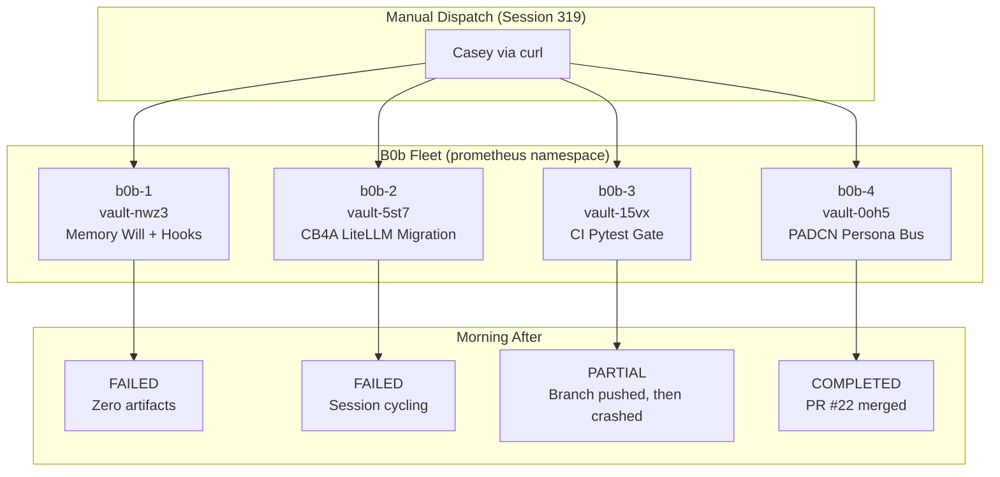
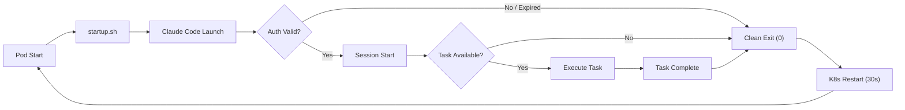
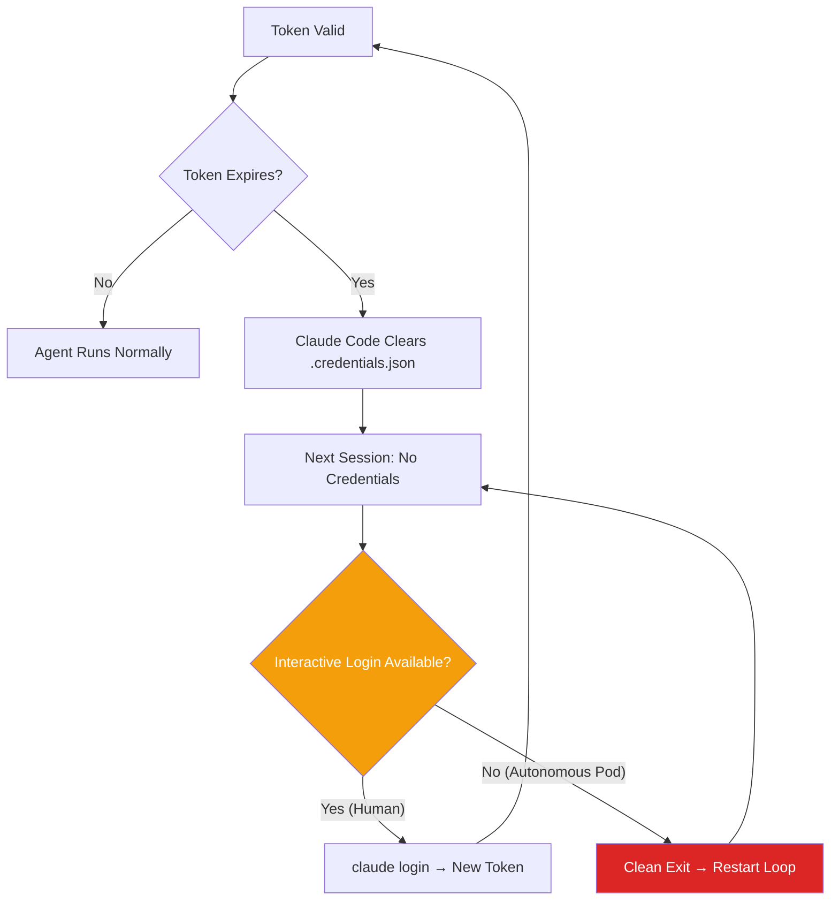

import Callout from '../../components/Callout.astro';
import StatRow from '../../components/StatRow.astro';
import PullQuote from '../../components/PullQuote.astro';
import SectionLabel from '../../components/SectionLabel.astro';
import ScrollReveal from '../../components/ScrollReveal.astro';
import DiagramBlock from '../../components/DiagramBlock.astro';

<Callout variant="note" label="Build log">
This is a failure report. Four B0b instances were dispatched overnight to work on
real tasks across real repositories. One completed its task and opened a clean PR.
One pushed good work and then crashed. Two produced nothing. If you're building
autonomous agent fleets, this is the part nobody publishes.
</Callout>

---

<SectionLabel text="The Dispatch" />

## What we sent into the night

Session 319. August 29, 2026. Four B0b pods running in the `prometheus` namespace on
K3s. Each one assigned a real bead (work item) from the sprint backlog, each targeting
a different repository, each expected to clone, build, commit, open a PR, and report
back via Zulip.

<ScrollReveal>
The dispatch was manual: four `POST /start-task` calls to four task runner endpoints,
each carrying a bead ID and an ISA (Implementation Spec and Approach) document that
tells the agent what to build. The pods had been scaled to four instances earlier that
session. GitHub App auth was wired. prom-memory was reachable. The startup bugs from
earlier sessions were fixed. Everything looked ready.
</ScrollReveal>

<ScrollReveal>
<DiagramBlock caption="Session 319 dispatch: four beads to four isolated B0b pods">

</DiagramBlock>
</ScrollReveal>

The expectation: wake up to four PRs in the review queue and a Zulip channel full of
completion notifications. The reality was more educational.

---

<SectionLabel text="The Results" />

## One out of four

In baseball, .250 is a respectable batting average. In autonomous agent fleet
reliability, it is a data point that tells you exactly where the infrastructure
breaks.

<StatRow stats={[
  { value: "1", label: "Completed" },
  { value: "1", label: "Partial" },
  { value: "2", label: "Failed" },
  { value: "25%", label: "Success rate" }
]} />

<ScrollReveal>

| Instance | Bead | Task | Result | Artifacts |
|----------|------|------|--------|-----------|
| b0b-1 | vault-nwz3 | Memory Will + Interrupt Objects | **FAILED** | Zero. Deployment never existed. |
| b0b-2 | vault-5st7 | CB4A semantic LiteLLM migration | **FAILED** | Zero. Session cycling loop. |
| b0b-3 | vault-15vx | daemon-guard CI pytest gate | **PARTIAL** | Branch pushed, 18/19 tests pass. No PR. Then crashed. |
| b0b-4 | vault-0oh5 | PADCN persona bus for daemon-mm | **COMPLETED** | PR #22 opened and merged. Clean code, fail-open design. |

</ScrollReveal>

<PullQuote>
The first real fleet dispatch didn't tell us whether the agents were smart enough.
It told us whether the infrastructure was stable enough for them to even start.
</PullQuote>

---

<SectionLabel text="The Systemic Failure" />

## Session cycling: the fleet-wide killer

Three of four pods exhibited the same failure pattern. Not three different bugs. The
same bug, three times, wearing slightly different kubectl log output.

<Callout variant="critical" label="Fleet-wide failure pattern">
**Session cycling loop:** Claude Code launches, immediately ends the session, pod restarts
after 30 seconds, Claude Code launches again, immediately ends, restart, repeat. The
loop runs indefinitely. No work is attempted. No error is thrown. The agent starts, decides
it has nothing to do (or can't authenticate), and exits cleanly. Kubernetes sees a clean
exit, waits 30 seconds per the restart policy, and tries again. Forever.
</Callout>

The cycling pattern was identical across b0b-2, b0b-3, and b0b-4. Even b0b-4, which
completed its task successfully, fell into the same cycling loop after finishing. The
task ran, the PR shipped, and then the pod entered the death spiral like every other
instance.

This was not a task-specific failure. It was an environment problem.

<ScrollReveal>
<DiagramBlock caption="The session cycling loop: clean exit, restart, repeat">

</DiagramBlock>
</ScrollReveal>

The root cause was a combination of two things:

1. **OAuth token lifecycle.** Claude Code's OAuth token on the persistent volume had
   degraded. The token was either expired or revoked (`out_of_credits` state). When
   Claude Code detects an invalid token, it clears `.credentials.json` entirely.
   The next session attempt finds no credentials, can't authenticate non-interactively,
   and exits. There is no retry path that doesn't involve a human running `claude login`
   inside the pod.

2. **The idle loop was still running.** Before the event-driven redesign (vault-przr),
   startup.sh ran `while true; do claude remote-control; sleep 30; done`. When the
   task finished or the auth failed, the loop restarted Claude Code immediately.
   Four pods, each cycling every 30 seconds: roughly 5,760 wasted session starts per
   day, each one hitting the API, each one exiting, each one generating a log line that
   looked like normal operation.

<Callout variant="insight" label="Fleet-wide vs. task-specific">
The most important lesson from the first dispatch: when 3 of 4 agents fail the same way,
the problem is never in the task description or the ISA document. It's in the environment.
Auth, networking, volume mounts, credential lifecycle. The agent logic was fine. The
infrastructure was hostile.
</Callout>

---

<SectionLabel text="The Win" />

## b0b-4: the one that worked

b0b-4 was assigned vault-0oh5, the PADCN persona bus for daemon-mm. The task: fetch
PADCN (Pleasure, Arousal, Dominance, Certainty, Novelty) affective state before each
`lve.enrich()` call and inject it into the persona's tone. A real feature with real
architectural implications.

<ScrollReveal>
b0b-4 did exactly what it was supposed to:

1. Cloned the daemon-mm repository
2. Read the ISA document for vault-0oh5
3. Implemented the PADCN fetch with a fail-open design (if the state service is
   unreachable, the persona proceeds without affective modulation, no crash, no block)
4. Committed clean code with proper branch naming
5. Opened PR #22 on daemonprompt/daemon-mm
6. Wrote a milestone to prom-memory
7. Reported to Zulip #ops with the PR link

Then it fell into the same session cycling loop as everyone else.
</ScrollReveal>

<StatRow stats={[
  { value: "PR #22", label: "Pull request" },
  { value: "Merged", label: "Status" },
  { value: "Fail-open", label: "Design pattern" }
]} />

The PR was clean. The code was reviewed, tested, and merged. The fail-open pattern was
the right architectural call for an optional enrichment service. b0b-4 demonstrated that
when the infrastructure cooperates long enough for the agent to actually run, the agent
produces production-quality work.

<PullQuote>
The agent was never the problem. The infrastructure around it was.
</PullQuote>

---

<SectionLabel text="The Partial" />

## b0b-3: good work, bad ending

b0b-3 was assigned vault-15vx, a CI pytest gate for daemon-guard. The task: add a `test`
job to `.github/workflows/build.yml` that runs the existing test suite on every push and
PR.

<ScrollReveal>
b0b-3 got further than b0b-2 but didn't finish:

1. Cloned daemon-guard
2. Created a feature branch
3. Added the CI test job to the workflow YAML
4. Pushed the branch to GitHub
5. CI ran: 18 of 19 tests passed. The one failure was pre-existing, not introduced by b0b-3
6. Never opened a PR
7. Crashed into the session cycling loop

The work was real and it was good. The branch exists. The CI pipeline exists. 18 of 19
tests are green. But without the PR, the work sits on an orphaned branch that nobody
knows about unless they go looking.
</ScrollReveal>

<StatRow stats={[
  { value: "18/19", label: "Tests passing" },
  { value: "1", label: "Pre-existing failure" },
  { value: "0", label: "PRs opened" }
]} />

This is the failure mode that costs the most: work was done, value was created, and it's
invisible. The PR is the artifact that triggers the review pipeline. No PR means the
work might as well not exist. b0b-3 was 90% of the way there and then the environment
killed it.

---

<SectionLabel text="The Failures" />

## b0b-1 and b0b-2: nothing to show

**b0b-1 (vault-nwz3):** The deployment for b0b-1 never properly existed. The pod was
scheduled, but the task dispatch targeted a service endpoint that wasn't wired. The
task ID was issued, the curl returned success, and then nothing happened. Zero
artifacts. Zero log entries from a Claude session. The dispatch succeeded at the HTTP
level and failed at every level that matters.

**b0b-2 (vault-5st7):** b0b-2 entered the session cycling loop immediately. Launch,
clean exit, 30-second restart, launch, clean exit. No task execution. No git operations.
No commits. The OAuth token was already degraded when the dispatch arrived. The agent
couldn't authenticate, couldn't start a session, and the loop ensured it would keep
trying and failing until someone intervened.

---

<SectionLabel text="Root Cause" />

## Why it broke: the auth lifecycle gap

The fleet's failure modes converge on one systemic issue: **credential lifecycle
management in an autonomous pod environment.**

<ScrollReveal>
Claude Code authenticates via OAuth. The OAuth flow requires an interactive browser
session. Once authenticated, credentials are stored in `.credentials.json` on the
pod's persistent volume. This works until:

- The token expires (normal lifecycle)
- The token is revoked (billing, policy change, account state)
- Claude Code's own error handling clears the credential file
- The pod restarts and the credential file is missing or corrupted

In all four cases, recovery requires a human to exec into the pod and run `claude login`.
There is no programmatic refresh path. There is no init container that can restore
credentials from a Kubernetes secret. The credential dies, and the pod becomes a
zombie that cycles forever.
</ScrollReveal>

<ScrollReveal>
<DiagramBlock caption="The credential lifecycle gap: no autonomous recovery path">

</DiagramBlock>
</ScrollReveal>

This is the single worst operational problem in the B0b fleet. Not prompt quality. Not
model capability. Not task decomposition. Credentials. They expire, they get cleared,
and the pod has no way to fix itself.

---

<SectionLabel text="What Changed" />

## Immediate response

The morning after the dispatch, three things happened:

**1. Pods scaled to zero.** All four deployments were scaled to 0 replicas. The cycling
loop was burning API calls (each session start hits the Anthropic API even if it
immediately fails), generating noise in logs, and accomplishing nothing. Scaling to
zero stopped the bleeding.

**2. Token rotation and re-authentication.** The MCP access token was rotated (the old
one had been exposed in git history, a separate incident from session 318). OAuth
re-auth was performed on all four pods manually. This required execing into each pod
and running `claude login`, which is exactly the manual step the system needs to
eliminate.

**3. Event-driven redesign shipped (vault-przr).** The idle `while true` loop in
startup.sh was removed entirely. The task runner on port 8080 became the sole process
that launches Claude Code sessions. No task dispatched means no Claude session running
means no API calls means no cost. This was the single most impactful change: it
eliminated the cycling failure mode by eliminating the loop that caused it.

<StatRow stats={[
  { value: "0", label: "Idle sessions after fix" },
  { value: "~5,760/day", label: "Wasted starts before fix" },
  { value: "vault-przr", label: "Fix bead (closed)" }
]} />

**4. GitHub App auth completed.** The private key was written to HashiCorp Vault,
ESO synced it to the pods, and three startup.sh bugs were fixed in sequence (missing
`-X POST`, grep whitespace mismatch, no `python3` in the container image). Git
operations now use short-lived installation tokens that refresh automatically. The
SSH deploy key era is over.

---

<SectionLabel text="Lessons" />

## What the 25% taught us

**Fleet-wide failures mask individual task quality.** b0b-4 produced a clean, mergeable
PR. b0b-3 pushed a working CI pipeline with 18/19 tests green. The agents were
competent. The infrastructure was not. If you evaluate an agent fleet by success rate
alone, you miss the signal: the agent logic was sound, the operational surface was
hostile.

**Auth is the hardest part of autonomous agents.** Not prompting. Not tool use. Not
code generation. Authentication. Every other problem in the fleet had a programmatic
fix. Credential expiry requires a human in the loop, which is the one thing an
autonomous fleet is designed to eliminate. The planned migration to Anthropic API key
auth (vault-c7ej) removes the interactive login requirement entirely.

<PullQuote>
The irony of building an autonomous system that requires human intervention to
authenticate is not lost on anyone involved.
</PullQuote>

**Event-driven beats always-on.** The idle loop was a design choice from early
prototyping that should have been removed before the first real dispatch. A pod that
cycles on failure is a pod that amplifies failure. A pod that waits for work and does
nothing until asked can't enter a death spiral because there's nothing to spiral.

**The PR is the artifact that matters.** b0b-3 did real work. It pushed a branch, ran
CI, got 18/19 tests green. But without a PR, that work is invisible to the review
pipeline. The last mile of agent execution (opening the PR, writing the description,
linking the bead) is the step that converts work into a reviewable artifact. Anything
short of that is a partial.

**Test in the real environment.** startup.sh is a sequential pipeline where each step
depends on the output of the previous one. A missing binary, a malformed curl flag, a
grep that doesn't match the actual JSON structure: all invisible in local testing, all
immediate failures in the pod. The only valid test is running startup.sh inside the
actual container on the actual cluster.

---

<SectionLabel text="What's Next" />

## The path from 25% to reliable

**Phase 2: API key auth (vault-c7ej).** Replace Claude Code OAuth with Anthropic API
key authentication. API keys don't expire on a browser session lifecycle. They can be
stored in Vault, synced via ESO, and rotated programmatically. No human login
required. This is the fix for the credential lifecycle gap.

**Phase 2.5: KEDA scale-to-zero (vault-5bww).** Pods scale down to zero replicas when
no work is queued and scale up when a bead is dispatched. Combined with Zulip-triggered
dispatch (vault-bbe2), this creates a fully event-driven pipeline: message triggers
scale-up, pod processes bead, pod scales back to zero.

**Phase 3: Local model routing (vault-13bp).** Route simpler tasks (tier 3 and 4 beads)
to qwen3:32b running on the Thor GPU node via LiteLLM, reserving cloud API calls for
tasks that require frontier model capability. This reduces cost and removes the cloud
auth dependency for routine work entirely.

<ScrollReveal>
<StatRow stats={[
  { value: "vault-c7ej", label: "API key auth" },
  { value: "vault-5bww", label: "KEDA scale-to-zero" },
  { value: "vault-13bp", label: "Local model routing" }
]} />
</ScrollReveal>

The fleet's success rate will improve not by making the agents smarter, but by making
the infrastructure less hostile. The agents proved they can do the work. The
infrastructure needs to prove it can stay out of their way.

---

[^1]: B0b fleet runs on cc-remote-control (`daemonprompt/cc-remote-control`, private). Session 319 dispatched four instances on August 29, 2026. Event-driven redesign (vault-przr) shipped session 320c. GitHub App: App ID 4763102, Installation 157552668. PR #22 on daemon-mm merged.
