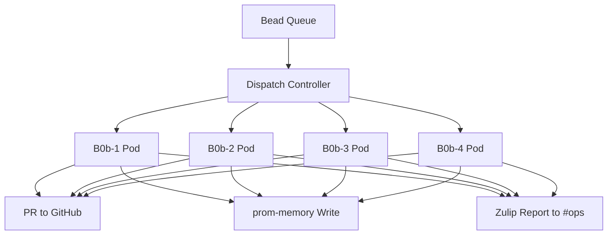
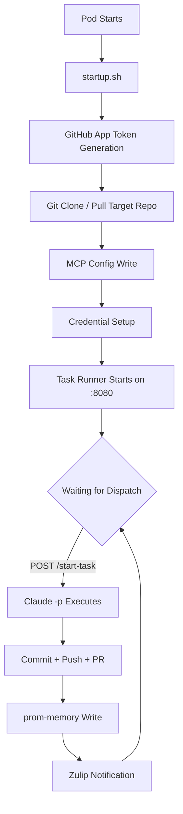
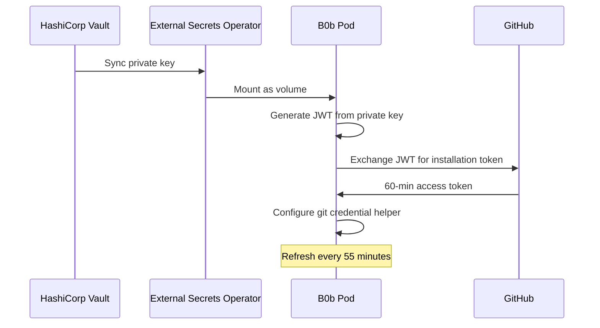

import Callout from '../../components/Callout.astro';
import StatRow from '../../components/StatRow.astro';
import PullQuote from '../../components/PullQuote.astro';
import SectionLabel from '../../components/SectionLabel.astro';
import ScrollReveal from '../../components/ScrollReveal.astro';
import DiagramBlock from '../../components/DiagramBlock.astro';

<Callout variant="note" label="Build log">
B0b is not a theoretical architecture. It's four Kubernetes pods running Claude Code
sessions that pick up work items, execute them autonomously, and produce pull requests.
This is the honest account of building it, including the 75% failure rate on the first
fleet dispatch.
</Callout>

---

<SectionLabel text="The Problem" />

## Why a fleet

One AI agent session can do one thing at a time. If you have twenty work items queued,
they execute sequentially. A two-hour task blocks everything behind it. The obvious
answer is parallelism: run multiple agent sessions simultaneously, each working on
a different item.

<ScrollReveal>
The less obvious problems show up immediately. Each session needs its own workspace,
its own git state, its own credentials, its own MCP configuration. You can't share
a checkout between two agents that are both committing to the same repo. You can't
share a credential file that gets rewritten on auth refresh. Every shared resource
is a race condition waiting to surface.

B0b solves this by treating each agent session as a fully isolated pod on Kubernetes.
Own filesystem. Own git clone. Own environment variables. Own MCP server connections.
The fleet shares nothing except the dispatch system that tells each pod what to work on.
</ScrollReveal>

<PullQuote>
Parallelism for AI agents is not a scheduling problem. It's an isolation problem.
</PullQuote>

---

<SectionLabel text="Architecture" />

## The bead-driven dispatch model

B0b runs on a work item system called beads. A bead is a task with an ID, a status,
a priority, and a description. The dispatch model is simple: beads go in, PRs come out.

<ScrollReveal>
<DiagramBlock caption="B0b fleet architecture: bead dispatch to isolated agent pods">

</DiagramBlock>
</ScrollReveal>

Each pod is a deployment in the `prometheus` namespace on K3s. The pods run a container
with Claude Code installed, a task runner listening on port 8080, and a startup script
that handles workspace initialization. When a bead is dispatched to a pod, the task runner
receives the bead ID and description, launches a Claude Code session with the appropriate
prompt, and monitors it to completion.

<StatRow stats={[
  { value: "4", label: "Fleet pods" },
  { value: ":8080", label: "Task runner port" },
  { value: "K3s", label: "Orchestration" }
]} />

---

<SectionLabel text="The Lifecycle" />

## startup.sh: the lifecycle of a B0b pod

Every B0b pod starts with `startup.sh`. This script is the most revised file in the
entire system. It went through more iterations than the task runner itself, because
every assumption about environment state turned out to be wrong at least once.

The startup sequence:

<ScrollReveal>
<DiagramBlock caption="B0b pod lifecycle: startup.sh initializes everything before the task runner listens">

</DiagramBlock>
</ScrollReveal>

**Step 1: GitHub App token generation.** B0b authenticates to GitHub using a GitHub App,
not a personal access token. The App's private key is stored in HashiCorp Vault, synced
to the pod via an External Secrets Operator (ESO) secret, and mounted as a volume. On
startup, a script generates a JWT from the private key, exchanges it for an installation
token, and configures git to use that token for HTTPS operations. The token refreshes
every 55 minutes (GitHub App tokens expire at 60).

**Step 2: Git clone.** The target repository is cloned fresh on each pod startup. This
guarantees clean state. No stale branches, no merge conflicts from a previous run,
no half-committed changes from a crashed session.

**Step 3: MCP config.** The `.mcp.json` file is written with the pod's specific
configuration: prom-memory endpoint, beads workspace, daemon-guard connection. This file
is protected with `chmod 444` after writing because Claude Code has a tendency to
overwrite it during session initialization.

**Step 4: Task runner.** A Node.js process starts on port 8080, exposing `/start-task`,
`/stop-session`, `/health`, and `/start-session` endpoints. The task runner is the only
process that launches Claude Code sessions. No idle Claude loop. No background process
burning credits. The pod sits at zero compute cost until a task arrives.

<Callout variant="insight" label="Event-driven, not polling">
The original B0b design ran a persistent Claude Code session in each pod, waiting for
work. This burned API credits continuously. The event-driven redesign (vault-przr) removed
the idle loop entirely. The task runner listens on :8080. No task, no Claude session,
no cost. This was the single most impactful architectural change in the fleet's history.
</Callout>

---

<SectionLabel text="The Task Runner" />

## B5: the task runner

The task runner is a lightweight Node.js HTTP server. When it receives a POST to
`/start-task` with a bead ID and task description, it:

1. Writes a prompt file from a tier-based template (the bead's priority determines
   which template)
2. Spawns `claude -p` with the prompt, allowed tools, and workspace path
3. Monitors the process for completion or timeout
4. On success: writes a milestone to prom-memory, notifies the #ops channel on Zulip
5. On failure: logs the error, sets a blocked state, notifies #ops with the failure reason

The templates are stored in a ConfigMap (`b0b-templates`) and mounted into each pod.
There are four tiers, matching bead priorities. Tier 1 templates are verbose with
extensive context. Tier 4 templates are minimal, just the task description and basic
constraints.

<ScrollReveal>
<StatRow stats={[
  { value: "Node.js", label: "Task runner runtime" },
  { value: "4", label: "Template tiers" },
  { value: "claude -p", label: "Execution method" }
]} />
</ScrollReveal>

<Callout variant="warning" label="prom-memory integration gotcha">
The task runner's prom-memory integration failed on first deployment because Node.js
`fetch()` doesn't work with the cluster-internal endpoints the same way `http.request`
does. The fix was replacing all `fetch()` calls with `http.request`, including fixing
the request body schema to match what prom-memory actually expects. This is the kind
of bug that only surfaces in a Kubernetes environment, never in local testing.
</Callout>

---

<SectionLabel text="First Fleet Run" />

## The first fleet dispatch: 25% success rate

The first real fleet dispatch sent four beads to four B0b pods simultaneously. One
succeeded. Three failed. Here's what went wrong.

**B0b-1: networking failure.** Pod couldn't reach prom-memory. Same-node Cilium routing
issue. The pod was scheduled on the same K3s node as the prom-memory service, and a
Cilium CNI bug prevented pod-to-service communication within the same node. This pod
has never successfully completed a task. Bead vault-r7po tracks the fix. Workaround:
use b0b-2 through b0b-4 only.

**B0b-3: silent non-completion.** The Claude Code session started, ran for a while, and
produced zero commits. No error. No crash. No blocked-state file. The session just
stopped making progress. Root cause analysis pointed to a prom-memory cold-start timeout:
the embedding model wasn't loaded, the first prom-memory call timed out, and the session
lost context about what it was supposed to do. Subsequent dispatches added a health check
that pre-warms prom-memory before task execution.

**B0b-4: auth failure.** The Claude Code OAuth token on the persistent volume had expired.
Claude Code handles expired tokens by clearing the `.credentials.json` file entirely,
which means the next session attempt fails with no way to recover without human
intervention. This is the single worst operational problem in the fleet: credential
expiry requires a human to run `claude login` inside the pod.

**B0b-2: success.** Cloned the repo, ran the task, produced a PR, wrote a prom-memory
milestone, reported to Zulip. The one that worked proved the architecture was sound.
The three that failed proved the operational surface was hostile.

<PullQuote>
A 25% success rate on the first fleet run sounds bad. It was actually the
most informative data point in the project. Every failure was a different class
of problem, and none of them were in the agent logic.
</PullQuote>

<StatRow stats={[
  { value: "1/4", label: "First run success rate" },
  { value: "3", label: "Distinct failure classes" },
  { value: "0", label: "Agent logic failures" }
]} />

---

<SectionLabel text="Auth Evolution" />

## The auth problem: from PATs to GitHub App

Authentication went through three iterations, each one solving the previous iteration's
failure mode.

**Iteration 1: Personal Access Token.** A PAT stored as a Kubernetes secret, mounted
into the pod, used for all git operations. Problems: the PAT had a maximum lifetime
set by the GitHub org policy, rotation required manual secret update across all pods,
and the PAT's scope was broader than necessary (full repo access when the pod only
needed access to one or two repos).

**Iteration 2: SSH deploy keys.** Per-repo SSH keys, each with read/write access to a
single repository. Better scoping, but key management became complex. Each pod needed
the right key for the right repo, and the git SSH config had to map hostnames to keys.
Adding a new repo meant generating a new key, adding it to GitHub, and updating every
pod's SSH config.

**Iteration 3: GitHub App.** A single GitHub App (ID 4763102) installed on the
`daemonprompt` org with access to all target repositories. The App's private key lives
in Vault. Each pod generates short-lived installation tokens (60-minute TTL) on
startup and on a 55-minute refresh loop. Token scope is determined by the App's
installation permissions, not by the token itself.

<ScrollReveal>
<DiagramBlock caption="GitHub App auth flow: Vault to ESO to pod to GitHub">

</DiagramBlock>
</ScrollReveal>

<Callout variant="warning" label="Three bugs in one commit">
The GitHub App auth integration shipped with three bugs in startup.sh that each required
a separate fix commit. Missing `-X POST` flag on the curl that exchanges JWT for token.
Whitespace in the grep that parses the token from the JSON response. No `python3` binary
in the container image (needed for JWT generation). Each bug was invisible until the pod
actually started and the auth flow ran in sequence. Testing startup.sh requires running
it inside the actual container on the actual cluster. Local testing catches nothing.
</Callout>

---

<SectionLabel text="Operational Reality" />

## What actually runs the fleet

The fleet is not self-operating. The event-driven model means no idle cost, but dispatch
is still triggered manually or by a controller. The current dispatch chain:

1. A bead is marked ready for autonomous execution
2. Dispatch command sent to the target pod's task runner endpoint
3. Task runner pulls the bead template, injects the ISA (Implementation Spec and Approach),
   and spawns Claude Code
4. Claude Code runs in the pod's workspace with full MCP tool access
5. On completion: git push, PR creation, prom-memory write, Zulip notification
6. Casey reviews the PR, provides feedback or merges, closes the bead

<StatRow stats={[
  { value: "Manual", label: "Current dispatch" },
  { value: "KEDA", label: "Planned autoscaler" },
  { value: "Zulip", label: "Notification channel" }
]} />

The next phase is KEDA-based scale-to-zero (bead vault-5bww): pods scale down to zero
replicas when no work is queued, and scale up when a bead is dispatched. Combined with
Zulip-triggered dispatch (vault-bbe2), this creates a fully event-driven pipeline:
message in Zulip triggers pod scale-up, pod processes bead, pod scales back to zero.

---

<SectionLabel text="Lessons" />

## What we learned

**Isolation is everything.** Shared filesystem, shared credentials, shared MCP config:
every shared resource produced a failure. The move to fully isolated pods with no shared
state was the inflection point.

**Credential lifecycle is the hardest operational problem.** Not model quality. Not prompt
engineering. Not task decomposition. Credentials. They expire. They get cleared by Claude
Code's own error handling. They can't be refreshed without human intervention in some cases.
The GitHub App migration solved the git auth problem. The Claude Code OAuth problem
(requires interactive `claude login`) remains the last manual step.

**Test startup.sh in the real environment.** startup.sh is a sequential pipeline where
each step depends on the previous step's output. A missing binary, a malformed curl flag,
a grep that doesn't match the actual JSON structure: all of these are invisible in local
testing and immediate failures in the pod. The only valid test environment is the actual
container on the actual cluster.

**Event-driven beats always-on.** The original persistent-session design burned API credits
24/7. Each pod ran a Claude Code session even when no work was queued. The event-driven
redesign (task runner on :8080, no idle Claude session) reduced idle cost to zero. The
pod exists, the container runs, the task runner listens, but no expensive API calls happen
until work arrives.

<PullQuote>
The fleet's success rate improved from 25% to reliable not by making the agent smarter,
but by making the infrastructure less hostile.
</PullQuote>

**The .mcp.json overwrite problem.** Claude Code writes its own `.mcp.json` during
session initialization. If the file contains custom MCP server configurations (prom-memory,
beads, daemon-guard), Claude Code may overwrite them. The fix is `chmod 444` after writing
the file in startup.sh. The file is read-only for the duration of the session.

**prom-memory writes from Node.js need `http.request`.** The task runner is Node.js.
prom-memory's API expects a specific request body schema. Node.js `fetch()` in a
Kubernetes cluster environment doesn't behave identically to browser fetch. The
migration to `http.request` with explicit content-type headers and JSON body encoding
fixed the silent prom-memory write failures.

---

<SectionLabel text="Phased Compute" />

## The compute model: phased reduction

B0b's compute cost model is evolving through three phases:

<ScrollReveal>
| Phase | What changes | Status |
|-------|-------------|--------|
| Phase 1 | Event-driven startup, kill idle loop | Shipped |
| Phase 2 | KEDA scale-to-zero, Zulip dispatch triggers | Planned (vault-5bww, vault-bbe2) |
| Phase 3 | API key migration (away from OAuth), local model routing via LiteLLM | Planned (vault-c7ej, vault-13bp) |
</ScrollReveal>

Phase 1 was the immediate win: removing the idle Claude loop dropped the baseline
cost to near zero. Phase 2 removes the pod itself when idle, saving container resources
on the cluster. Phase 3 is the long game: routing simpler tasks to local models
(qwen3:32b on the Thor GPU node) instead of cloud API calls, and replacing the
OAuth-based Claude Code auth with API key auth that doesn't require interactive login.

The end state is a fleet that costs nothing when idle, scales up on demand, uses local
inference where possible, and only hits the cloud API for tasks that require frontier
model capability.

---

<SectionLabel text="Open Questions" />

## What's next

**B0b-1 networking.** The Cilium same-node routing issue (vault-r7po) has been worked
around by not dispatching to b0b-1. The root cause needs a fix at the CNI level, not
a pod-level workaround.

**PR review pipeline.** B0b produces PRs, but there's no automated notification to the
primary session when a PR is ready for review. Casey has to check `gh pr list` manually.
vault-rt8b (morning briefing) and vault-4rqh (PR notification pipeline) will close this
gap.

**ISA enforcement.** The Implementation Spec and Approach (ISA) document is what tells
B0b what to build for a given bead. Currently, ISA existence is not enforced before
dispatch. vault-uf2b adds a gate: no ISA, no dispatch. This prevents B0b from starting
work on an underspecified task and producing a PR that doesn't match intent.

**Multi-repo tasks.** Each B0b pod works in a single repository per task. Some beads
require changes across multiple repos (e.g., daemon-guard change + prometheus-gitops
deployment update). The current model requires separate beads and separate dispatches.
A single bead that coordinates multi-repo changes is not yet supported.

---

[^1]: cc-remote-control (B0b fleet) repository: `daemonprompt/cc-remote-control` (private). Event-driven mode shipped session-320c, August 2026. Bead: vault-przr (closed). GitHub App auth: App ID 4763102, installation 157552668.
