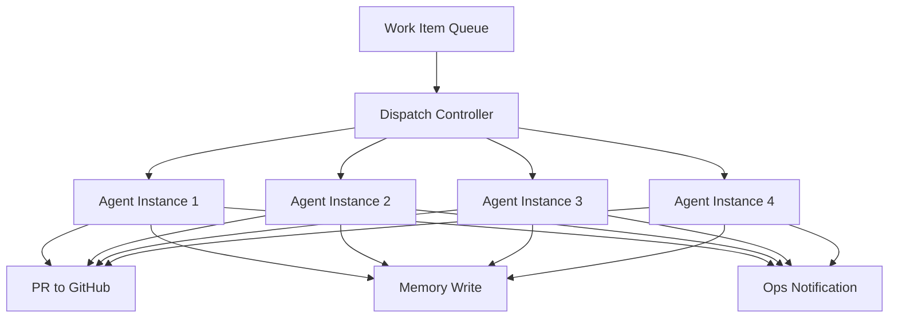
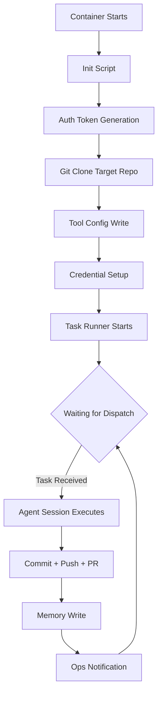
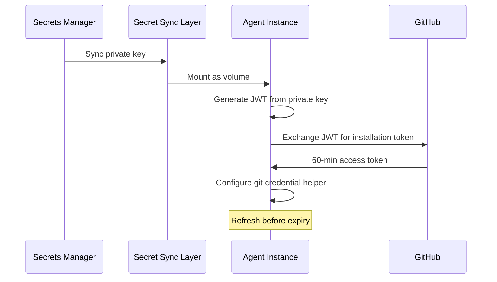

import Callout from '../../components/Callout.astro';
import StatRow from '../../components/StatRow.astro';
import PullQuote from '../../components/PullQuote.astro';
import SectionLabel from '../../components/SectionLabel.astro';
import ScrollReveal from '../../components/ScrollReveal.astro';
import DiagramBlock from '../../components/DiagramBlock.astro';

<Callout variant="note" label="Build log">
This is not a theoretical architecture. It's four containerized AI agent instances
that pick up work items, execute them autonomously, and produce pull requests.
This is the honest account of building it, including the 75% failure rate on the first
fleet dispatch.
</Callout>

---

<SectionLabel text="The Problem" />

## Why a fleet

One AI agent session can do one thing at a time. If you have twenty work items queued,
they execute sequentially. A two-hour task blocks everything behind it. The obvious
answer is parallelism: run multiple agent sessions simultaneously, each working on
a different item.

<ScrollReveal>
The less obvious problems show up immediately. Each session needs its own workspace,
its own git state, its own credentials, its own tool configuration. You can't share
a checkout between two agents that are both committing to the same repo. You can't
share a credential file that gets rewritten on auth refresh. Every shared resource
is a race condition waiting to surface.

The fleet solves this by treating each agent session as a fully isolated container. Own
filesystem. Own git clone. Own environment variables. Own tool connections. The fleet
shares nothing except the dispatch system that tells each instance what to work on.
</ScrollReveal>

<PullQuote>
Parallelism for AI agents is not a scheduling problem. It's an isolation problem.
</PullQuote>

---

<SectionLabel text="Architecture" />

## The task-driven dispatch model

The fleet runs on a structured work item system. Each work item has an ID, a status, a
priority, and a description. The dispatch model is simple: work items go in, PRs come out.

<ScrollReveal>
<DiagramBlock caption="Fleet architecture: task dispatch to isolated agent instances">

</DiagramBlock>
</ScrollReveal>

Each instance runs in its own container with an AI coding agent installed, a task runner
listening for work, and a startup script that handles workspace initialization. When a
work item is dispatched to an instance, the task runner receives the item ID and
description, launches an agent session with the appropriate prompt, and monitors it
to completion.

<StatRow stats={[
  { value: "4", label: "Fleet instances" },
  { value: "HTTP", label: "Task runner interface" },
  { value: "Containers", label: "Isolation model" }
]} />

---

<SectionLabel text="The Lifecycle" />

## The startup lifecycle

Every agent instance starts with an initialization script. This script is the most
revised file in the entire system. It went through more iterations than the task runner
itself, because every assumption about environment state turned out to be wrong at least
once.

The startup sequence follows a strict pipeline:

<ScrollReveal>
<DiagramBlock caption="Agent instance lifecycle: auth, workspace, tools, then listen">

</DiagramBlock>
</ScrollReveal>

**Step 1: Auth token generation.** The instance authenticates to GitHub using a GitHub
App, not a personal access token. On startup, a script generates a JWT from the app's
private key, exchanges it for a short-lived installation token, and configures git to
use that token. The token refreshes automatically before expiry.

**Step 2: Git clone.** The target repository is cloned fresh on each startup. This
guarantees clean state. No stale branches, no merge conflicts from a previous run,
no half-committed changes from a crashed session.

**Step 3: Tool config.** The agent's tool configuration file is written with
instance-specific settings: memory endpoint, task workspace, external tool connections.
This file is then made read-only, because the AI agent has a tendency to overwrite it
during session initialization.

**Step 4: Task runner.** A lightweight HTTP server starts, exposing endpoints for task
submission, session control, and health checks. The task runner is the only process
that launches agent sessions. No idle agent loop. No background process burning credits.
The instance sits at zero compute cost until work arrives.

<Callout variant="insight" label="Event-driven, not polling">
The original design ran a persistent agent session in each instance, waiting for
work. This burned API credits continuously. The event-driven redesign removed
the idle loop entirely. The task runner listens for HTTP requests. No task, no agent
session, no cost. This was the single most impactful architectural change in the fleet's
history.
</Callout>

---

<SectionLabel text="The Task Runner" />

## The task runner

The task runner is a lightweight HTTP server. When it receives a task request with a
work item ID and description, it:

1. Writes a prompt file from a tier-based template (the item's priority determines
   which template)
2. Spawns an agent session with the prompt, allowed tools, and workspace path
3. Monitors the process for completion or timeout
4. On success: writes a milestone to the memory layer, notifies the ops channel
5. On failure: logs the error, sets a blocked state, notifies ops with the failure reason

The templates are stored in a config map and mounted into each instance. There are four
tiers, matching work item priorities. Tier 1 templates are verbose with extensive context.
Tier 4 templates are minimal, just the task description and basic constraints.

<ScrollReveal>
<StatRow stats={[
  { value: "Node.js", label: "Task runner runtime" },
  { value: "4", label: "Template tiers" },
  { value: "CLI", label: "Agent execution method" }
]} />
</ScrollReveal>

<Callout variant="warning" label="HTTP client gotcha">
The task runner's memory layer integration failed on first deployment because the HTTP
client library in Node.js doesn't behave identically to browser fetch when running inside
a container network. The fix was switching to a lower-level HTTP client with explicit
content-type headers and body encoding. This is the kind of bug that only surfaces in
a containerized environment, never in local testing.
</Callout>

---

<SectionLabel text="First Fleet Run" />

## The first fleet dispatch: 25% success rate

The first real fleet dispatch sent four work items to four agent instances simultaneously.
One succeeded. Three failed. Here's what went wrong.

**Instance 1: networking failure.** The container couldn't reach the memory service. A
container networking bug prevented communication between co-located containers on the same
host. This instance never successfully completed a task on the first run. Workaround:
dispatch to the other three instances only.

**Instance 3: silent non-completion.** The agent session started, ran for a while, and
produced zero commits. No error. No crash. No failure signal. The session just stopped
making progress. Root cause: a cold-start timeout on the memory service. The embedding
model wasn't loaded yet, the first memory call timed out, and the agent lost context
about what it was supposed to do. Fix: added a health check that pre-warms the memory
service before task execution.

**Instance 4: auth failure.** The agent's OAuth token on the persistent volume had
expired. The agent handles expired tokens by clearing the credential file entirely,
which means the next session attempt fails with no way to recover without human
intervention. This is the single worst operational problem in the fleet: credential
expiry requires a human to run an interactive login inside the container.

**Instance 2: success.** Cloned the repo, ran the task, produced a PR, wrote a memory
milestone, reported to ops. The one that worked proved the architecture was sound.
The three that failed proved the operational surface was hostile.

<PullQuote>
A 25% success rate on the first fleet run sounds bad. It was actually the
most informative data point in the project. Every failure was a different class
of problem, and none of them were in the agent logic.
</PullQuote>

<StatRow stats={[
  { value: "1/4", label: "First run success rate" },
  { value: "3", label: "Distinct failure classes" },
  { value: "0", label: "Agent logic failures" }
]} />

---

<SectionLabel text="Auth Evolution" />

## The auth problem: three iterations to get it right

Authentication went through three iterations, each one solving the previous iteration's
failure mode.

**Iteration 1: Personal Access Token.** A PAT stored as a secret, mounted into the
container, used for all git operations. Problems: the PAT had a maximum lifetime, rotation
required manual secret updates across all instances, and the PAT's scope was broader than
necessary (full repo access when the instance only needed one or two repos).

**Iteration 2: Deploy keys.** Per-repo SSH keys, each with read/write access to a single
repository. Better scoping, but key management became complex. Each instance needed the
right key for the right repo, and the SSH config had to map hostnames to keys. Adding a
new repo meant generating a new key, adding it to GitHub, and updating every instance's
config.

**Iteration 3: GitHub App.** A single GitHub App installed on the org with access to all
target repositories. The App's private key lives in a secrets manager. Each instance
generates short-lived installation tokens (60-minute TTL) on startup and on a refresh
loop. Token scope is determined by the App's installation permissions, not by the token
itself.

<ScrollReveal>
<DiagramBlock caption="GitHub App auth flow: secrets manager to container to GitHub">

</DiagramBlock>
</ScrollReveal>

<Callout variant="warning" label="Three bugs in one commit">
The GitHub App auth integration shipped with three bugs in the init script that each
required a separate fix. A missing flag on the HTTP call that exchanges the JWT for a
token. A whitespace issue in the response parser. A missing binary in the container
image that was needed for JWT generation. Each bug was invisible until the container
actually started and the auth flow ran in sequence. Testing the init script requires
running it inside the actual container in the actual environment. Local testing catches
nothing.
</Callout>

---

<SectionLabel text="Operational Reality" />

## What actually runs the fleet

The fleet is not self-operating. The event-driven model means no idle cost, but dispatch
is still triggered manually or by a controller. The current dispatch chain:

1. A work item is marked ready for autonomous execution
2. Dispatch command sent to the target instance's task runner endpoint
3. Task runner pulls the template, injects the implementation spec, and spawns the agent
4. Agent runs in the instance's workspace with full tool access
5. On completion: git push, PR creation, memory write, ops notification
6. Human reviews the PR, provides feedback or merges, closes the work item

<StatRow stats={[
  { value: "Manual", label: "Current dispatch" },
  { value: "Autoscaler", label: "Planned next phase" },
  { value: "Chat ops", label: "Notification channel" }
]} />

The next phase is autoscaler-based scale-to-zero: instances scale down to zero when no
work is queued, and scale up when an item is dispatched. Combined with chat-ops-triggered
dispatch, this creates a fully event-driven pipeline: message in chat triggers instance
scale-up, instance processes work item, instance scales back to zero.

---

<SectionLabel text="Lessons" />

## What I learned

**Isolation is everything.** Shared filesystem, shared credentials, shared tool config:
every shared resource produced a failure. The move to fully isolated containers with no
shared state was the inflection point.

**Credential lifecycle is the hardest operational problem.** Not model quality. Not prompt
engineering. Not task decomposition. Credentials. They expire. They get cleared by the
agent's own error handling. They can't be refreshed without human intervention in some
cases. The GitHub App migration solved the git auth problem. The agent's own OAuth problem
(requires interactive login) remains the last manual step.

**Test the init script in the real environment.** The initialization script is a sequential
pipeline where each step depends on the previous step's output. A missing binary, a
malformed HTTP flag, a parser that doesn't match the actual response structure: all of
these are invisible in local testing and immediate failures in the container. The only
valid test environment is the actual container in the actual deployment.

**Event-driven beats always-on.** The original persistent-session design burned API credits
around the clock. Each instance ran an agent session even when no work was queued. The
event-driven redesign (task runner listening for HTTP, no idle agent session) reduced idle
cost to zero. The instance exists, the container runs, the task runner listens, but no
expensive API calls happen until work arrives.

<PullQuote>
The fleet's success rate improved from 25% to reliable not by making the agent smarter,
but by making the infrastructure less hostile.
</PullQuote>

**The tool config overwrite problem.** The AI agent writes its own tool configuration
file during session initialization. If the file contains custom tool server settings, the
agent may overwrite them. The fix: make the file read-only after writing it during init.
Simple, dumb, effective.

**Container HTTP clients are not browser HTTP clients.** The task runner is Node.js. The
memory layer API expects a specific request body schema. Node.js `fetch()` inside a
container network doesn't behave identically to browser fetch. Switching to a lower-level
HTTP client with explicit headers and encoding fixed silent write failures that never
reproduced locally.

---

<SectionLabel text="Phased Compute" />

## The compute model: phased reduction

The fleet's compute cost model is evolving through three phases:

<ScrollReveal>
| Phase | What changes | Status |
|-------|-------------|--------|
| Phase 1 | Event-driven startup, kill idle loop | Shipped |
| Phase 2 | Autoscaler scale-to-zero, chat-ops dispatch triggers | Planned |
| Phase 3 | API key migration (away from OAuth), local model routing | Planned |
</ScrollReveal>

Phase 1 was the immediate win: removing the idle agent loop dropped the baseline cost
to near zero. Phase 2 removes the instance itself when idle, saving container resources.
Phase 3 is the long game: routing simpler tasks to local models instead of cloud API
calls, and replacing the OAuth-based auth with API key auth that doesn't require
interactive login.

The end state is a fleet that costs nothing when idle, scales up on demand, uses local
inference where possible, and only hits the cloud API for tasks that require frontier
model capability.

---

<SectionLabel text="Open Questions" />

## What's next

**Container networking fix.** The same-host routing bug has been worked around by not
dispatching to the affected instance. The root cause needs a fix at the network layer,
not an instance-level workaround.

**PR review pipeline.** The fleet produces PRs, but there's no automated notification to the
human operator when a PR is ready for review. Currently that requires manually checking
the PR list. An automated review notification pipeline will close this gap.

**Spec enforcement.** The implementation spec document is what tells the agent what to build
for a given work item. Currently, spec existence is not enforced before dispatch. Adding
a gate (no spec, no dispatch) prevents the fleet from starting work on an underspecified task
and producing a PR that doesn't match intent.

**Multi-repo tasks.** Each instance works in a single repository per task. Some work
items require changes across multiple repos (code change plus deployment config update,
for example). The current model requires separate items and separate dispatches. A single
work item that coordinates multi-repo changes is not yet supported.
