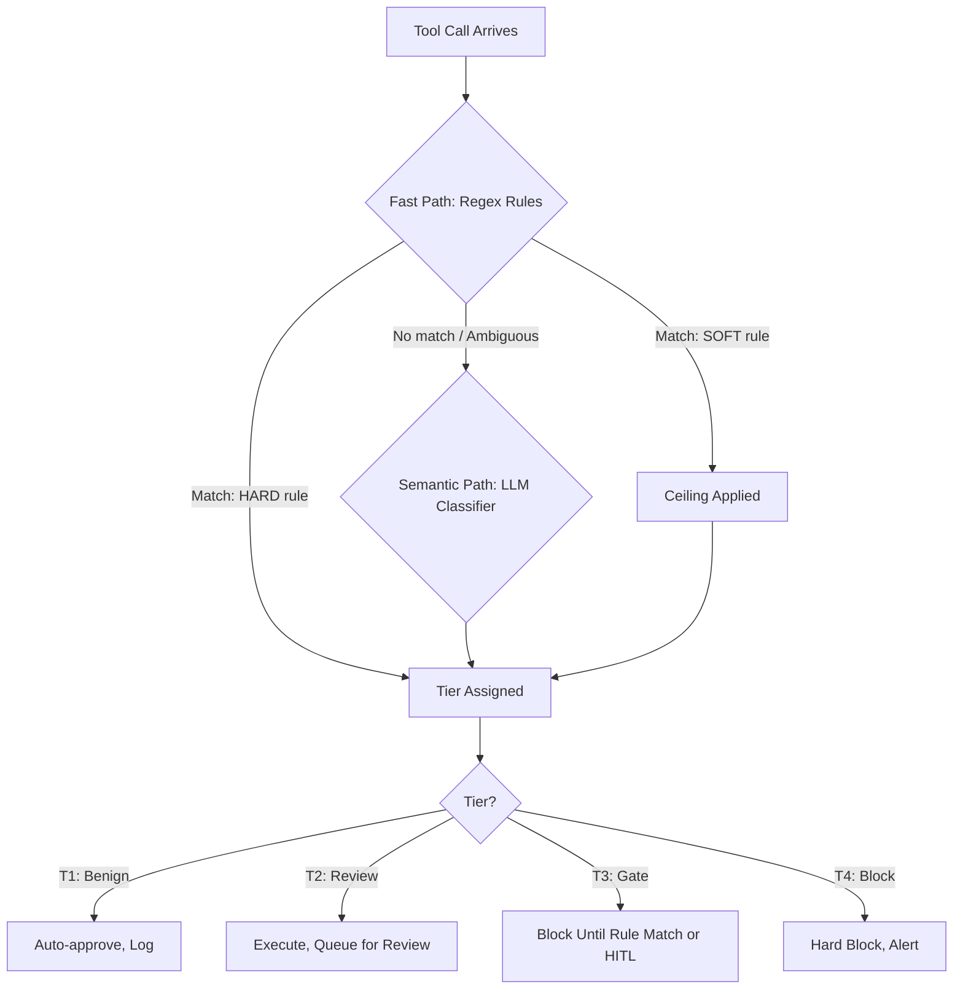
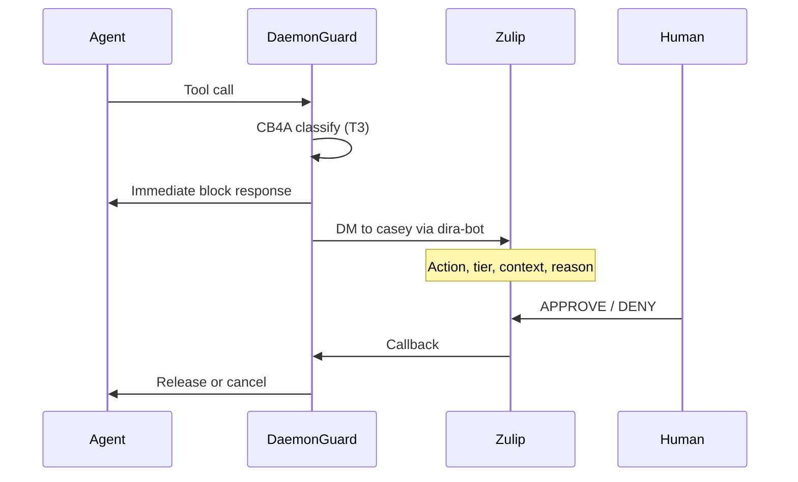
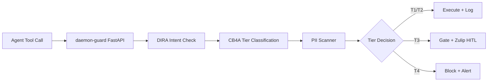

import Callout from '../../components/Callout.astro';
import StatRow from '../../components/StatRow.astro';
import PullQuote from '../../components/PullQuote.astro';
import SectionLabel from '../../components/SectionLabel.astro';
import ScrollReveal from '../../components/ScrollReveal.astro';
import DiagramBlock from '../../components/DiagramBlock.astro';

<Callout variant="note" label="Build log">
This is a build log, not a whitepaper. CB4A is running in production inside
daemon-guard on a K3s cluster. What follows is what we built, why we built it,
and what broke along the way.
</Callout>

---

<SectionLabel text="The Problem" />

## The authorization gap nobody talks about

AI agents make tool calls. Every tool call is an action taken on your behalf, with your
credentials, against your systems. And you did not pre-authorize any of them.

<ScrollReveal>
Traditional authorization happens at session start. You authenticate, you get a token,
the token carries scopes, and those scopes define what you can do. Clean model. Works
for humans who log in and click buttons.

Agents don't work this way. An agent receives a natural language instruction, decomposes
it into steps, and each step is a tool call. The tool calls are determined at runtime by
the model, not at design time by the developer. The instruction "research this company
and draft a summary" could produce ten tool calls or fifty, hitting web search, file
write, database read, credential lookup. You authorized none of those individually. You
authorized the intent. The agent chose the actions.
</ScrollReveal>

<PullQuote>
The gap between what you intended and what the agent does is the attack surface.
It's also the place where accidents live.
</PullQuote>

This is the problem CB4A solves. Not by restricting what agents can do, but by classifying
what they're actually doing, in real time, and routing each action to the appropriate
level of oversight.

---

<SectionLabel text="The Model" />

## Four tiers, not four rules

CB4A stands for Content-Based 4-tier Authorization. Every tool call that passes through
daemon-guard gets classified into one of four tiers based on what the call actually
contains, not just which tool it invokes.

<ScrollReveal>
<DiagramBlock caption="CB4A tier classification: every tool call gets a tier before execution">

</DiagramBlock>
</ScrollReveal>

**Tier 1: Benign.** Read-only operations, web searches, file reads. Auto-approved and
logged silently. The agent keeps moving.

**Tier 2: Review.** Actions that modify state but aren't dangerous. File writes, database
updates, configuration changes. The action executes immediately, but it goes into a review
queue. A human sees it within the session or at the daily review.

**Tier 3: Gate.** Actions that could cause harm if wrong. Git pushes, API calls to external
services, infrastructure changes. These block until either a rule match clears them
automatically or a human approves via Zulip.

**Tier 4: Block.** Hard stop. Credential exposure detected, injection patterns found,
actions that would be catastrophic if executed. No override without explicit human approval.

<StatRow stats={[
  { value: "4", label: "Authorization tiers" },
  { value: "<5ms", label: "Fast path latency" },
  { value: "T4", label: "Auto-blocks credentials" }
]} />

---

<SectionLabel text="Rule Architecture" />

## Two paths: fast and semantic

The classification engine has two layers. The fast path handles the 90% case. The semantic
path handles the rest.

### Fast path: regex rules

The fast path is a rule set in `cb4a_tier.py`. Each rule has a regex pattern, a tier
assignment, and a rule type: HARD or SOFT.

**HARD rules** set the tier directly. If a tool call's content matches a HARD rule, that's
the tier. No further analysis. A HARD T4 rule for credential patterns means that if the
output of a tool call contains what looks like an API key or token, it's blocked. Period.

**SOFT rules** set a ceiling. A SOFT T2 rule on file write operations means the action
can't be classified lower than T2, but the semantic layer might push it higher. SOFT rules
are guardrails, not verdicts.

```python
# cb4a_tier.py — simplified rule structure
RULES = [
    # HARD rules: deterministic tier assignment
    {"pattern": r"(ghp_|sk-|AKIA)[A-Za-z0-9]{20,}", "tier": 4, "type": "HARD",
     "reason": "credential pattern detected in output"},
    {"pattern": r"<script>|javascript:", "tier": 4, "type": "HARD",
     "reason": "injection pattern detected"},

    # SOFT rules: tier ceiling
    {"pattern": r"(git push|git commit)", "tier": 2, "type": "SOFT",
     "reason": "git write operation"},
    {"pattern": r"kubectl (apply|delete|patch)", "tier": 3, "type": "SOFT",
     "reason": "kubernetes mutation"},
]
```

<Callout variant="insight" label="Design decision">
HARD vs SOFT is the key distinction. Early versions only had one rule type, which meant
every regex match was final. The problem: a `git push` to a feature branch and a
`git push --force` to main are categorically different actions, but both match `git push`.
SOFT rules let the regex set a floor while the semantic layer evaluates context.
</Callout>

### Semantic path: LLM classifier

When the fast path produces an ambiguous result, or when a SOFT rule sets a ceiling
that needs refinement, the tool call goes to `cb4a_semantic.py`. This is a lightweight
LLM call (Haiku) that answers one question: is this tool call *mentioning* something
sensitive, or *using* something sensitive?

The mention-vs-use distinction matters enormously. A research agent that writes "the
company uses API keys stored in environment variables" is mentioning credentials. An
agent that outputs `ghp_abc123def456` in a file write is using one. The regex can't
tell the difference. The LLM can.

<ScrollReveal>
<StatRow stats={[
  { value: "90%", label: "Resolved by fast path" },
  { value: "~200ms", label: "Semantic path latency" },
  { value: "Haiku", label: "Classifier model" }
]} />
</ScrollReveal>

The semantic classifier runs asynchronously. For T3 actions that are already gated, the
latency doesn't matter because the action is blocked anyway. For T2 actions where the
SOFT rule might need upgrading, the classifier result determines whether the action goes
into the review queue or gets escalated.

---

<SectionLabel text="HITL Integration" />

## Human in the loop via Zulip

T3 and T4 actions need human approval. The human-in-the-loop (HITL) path runs through
Zulip, a self-hosted team chat platform.

<ScrollReveal>
<DiagramBlock caption="HITL approval flow: daemon-guard to Zulip to human to action">

</DiagramBlock>
</ScrollReveal>

The Zulip integration uses `cb4a_hitl.py`, which sends a direct message through
a bot account (`dira-bot`) with the action details, tier, and classification reason.
The message format is designed for quick scanning on mobile: what's being done, why it
was flagged, and the approval options.

<Callout variant="warning" label="SSL gotcha">
The Zulip instance at `zulip.daemonprompt.app` uses a self-signed certificate.
The first deployment of the HITL path failed silently because the `httpx.AsyncClient`
defaults to strict SSL verification. Both async client instances in `cb4a_hitl.py`
needed `verify=False`. This is acceptable for an internal service behind Tailscale,
not acceptable for anything internet-facing.
</Callout>

The design is notify-then-block, not block-then-notify. The agent gets an immediate
block response so it can handle the interruption gracefully (retry, skip, or wait). The
Zulip notification fires in the background. This means the agent never hangs waiting for
a human who might be asleep.

---

<SectionLabel text="False Positives" />

## The false positive problem

Any content-based classification system will produce false positives. CB4A's approach
is to make false positives cheap and false negatives expensive.

A false positive at T2 means an action goes into the review queue when it didn't need to.
Cost: a few seconds of human review time, eventually. A false positive at T3 means an
action blocks when it should have proceeded. Cost: agent pauses, human gets a Zulip
notification, approves in seconds.

A false negative at T4 means a credential leaks. That cost is not comparable.

<PullQuote>
The tiers are designed so that over-classification costs minutes and
under-classification costs weeks of incident response.
</PullQuote>

The SOFT rule system is the primary false-positive management mechanism. Instead of making
every file write a T3 (which would flood the approval queue), SOFT rules set a ceiling
at T2 and let the semantic classifier decide if the specific content warrants escalation.
A file write containing a markdown summary stays T2. A file write containing a raw PAT
gets pushed to T4 by the HARD rule before the SOFT ceiling even applies.

---

<SectionLabel text="Implementation" />

## Where it runs

CB4A is implemented as middleware inside daemon-guard, a FastAPI service deployed on K3s.
daemon-guard sits in the tool call path for all Prometheus agents, including the B0b
autonomous fleet.

<ScrollReveal>
<DiagramBlock caption="daemon-guard service architecture: CB4A as middleware layer">

</DiagramBlock>
</ScrollReveal>

The service stack inside daemon-guard is layered: DIRA (Dual-Intent Runtime Authorization)
evaluates whether the action aligns with the user's intent and the agent's role. CB4A
evaluates the content of the specific tool call. PII scanning catches personal data
that should never appear in agent output. Each layer operates independently. A tool call
that passes DIRA can still be blocked by CB4A if the content is dangerous.

The configuration is managed through a Kubernetes ConfigMap (`daemon-guard-config`), which
means CB4A can be toggled without redeploying the service. The toggle went through three
iterations: first via `kubectl patch configmap` (reverted by ArgoCD within three minutes),
then via deployment environment override (`kubectl set env`), and finally settled as a
persistent ConfigMap value managed through the gitops repo.

<Callout variant="warning" label="ArgoCD gotcha">
ArgoCD's `selfHeal` feature will revert any `kubectl patch` to match the git state within
minutes. If you need to toggle a ConfigMap value for testing, either commit to git or
temporarily disable selfHeal on the application. We learned this by watching CB4A turn
itself back on three times during initial testing.
</Callout>

---

<SectionLabel text="What Broke" />

## What broke and what we learned

**v1 had one rule type.** Every regex match was a verdict. This meant `git push` always
triggered the same tier regardless of context. The HARD/SOFT split in v2 was the fix.

**The semantic classifier needed a precise question.** Early prompts asked "is this
action safe?" which is unanswerable without full system context. The question that works
is narrower: "Is this content *mentioning* something sensitive, or *using* it?" The LLM
can answer that from the tool call content alone.

**`imagePullPolicy: Never` on K3s breaks CI/CD.** daemon-guard uses `imagePullPolicy: Never`
in the K3s deployment, which means the cluster never pulls a new image on pod restart.
After CI pushes a new image to GHCR, you have to manually remove the old image from the
containerd cache and pull the new one. This is by design (air-gapped deployment), but it
adds a manual step to every deploy that is easy to forget.

**SSL verification on internal services.** The HITL path to Zulip failed silently on first
deploy. Self-signed certs behind Tailscale need explicit `verify=False` on every HTTP
client instance. "Both" means both, not "the one you remembered to change."

<StatRow stats={[
  { value: "v2", label: "Current version" },
  { value: "2", label: "Rule types (HARD/SOFT)" },
  { value: "0", label: "T4 false negatives" }
]} />

---

<SectionLabel text="Open Questions" />

## What's next

The current classifier model is Haiku. It's fast and cheap, but for ambiguous cases
a more capable model might improve precision. The plan is to route through the local
qwen3:32b on Thor (the Jetson Thor node in the cluster) for zero API cost on the
semantic path.

The feedback loop from the Zulip approval decisions back into rule tuning is not yet
automated. Every APPROVE on a T3 action is a data point that the rule might be too
aggressive. Every DENY is validation. Collecting these decisions and adjusting SOFT
rule ceilings automatically is the next iteration.

CB4A currently evaluates individual tool calls in isolation. The sequence matters too:
ten benign file reads followed by a file write that combines all of them is a data
exfiltration pattern that no single-call classifier would catch. Sequence evaluation
(`sequence_eval.py` exists in daemon-guard but is not yet wired to CB4A) is the path
toward session-level threat detection.

---

[^1]: daemon-guard repository: `daemonprompt/daemon-guard` (private). CB4A v2 shipped session-318, August 2026. Bead: vault-z3ht (closed).
