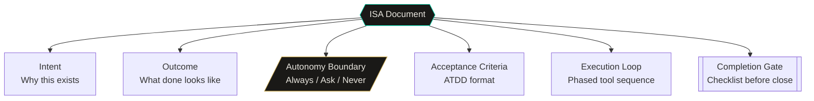
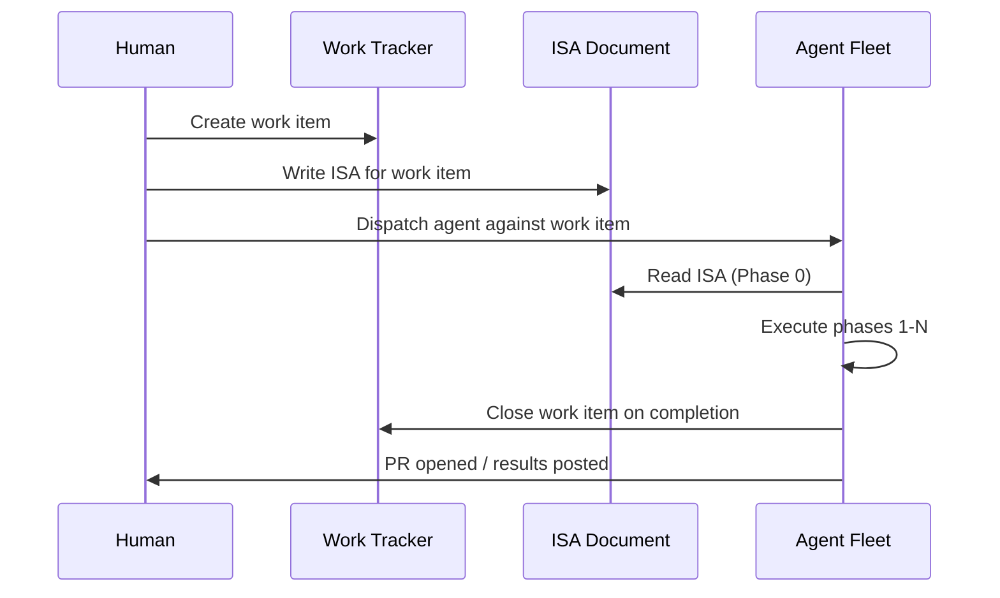
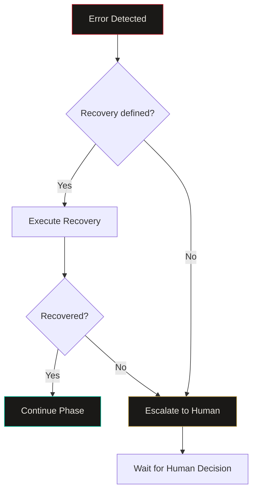

import Callout from '../../components/Callout.astro';
import StatRow from '../../components/StatRow.astro';
import PullQuote from '../../components/PullQuote.astro';
import SectionLabel from '../../components/SectionLabel.astro';
import ScrollReveal from '../../components/ScrollReveal.astro';
import DiagramBlock from '../../components/DiagramBlock.astro';

<Callout variant="note" label="Context">
This article documents a pattern for giving autonomous AI agents clear, auditable
instructions that actually work. The ISA (Intelligent Service Agreement) format emerged
from real failures in ad-hoc agent prompting and was validated by shipping a batch of
11 ISAs for an autonomous coding agent fleet in a single working session. The pattern
is agent-agnostic and framework-agnostic. If you dispatch AI agents against non-trivial
work, this is for you.
</Callout>

---

<SectionLabel text="The Problem" />

## Why ad-hoc prompting fails

The standard approach to giving an AI agent work: write a prompt describing what you
want. Maybe add some context. Hit send. Hope the agent figures out the rest.

This works for small tasks. Write a function. Fix a bug. Run a test. The scope is
narrow, the success criteria are obvious, and the agent can verify its own work.

<ScrollReveal>
It does not work for anything larger. A multi-file refactoring across three services.
A new feature that requires reading existing code, understanding constraints, writing
implementation, and validating against acceptance criteria. A deployment that involves
infrastructure manifests, image builds, and smoke tests.

For these tasks, ad-hoc prompting fails in predictable ways:
</ScrollReveal>

**Scope creep.** Without explicit boundaries, the agent interprets "fix the routing
logic" as "fix the routing logic and also refactor the error handling and also update
the tests and also clean up the imports." Each addition is individually reasonable.
Together they produce a PR that nobody asked for and nobody can review.

**Missing context.** The agent does not know what it does not know. Without a structured
context-loading step, it guesses at constraints, invents conventions, and makes
assumptions about the codebase that are wrong. The output looks correct until you read
it against the actual architecture.

**Ambiguous completion.** When is the task done? The agent thinks it is done when the
code compiles. You think it is done when the tests pass, the deployment succeeds, and
the smoke test returns green. Without explicit acceptance criteria, "done" is a
negotiation that happens after the work is complete.

**No escalation path.** The agent encounters something it cannot resolve. A dependency
is missing. A service is down. A decision requires human judgment. Without an explicit
escalation model, the agent either blocks silently (wasting the session) or makes a
guess (introducing risk).

<PullQuote>
Ad-hoc prompting treats the agent as a conversation partner. ISAs treat the agent as
a contractor with a scope of work, a set of constraints, and a definition of done.
</PullQuote>

---

<SectionLabel text="The ISA Format" />

## Anatomy of an ISA

ISA stands for Intelligent Service Agreement. The name is deliberate. It borrows from
the service agreement pattern in IT service management (ITIL) and from the legal
structure of a contract: scope, constraints, acceptance criteria, escalation triggers,
completion definition. The "intelligent" qualifier means the agreement is written for
an agent that can reason about its own compliance with the terms.

<ScrollReveal>
<DiagramBlock caption="ISA structure: six sections that define the complete contract between human and agent">

</DiagramBlock>
</ScrollReveal>

### Intent

One paragraph. Why does this work item exist? Not what needs to be built. Why it needs
to be built. The agent reads this first and uses it to resolve ambiguity throughout
execution. If a decision could go either way, the intent section breaks the tie.

### Outcome (What Done Looks Like)

Falsifiable statements. Not "the service works." Statements like: "the API returns a
200 status with a valid response body for each of 3 test inputs." The agent can verify
each statement independently. If any statement is false after execution, the work is
not done.

### Autonomy boundary

Three tiers, explicitly enumerated:

<ScrollReveal>
<StatRow stats={[
  { value: "Always", label: "Execute without asking" },
  { value: "Ask", label: "Require human approval" },
  { value: "Never", label: "Hard stop, no exceptions" }
]} />
</ScrollReveal>

**Always:** actions the agent takes without checking. Read the codebase. Search project
memory. Write implementation files. Run tests. Commit and push. These are within the
agent's authority.

**Ask First:** actions that require explicit human approval before execution. Changing
behavior rules. Modifying thresholds. Adding new data categories. Wiring capabilities
not in scope. These are design decisions, not implementation decisions.

**Never:** hard stops. Actions the agent must not take under any circumstances. Storing
private data with public classification. Using a more expensive model tier than
specified. Violating the memory wall between contexts. These are not negotiable
regardless of what the agent thinks is "better."

<Callout variant="insight" label="Why three tiers">
Two tiers (do / don't) are not enough. The middle tier, Ask First, is where most
governance failures happen. The agent encounters something ambiguous. With only do/don't,
it either blocks (lost time) or guesses (risk). The Ask tier gives it a third option:
surface the decision to the human and wait. This is the escalation path that ad-hoc
prompting lacks.
</Callout>

### Acceptance criteria (ATDD format)

Each criterion follows a Given-When-Then structure borrowed from Acceptance Test-Driven
Development. The format forces specificity:

```
AC-1: Agent responds to messages in the correct channel

Given: the messaging service is deployed and running
When:  a user sends a message to the designated channel
Then:  the agent routes the message to the correct handler
And:   the response matches the expected tone and format
And:   the service logs confirm the route was triggered

Negative: the agent must NOT respond to messages in other channels
Measure:  3 test messages sent, 3 responses received, 3 log entries
```

The **Negative** line is as important as the positive criteria. It defines what the
system must not do, not just what it must do. The **Measure** line defines how
verification works.

### Execution loop

A phased tool sequence that tells the agent exactly what to do and in what order.
Phases are sequential. Within a phase, steps can be parallel or sequential, explicitly
marked. Error handling is defined per phase with recovery actions and escalation
triggers.

This is not a suggestion. It is a plan. The agent follows the plan. Deviations from
the plan require Ask First escalation.

### Completion gate

A checklist of all acceptance criteria plus operational requirements (code committed,
tests passing, deployment verified, work item closed in the tracking system). The agent
does not declare "done" until every line in the completion gate is checked.

---

<SectionLabel text="Composing Work" />

## How ISAs compose with work tracking

Every work item, from a one-hour fix to a multi-session build, gets a tracking ID.
The tracker holds status, priority, dependencies, and ownership. ISAs attach to
tracked work items.

<ScrollReveal>
<DiagramBlock caption="ISA lifecycle: work item created, ISA written, agent dispatched, work executed, item closed">

</DiagramBlock>
</ScrollReveal>

The tracker contains metadata: what the work is, when it was created, what it depends
on, what its priority is. The ISA contains the execution contract: how the work gets
done, what the constraints are, what done means.

Separating the two is deliberate. The work item can exist without an ISA (for tracking
purposes). The ISA can exist without immediate dispatch (for planning purposes). When
the agent is dispatched, it reads both: the work item for context, the ISA for
instructions.

<Callout variant="warning" label="The dependency model">
ISAs can declare dependencies on other work items. The agent's first action in the
execution loop is to check whether dependencies are met. If work item A depends on
work item B (a prerequisite that must be merged first), the agent checks the dependency
before writing any code. If the dependency is not met, the agent stops and surfaces the
block to the human. This is not politeness. It is governance. Building on unmet
dependencies produces work that cannot be deployed.
</Callout>

---

<SectionLabel text="Agent Consumption" />

## How an agent fleet consumes ISAs

An agent fleet is a set of AI coding instances dispatched against work items. Each
instance gets a task description and a behavioral template that defines how it operates.
The templates tell the agent how to behave. The ISA tells the agent what to build.

<ScrollReveal>

**Phase 0: Memory check.** Before touching any code, the agent searches project memory
for prior work on this item. This catches the case where a previous agent session started
the work, hit a failure, and left breadcrumbs. Without Phase 0, each dispatch starts from
scratch. With Phase 0, each dispatch has the context of every previous attempt.

**Phase 1: Read.** The agent reads the relevant codebase. Not guesses about the codebase.
Actually reads the files, in parallel, and waits for all reads to complete before
proceeding. The ISA specifies which files to read. This eliminates the "agent invents
the architecture" failure mode.

**Phase 2: Check dependencies.** Verify that prerequisite work items are closed,
prerequisite PRs are merged, prerequisite services are running. If any check fails, stop
and surface to the human. Do not proceed on assumptions.

**Phases 3-N: Execute.** Write code, run tests, deploy, verify. Each phase has explicit
completion criteria. Error handling blocks define recovery for each anticipated failure
mode.

**Final phase: Close.** Save a memory milestone (so future dispatches have context).
Close the work item in the tracking system. Post results. The session ends with a clean
state.

</ScrollReveal>

<PullQuote>
The ISA execution loop is not a guide. It is a contract. The agent follows the phases.
Deviations require explicit escalation. This is the governance that ad-hoc prompting
lacks.
</PullQuote>

---

<SectionLabel text="Validation" />

## Batch validation: 11 ISAs in one session

The proof that the ISA pattern scales came from writing 11 ISAs in a single working
session, each covering a distinct build with its own acceptance criteria.

<ScrollReveal>
<StatRow stats={[
  { value: "11", label: "ISAs written" },
  { value: "1", label: "Session" },
  { value: "6", label: "Distinct services" }
]} />
</ScrollReveal>

The ISAs spanned persona routing, session lifecycle management, notification pipelines,
agent template upgrades, memory persistence layers, watchdog systems, event buses, and
semantic analysis. Each one followed the same structure: intent, outcome, autonomy
boundary, ATDD acceptance criteria, phased execution loop, completion gate.

The consistency of the format meant that any agent instance could pick up any ISA and
know exactly how to execute it. The dispatcher did not need to understand the content
of each ISA. It only needed to know the dependency graph and the dispatch order.

<Callout variant="insight" label="What scaled">
The ISA format itself is the scaling mechanism. Writing 11 ISAs in one session was
possible because the format is structured enough to be composable. Each ISA is
self-contained. Dependencies between ISAs are declared, not implicit. An agent can be
dispatched against any ISA in any order (subject to dependency resolution) without
the dispatcher needing to understand the content.
</Callout>

---

<SectionLabel text="Lessons" />

## Lessons on ISA granularity

Not all 11 ISAs were the same size. Some (a template syntax fix) were small: one repo,
one change, well-defined before and after. Others (a session lifecycle layer) were large:
three repos, five sub-items, complex dependencies.

<ScrollReveal>

**Lesson 1: One ISA per deployable unit.** The right granularity is: one ISA produces
one PR (or one set of coordinated PRs) that can be deployed and verified independently.
When the session lifecycle ISA was written as a single ISA with five sub-items, it was
too large. Each sub-item needed its own ISA because each was independently deployable.
The parent ISA became a coordination document, not an execution contract.

**Lesson 2: Acceptance criteria are the granularity test.** If you cannot write ATDD
acceptance criteria that are independently verifiable, the ISA is either too large
(split it) or too vague (sharpen it). The Given-When-Then format forces falsifiability.
If the criterion is not falsifiable, it is not a criterion.

**Lesson 3: The autonomy boundary is the hardest section to write.** Deciding what
the agent can do without asking is a governance decision with real consequences. Too
permissive and the agent makes decisions you did not authorize. Too restrictive and
the agent blocks on trivial questions, burning session time. The right calibration
comes from experience. After 11 ISAs, the pattern stabilized around: "implementation
decisions are Always; design decisions are Ask First; data classification decisions
are Never."

**Lesson 4: Phase 0 (memory check) is non-negotiable.** Multiple dispatches against
the same work item is the normal case, not the exception. Agent sessions time out,
hit errors, run into unmet dependencies, and get restarted. Without Phase 0, each
restart reinvents context. With Phase 0, each restart reads the breadcrumbs from the
last attempt and picks up where it left off. Persistent memory breadcrumbs are the
session continuity mechanism for autonomous agents.

</ScrollReveal>

---

<SectionLabel text="Error Handling" />

## Structured error handling in ISAs

Each ISA includes an error handling block per phase. The block defines: the error, the
context (which phase), the recovery action, and whether to escalate to the human.

<ScrollReveal>
<DiagramBlock caption="Error handling flow: detect, attempt recovery, escalate if recovery fails">

</DiagramBlock>
</ScrollReveal>

Example from a persona implementation ISA:

```
Error: prerequisite PR not merged
Context: Phase 2 dependency check
Recovery: Stop. Surface to human: "Prerequisite PR is not
  merged. This feature depends on it. Merge first."
Escalate: Yes

Error: system prompt exceeds token budget
Context: Phase 5 token audit
Recovery: Trim the base prompt. Preserve voice rules.
  Cut examples and elaborations first. Rerun count.
Escalate: No

Error: upstream service unreachable (state fetch fails)
Context: Phase 6 smoke test
Recovery: Use neutral defaults. Log warning. Continue.
Escalate: No
```

The escalation flag is the key design decision. Some errors are recoverable by the
agent (trim the prompt, use defaults). Some errors require a human decision (unmet
dependency, service down, scope question). The ISA makes this distinction explicit
rather than leaving it to the agent's judgment.

<PullQuote>
The ISA does not assume the agent will succeed. It assumes the agent will encounter
failures and provides a decision tree for each one. That is the difference between
a prompt and a contract.
</PullQuote>

---

<SectionLabel text="The Pattern" />

## ISA as a governance pattern

ISAs are not just a prompting technique. They are a governance pattern for autonomous
AI agents.

<ScrollReveal>

**Auditability.** Every ISA is a document that can be reviewed before execution. The
autonomy boundary is explicit. The acceptance criteria are falsifiable. The error
handling is defined. If the agent produces an unexpected outcome, the ISA provides the
reference against which to evaluate what went wrong.

**Reproducibility.** Given the same ISA and the same codebase state, two different agent
instances should produce equivalent output. The ISA constrains the agent's decision
space enough that implementation variance is bounded. This is not deterministic
(LLMs are stochastic), but it is reproducible enough for practical purposes.

**Composability.** ISAs compose through the dependency system. Complex work decomposes
into multiple ISAs with declared dependencies. The dispatcher can schedule ISAs in
dependency order without understanding the content. This is the mechanism that turns
one person's architecture decisions into a fleet's work queue.

**Portability.** ISAs are markdown documents. They are not tied to a specific agent
framework, a specific LLM, or a specific deployment platform. They could be consumed
by Claude Code, by Cursor, by a custom agent, by a human engineer. The format is the
interface. The execution engine is pluggable.

</ScrollReveal>

<Callout variant="insight" label="The deeper claim">
The ISA pattern is a partial answer to the AI agent authorization problem. The
autonomy boundary (Always / Ask / Never) is a runtime authorization policy expressed
in natural language. The agent's compliance with that policy is verifiable through the
acceptance criteria. This is not a complete solution to agentic AI governance, but it
is a working implementation of a principle that most governance frameworks describe
only in abstract terms.
</Callout>

---

<SectionLabel text="Template" />

## ISA template for practitioners

If you are building autonomous agents and want to try the pattern, here is the minimal
viable ISA structure:

```markdown
# ISA: [work-item-id] -- [title]

## Intent
Why this work exists. One paragraph.

## Outcome (What Done Looks Like)
Falsifiable statements. Numbered list.

## Autonomy Boundary
### Always (agent executes without asking)
### Ask First (requires human approval)
### Never (hard stop)

## Acceptance Criteria
### AC-1: [name]
Given: [precondition]
When:  [action]
Then:  [expected result]
Negative: [what must NOT happen]
Measure: [how to verify]

## Execution Loop
Phase 0: Memory check (search for prior work on this item)
Phase 1: Read current state (specified files, not guesses)
Phase 2: Check dependencies (prerequisite items closed?)
Phase 3-N: Execute (write, test, deploy, verify)
Final: Close (save memory milestone, close work item, post results)

## Error Handling
Per phase: error, context, recovery action, escalate yes/no

## Completion Gate
- [ ] AC-1 verified
- [ ] AC-2 verified
- [ ] Code committed
- [ ] Tests passing
- [ ] Work item closed
```

Adapt as needed. The sections are the point, not the syntax. The autonomy boundary and
acceptance criteria are the minimum viable governance layer. Everything else is
optimization.

---

<SectionLabel text="Open Questions" />

## Open questions

**ISA generation.** Currently ISAs are written by hand. This is fine for a batch of 11.
It does not scale to 50. Can the ISA format itself be generated from a higher-level
intent description? The risk is that generated ISAs lose the specificity that makes
them useful. The opportunity is that the pattern is structured enough to be partially
automatable.

**ISA versioning.** What happens when an ISA needs to change mid-execution? Currently
the answer is: write a new ISA. But if the agent is mid-session on the original ISA,
there is no mechanism for hot-updating the contract. The agent finishes the old ISA or
discards it. There is no graceful transition.

**Cross-agent ISAs.** What happens when multiple agents with different capabilities need
to coordinate on a single deliverable? The dependency model handles sequential handoffs.
It does not handle parallel collaboration where two agents work on the same codebase
simultaneously. Coordination protocols for multi-agent ISA execution are an open design
problem.

## See also

- [When execution is cheap specification is the new skill](/analysis/execution-cheap-specification-skill) — the theoretical frame. ISAs are the operationalized answer to the specification bottleneck.
- [My AI system builds itself, that's the point](/build-logs/ai-system-builds-itself) — an agent writing an ISA to govern future ISA-driven dispatches. The recursive case.
- [Agent-written CI: 18 of 19 tests](/build-logs/ci-gate-agent-written) — a successful ISA-driven dispatch. The one failure was a specification gap, not a code gap.
- [Writing to the Next Session](/build-logs/writing-to-the-next-session) — the handoff document is a form of specification. ISA patterns informed the handoff architecture.
- [First fleet dispatch: a 25% success rate](/build-logs/b0b-first-fleet) — the failure report before ISA-driven dispatch was standard. Underspecified tasks produced the 75% failure rate.
