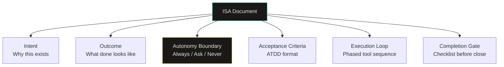
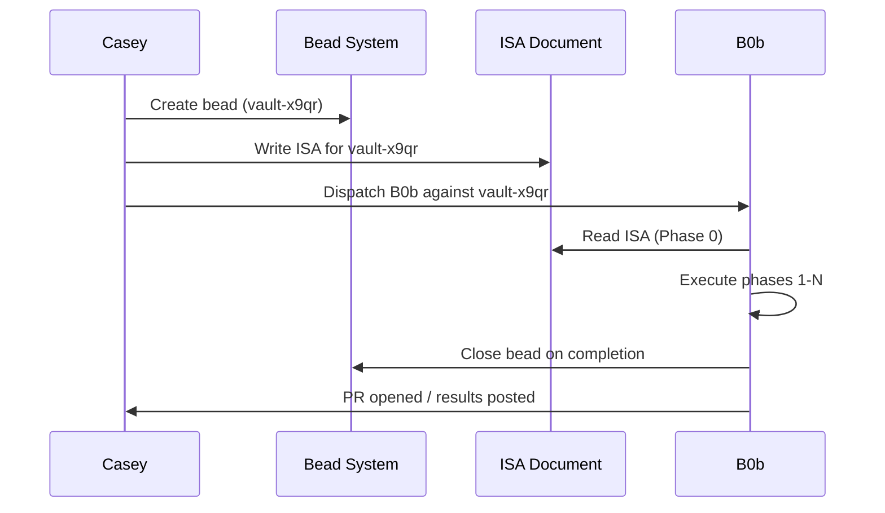
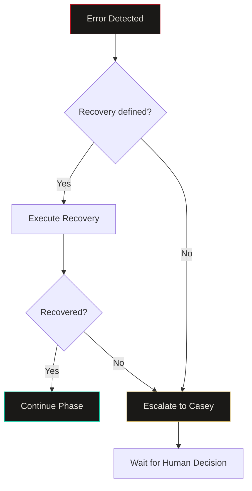

import Callout from '../../components/Callout.astro';
import StatRow from '../../components/StatRow.astro';
import PullQuote from '../../components/PullQuote.astro';
import SectionLabel from '../../components/SectionLabel.astro';
import ScrollReveal from '../../components/ScrollReveal.astro';
import DiagramBlock from '../../components/DiagramBlock.astro';

<Callout variant="note" label="Context">
Prometheus is a personal AI infrastructure stack. B0b is the autonomous coding agent in
the stack. He runs as a fleet of Claude Code instances dispatched against work items
(beads). This article documents the ISA pattern that governs what B0b does, what he
is allowed to do, and how we know when he is done. The pattern emerged from real
failures in ad-hoc agent prompting and was validated by shipping 11 ISAs in a single
session (session-318).
</Callout>

---

<SectionLabel text="The Problem" />

## Why ad-hoc prompting fails

The standard approach to giving an AI agent work: write a prompt describing what you
want. Maybe add some context. Hit send. Hope the agent figures out the rest.

This works for small tasks. Write a function. Fix a bug. Run a test. The scope is
narrow, the success criteria are obvious, and the agent can verify its own work.

<ScrollReveal>
It does not work for anything larger. A multi-file refactoring across three services.
A new feature that requires reading existing code, understanding constraints, writing
implementation, and validating against acceptance criteria. A deployment that involves
Kubernetes manifests, image builds, and smoke tests across nodes.

For these tasks, ad-hoc prompting fails in predictable ways:
</ScrollReveal>

**Scope creep.** Without explicit boundaries, the agent interprets "fix the routing
logic" as "fix the routing logic and also refactor the error handling and also update
the tests and also clean up the imports." Each addition is individually reasonable.
Together they produce a PR that nobody asked for and nobody can review.

**Missing context.** The agent does not know what it does not know. Without a structured
context-loading step, it guesses at constraints, invents conventions, and makes
assumptions about the codebase that are wrong. The output looks correct until you read
it against the actual architecture.

**Ambiguous completion.** When is the task done? The agent thinks it is done when the
code compiles. You think it is done when the tests pass, the deployment succeeds, and
the smoke test returns green. Without explicit acceptance criteria, "done" is a
negotiation that happens after the work is complete.

**No escalation path.** The agent encounters something it cannot resolve. A dependency
is missing. A service is down. The ISA requires a decision only the human can make.
Without an explicit escalation model, the agent either blocks silently (wasting the
session) or makes a guess (introducing risk).

<PullQuote>
Ad-hoc prompting treats the agent as a conversation partner. ISAs treat the agent as
a contractor with a scope of work, a set of constraints, and a definition of done.
</PullQuote>

---

<SectionLabel text="The ISA Format" />

## Anatomy of an ISA

ISA stands for Intelligent Service Agreement. The name is deliberate. It borrows from
the service agreement pattern in IT service management (ITIL) and from the legal
structure of a contract: scope, constraints, acceptance criteria, escalation triggers,
completion definition. The "intelligent" qualifier means the agreement is written for
an agent that can reason about its own compliance with the terms.

<ScrollReveal>
<DiagramBlock caption="ISA structure: six sections that define the complete contract between human and agent">

</DiagramBlock>
</ScrollReveal>

### Intent

One paragraph. Why does this work item exist? Not what needs to be built. Why it needs
to be built. The agent reads this first and uses it to resolve ambiguity throughout
execution. If a decision could go either way, the intent section breaks the tie.

### Outcome (What Done Looks Like)

Falsifiable statements. Not "the service works." Statements like: "kubectl logs show
`[grace] route triggered` for each of 3 test messages." The agent can verify each
statement independently. If any statement is false after execution, the work is not
done.

### Autonomy boundary

Three tiers, explicitly enumerated:

<ScrollReveal>
<StatRow stats={[
  { value: "Always", label: "Execute without asking" },
  { value: "Ask", label: "Require human approval" },
  { value: "Never", label: "Hard stop, no exceptions" }
]} />
</ScrollReveal>

**Always:** actions the agent takes without checking. Read the codebase. Search
prom-memory. Write implementation files. Run tests. Commit and push. These are within
the agent's authority.

**Ask First:** actions that require explicit human approval before execution. Changing
behavior rules. Modifying thresholds. Adding new data categories. Wiring capabilities
not in scope. These are design decisions, not implementation decisions.

**Never:** hard stops. Actions the agent must not take under any circumstances. Storing
private data with public classification. Using a more expensive model tier than
specified. Violating the memory wall between contexts. These are not negotiable
regardless of what the agent thinks is "better."

<Callout variant="insight" label="Why three tiers">
Two tiers (do / don't) are not enough. The middle tier, Ask First, is where most
governance failures happen. The agent encounters something ambiguous. With only do/don't,
it either blocks (lost time) or guesses (risk). The Ask tier gives it a third option:
surface the decision to the human and wait. This is the escalation path that ad-hoc
prompting lacks.
</Callout>

### Acceptance criteria (ATDD format)

Each criterion follows a Given-When-Then structure borrowed from Acceptance Test-Driven
Development. The format forces specificity:

```
AC-1: Grace responds to Zulip messages in her channel

Given: daemon-mm is deployed and running (1/1 Running)
When:  Casey sends a message to the grace Zulip stream
Then:  daemon-mm routes the message to router/grace.py
And:   the response is in Grace's voice (warm, direct, no hedging)
And:   kubectl logs show [grace] route triggered

Negative: Grace must NOT respond to messages in other persona streams
Measure:  3 test messages sent, 3 responses received, 3 log entries
```

The **Negative** line is as important as the positive criteria. It defines what the
system must not do, not just what it must do. The **Measure** line defines how
verification works.

### Execution loop

A phased tool sequence that tells the agent exactly what to do and in what order.
Phases are sequential. Within a phase, steps can be parallel or sequential, explicitly
marked. Error handling is defined per phase with recovery actions and escalation
triggers.

This is not a suggestion. It is a plan. The agent follows the plan. Deviations from
the plan require Ask First escalation.

### Completion gate

A checklist of all acceptance criteria plus operational requirements (code committed,
tests passing, deployment verified, bead closed in the tracking system). The agent
does not declare "done" until every line in the completion gate is checked.

---

<SectionLabel text="ISA + Beads" />

## How ISAs compose with beads

Beads are the work tracking units in Prometheus. Every work item, from a one-hour fix
to a multi-session build, has a bead ID. The bead tracks status, priority, dependencies,
and ownership. ISAs attach to beads.

<ScrollReveal>
<DiagramBlock caption="ISA lifecycle: bead created, ISA written, B0b dispatched, work executed, bead closed">

</DiagramBlock>
</ScrollReveal>

The bead contains metadata: what the work is, when it was created, what it depends on,
what its priority is. The ISA contains the execution contract: how the work gets done,
what the constraints are, what done means.

Separating the two is deliberate. The bead can exist without an ISA (for tracking
purposes). The ISA can exist without immediate dispatch (for planning purposes). When
B0b is dispatched, he reads both: the bead for context, the ISA for instructions.

<Callout variant="warning" label="The dependency model">
ISAs can declare dependencies on other beads. B0b's first action in the execution loop
is to check whether dependencies are met. If vault-x9qr depends on vault-0oh5 (a
PADCN bus that must be merged first), B0b checks the dependency in Phase 2 before
writing any code. If the dependency is not met, B0b stops and surfaces the block to
Casey. This is not politeness. It is governance. Building on unmet dependencies
produces work that cannot be deployed.
</Callout>

---

<SectionLabel text="B0b Consumption" />

## How B0b consumes ISAs

B0b is a fleet of Claude Code instances. Each instance is dispatched with a task
description and a template that defines its operating behavior. The templates (tier-0
through tier-3) tell B0b how to behave. The ISA tells B0b what to build.

<ScrollReveal>

**Phase 0: Memory check.** Before touching any code, B0b searches prom-memory for
prior work on this bead. This catches the case where a previous B0b session started the
work, hit a failure, and left breadcrumbs. Without Phase 0, each dispatch starts from
scratch. With Phase 0, each dispatch has the context of every previous attempt.

**Phase 1: Read.** B0b reads the relevant codebase. Not guesses about the codebase.
Actually reads the files, in parallel, and waits for all reads to complete before
proceeding. The ISA specifies which files to read. This eliminates the "agent invents
the architecture" failure mode.

**Phase 2: Check dependencies.** Verify that prerequisite beads are closed, prerequisite
PRs are merged, prerequisite services are running. If any check fails, stop and surface
to Casey. Do not proceed on assumptions.

**Phases 3-N: Execute.** Write code, run tests, deploy, verify. Each phase has explicit
completion criteria. Error handling blocks define recovery for each anticipated failure
mode.

**Final phase: Close.** Save a prom-memory milestone. Close the bead in the tracking
system. Post results. The session ends with a clean state.

</ScrollReveal>

<PullQuote>
The ISA execution loop is not a guide. It is a contract. The agent follows the phases.
Deviations require explicit escalation. This is the governance that ad-hoc prompting
lacks.
</PullQuote>

---

<SectionLabel text="Session-318" />

## The session-318 batch: 11 ISAs in one session

Session-318 was the proof that the ISA pattern scales. In a single session, 11 ISAs
were written for Sprint 4 of the Prometheus roadmap. Each ISA covered a distinct build,
a distinct service, and a distinct set of acceptance criteria.

<ScrollReveal>
<StatRow stats={[
  { value: "11", label: "ISAs written" },
  { value: "1", label: "Session" },
  { value: "6", label: "Distinct services" }
]} />
</ScrollReveal>

The ISAs covered:

| Bead | Scope | Service |
|------|-------|---------|
| vault-0oh5 | PADCN persona bus, per-response tone injection | daemon-mm |
| vault-x9qr | Grace persona implementation | daemon-mm |
| vault-ohvc | System prompt audit, token budget enforcement | daemon-mm |
| vault-er18 | Session lifecycle layer (hooks, memory will, sleeptime) | daemon-state + daemon-guard |
| vault-4rqh | PR notification pipeline | daemon-state |
| vault-djl9 | B0b template upgrade, variable syntax fix | b0b-templates |
| vault-nwz3 | Memory will and interrupt objects | daemon-state |
| vault-dyvc | Sleeptime memory agent | daemon-state |
| vault-jptu | Dead man's switch | daemon-guard |
| vault-4k20 | Signal bus | daemon-state |
| vault-ay22 | Semantic delta primer | daemon-state |

Each ISA followed the same structure: intent, outcome, autonomy boundary, ATDD
acceptance criteria, phased execution loop, completion gate. The consistency of the
format meant that any B0b instance could pick up any ISA and know exactly how to
execute it.

<Callout variant="insight" label="What scaled">
The ISA format itself is the scaling mechanism. Writing 11 ISAs in one session was
possible because the format is structured enough to be composable. Each ISA is
self-contained. Dependencies between ISAs are declared, not implicit. B0b can be
dispatched against any ISA in any order (subject to dependency resolution) without
the dispatcher needing to understand the content.
</Callout>

---

<SectionLabel text="Lessons" />

## Lessons on ISA granularity

Not all 11 ISAs were the same size. Some (vault-djl9, the template syntax fix) were
small: one repo, one change, well-defined before and after. Others (vault-er18, the
session lifecycle layer) were large: three repos, five sub-beads, complex dependencies.

<ScrollReveal>

**Lesson 1: One ISA per deployable unit.** The right granularity is: one ISA produces
one PR (or one set of coordinated PRs) that can be deployed and verified independently.
When vault-er18 was written as a single ISA with five sub-beads, it was too large. Each
sub-bead needed its own ISA because each was independently deployable. The parent ISA
became a coordination document, not an execution contract.

**Lesson 2: Acceptance criteria are the granularity test.** If you cannot write ATDD
acceptance criteria that are independently verifiable, the ISA is either too large
(split it) or too vague (sharpen it). The Given-When-Then format forces falsifiability.
If the criterion is not falsifiable, it is not a criterion.

**Lesson 3: The autonomy boundary is the hardest section to write.** Deciding what
the agent can do without asking is a governance decision with real consequences. Too
permissive and the agent makes decisions you did not authorize. Too restrictive and
the agent blocks on trivial questions, burning session time. The right calibration
comes from experience. After 11 ISAs, the pattern stabilized around: "implementation
decisions are Always; design decisions are Ask First; data classification decisions
are Never."

**Lesson 4: Phase 0 (memory check) is non-negotiable.** Multiple B0b dispatches
against the same bead is the normal case, not the exception. B0b sessions time out,
hit errors, run into unmet dependencies, and get restarted. Without Phase 0, each
restart reinvents context. With Phase 0, each restart reads the breadcrumbs from the
last attempt and picks up where it left off. Prom-memory breadcrumbs are the session
continuity mechanism for autonomous agents.

</ScrollReveal>

---

<SectionLabel text="Error Handling" />

## Structured error handling in ISAs

Each ISA includes an error handling block per phase. The block is a JSON-like structure
that defines: the error, the context (which phase), the recovery action, and whether
to escalate to Casey.

<ScrollReveal>
<DiagramBlock caption="Error handling flow: detect, attempt recovery, escalate if recovery fails">

</DiagramBlock>
</ScrollReveal>

Example from vault-x9qr (Grace persona implementation):

```
Error: vault-0oh5 PR not merged
Context: Phase 2 dependency check
Recovery: Stop. Surface to Casey: "vault-0oh5 (daemon-mm#22)
  is not merged. Grace requires PADCN bus. Merge first."
Escalate: Yes

Error: Grace system prompt exceeds 500 tokens
Context: Phase 5 token audit
Recovery: Trim GRACE_BASE. Preserve voice rules.
  Cut examples and elaborations first. Rerun count.
Escalate: No

Error: daemon-state unreachable (PADCN fetch fails)
Context: Phase 6 smoke test
Recovery: Use neutral defaults (all dims = 0.5).
  Log warning. Continue response.
Escalate: No
```

The escalation flag is the key design decision. Some errors are recoverable by the
agent (trim the prompt, use defaults). Some errors require a human decision (unmet
dependency, service down, scope question). The ISA makes this distinction explicit
rather than leaving it to the agent's judgment.

<PullQuote>
The ISA does not assume the agent will succeed. It assumes the agent will encounter
failures and provides a decision tree for each one. That is the difference between
a prompt and a contract.
</PullQuote>

---

<SectionLabel text="The Pattern" />

## ISA as a governance pattern

ISAs are not just a prompting technique. They are a governance pattern for autonomous
AI agents.

<ScrollReveal>

**Auditability.** Every ISA is a document that can be reviewed before execution. The
autonomy boundary is explicit. The acceptance criteria are falsifiable. The error
handling is defined. If the agent produces an unexpected outcome, the ISA provides the
reference against which to evaluate what went wrong.

**Reproducibility.** Given the same ISA and the same codebase state, two different B0b
instances should produce equivalent output. The ISA constrains the agent's decision
space enough that implementation variance is bounded. This is not deterministic
(LLMs are stochastic), but it is reproducible enough for practical purposes.

**Composability.** ISAs compose through the bead dependency system. Complex work
decomposes into multiple ISAs with declared dependencies. The dispatcher can schedule
ISAs in dependency order without understanding the content. This is the mechanism
that turns one person's architecture decisions into a fleet's work queue.

**Portability.** ISAs are markdown documents. They are not tied to a specific agent
framework, a specific LLM, or a specific deployment platform. They could be consumed
by Claude Code, by a custom agent, by a human engineer. The format is the interface.
The execution engine is pluggable.

</ScrollReveal>

<Callout variant="insight" label="The deeper claim">
The ISA pattern is a partial answer to the AI agent authorization problem. The
framework's autonomy boundary (Always / Ask / Never) is a runtime authorization
policy expressed in natural language. The agent's compliance with that policy is
verifiable through the acceptance criteria. This is not a complete solution to agentic
AI governance, but it is a working implementation of a principle that most governance
frameworks describe only in abstract terms.
</Callout>

---

<SectionLabel text="Template" />

## ISA template for practitioners

If you are building autonomous agents and want to try the pattern, here is the minimal
viable ISA structure:

```markdown
# ISA: [bead-id] -- [title]

## Intent
Why this work exists. One paragraph.

## Outcome (What Done Looks Like)
Falsifiable statements. Numbered list.

## Autonomy Boundary
### Always (agent executes without asking)
### Ask First (requires human approval)
### Never (hard stop)

## Acceptance Criteria
### AC-1: [name]
Given: [precondition]
When:  [action]
Then:  [expected result]
Negative: [what must NOT happen]
Measure: [how to verify]

## Execution Loop
Phase 0: Memory check
Phase 1: Read current state
Phase 2: Check dependencies
Phase 3-N: Execute
Final: Close

## Completion Gate
- [ ] AC-1 verified
- [ ] AC-2 verified
- [ ] Code committed
- [ ] Tests passing
- [ ] Bead closed
```

Adapt as needed. The sections are the point, not the syntax. The autonomy boundary and
acceptance criteria are the minimum viable governance layer. Everything else is
optimization.

---

<SectionLabel text="Open Questions" />

## Open questions

**ISA generation.** Currently ISAs are written by hand. This is fine for 11 ISAs in a
session. It does not scale to 50. Can the ISA format itself be generated from a
higher-level intent description? The risk is that generated ISAs lose the specificity
that makes them useful. The opportunity is that the pattern is structured enough to
be partially automatable.

**ISA versioning.** What happens when an ISA needs to change mid-execution? Currently
the answer is: write a new ISA. But if B0b is mid-session on the original ISA, there
is no mechanism for hot-updating the contract. The agent finishes the old ISA or
discards it. There is no graceful transition.

**Cross-agent ISAs.** All current ISAs are written for B0b. What happens when multiple
agents with different capabilities need to coordinate on a single deliverable? The
dependency model handles sequential handoffs. It does not handle parallel collaboration
where two agents work on the same codebase simultaneously. Coordination protocols for
multi-agent ISA execution are an open design problem.
