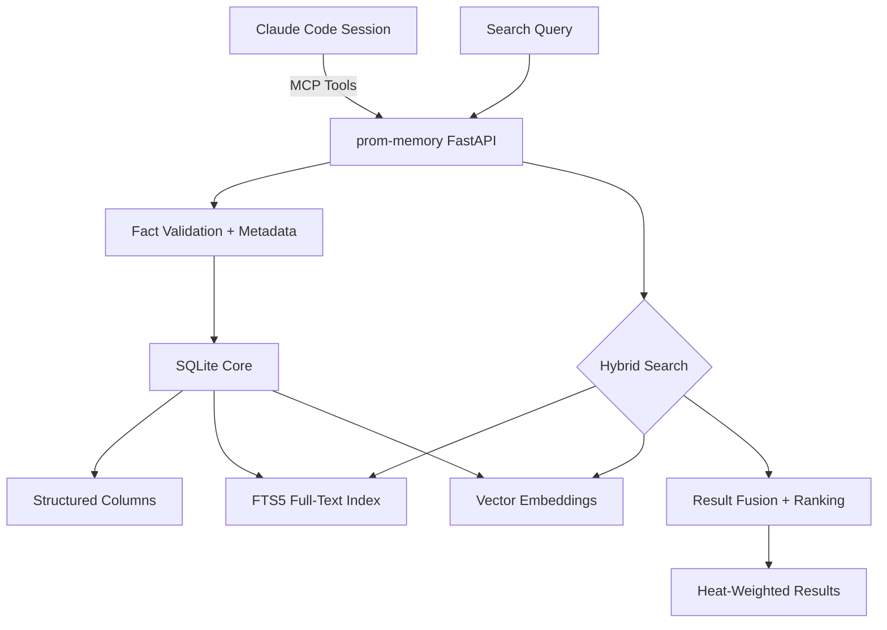
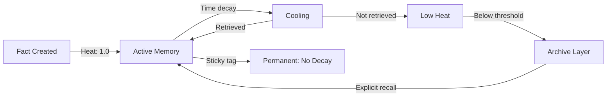
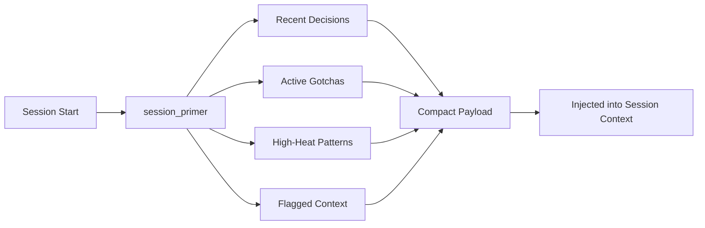

import Callout from '../../components/Callout.astro';
import StatRow from '../../components/StatRow.astro';
import PullQuote from '../../components/PullQuote.astro';
import SectionLabel from '../../components/SectionLabel.astro';
import ScrollReveal from '../../components/ScrollReveal.astro';
import DiagramBlock from '../../components/DiagramBlock.astro';

<Callout variant="note" label="Build log">
prom-memory has been running in production for 320+ sessions across a personal
AI system called Prometheus. This is the build log: what it is, how it works,
and what we learned from a year of episodic memory in production.
</Callout>

---

<SectionLabel text="The Problem" />

## Why episodic memory matters

AI assistants are stateless by default. Every session starts from zero. The system
prompt provides identity and rules, the context window provides the working set, and
when the session ends, everything evaporates.

<ScrollReveal>
This works for one-off conversations. It fails completely for an AI system that operates
across hundreds of sessions, maintains relationships with projects and decisions, and
needs to remember what happened three months ago when a similar problem surfaced.

The naive solution is "put everything in the context window." The problem is that
context windows are finite, attention degrades in the middle of long contexts, and
most of what happened in session 47 is irrelevant to session 320. You don't need all
the memories. You need the right ones, retrieved at the right time, with the right
level of detail.
</ScrollReveal>

<PullQuote>
Memory is not retrieval. Retrieval finds documents. Memory knows what happened,
what you decided, what broke, and what you learned from it.
</PullQuote>

prom-memory is an episodic memory layer: structured fact storage with semantic search,
organized by a taxonomy that distinguishes decisions from gotchas from milestones from
patterns. It doesn't store documents. It stores typed facts about what happened during
sessions, with enough metadata to retrieve them by meaning, filter them by context,
and let them decay when they stop being useful.

---

<SectionLabel text="Architecture" />

## The stack

prom-memory runs as a FastAPI service on K3s with Longhorn persistent volume claims.
The storage engine is SQLite with three layers: structured fact storage, full-text search
via FTS5, and vector similarity search via locally-generated embeddings.

<ScrollReveal>
<DiagramBlock caption="prom-memory architecture: three search layers over structured fact storage">

</DiagramBlock>
</ScrollReveal>

<StatRow stats={[
  { value: "320+", label: "Production sessions" },
  { value: "14", label: "MCP tools (v2)" },
  { value: "SQLite", label: "Storage engine" }
]} />

**Why SQLite?** Because it's the right tool for this scale. prom-memory stores thousands
of facts, not millions. A single SQLite file is trivially backed up, trivially migrated,
and runs on hardware from a Jetson Orin to a Beelink mini PC. No connection pooling, no
cluster management, no ops burden. The database is a file. The backup is a file copy.

**Why not Postgres?** Prometheus runs Postgres for other services (LangGraph checkpoints,
Langfuse backend). prom-memory doesn't need multi-user access, transactions across
tables, or any of the features that justify Postgres complexity. The single-writer,
single-reader pattern of one AI system writing its own memories is a perfect SQLite fit.

---

<SectionLabel text="CogniLayer Taxonomy" />

## Structured forgetting: the CogniLayer fact types

Not all memories are the same. A decision has different retrieval patterns than a gotcha.
A milestone matters for narrative context; a pattern matters for problem solving. The
CogniLayer taxonomy assigns a type to every fact, and the type determines how the fact
is stored, searched, and eventually compressed or archived.

<ScrollReveal>
| Type | What it captures | Retrieval pattern |
|------|-----------------|-------------------|
| `decision` | A choice was made, with reasoning | Architecture discussions, "why did we..." |
| `milestone` | Something shipped or completed | Progress tracking, session history |
| `gotcha` | Something broke or surprised us | Similar-problem detection, debugging |
| `pattern` | A recurring observation | Cross-session pattern recognition |
| `correction` | A wrong assumption was fixed | Accuracy improvement, anti-patterns |
| `preference` | User preference observed | Personalization, style consistency |
| `context` | Background information | Session priming, project context |
| `insight` | A non-obvious connection | Creative problem solving |
| `question` | An open question flagged | Research agenda tracking |
| `risk` | A risk identified | Pre-mortem, Cassandra protocol |
| `procedure` | A how-to captured | Runbook assembly, automation |
| `relationship` | A connection between entities | Graph traversal, dependency mapping |
| `metric` | A measured value | Trend tracking, regression detection |
| `environment` | System/infra state at a point in time | Debugging, postmortem context |
</ScrollReveal>

<Callout variant="insight" label="Why types matter">
Without types, memory search degenerates into "give me everything vaguely related to X."
With types, you can ask "what decisions have we made about X" or "what gotchas have we
hit when working with X." The type is a structured filter that dramatically improves
retrieval precision without requiring the searcher to know the right keywords.
</Callout>

Each fact also carries metadata: timestamp, session ID, context (work vs personal vs
prometheus), classification level, related entities, and a heat score. The heat score
is the mechanism for structured forgetting.

---

<SectionLabel text="Heat Decay" />

## Heat decay: memories that cool over time

Every fact enters prom-memory with a heat score. The score decays over time unless the
fact is retrieved, referenced, or linked to other facts. High-heat facts surface in
session primers and search results. Low-heat facts fade into the archive layer, still
retrievable but no longer proactively surfaced.

<ScrollReveal>
<DiagramBlock caption="Heat decay curve: retrieval reheats, time cools, type sets floor">

</DiagramBlock>
</ScrollReveal>

The decay function is configurable per fact type. Decisions decay slowly because they
remain relevant across many sessions. Gotchas decay slowly because the failure mode
they document tends to recur. Environment facts decay quickly because system state
changes. Metrics decay at a medium rate because trend data has a shelf life.

Three decay categories:

- **Sticky**: never decays. Foundation-layer memories. Used for architectural decisions,
  core gotchas, and user preferences that define the system's behavior.
- **Standard**: decays on a schedule. The default. Most facts live here.
- **Ephemeral**: decays rapidly. Session-specific context, temporary state, notes that
  are only relevant to the current work block.

<PullQuote>
The goal is not to remember everything. The goal is to forget the right things
at the right time, and never forget the things that matter.
</PullQuote>

This maps directly to the [Middle-Out compression](/research/middle-out-compression)
algorithm: sticky facts are the foundation band (never compress), standard facts are
the middle band (compress when they cluster), and ephemeral facts are the active band
(keep until they're integrated, then discard).

---

<SectionLabel text="Hybrid Search" />

## Hybrid search: FTS5 + vector embeddings

prom-memory uses two search strategies simultaneously and fuses the results.

**FTS5 (full-text search)** handles exact keyword matches, boolean queries, and phrase
matching. When you search for "daemon-guard CB4A deployment," FTS5 finds every fact
that contains those terms. It's fast, deterministic, and handles the cases where the
user knows exactly what they're looking for.

**Vector search** handles semantic similarity. Embeddings are generated on write using
a local model on the Orin AGX node. When you search for "tool call authorization,"
vector search finds facts about CB4A even if they never use the word "authorization."
It handles the cases where the user knows the concept but not the exact terms.

<ScrollReveal>
<StatRow stats={[
  { value: "FTS5", label: "Keyword search" },
  { value: "Vector", label: "Semantic search" },
  { value: "Fused", label: "Result ranking" }
]} />
</ScrollReveal>

The fusion is weighted: FTS5 matches get a precision bonus (exact matches are usually
what you want), vector matches get a recall bonus (finding related facts the user
didn't think to search for). Heat scores weight the final ranking, so a hot decision
about CB4A outranks a cold environment note from three months ago.

<Callout variant="warning" label="Embedding model gotcha">
The Orin AGX runs JetPack R36.5.0, which constrains the ONNX runtime version. The
embedding model must pin `onnxruntime==1.17.3` because 1.18+ crashes on this JetPack
version. This dependency constraint is invisible until the service restarts and fails
to load the model. We lost two sessions to this before pinning it in requirements.
</Callout>

---

<SectionLabel text="v2 Tools" />

## v2: from storage to intelligence

v1 of prom-memory had four tools: `add`, `search`, `archive`, and `review_queue`.
Store facts, find facts, archive facts, review what's pending. Functional but limited.
The system accumulated memory but couldn't do anything with it beyond retrieval.

v2 added seven tools that turn stored facts into connected knowledge:

<ScrollReveal>
| Tool | What it does |
|------|-------------|
| `link` | Create a typed relationship between two facts |
| `traverse` | Walk the link graph from a starting fact |
| `links` | List all connections for a given fact |
| `recall_at` | Retrieve the memory state at a specific point in time |
| `consolidate` | Merge multiple related facts into a summary fact |
| `drift_check` | Compare current beliefs against historical decisions |
| `harvest` | Extract structured insights from a set of facts |
</ScrollReveal>

**`link` and `traverse`** turn flat fact storage into a knowledge graph. A decision about
architecture can be linked to the gotcha that motivated it, the milestone where it shipped,
and the pattern it established. Traversal follows these links, giving the system a way to
understand not just "what happened" but "why it happened and what it led to."

**`consolidate`** is the manual compression tool. When a set of facts about the same
topic has accumulated over many sessions, consolidate merges them into a single summary
fact. The original facts are preserved (history is inviolable) but the summary becomes
the primary retrieval target. This feeds the Middle-Out compression pipeline.

**`drift_check`** compares what the system currently believes against what it decided
in the past. If a decision was made in session 50 and the current session is
contradicting it without acknowledging the change, drift_check catches it. This is
the self-consistency mechanism: the system can check whether it's being coherent
across time, not just within a single session.

<StatRow stats={[
  { value: "7", label: "New v2 tools" },
  { value: "14", label: "Total tool count" },
  { value: "Graph", label: "Fact relationships" }
]} />

---

<SectionLabel text="Session Primer" />

## How memory enters a session

At the start of every session, the `session_primer` tool runs. It assembles a compact
memory payload from the most relevant facts: recent decisions, active gotchas,
high-heat patterns, and any context flagged as "surface next session."

<ScrollReveal>
<DiagramBlock caption="Session primer flow: curated memory injection at session start">

</DiagramBlock>
</ScrollReveal>

The primer is budget-constrained. It doesn't dump every fact into the context window.
It selects the highest-value facts within a token budget, prioritized by heat, recency,
and type. Decisions and gotchas get priority over metrics and environment facts. The
result is a focused memory injection that gives the session relevant history without
burning half the context window on old notes.

The primer is also context-aware. In a Work context session, it only surfaces
work-context facts. In a Prometheus context session, it only surfaces
prometheus-context facts. The memory wall between contexts is enforced at the
retrieval layer, not just the storage layer.

---

<SectionLabel text="Production Lessons" />

## What we learned from 320 sessions

**Memory volume is not the problem; memory quality is.** Early sessions stored everything.
Every observation, every minor decision, every configuration value. The search results
became noisy. The heat decay system was the first major fix: facts that aren't retrieved
cool down and stop polluting results. The CogniLayer types were the second: being able
to filter by `decision` vs `environment` reduced noise dramatically.

**The session primer is the most important tool.** Not search. Not add. The primer.
Because the primer determines what the system knows at the start of every session, it's
the highest-leverage point in the entire memory architecture. A bad primer means a bad
session. We spent more time tuning the primer's selection algorithm than any other
component.

**Cross-session drift is real.** Without drift_check, the system would make contradictory
decisions across sessions without noticing. Session 200 decides to use Longhorn for all
PVCs. Session 230 proposes local-path for a new service because it's simpler. drift_check
catches this: "You decided Longhorn-only in session 200. Are you intentionally reversing
that?" The system becomes self-correcting across time.

<PullQuote>
The system that doesn't check its own consistency will eventually contradict itself.
At 320 sessions, "eventually" happens every week.
</PullQuote>

**Backup is a file copy.** This is the quiet advantage of SQLite. The entire memory
database, including embeddings, FTS5 index, and all structured data, is a single file.
Backup runs as a scheduled task on the K3s cluster: copy the file to the backup node.
Restore is copy it back. No export/import pipeline, no schema migration, no pg_dump.
The simplest backup strategy that could possibly work, and it works.

**Cold-start timeouts kill agent workflows.** prom-memory loads the embedding model on
first request. If the model hasn't been loaded recently and the first request comes from
an autonomous agent (B0b) with a short timeout, the request fails. The agent moves on
without memory context. This caused silent quality degradation in autonomous sessions
until we added a health check that pre-loads the model.

<StatRow stats={[
  { value: "1 file", label: "Entire database" },
  { value: "Longhorn", label: "PVC storage class" },
  { value: "K3s", label: "Deployment platform" }
]} />

---

<SectionLabel text="What's Next" />

## Open threads

**Middle-Out compression integration.** The consolidate tool is the manual path.
The automated path is a scheduled K3s CronJob that identifies clusters of related
facts in the middle band (not recent, not foundational) and generates summary facts.
The algorithm is designed. Implementation is next.

**Embedding model migration.** The current model is pinned to onnxruntime 1.17.3
due to JetPack constraints. The Orin has been upgraded to R36.5.0, and a second
GPU node (Thor, running a Jetson Thor SoC at R38.4.0) is now in the cluster. The
embedding model can move to the newer runtime, which unlocks better models and
faster inference.

**LiteLLM routing for embeddings.** Instead of running a single embedding model on
a single node, route embedding generation through LiteLLM to use whichever GPU node
has capacity. This also opens the path to using the local qwen3:32b model for
embedding extraction, which would improve semantic search quality.

**prom-memory as a service for all agents.** Currently, prom-memory serves one primary
consumer (Casey's Claude Code sessions) and one autonomous consumer (B0b fleet). The
next step is making it a shared service for all Prometheus personas and agents, with
per-consumer access control and context scoping. The memory wall enforcement that
currently operates at the tool level needs to move into the service's authentication
layer.

---

[^1]: prom-memory repository: `daemonprompt/prom-memory` (private). v2 shipped session-56. CogniLayer taxonomy: 14 fact types. Production data: 320+ sessions as of August 2026.
