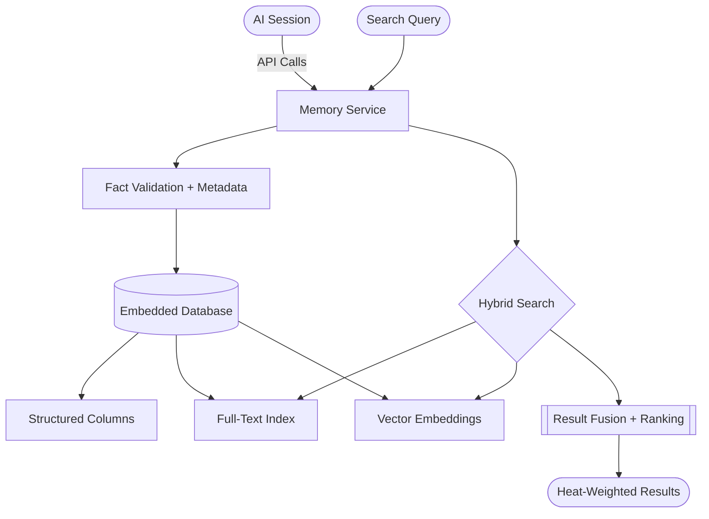
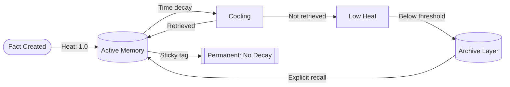
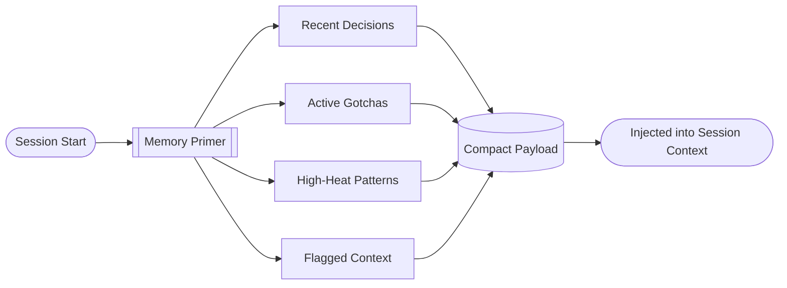

import Callout from '../../components/Callout.astro';
import StatRow from '../../components/StatRow.astro';
import PullQuote from '../../components/PullQuote.astro';
import SectionLabel from '../../components/SectionLabel.astro';
import ScrollReveal from '../../components/ScrollReveal.astro';
import DiagramBlock from '../../components/DiagramBlock.astro';

<Callout variant="note" label="Build log">
This is the episodic memory layer for my AI system.
It has been running in production for over a year. This is the build log: what it is,
how it works, and what I learned building it.
</Callout>

---

<SectionLabel text="The Problem" />

## Why episodic memory matters

AI assistants are stateless by default. Every session starts from zero. The system
prompt provides identity and rules, the context window provides the working set, and
when the session ends, everything evaporates.

<ScrollReveal>
This works for one-off conversations. It fails completely for an AI system that operates
across hundreds of sessions, maintains relationships with projects and decisions, and
needs to remember what happened three months ago when a similar problem surfaced.

The naive solution is "put everything in the context window." The problem is that
context windows are finite, attention degrades in the middle of long contexts, and
most of what happened early on is irrelevant to today's session. You don't need all
the memories. You need the right ones, retrieved at the right time, with the right
level of detail.
</ScrollReveal>

<PullQuote>
Memory is not retrieval. Retrieval finds documents. Memory knows what happened,
what you decided, what broke, and what you learned from it.
</PullQuote>

The memory layer is an episodic memory service: structured fact storage with semantic search,
organized by a taxonomy that distinguishes decisions from gotchas from milestones from
patterns. It doesn't store documents. It stores typed facts about what happened during
sessions, with enough metadata to retrieve them by meaning, filter them by context,
and let them decay when they stop being useful.

---

<SectionLabel text="Architecture" />

## The stack

The memory service runs as a lightweight API backed by a single-file embedded database.
The storage engine has three layers: structured fact storage, full-text search, and
vector similarity search via locally-generated embeddings.

<ScrollReveal>
<DiagramBlock caption="Memory layer architecture: three search layers over structured fact storage">

</DiagramBlock>
</ScrollReveal>

<StatRow stats={[
  { value: "3", label: "Search layers" },
  { value: "14", label: "Fact types" },
  { value: "1 file", label: "Entire database" }
]} />

**Why an embedded database?** Because it's the right tool for this scale. The memory layer
stores thousands of facts, not millions. A single database file is trivially backed up,
trivially migrated, and runs on hardware from a GPU dev kit to a mini PC. No connection
pooling, no cluster management, no ops burden. The database is a file. The backup is a
file copy.

**Why not a full database server?** The memory service doesn't need multi-user access, complex
transactions, or any of the features that justify server-class database complexity. The
single-writer, single-reader pattern of one AI system writing its own memories is a
perfect fit for an embedded engine.

---

<SectionLabel text="CogniLayer Taxonomy" />

## Structured forgetting: the CogniLayer fact types

Not all memories are the same. A decision has different retrieval patterns than a gotcha.
A milestone matters for narrative context; a pattern matters for problem solving. The
CogniLayer taxonomy assigns a type to every fact, and the type determines how the fact
is stored, searched, and eventually compressed or archived.

<ScrollReveal>
| Type | What it captures | Retrieval pattern |
|------|-----------------|-------------------|
| `decision` | A choice was made, with reasoning | Architecture discussions, "why did we..." |
| `milestone` | Something shipped or completed | Progress tracking, session history |
| `gotcha` | Something broke or surprised us | Similar-problem detection, debugging |
| `pattern` | A recurring observation | Cross-session pattern recognition |
| `correction` | A wrong assumption was fixed | Accuracy improvement, anti-patterns |
| `preference` | User preference observed | Personalization, style consistency |
| `context` | Background information | Session priming, project context |
| `insight` | A non-obvious connection | Creative problem solving |
| `question` | An open question flagged | Research agenda tracking |
| `risk` | A risk identified | Pre-mortem analysis |
| `procedure` | A how-to captured | Runbook assembly, automation |
| `relationship` | A connection between entities | Graph traversal, dependency mapping |
| `metric` | A measured value | Trend tracking, regression detection |
| `environment` | System state at a point in time | Debugging, postmortem context |
</ScrollReveal>

<Callout variant="insight" label="Why types matter">
Without types, memory search degenerates into "give me everything vaguely related to X."
With types, you can ask "what decisions have we made about X" or "what gotchas have we
hit when working with X." The type is a structured filter that dramatically improves
retrieval precision without requiring the searcher to know the right keywords.
</Callout>

Each fact also carries metadata: timestamp, session identifier, context scope, related
entities, and a heat score. The heat score is the mechanism for structured forgetting.

---

<SectionLabel text="Heat Decay" />

## Heat decay: memories that cool over time

Every fact enters the memory layer with a heat score. The score decays over time unless the
fact is retrieved, referenced, or linked to other facts. High-heat facts surface in
session primers and search results. Low-heat facts fade into the archive layer, still
retrievable but no longer proactively surfaced.

<ScrollReveal>
<DiagramBlock caption="Heat decay curve: retrieval reheats, time cools, type sets floor">

</DiagramBlock>
</ScrollReveal>

The decay function is configurable per fact type. Decisions decay slowly because they
remain relevant across many sessions. Gotchas decay slowly because the failure mode
they document tends to recur. Environment facts decay quickly because system state
changes. Metrics decay at a medium rate because trend data has a shelf life.

Three decay categories:

- **Sticky**: never decays. Foundation-layer memories. Used for architectural decisions,
  core gotchas, and user preferences that define the system's behavior.
- **Standard**: decays on a schedule. The default. Most facts live here.
- **Ephemeral**: decays rapidly. Session-specific context, temporary state, notes that
  are only relevant to the current work block.

<PullQuote>
The goal is not to remember everything. The goal is to forget the right things
at the right time, and never forget the things that matter.
</PullQuote>

This maps directly to the [Middle-Out compression](/research/middle-out-compression)
algorithm: sticky facts are the foundation band (never compress), standard facts are
the middle band (compress when they cluster), and ephemeral facts are the active band
(keep until they're integrated, then discard).

---

<SectionLabel text="Hybrid Search" />

## Hybrid search: full-text + vector embeddings

The memory layer uses two search strategies simultaneously and fuses the results.

**Full-text search** handles exact keyword matches, boolean queries, and phrase
matching. When you search for a specific project name or error message, full-text
finds every fact that contains those terms. It's fast, deterministic, and handles
the cases where the user knows exactly what they're looking for.

**Vector search** handles semantic similarity. Embeddings are generated on write using
a local model running on GPU hardware. When you search for a concept like "tool call
authorization," vector search finds facts about authorization frameworks even if they
never use that exact phrase. It handles the cases where the user knows the concept but
not the exact terms stored in memory.

<ScrollReveal>
<StatRow stats={[
  { value: "Full-Text", label: "Keyword search" },
  { value: "Vector", label: "Semantic search" },
  { value: "Fused", label: "Result ranking" }
]} />
</ScrollReveal>

The fusion is weighted: full-text matches get a precision bonus (exact matches are usually
what you want), vector matches get a recall bonus (finding related facts the user
didn't think to search for). Heat scores weight the final ranking, so a hot decision
outranks a cold environment note from three months ago.

<Callout variant="warning" label="Embedding model gotcha">
If your embedding inference runs on constrained hardware, pin your runtime dependencies
explicitly. We lost two sessions to a silent crash caused by an incompatible runtime
version that only manifested on service restart. The failure mode was invisible until it
wasn't.
</Callout>

---

<SectionLabel text="Evolving the Tools" />

## From storage to intelligence

The first version had four operations: add facts, search facts, archive facts, review
what's pending. Functional but limited. The system accumulated memory but couldn't do
anything with it beyond retrieval.

The second version added capabilities that turn stored facts into connected knowledge:

<ScrollReveal>
| Capability | What it does |
|------------|-------------|
| **Linking** | Create typed relationships between facts |
| **Traversal** | Walk the link graph from a starting fact |
| **Temporal recall** | Retrieve the memory state at a specific point in time |
| **Consolidation** | Merge related facts into a summary fact |
| **Drift detection** | Compare current beliefs against historical decisions |
| **Harvesting** | Extract structured insights from a set of facts |
</ScrollReveal>

**Linking and traversal** turn flat fact storage into a knowledge graph. A decision about
architecture can be linked to the gotcha that motivated it, the milestone where it shipped,
and the pattern it established. Traversal follows these links, giving the system a way to
understand not just "what happened" but "why it happened and what it led to."

**Consolidation** is the manual compression path. When a set of facts about the same
topic has accumulated over many sessions, consolidation merges them into a single summary
fact. The original facts are preserved (history is inviolable) but the summary becomes
the primary retrieval target. This feeds the Middle-Out compression pipeline.

**Drift detection** compares what the system currently believes against what it decided
in the past. If a decision was made months ago and the current session is contradicting
it without acknowledging the change, drift detection catches it. This is the
self-consistency mechanism: the system can check whether it's being coherent
across time, not just within a single session.

<StatRow stats={[
  { value: "6", label: "Intelligence capabilities" },
  { value: "Graph", label: "Fact relationships" },
  { value: "Temporal", label: "Point-in-time recall" }
]} />

---

<SectionLabel text="Session Primer" />

## How memory enters a session

At the start of every session, the memory system assembles a compact payload from the
most relevant facts: recent decisions, active gotchas, high-heat patterns, and any
context flagged as "surface next session."

<ScrollReveal>
<DiagramBlock caption="Session primer flow: curated memory injection at session start">

</DiagramBlock>
</ScrollReveal>

The primer is budget-constrained. It doesn't dump every fact into the context window.
It selects the highest-value facts within a token budget, prioritized by heat, recency,
and type. Decisions and gotchas get priority over metrics and environment facts. The
result is a focused memory injection that gives the session relevant history without
burning half the context window on old notes.

The primer is also context-aware. Different operational contexts (work vs personal vs
project-specific) only surface facts relevant to that context. The memory wall between
contexts is enforced at the retrieval layer, not just the storage layer.

---

<SectionLabel text="Production Lessons" />

## What I learned building this

**Memory volume is not the problem; memory quality is.** Early sessions stored everything.
Every observation, every minor decision, every configuration value. The search results
became noisy. The heat decay system was the first major fix: facts that aren't retrieved
cool down and stop polluting results. The fact type taxonomy was the second: being able
to filter by `decision` vs `environment` reduced noise dramatically.

**The session primer is the most important component.** Not search. Not storage. The primer.
Because the primer determines what the system knows at the start of every session, it's
the highest-leverage point in the entire memory architecture. A bad primer means a bad
session. I spent more time tuning the primer's selection algorithm than any other
component.

**Cross-session drift is real.** Without drift detection, the system makes contradictory
decisions across sessions without noticing. An early session decides on an architectural
rule. A later session proposes violating it because the simpler path looks appealing.
Drift detection catches this: "You decided X previously. Are you intentionally reversing
that?" The system becomes self-correcting across time.

<PullQuote>
The system that doesn't check its own consistency will eventually contradict itself.
At production scale, "eventually" happens every week.
</PullQuote>

**Backup is a file copy.** This is the quiet advantage of an embedded database. The entire
memory store, including embeddings, full-text index, and all structured data, is a single
file. Backup is: copy the file. Restore is: copy it back. No export/import pipeline, no
schema migration, no dump utility. The simplest backup strategy that could possibly work,
and it works.

**Cold-start timeouts kill agent workflows.** The memory service loads the embedding model on
first request. If the model hasn't been loaded recently and the first request comes from
an autonomous agent with a short timeout, the request fails. The agent moves on without
memory context. This caused silent quality degradation in autonomous sessions until I
added a health check that pre-loads the model at startup.

<StatRow stats={[
  { value: "1 file", label: "Entire database" },
  { value: "File copy", label: "Backup strategy" },
  { value: "Pre-load", label: "Cold start fix" }
]} />

---

<SectionLabel text="What's Next" />

## Open threads

**Automated compression.** The consolidation capability is the manual path. The automated
path is a scheduled job that identifies clusters of related facts in the middle band
(not recent, not foundational) and generates summary facts. The algorithm is designed
around the Middle-Out compression model. Implementation is next.

**Embedding model upgrades.** The current model is pinned to a specific runtime version
due to hardware constraints. As the compute environment evolves, the embedding model
can move to newer runtimes, which unlocks better models and faster inference.

**Shared memory across agents.** Currently, the memory service serves one primary consumer and
one autonomous agent fleet. The next step is making it a shared service for all personas
and agents in the system, with per-consumer access control and context scoping. The
memory wall enforcement that currently operates at the application level needs to move
into the service's authentication layer.

---

[^1]: The episodic memory system described here uses the CogniLayer taxonomy: 14 fact types. Running in production since 2025.

## See also

**Prometheus build chain** — prom-memory is the memory layer the rest of the system is built on:

- [Middle-Out: temporal compression for AI episodic memory systems](/research/middle-out-compression) — the compression algorithm that keeps prom-memory from growing without bound. Named after that show.
- [The Notebook That Edits Itself](/research/cognitive-security-part1) — what happens when the memory layer starts shaping cognition. The cognitive security series runs on prom-memory findings.
- [The Elliot Probe](/research/bdd-persona-drift) — structural detection for behavioral drift in AI systems that use shared memory.
- [My agent couldn't read its own name for months](/build-logs/agent-couldnt-read-its-own-name) — a failure mode that prom-memory's attribution tooling is designed to catch: silent corruption that health checks don't surface.
- [Writing to the Next Session](/build-logs/writing-to-the-next-session) — session handoff architecture built on top of prom-memory. What recovery actually needs.
