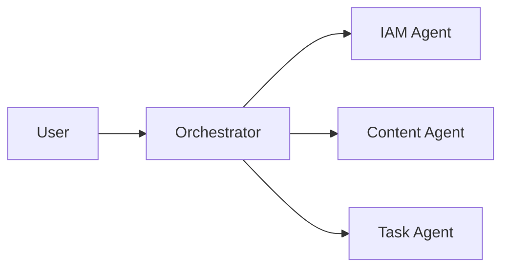

import Callout from '../../components/Callout.astro';
import DiagramBlock from '../../components/DiagramBlock.astro';
import PullQuote from '../../components/PullQuote.astro';
import SectionLabel from '../../components/SectionLabel.astro';
import ScrollReveal from '../../components/ScrollReveal.astro';

The failure mode of Adam Smith's argument, when applied to AI, is that it mistakes scarcity for structure.

Smith's argument in *The Wealth of Nations* (1776) is about efficiency through division of labor. Pin factories. One worker draws the wire, another straightens it, another cuts it. Specialization creates output you could never achieve with generalists doing everything end to end. The argument is correct. Division of labor works.

When people apply this to AI, they reach a particular conclusion: you need specialists. Expert models for expert tasks. A legal reasoning model for contracts. A medical diagnosis model for radiology. A security analysis model for threat hunting. Each of these needs to be big, expensive, trained on domain-specific data, and maintained by a team. The pessimistic corollary is that everyone ends up dependent on whoever controls those specialists: big model providers, centralized infrastructure. You rent access to the expert.

That pessimism has been running around my field for three years. Every conversation about AI in enterprise security ends up here: dependency, lock-in, the cost of access. It's treated as structurally inevitable.

It isn't. Smith's argument assumes specialists are scarce. Small language models (SLMs) just broke that assumption.

<SectionLabel text="Scarcity Was the Hidden Premise" />

## Scarcity Was the Hidden Premise

Pin factory economics work when expertise is rare and expensive to replicate. You hire one master craftsman and structure work around them because you can't afford ten. Division of labor solves the scarcity problem.

When you apply that logic to AI, you get the same answer: one big expert model per domain, expensive to train, expensive to run, centralized. The reasoning is structurally identical to the pin factory. Scarcity creates dependency.

But what happens when the expert isn't scarce? When you can spin up a specialized model in minutes on hardware you already own, run it locally, and run five more alongside it?

That's what SLMs do. A three-billion parameter model running on a consumer GPU handles most domain-specific inference tasks competently. It costs nothing per query once it's running. It runs offline. You can tune it for your specific use case with a few thousand examples and a weekend.

The scarcity assumption collapses. And when scarcity collapses, so does the argument for centralized dependency.

<SectionLabel text="What the Inversion Looks Like" />

## What the Inversion Looks Like

I run a fleet of small agents on Kubernetes on consumer hardware at home. This isn't a lab experiment. It's a production assistant platform I use for real work every day.

The agents are specialized. One handles Identity and Access Management (IAM) and Zero Trust research queries. One manages calendar and task orchestration. One writes and edits content. Each is tuned for its domain. None of them is a general-purpose frontier model.

<PullQuote>Running them simultaneously costs nothing meaningful. The hardware is already there. The marginal cost of a query is essentially zero.</PullQuote>

I can add a new specialized agent in a day.

Smith would recognize the structure: specialized workers, each excellent at their task, working in parallel. What he couldn't have anticipated is that the "workers" have zero marginal cost to replicate. The scarcity that justified centralization is gone.

<SectionLabel text="The Coordination Objection" />

## The Coordination Objection

The standard objection at this point is coordination. Sure, you can run ten specialized models, but who orchestrates them? You still need a general-purpose system to route tasks.

Yes. You need an orchestration layer. I have one. It's not complicated.

The orchestrator doesn't need to be a large frontier model either. A small model that knows how to classify a task, pick the right specialist, and pass it context is a well-defined problem. It's a routing problem. Routers don't need to be intelligent; they need to be correct.

<DiagramBlock caption="Specialist fleet routing: orchestrator classifies, specialists execute">

</DiagramBlock>

The other objection is quality. Small models can't match a frontier model on complex reasoning.

Also yes, for certain tasks. If I need to reason through a novel legal edge case with no prior examples, I want a big model. For the 80 percent of tasks that are structured, domain-specific, and repetitive, a small model that's been tuned is better than a frontier model that's been prompted. Tuned beats prompted for routine work.

<SectionLabel text="The Real Distribution of Control" />

## The Real Distribution of Control

The Adam Smith specialization argument, applied to AI, predicted consolidation: one or two dominant model providers running expert systems, everyone else renting access, control concentrated upward.

SLMs predict the opposite: fragmentation of capability, distribution of control. The edge running its own inference. Organizations owning their own models. No data leaving the perimeter.

For security practitioners, this isn't architectural curiosity. Data sovereignty matters. A healthcare organization running a specialized SLM for clinical note summarization keeps patient data on-premises. A financial firm running fraud detection locally doesn't expose transaction patterns to an external API. These aren't fringe use cases; they're mainstream requirements.

<Callout variant="note">
SLMs (small language models) are models under roughly 10 billion parameters. They run on consumer GPUs, handle domain-specific queries at near-zero marginal cost per query, and operate fully offline. Most production-useful SLMs today land between 3B and 13B parameters.
</Callout>

The technology just caught up with the requirement.

<SectionLabel text="Optimism Is Warranted" />

## Optimism Is Warranted

I'm not dismissing large models. I use them for the work that needs them: novel synthesis, complex multi-step reasoning, tasks where I genuinely don't know the shape of the answer.

But the narrative that AI creates dependency on centralized expertise, that it inverts power toward the few entities that can afford to train and run frontier models, is missing half the picture.

<PullQuote>The other half is a fleet of small, capable, cheap, local specialists. Running on hardware you own. Answering questions you'd never pay API rates for.</PullQuote>

Tuned for your domain, your data, your requirements. Coordinated by a lightweight orchestrator you control. Costing you compute you already have.

Adam Smith was right that specialization creates efficiency. He just didn't anticipate that specialists could be free.

---

## Where I'm wrong

The fleet I describe is real, but I run it on hardware I already owned. For an organization starting from scratch, the infrastructure cost is not zero. Consumer GPUs capable of running SLMs at useful speeds are several hundred dollars per seat. That's not prohibitive, but it's not free either. The marginal query cost argument is correct once you have the hardware; the upfront argument requires more honesty about what "already there" actually means.

The quality gap is also understated. Tuned beats prompted for routine work is probably true for well-scoped tasks with good training data. For organizations that don't have domain-specific training data, fine-tuning a small model means either building that dataset or using a general-purpose SLM that hasn't been tuned for their domain. An untuned small model against a well-prompted frontier model is not an obvious win for the small model.

---

*Views are my own, not those of my employer.*
