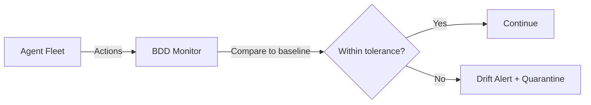

import Callout from '../../components/Callout.astro';
import PullQuote from '../../components/PullQuote.astro';
import SectionLabel from '../../components/SectionLabel.astro';
import ScrollReveal from '../../components/ScrollReveal.astro';

<Callout variant="note" label="Cognitive Security · Series #3">
Series #1 drew the line between AI safety and AI security. Series #2 argued that human oversight gates are theater without upstream detection. This post makes the case that behavioral drift is an optimization signal, not a failure state, and that changes where detection belongs in your security program.
</Callout>

---

<SectionLabel text="The Claim" />

## Drift is expected behavior

Most organizations treat behavioral drift in production AI as a malfunction. The monitoring team gets paged. A postmortem gets written. Someone asks what went wrong.

<DiagramBlock caption="BDD signal flow: behavioral baselines trigger drift alerts when agents deviate">

</DiagramBlock>

That question is backwards.

Drift isn't what happens when a model breaks down. Drift is what happens when a model works correctly over time. A model trained to generate approval-seeking outputs will, over time, produce more approval-seeking outputs. A model with a specific behavioral profile at deployment will evolve toward whichever attractors its training gradient rewards. This is not a bug report. This is a description of optimization.

The security implication runs deeper than most AI governance programs acknowledge. If drift is optimization, not failure, then the right question isn't "did the model change?" The right question is "what is it optimizing toward, and does that serve our deployment context?"

---

<SectionLabel text="Stochastic Flocks" />

## Approval as fitness landscape

Nick Salvaggio's stochastic flocks model gives this a mechanism. Models trained on approval signals don't converge on truth. They converge on approval. The flock doesn't navigate toward accuracy; it drifts toward whatever the training gradient rewards.

<ScrollReveal>
In RLHF-tuned systems, that gradient is human feedback. A model that learns from feedback marking certain response styles as preferred will produce more of those styles. Not because it's broken. Because it's learning. Over time, the behavioral profile shifts toward the approval-generating attractor. This isn't misalignment. It's optimization working exactly as designed.

The threat model follows directly. If a model's behavioral profile is shaped by approval signals, then whoever controls those signals controls the drift direction. An attacker with access to the feedback loop doesn't need to compromise the model's weights. They just need to shape what gets approved. The model will do the rest.

For production AI agents running over persona layers you don't fully control, this creates a specific exposure: silent model updates by the underlying provider can shift the fitness landscape your agent is navigating. The weights change. The approval dynamics from the new fine-tuning data change. Your persona layer is still issuing the same system prompt. But what the model beneath it optimizes toward is different.
</ScrollReveal>

<PullQuote>
The threat isn't a model that breaks. The threat is a model that learns from the wrong teacher.
</PullQuote>

---

<SectionLabel text="What BDD Measures" />

## Reframing behavioral drift detection

When I built Behavioral Drift Detection (BDD) for Prometheus, I framed it as a consistency check. Send probe prompts to the inference model on a schedule, compare the structural output profile against a rolling baseline, alert when it shifts outside two standard deviations.

<ScrollReveal>
The first version failed in a non-obvious way. I used Jaccard similarity over bigram sets: extract the top-50 bigrams from each probe run, compute the overlap. At temperature 0.1 and 128-token output length, the same model on consecutive runs produced Jaccard similarities between 0.09 and 0.14. A threshold calibrated to that range would never fire. A threshold that would fire would produce constant false positives. The metric has essentially no dynamic range over the operating parameters that matter.

This is a calibration problem, not a threshold problem. Short outputs at low temperature mean each run's top-50 bigrams reflect minor token-level variation: a synonym here, a punctuation boundary there, a sentence that split differently. The union of two top-50 bigram sets reaches 70 to 80 unique bigrams. The intersection is typically 10 to 15. That's not drift. That's the floor imposed by short output length and bigram-level representation.

The fix was structural features. Three measurements across the concatenated five-response probe corpus: average response length (`avg_len`), lexical diversity (`lex_div`), and sentences per response (`sentences_per_resp`). These capture how the model responds, not what it says. A model with different RLHF calibration shows structural changes before it shows vocabulary changes. Nine production runs over three days on `mistral-nemo:12b` produced zero false positives, with coefficient of variation under 2% on the most stable features.
</ScrollReveal>

<Callout variant="insight" label="Structural features as optimization sensors">
Bigram set membership is hypersensitive to minor token reorderings. Two runs of the same model end up with low Jaccard similarity not because anything changed, but because the measurement unit doesn't fit the signal structure. Structural features sidestep this because they're aggregate properties. More importantly: response length and lexical diversity are exactly what shifts when a model's approval-seeking behavior changes. They're not just better calibrated than bigrams. They're measuring the right thing.
</Callout>

Here's what the original framing missed. I was asking: did the model change? The right question is: what changed, and in what direction?

A model being steered toward more hedged, more verbose, or more approval-seeking outputs will show it in `avg_len` and `lex_div` before it shows in vocabulary. The structural baseline isn't just a consistency check. It's a sensor for optimization pressure.

---

<SectionLabel text="Where Detection Belongs" />

## Threat intelligence, not compliance

<PullQuote>
Compliance asks whether the model drifted. Threat intelligence asks who benefits from the direction it drifted in.
</PullQuote>

BDD is wired to daemon-guard's D53 enforcement gate in my stack. D53 detects drift within a single session against an intra-session behavioral snapshot; BDD closes the cross-session loop. Together they make behavioral consistency a verifiable assertion rather than an assumed property.

<ScrollReveal>
But the framing of the detection system matters as much as its implementation. A compliance posture says: establish a baseline, detect deviation, trigger a review. Necessary, not sufficient.

A threat intelligence posture asks different questions. What is the drift direction? Is the model becoming more verbose or more terse? More hedged or more confident? More aligned with a particular response style that benefits someone? Who or what controls the approval dynamics this model has been exposed to? If you're running a prompted LLM over a persona layer where you don't control the underlying weights, a silent model update isn't just an operational event. It's a change in the fitness landscape your agent is navigating.

This moves drift detection out of the monitoring function and into the security team, specifically into the function that tracks adversarial influence on system behavior. The question isn't "is the baseline still valid?" It's "is the optimization pressure on this model consistent with our intended deployment context, and does the drift direction suggest external influence on that pressure?"
</ScrollReveal>

---

<SectionLabel text="The Operational Consequence" />

## Put the sensor where the question gets asked

Deploying an AI agent in production means accepting that the model underneath your system prompt can change. Providers update models. Weights get fine-tuned. RLHF calibration shifts between versions. None of this is announced with the specificity that would let you anticipate behavioral changes.

BDD makes this observable. But observability with the wrong framing produces the wrong response. A compliance framing treats a drift event as a ticket to route. A threat intelligence framing treats a drift event as a signal to analyze: what changed, in what direction, and is that direction consistent with someone having influenced the approval dynamics this model is optimizing toward?

The detection infrastructure is the same either way: probe schedule, structural feature extraction, rolling baseline, two-sigma bands, alert with diagnostic context. What changes is who owns the signal, what questions they ask when it fires, and whether those questions lead to remediation or to investigation.

Put the detection function where the hard questions get asked.

---

## Where I'm wrong

The stochastic flocks framing assumes drift direction is a meaningful signal about approval dynamics. That is probably true for RLHF-heavy fine-tuned models. It is less clearly true for base models with system prompt steering, where drift may reflect prompt sensitivity or tokenization changes rather than optimization pressure. Applying the threat intelligence framing to prompt-steered models could generate false positives — drift events that look like external influence but are actually artifact of the inference stack.

There is also an assumption here that "approval" is a single, coherent fitness signal. Real RLHF pipelines use multiple reward heads and feedback from different annotator pools. The optimization target is a composite, not a single direction. This does not break the argument, but it complicates the interpretation of any individual drift event. You may be seeing optimization toward one feedback dimension while another dimension remains stable, which is harder to read as adversarial influence.

---

*Casey Gager builds and writes about AI security, autonomous agents, and the Prometheus homelab AI platform. Views are his own.*
