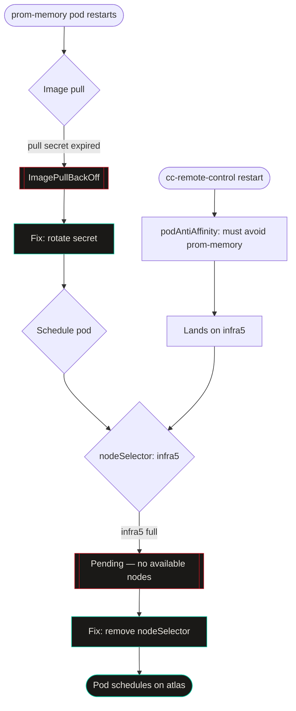

import Callout from '../../components/Callout.astro';
import StatRow from '../../components/StatRow.astro';
import PullQuote from '../../components/PullQuote.astro';
import SectionLabel from '../../components/SectionLabel.astro';
import ScrollReveal from '../../components/ScrollReveal.astro';
import DiagramBlock from '../../components/DiagramBlock.astro';

The prom-memory pod went into Pending on a Thursday morning and I found my first explanation in about three minutes. Expired pull secret. The GitHub App installation token had rotated, the Kubernetes secret had not been updated, and the GHCR registry was returning 401 on every image pull. Clear and fixable.

I fixed it. The pod stayed in Pending.

That is the part nobody tells you about multi-cause failures. The first root cause is real. You fix it. Nothing gets better. And then you are standing in front of a still-broken system with a working theory that just stopped working, wondering what you missed.

---

<SectionLabel text="The Incident" />

## What broke

prom-memory is the episodic memory layer for my agent fleet. When it goes down, agents lose their ability to recall context from previous sessions. It is a P1 service.

On 2026-09-03, the pod entered Pending and did not recover. Three things were true simultaneously:

1. The GHCR pull secret had expired — the GitHub App installation token backing it had rotated, the K8s secret had not been updated. Image pull was failing.
2. The prom-memory deployment had a hard `nodeSelector: infra5` plus a `requiredDuringScheduling` nodeAffinity expression pinning it to `infra5`. The pod could not schedule anywhere else.
3. The cc-remote-control pods — which run a `requiredDuringScheduling` podAntiAffinity against `app=prom-memory` — had filled infra5 after their own restart cycle. They needed to be away from prom-memory, so they landed on infra5, the only node prom-memory was allowed to use.

Cause 1 was why the pod was restarting. Causes 2 and 3 were why it could not come back when the restart was forced.

<ScrollReveal>
<DiagramBlock caption="Three independent constraints that only deadlock together">

</DiagramBlock>
</ScrollReveal>

---

<SectionLabel text="Why Diagnosis Goes In Circles" />

## The first answer always feels complete

When you find a root cause, your brain closes the loop. *Pull secret expired → ImagePullBackOff → fix the secret → pod comes back.* That is a coherent story. It has a cause and a resolution. The instinct is to ship the fix and move on.

The problem is that multi-cause failures have multiple coherent stories. Each root cause, examined in isolation, fully explains the symptoms at that moment. The expired pull secret fully explains why the pod was failing. You fix it. Now the pod is failing for a different reason. The new reason also fully explains the current symptoms. You have not gone in circles — you have made real progress twice — but you have not finished.

<ScrollReveal>
<PullQuote>
The first root cause you find is real. Fixing it is not enough to prove it was the only one.
</PullQuote>
</ScrollReveal>

The trap is treating each fix as a complete resolution rather than a test. Fix the pull secret: the pod should restart and come up. If it doesn't, the fix was necessary but not sufficient. Something else is still wrong. Keep going.

---

<SectionLabel text="Cause 1: The Expired Secret" />

## Pull secret rotation nobody tracked

The prom-memory image lives in GHCR under the `daemonprompt` org. The cluster pulls it via a K8s secret in the `prometheus` namespace. That secret holds credentials tied to a GitHub App installation token.

GitHub App installation tokens expire. When the App gets reinstalled or re-authorized, the old token stops working. The K8s secret does not know this happened. It holds the old credentials and hands them to the kubelet on every pull attempt. The registry says 401. The kubelet says `ImagePullBackOff`. The pod goes into a restart loop.

<Callout variant="warning">
GitHub App installation tokens are not credentials you rotate on a schedule. They rotate when the App is reinstalled, re-authorized, or when the org changes settings. If your pull secret is backed by one, you will not know it expired until something tries to pull an image.
</Callout>

The fix was straightforward: patch the secret with a PAT (`prometheus-ghcr-pull`, `read:packages` scope) instead of the App token. More stable, explicit rotation schedule. Done in ten minutes.

Pod still in Pending.

---

<SectionLabel text="Cause 2: The Pinned Node" />

## NodeSelector as a fossil

The prom-memory deployment had this in it:

```yaml
nodeSelector:
  kubernetes.io/hostname: infra5
affinity:
  nodeAffinity:
    requiredDuringSchedulingIgnoredDuringExecution:
      nodeSelectorTerms:
      - matchExpressions:
        - key: kubernetes.io/hostname
          operator: In
          values: ["infra5"]
```

Both a `nodeSelector` and a `requiredDuringScheduling` nodeAffinity pinning to the same node. Belt and suspenders. Belt and suspenders on a pod that needs to be able to move.

This was from an earlier period when prom-memory used `local-path` storage and the pod had to stay on the node where its data lived. Longhorn replaced local-path. The volume is now network-attached and follows the pod. The hard pin became a fossil — it no longer served any function, but it remained in the manifest, quietly constraining scheduling without anyone noticing because infra5 was almost always available.

"Almost always" is not a scheduling policy.

---

<SectionLabel text="Cause 3: The Crowded Node" />

## Anti-affinity doing exactly what it was designed to do

cc-remote-control runs a `requiredDuringScheduling` podAntiAffinity against `app=prom-memory`. The design intent: keep the remote-control pods away from the memory layer so a cc-remote-control restart does not take out prom-memory. Good instinct.

The effect, when cc-remote-control's own pods restarted: the scheduler looked for nodes without a prom-memory pod. prom-memory was on infra5, so the scheduler sent everything else to infra5. Not just cc-remote-control — all the other pods with soft or hard preferences for any node other than where prom-memory was sitting ended up on infra5 through secondary effects.

When prom-memory then tried to restart (after the pull secret fix), it needed infra5 because of its nodeSelector. infra5 had no room. The pod went to Pending and stayed there.

<ScrollReveal>
<StatRow stats={[
  { value: "3", label: "Root causes, each benign alone" },
  { value: "0", label: "Alerts fired during the deadlock" },
  { value: "1", label: "kubectl describe command that surfaces all three at once" }
]} />
</ScrollReveal>

---

<SectionLabel text="The Diagnostic Path" />

## Elimination, not confirmation

The sequence that got me out:

**Step 1: Read the pod events.** `kubectl describe pod` surfaces the actual failure reason. ImagePullBackOff with a 401 is unambiguous. Fix the secret.

**Step 2: Force a restart and watch.** After fixing the pull secret, delete the pod and watch what happens. The pod should schedule and pull. If it goes to Pending instead of ContainerCreating, the pull fix worked but something else is preventing scheduling.

**Step 3: Read the scheduler events.** The `Events` section of `kubectl describe pod` for a Pending pod tells you why the scheduler is not placing it. "0/3 nodes are available: 1 Insufficient cpu, 2 node(s) didn't match Pod's node affinity/selector." That second phrase is the nodeSelector and affinity blocking placement on the only two remaining nodes.

**Step 4: Check resource pressure on the pinned node.** `kubectl describe node infra5` — look at Allocated resources, Non-terminated Pods. If the node is full, the pod cannot schedule even if the selector is satisfied.

**Step 5: Eliminate the constraint.** Remove the nodeSelector and affinity. The pod now has three nodes to choose from. It picks atlas. It comes up.

<Callout variant="info">
The right diagnostic posture is elimination, not confirmation. You are not trying to prove your current theory. You are trying to rule out everything else. Each fix should expand what the scheduler can do, not just address the symptom you see right now.
</Callout>

---

<SectionLabel text="The Combination" />

## Why each piece was fine alone

This is the part worth sitting with. None of these three things were individually broken:

- An expired pull secret is a standard credential hygiene problem. It happens. Clusters deal with it every day by updating the secret and moving on.
- A hard nodeSelector is unusual but not wrong. If a pod genuinely needs to run on a specific node, you pin it. The pin on prom-memory was a fossil, but it would not have caused a problem as long as infra5 had capacity.
- A podAntiAffinity rule that keeps unrelated services off the memory layer is exactly the right way to build resilient scheduling. It was working correctly.

The failure required all three. The expired pull secret triggered a restart. The restart exposed the nodeSelector fossil. The anti-affinity rule had packed infra5 during cc-remote-control's own restart cycle. Any two of the three would have been recoverable. All three together produced a state the scheduler could not resolve without operator intervention.

<ScrollReveal>
<PullQuote>
Infrastructure that runs fine for weeks teaches you nothing about what happens when two things go wrong simultaneously.
</PullQuote>
</ScrollReveal>

---

<SectionLabel text="Counterarguments" />

## The obvious objections

**"Remove the hard nodeSelector as soon as you migrated off local-path."** Correct. The nodeSelector should have been removed the day Longhorn went in. It wasn't, because prom-memory kept working and nobody checked. The lesson is: when you change a dependency (local-path → Longhorn), audit everything that was configured to work around the old dependency's constraints.

**"Monitor nodeSelector / affinity compatibility proactively."** There is no built-in K8s alarm for "this pod's scheduling constraints are compatible with cluster capacity right now but might not be if X happens." It is possible to write one. I did not have it. The failure is the reminder.

**"The anti-affinity design is wrong."** No. Keeping unrelated workloads away from your memory layer is correct. What was wrong was having the memory layer pinned to exactly one node while other workloads were configured to avoid it. The two constraints interacted badly. The fix was to make prom-memory portable, not to remove the anti-affinity.

---

<SectionLabel text="What Changed" />

## The fix and what it cost

The direct fix: removed `nodeSelector` and the `requiredDuringScheduling` nodeAffinity In:infra5 expression from the prom-memory deployment. Committed to prometheus-gitops main (c4fd736). ArgoCD synced it. Pod moved to atlas. Service restored.

Cost: about ninety minutes of wall clock time between first alert and service restored. Most of that was the elapsed time between fixing the pull secret and noticing the pod was still Pending, then reading the scheduler events carefully enough to see the second problem.

What I watch now: `kubectl get pvc -A` after any storage migration to catch lingering node-pinned volumes. `kubectl describe pod` events for Pending pods before assuming the most recent fix will resolve it. The combination of nodeSelector with network-attached storage in the same deployment is now a pattern I look for during review.

The pull secret rotation moved from "update when it breaks" to "automated refresh on a schedule." That one was overdue regardless.

*Casey Gager builds a personal AI orchestration system. He writes about what works, what breaks, and what he is still figuring out. Views are his own.*

## See also

- [My agent couldn't read its own name for months](/build-logs/agent-couldnt-read-its-own-name) — another failure that hid because health checks only measure whether the system is running, not whether it is doing the right thing.
- [My AI system builds itself, that's the point](/build-logs/ai-system-builds-itself) — the context for why prom-memory going down is a P1 event, not just a service blip.
