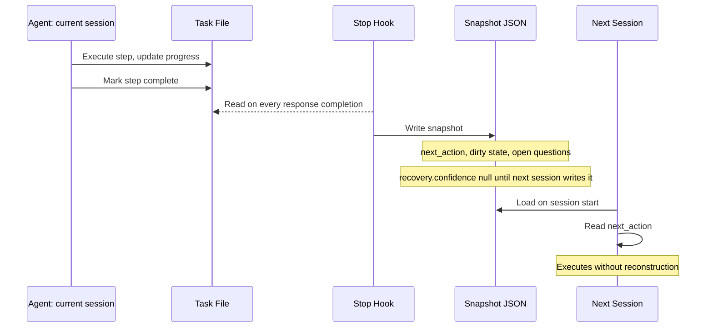

import Callout from '../../components/Callout.astro';
import StatRow from '../../components/StatRow.astro';
import PullQuote from '../../components/PullQuote.astro';
import SectionLabel from '../../components/SectionLabel.astro';
import ScrollReveal from '../../components/ScrollReveal.astro';
import DiagramBlock from '../../components/DiagramBlock.astro';

Here is a mistake I made in the first version of this system. I had my agent assess its own recovery confidence. At the end of every session, it would score itself: how likely is the next session to successfully resume? A number, 0.0 to 1.0, written into the handoff record.

This is completely backwards.

---

<SectionLabel text="The Wrong Design" />

## Why self-scored confidence fails

The writing session has no idea whether it left useful notes. It thinks it did. It always thinks it did. The session that finds out whether any of that was true is the one that reads the handoff and tries to pick up the task. Only that session can say: "yes, this was enough to resume cleanly" or "I had no idea where I was."

So `recovery.confidence` is written by the reader, not the writer. After successful resumption, the new session writes back what actually worked. That feedback flows into a corpus. Over enough iterations, you can see which session endings produce high-confidence resumptions and which produce archaeology.

<ScrollReveal>
<PullQuote>
The writing session cannot assess its own recovery value. The reading session can. Design the feedback loop accordingly.
</PullQuote>
</ScrollReveal>

I got there eventually. The story of how starts with what a broken handoff looks like.

---

<SectionLabel text="The Crash Test" />

## What a bad handoff produces

Agent session closes mid-task. Power loss, context limit, doesn't matter. The next session loads. There is a handoff file. It says:

```
branch: main
last-commit: abc1234 chore: pre-compact checkpoint
active threads: Agent Fleet, Content Pipeline, task-in-progress
```

I know the branch. I have git log. The active threads are titles with no state. I have no idea where in the task we were, what the next step is, what has already been tried, or what is half-done sitting in a dirty working directory.

The agent knows exactly as much as I do: nothing useful. We spend 15 minutes reconstructing state from git diffs and file reads before we can do any actual work.

That is not a session handoff system. It is a change log with a bow on it.

<Callout variant="warning" label="The tell">
If the first thing the new session does is read git log and grep through files to figure out where it is, the handoff failed. Good handoffs eliminate that reconstruction step entirely.
</Callout>

---

<SectionLabel text="What Recovery Needs" />

## The minimum viable handoff

I started from first principles: what does a new agent instance actually need to resume work without my help? Not what would be nice to have. What is the minimum.

Five things:

**1. Where in the task it is.** Not "working on X." Which step. Step 3 of 7. Step 3 is "write the stop hook." Steps 1 and 2 are done. Step 3 is 60% complete. The exact file being edited at line 42.

**2. What was tried and did not work.** The agent already attempted approach A. It failed for a specific reason. Do not try approach A again. This is what prevents circular debugging loops.

**3. What state is dirty.** Which files are modified but not committed. Whether there is a half-applied patch. Whether a deployment is mid-rollout.

**4. The next action.** One sentence. Not a summary of the task. The next concrete step the new instance should take without further investigation.

**5. What is still unknown.** Open questions the old session could not resolve. Dependencies that were not confirmed.

Everything else is noise.

---

<SectionLabel text="The Architecture" />

## Two parts that work together

The system I built has two parts.

**A live task file** lives at the root of the working context. The agents update it after every step during execution phases. It reads like a build log:

```markdown
## Agent Handoff System Implementation
Agent: fleet-agent-2 | Started: 2026-08-31T09:14:00

### Steps
[x] Step 1: Create hooks directory -- done 09:14
[x] Step 2: Write handoff JSON schema -- done 09:31
[ ] Step 3: Write stop hook (IN PROGRESS -- 60%)
    Working file: hooks/stop.sh
    Approach: read task file, snapshot to JSON, write async
    Blocker: none
[ ] Step 4: Wire hook in settings
[ ] Step 5: Test with simulated crash

### Decisions
09:22 -- chose file-write-first pattern (not HTTP-first) to handle memory layer downtime
```

I chose file-first specifically because I wanted recovery to work even when the external memory layer is down. HTTP writes can fail silently. The file survives anything short of disk corruption.

**The stop hook** fires on every response completion. It reads the task file and snaps the current state to a structured JSON file:

```json
{
  "id": "2026-08-31T09:41:22-handoff",
  "task": "Agent Handoff System",
  "execution": {
    "steps_planned": 5,
    "steps_completed": 2,
    "interruption": null
  },
  "recovery": {
    "next_action": "Resume stop hook at line 42 -- write the git diff capture block",
    "uncommitted_state": ["hooks/stop.sh (partial)"],
    "confidence": null
  },
  "open_questions": []
}
```

`recovery.confidence` is null. That field gets written by the next session, after it successfully resumes. The writing session cannot assess its own recovery value.

<ScrollReveal>
<DiagramBlock caption="Handoff flow: task file updated continuously, stop hook snapshots on every response">

</DiagramBlock>
</ScrollReveal>

Put the two handoffs side by side:

| Bad handoff | Good handoff |
|---|---|
| `last-commit: abc1234 chore: pre-compact` | `next_action: "Resume stop hook at line 42"` |
| `active threads: Agent Fleet, Content Pipeline` | `uncommitted_state: ["hooks/stop.sh (partial)"]` |
| Agent spends 15 minutes reconstructing state | Agent reads one file, starts one step |

The bad handoff was written for me. I can read commit history. I can check the notes. The good handoff is written for an agent that has never seen this task before.

---

<SectionLabel text="The Corpus" />

## What the data is for

The handoff system produces a corpus. Every completed task generates a record: steps planned vs. completed, approach retries, specification gaps (things the agent had to discover on its own that were not in the spec), decisions the agent made without guidance, and whether the session ended cleanly or mid-step.

Over time that corpus answers questions I cannot see from individual sessions:

- Which specification sections are chronically underspecified
- Which task types have the highest mid-session abandonment rates
- Whether specification quality improvements actually change completion rates
- How model changes affect execution: same spec, same task type, different model, different outcomes

<ScrollReveal>
<StatRow stats={[
  { value: "5 fields", label: "Minimum for clean crash recovery" },
  { value: "15 min", label: "State reconstruction with a bad handoff" },
  { value: "0", label: "Reconstruction steps with a good handoff" }
]} />
</ScrollReveal>

This is what I could not build when the handoff was a text blob. You cannot run queries on text blobs.

Three more work items extend this loop: an autonomous diagnostic agent that reads the corpus nightly and proposes fixes via the work tracking system before failure patterns become incidents; a fix-forward pipeline that fires when any bug task closes and automatically generates a memory sticky note, a runbook update, and a behavioral test probe; and a monthly specification improvement scan that groups gap patterns by task type and proposes template additions with evidence counts. Human gate before any template change.

The design goal is a system that learns from its own execution history. I have been doing the manual version of this for months. The corpus scales. Manual pattern-matching does not.

<Callout variant="insight">
The handoff system is not just crash recovery. It is the instrumentation layer for a system that improves its own specifications based on execution data. Every handoff record is a data point. The corpus is the model.
</Callout>

---

<SectionLabel text="The Actual Point" />

## A briefing, not a record

If your AI agent's session handoff reads like a changelog, it is not a handoff system. It is a note to yourself that the agent cannot use.

The framing shift that made everything click: a handoff is not a record of what happened. It is a briefing for the next session. It is written for another agent that has never seen this task before.

Write to the next session. Include exactly what it needs. Drop everything else.

The reading session will tell you whether you got it right. Put the feedback mechanism in place and let it tell you.

*Casey Gager builds a personal AI orchestration system. He writes about what works, what breaks, and what he is still figuring out. Views are his own.*

## See also

- [prom-memory: building episodic memory for an AI system that actually remembers](/build-logs/prom-memory): the memory layer session handoffs are built on. Recovery needs more than a log entry; it needs structured, retrievable episodic memory.
- [ISA-driven development: structured contracts for autonomous AI agents](/build-logs/isa-patterns): ISAs and session handoffs share a design principle: the document is a specification the next agent reads cold. Same precision requirements.
- [My agent couldn't read its own name for months](/build-logs/agent-couldnt-read-its-own-name): what breaks when identity injection fails at session start. The handoff architecture is only as good as what it recovers into.
- [Strip your agent to voice and guitar](/analysis/strip-agent-voice-guitar): the handoff document is voice and guitar: every load-bearing element, nothing else.
- [Middle-Out: temporal compression for AI episodic memory systems](/research/middle-out-compression): compression determines what survives into the next session. The handoff and the compression algorithm solve the same problem from different angles.
