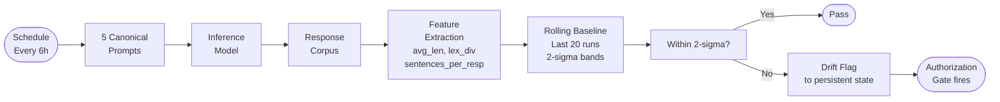

import Callout from '../../components/Callout.astro';
import StatRow from '../../components/StatRow.astro';
import PullQuote from '../../components/PullQuote.astro';
import SectionLabel from '../../components/SectionLabel.astro';
import ScrollReveal from '../../components/ScrollReveal.astro';
import DiagramBlock from '../../components/DiagramBlock.astro';

<SectionLabel text="The Gap" />

Last July, I upgraded the Prometheus cluster and mistral-nemo:12b got pulled to a new version during the process. The persona layer kept running. The system prompt didn't change. Prompts went in, responses came out, latency looked normal. Nothing in my observability stack flagged anything.

I found out two days later, manually, by noticing the responses felt different. "Felt different" is not a monitoring strategy.

The gap is structural: standard ML observability monitors latency, error rates, token usage, cost. None of those tell you whether the model underneath your persona layer is still behaving the same way it was when you set your baseline. If you run an AI agent with a defined persona and the inference model gets updated silently, by a package manager, by a hosting provider, by your own cluster upgrade, your users experience drift without explanation. Any governance controls you've built that depend on behavioral assertions about that agent are now operating on a stale baseline.

Most monitoring infrastructure assumes you own the model. When you don't, the assumption fails silently.

---

<SectionLabel text="MacReady's Blood Test" />

In *The Thing* (1982), John Carpenter's crew in Antarctica can't tell which of them has been replaced. The creature mimics its host perfectly: same face, same mannerisms, same voice. You cannot tell by looking. You cannot tell by talking to it. You need an independent structural test that doesn't ask the thing whether it's changed.

MacReady's blood test works because it operates on the underlying biology, not the surface behavior. The imitation is perfect. The biology isn't.

The Elliot probe is a blood test for inference models. Named for the man who has to audit the gaps in what his parallel process did without his knowledge, because the probe doesn't ask the model if it's changed. It measures structural outputs and decides for itself.

---

<SectionLabel text="First Attempt: Bigrams" />

I started with Jaccard similarity over bigram sets. For each probe run, send five canonical prompts to the inference model, collect the responses, extract the top 50 bigrams by frequency, store that set as the behavioral fingerprint. On the next run, compare fingerprints. If similarity dropped below 0.72, alert as a drift event.

The rationale was reasonable. Bigram overlap captures vocabulary and phrasing patterns characteristic of a model's output distribution. Cheap, no semantic model required.

I ran it. Same model, same prompts, consecutive intervals. Got back 0.09. Then 0.11. Then 0.14. Tried adjusting the threshold. Any threshold sensitive enough to catch a model swap would fire constantly on normal run variation. Any threshold stable enough to stop the false positives would never fire on an actual swap. I spent two hours looking for bugs. There were no bugs. The floor was real.

---

<SectionLabel text="The Natural Floor" />

The failure has a specific cause. Inference parameters: `temperature: 0.1`, `num_predict: 128`.

At temperature 0.1, the model is near-deterministic. That sounds like it should make Jaccard similarity high across runs. The opposite happens. With `num_predict=128`, each response is approximately 128 tokens. Across five prompts, the total corpus is roughly 640 tokens. After extracting the top 50 bigrams, you're working with a small set.

When you compare two runs, minor token-level variation, punctuation differences, synonym selection, sentence boundary shifts, causes bigram set membership to diverge significantly. The union of two top-50 bigram sets reaches 70-80 unique bigrams. Intersection is typically 10-15.

So: 12 / 75 = 0.16. That's not drift. That's the floor.

<PullQuote text="At low temperature and short output lengths, the model is nearly deterministic at the token level but highly variable at the bigram-set level. The measurement unit doesn't fit the signal structure." />

This is a calibration problem, not a threshold problem. You cannot tune your way out of it. Any system using n-gram similarity to monitor LLM behavioral consistency at low temperature and short output lengths will hit this floor. I'm telling you because I spent the two hours so you don't have to.

---

<SectionLabel text="What Actually Works" />

I threw out the bigrams. The problem wasn't the threshold. I couldn't set a meaningful threshold because the metric had no dynamic range. The underlying issue: at low temperature, the content across runs is nearly identical at the token level, but which specific tokens land in the top-50 bigram set by frequency shifts enough that the sets barely overlap. The model isn't changing what it says. Bigram set membership is just unstable at this corpus size. That's noise. I was measuring noise.

The replacement doesn't measure what the model says. It measures how the model says it.

At a given temperature and output length, structural output characteristics, response length, vocabulary richness, sentence density, are more stable within a model than bigram vocabulary. When a model drifts, structural properties shift before bigram patterns do. MacReady's blood test, not a Turing test.

Three features extracted from the concatenated five-response corpus:

| Feature | Definition | What it catches |
|---|---|---|
| `avg_len` | Mean character count per response | Verbosity shifts |
| `lex_div` | Unique words / total words | Vocabulary richness, formality level |
| `sentences_per_resp` | Sentence-ending punctuation / response count | Response structure |

Three, not more. Nine runs and three features gives 27 data points at baseline, enough to set two-sigma bands without outliers dominating. I wanted a signal, not a statistics requirement.

---

<SectionLabel text="How It Runs" />

The probe maintains a rolling history of the last 20 runs. New runs append; old runs fall off. No comparison fires until at least five runs have accumulated, warming-up mode before that. The minimum window gate prevents two-standard-deviation bands from being set by too few data points.

Detection runs per-feature. For each feature, compute the rolling mean and standard deviation over the history window. Any single feature outside its two-sigma band triggers an alert, with which feature drifted, current value versus rolling mean, direction, and recommended action. Not just a binary alarm.

<DiagramBlock caption="Elliot probe detection loop: scheduled probe fires, extracts structural features, compares against rolling baseline">

</DiagramBlock>

---

<SectionLabel text="Nine Runs" />

Deployment: 2026-07-15. Model: `mistral-nemo:12b` via Ollama on the Jetson AGX Orin. Schedule: every six hours.

| Feature | Mean | Std Dev | 2-Sigma Band |
|---|---|---|---|
| `avg_len` (chars) | 577.3 | 11.5 | [554.4, 600.3] |
| `lex_div` | 0.642 | 0.011 | [0.621, 0.664] |
| `sentences_per_resp` | 6.07 | 0.57 | [4.92, 7.21] |

<ScrollReveal>
<StatRow stats={[
  { value: "0", label: "False positives across 9 runs" },
  { value: "2%", label: "avg_len coefficient of variation" },
  { value: "1.7%", label: "lex_div coefficient of variation" }
]} />
</ScrollReveal>

`avg_len` shows the most absolute variance but the narrowest relative band: 2% coefficient of variation. `lex_div` is the most stable at 1.7% CV. `sentences_per_resp` is the most variable (9.4% CV), consistent with sentence boundary detection being sensitive to minor token variation.

Two of eight scheduled runs failed, Ollama inference timeouts during high-load periods on the Orin. The Orin was doing something. I don't know what. The probe logged the failure cleanly and the next run restarted without incident.

---

<SectionLabel text="Enforcement" />

The probe connects to the DIRA governance layer via Gate D53, labeled CONTEXT\_DRIFT. D53 fires when behavioral drift is detected post-snapshot-lock.

Two detection mechanisms, different scopes:

- **D53, in-session:** Detects drift within a single session against an intra-session behavioral snapshot
- **Elliot probe, cross-session:** Detects drift in the inference model itself across sessions against a rolling multi-day structural baseline

D53 tells you something changed this session. The Elliot probe tells you whether the inference model itself changed between sessions. Together they close a loop that in-session monitoring alone cannot close. The persona-consistency claim becomes verifiable rather than assumed.

<Callout type="note">D53 enforcement is active. Five-run minimum window is met. Probe has run clean across all valid intervals since deployment. A model update triggers the gate; it does not bypass it.</Callout>

---

<SectionLabel text="Where I'm Wrong" />

**The rolling baseline absorbs real drift.** Yes, intentionally, but this is a genuine trade-off. If a model degrades gradually across weeks, the rolling window will incorporate that degradation as the new normal and never fire. The 20-run window is calibrated for detecting abrupt swaps, not slow model rot. An absolute baseline that never updates would close this gap. I don't have one yet.

**Three features miss too much.** `avg_len`, `lex_div`, and `sentences_per_resp` don't capture semantic drift, reasoning quality shifts, or instruction-following degradation. A model update that changes what the model says without changing how it structures responses would pass the probe undetected. Structural features are a proxy. For governance claims that extend beyond structural consistency, additional detectors are needed.

**Semantic similarity would work better with more tokens.** Probably true. The natural floor problem is specific to short output lengths. At 2,000+ tokens per response, bigram sets are large enough for Jaccard to have real dynamic range. The structural approach is an adaptation to constrained inference, not a claim that semantic methods are wrong.

**Nine runs is not a validated baseline.** It is not. The two-sigma bands will shift materially as the history window fills to 20. Zero false positives is encouraging, but it reflects nine runs of one model on one inference platform. Calibrate your own feature selection and window size before treating these numbers as transferable.
