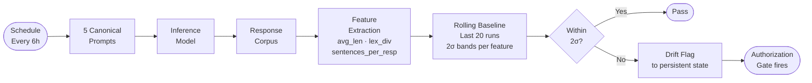

import Callout from '../../components/Callout.astro';
import StatRow from '../../components/StatRow.astro';
import PullQuote from '../../components/PullQuote.astro';
import SectionLabel from '../../components/SectionLabel.astro';
import ScrollReveal from '../../components/ScrollReveal.astro';
import DiagramBlock from '../../components/DiagramBlock.astro';

Production AI systems that maintain persistent personas have a monitoring gap that standard ML observability doesn't address. You can monitor latency, error rates, token usage, and cost. What you cannot easily monitor is whether the model underneath your persona layer is still behaving the same way it was when you set your baseline.

This matters more than it sounds. If you run an AI agent with a defined voice, domain scope, and behavior profile, and the inference model gets updated silently underneath your system prompt, your users experience drift without explanation. More concretely, any governance controls you've built that depend on behavioral assertions about that agent are now operating on a stale baseline. They're claiming something about the model that may no longer be true.

Behavioral Drift Detection (BDD) is the tripwire I built for this in Prometheus, my homelab AI agent stack. This post documents what I tried first, why it failed in a non-obvious way, what replaced it, and what the first nine production runs show.

---

<SectionLabel text="First Attempt" />

## What we tried first: Jaccard bigrams

The original approach was Jaccard similarity over bigram sets. For each probe run, send five canonical prompts to the inference model, collect the responses, extract the top 50 bigrams by frequency, and store that set as the behavioral fingerprint. On the next run, compare fingerprints:

```
Jaccard(A, B) = |A ∩ B| / |A ∪ B|
```

If similarity dropped below a threshold (0.72 was the default), alert as a drift event.

The rationale was reasonable. Bigram overlap captures vocabulary and phrasing patterns characteristic of a model's output distribution. A model with different training data or RLHF tuning should produce different characteristic bigrams. Computationally cheap, no semantic model required.

In practice, it didn't work. Runs of the same model, same prompts, consecutive intervals, produced Jaccard similarities ranging from 0.09 to 0.14. A 0.72 threshold would never fire. A threshold calibrated to this range would produce constant false positives from run-to-run variation that carried no signal.

---

<SectionLabel text="What Went Wrong" />

## The natural floor problem

The failure had a specific cause. Inference parameters: `temperature: 0.1`, `num_predict: 128`.

At temperature 0.1, the model is near-deterministic. That sounds like it should make Jaccard similarity high across runs. The opposite happens, for a reason that only becomes obvious when you think through the math.

With `num_predict=128`, each response is approximately 128 tokens. Across five prompts, the total corpus is roughly 640 tokens. After extracting bigrams and taking the top 50 unique ones, you're working with a small set.

When you compare two runs, each run's top-50 bigrams reflect the same underlying model. But minor token-level variation, punctuation differences, synonym selection, sentence boundary shifts, causes bigram set membership to diverge significantly. The union of two top-50 bigram sets reaches 70-80 unique bigrams. Intersection is typically 10-15.

So: 12 / 75 = 0.16. That's not drift. That's the floor imposed by short output length and bigram-level representation.

<PullQuote>
At low temperature and short output lengths, the model is nearly deterministic at the token level but highly variable at the bigram-set level. Two runs of the same model end up with low Jaccard similarity not because anything changed, but because the measurement unit doesn't fit the signal structure.
</PullQuote>

This is a calibration problem, not a threshold problem. You cannot adjust your way out of it by tuning the threshold. The metric has essentially no dynamic range over the operating range that matters.

The implication extends beyond Prometheus: any system using n-gram similarity to monitor LLM behavioral consistency at low temperature and short output lengths will encounter this floor.

---

<SectionLabel text="The Replacement" />

## The fix: structural features

The replacement approach measures output structure rather than content.

At a given temperature and output length, a model's structural output characteristics, how it organizes responses, are more stable than its specific bigram vocabulary. A model that has drifted behaviorally will show changes in structural properties before it shows detectable change in bigram patterns.

Three features extracted from the concatenated five-response corpus:

| Feature | Definition | Sensitivity |
|---|---|---|
| `avg_len` | Mean character count per response | Response verbosity / model verbosity bias |
| `lex_div` | Unique words / total words | Vocabulary richness, formality level |
| `sentences_per_resp` | Total sentence-ending punctuation / response count | Response structure, answer granularity |

These features are domain-agnostic. They measure how the model responds, not what it says. A model with different RLHF calibration, or a different version of the same base model, will exhibit different structural signatures on familiar prompts even when the bigram vocabulary overlaps heavily.

Three features rather than more is a deliberate choice. Nine runs and three features gives 27 data points at first baseline. Adding more features increases statistical requirements without proportional benefit. The three chosen features capture orthogonal properties: verbosity, vocabulary richness, and structural complexity.

---

<SectionLabel text="Methodology" />

## Baseline methodology

The probe maintains a rolling history of the last 20 runs. New runs append; old runs fall off. This prevents the baseline from locking in on initial conditions and allows gradual, legitimate model evolution to be absorbed over time.

No comparison fires until at least five runs have accumulated. Before that point, the probe is in warming-up mode. The minimum window gate prevents two-standard-deviation bands from being set by too few data points, where outliers would dominate.

Detection works per-feature. For each feature, compute the rolling mean and standard deviation over the history window:

```
lo = mean - 2 * stddev
hi = mean + 2 * stddev
drift if not (lo <= current <= hi)
```

Any single feature outside its two-sigma band triggers an alert. The alert includes which feature drifted, current value versus rolling mean and standard deviation, direction, and a recommended action. Operators get diagnostic information, not just a binary alarm.

<DiagramBlock caption="BDD probe detection loop: scheduled probe fires, extracts structural features, compares against rolling baseline, routes to pass or drift event">

</DiagramBlock>

---

<SectionLabel text="Results" />

## Results

**Deployment:** 2026-07-15. **Model:** `mistral-nemo:12b` via Ollama on a Jetson AGX Orin. **Schedule:** Every six hours.

**Baseline statistics, 9 runs (2026-07-15 to 2026-07-18):**

| Feature | Mean | Std Dev | 2-Sigma Band |
|---|---|---|---|
| `avg_len` (chars) | 577.3 | 11.5 | [554.4, 600.3] |
| `lex_div` | 0.642 | 0.011 | [0.621, 0.664] |
| `sentences_per_resp` | 6.07 | 0.57 | [4.92, 7.21] |

<ScrollReveal>
<StatRow stats={[
  { value: "0", label: "False positives across 9 runs" },
  { value: "2%", label: "avg_len coefficient of variation" },
  { value: "1.7%", label: "lex_div coefficient of variation" }
]} />
</ScrollReveal>

`avg_len` shows the most absolute variance, ranging from 554 to 596 characters, but the narrowest relative band: 2% coefficient of variation. `lex_div` is the most stable at 1.7% CV. `sentences_per_resp` shows the most relative variability (9.4% CV), consistent with sentence boundary detection being sensitive to minor token variation.

Two of eight scheduled runs failed, due to Ollama inference timeouts during high-load periods on the node. That's an infrastructure issue unrelated to the measurement methodology. The probe logs the failure cleanly and the next run restarts without incident.

---

<SectionLabel text="Enforcement" />

## Enforcement connection

BDD connects to the DIRA (Dual-Intent Runtime Authorization) governance layer via Gate D53, labeled CONTEXT_DRIFT. D53 is an enforcement gate that fires when behavioral drift is detected post-snapshot-lock.

The two detection mechanisms address different scopes:

- **D53, in-session:** Detects drift within a single session, measured against an intra-session behavioral snapshot
- **BDD elliot probe, cross-session:** Detects drift in the inference model itself across sessions, measured against a rolling multi-day structural baseline

<Callout variant="insight" label="What this closes">
D53 can tell you that something changed this session. BDD can tell you whether the inference model itself has changed between sessions. Together they close a loop that in-session monitoring alone cannot close. The persona-consistency claim becomes verifiable rather than assumed.
</Callout>

D53 enforcement at the inference-model level is now active. The five-run minimum window is met, baseline statistics are published above, and the probe has run clean across all valid intervals since deployment. A model update triggers the gate; it does not bypass it.

---

<SectionLabel text="What's Next" />

## What's next

The D53 enforcement loop is active. The probe writes a machine-readable drift flag to persistent state on detection, alongside a channel alert. Downstream services read that flag rather than waiting for a human to respond to a notification. A silent model swap triggers an authorization gate, not just a notification.

Two infrastructure items remain. The history file currently lives on a hostPath volume pinned to a specific node, which is infra debt. The fix is migration to a distributed volume for history storage. Separately, the probe should log Ollama response latency alongside structural features. A model swap that causes slower inference could manifest as probe failures before structural features shift. Latency logged alongside structural data would catch that pattern earlier.

The canonical probes and baseline methodology will be published as a standalone reference. The approach generalizes. The specific features (`avg_len`, `lex_div`, `sentences_per_resp`) were validated on one model and one persona. Different deployments should validate their own feature selection against their operating parameters. The measurement methodology, rolling structural baseline with standard deviation bands and a minimum window gate, applies broadly to any prompted LLM where the operator does not control the underlying inference binary.

That's the gap this addresses: not general ML drift detection, but behavioral consistency verification for prompted LLMs where the model can be swapped underneath your persona layer without notice. Most monitoring infrastructure assumes you own the model. BDD is for when you don't.

---

<SectionLabel text="Where I'm Wrong" />

## Counterarguments

**The rolling baseline absorbs real drift.** Yes, intentionally, but this is a genuine trade-off. If a model degrades gradually across weeks, the rolling window will incorporate that degradation as the new normal and never fire. The 20-run window is calibrated for detecting abrupt swaps, not slow model rot. A secondary detector with a longer horizon, or an absolute baseline that never updates, would close this gap. I don't have one yet.

**Three features miss too much.** `avg_len`, `lex_div`, and `sentences_per_resp` are orthogonal and cheap, but they don't capture semantic drift, reasoning quality shifts, or instruction-following degradation. A model update that changes *what* the model says without changing *how it structures responses* would pass BDD undetected. Structural features are a proxy, not a complete signal. For governance claims that extend beyond structural consistency, additional detectors are needed.

**Semantic similarity would work better with more tokens.** Probably true. The natural floor problem is specific to short output lengths (128 tokens, five prompts). At 2,000+ tokens per response, bigram sets are large enough for Jaccard to have real dynamic range. If your inference budget allows longer probe outputs, bigram or embedding-based similarity becomes viable. The structural approach is an adaptation to constrained inference, not a general claim that semantic methods are wrong.

**Nine runs is not a validated baseline.** It is not. The two-sigma bands set on nine runs will shift materially as the history window fills to 20. The zero false-positive result is encouraging, but it reflects nine runs of a single model on a single inference platform. Different models, different hardware, different load characteristics could produce different baseline variance. Calibrate your own feature selection and window size before treating these numbers as transferable.
