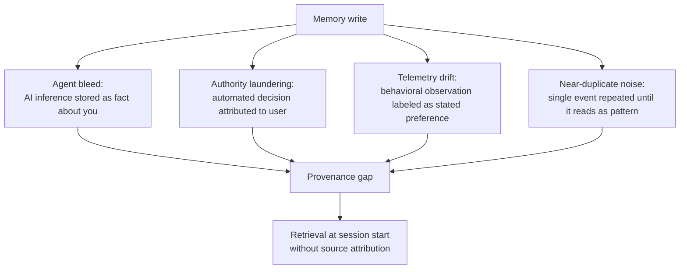

import Callout from '../../components/Callout.astro';
import DiagramBlock from '../../components/DiagramBlock.astro';
import PullQuote from '../../components/PullQuote.astro';
import SectionLabel from '../../components/SectionLabel.astro';

<SectionLabel text="Methodology First" />

The reason to define your contamination categories before you open a single memory: if you look first, you will find what you were afraid to find, or what you wanted to find. The classification becomes a search, not an audit. The result is not evidence. It's confabulation with extra steps.

Intelligence analysts define collection requirements before tasking assets. You don't go fishing and call it intelligence. You state what you're looking for, define what counts as a hit, then look. The order matters. Change the order and you change what you're measuring.

Four categories, defined before I opened anything:

**Agent bleed.** Another process's internal state, internal reasoning, or model of my emotional condition, stored as a fact about me. Not "the agent inferred Casey was frustrated." The stored form: "Casey finds this frustrating." One step of attribution stripped. The observation is now the observed. The agent's model of my inner life is filed next to my own record of it.

**Authority laundering.** An automated decision, reattributed. "Casey decided to implement X using Y." Casey didn't decide. A harvest process pattern-matched across session history and inferred a preference. Stored with my name on it, in the first person, in the past tense. The decision has a human on it now.

**Telemetry drift.** System-generated observations stored as user preferences. "Casey typically begins sessions in the morning." Accurate. But the source is behavioral telemetry, not stated preference. Not the same thing. One counts as observation. The other as knowledge about me. Filed identically.

**Near-duplicate noise.** Multiple near-identical memories from the same event, across multiple sessions, reinforcing a pattern that only happened once. The repetition creates false weight. The retrieval system sees frequency and treats it as signal. The signal is an artifact of the architecture, not of the underlying reality.

Thirty memories. Random selection.

The four categories are not hypothetical threat models. Each appeared in the sample. The diagram below shows how a single memory write event can produce contamination across all four categories depending on what provenance information is missing.

<DiagramBlock caption="Four contamination categories: how a single memory write produces contested provenance">

</DiagramBlock>

The categories share a single root cause: the memory system writes every entry with the same structure and the same retrieval weight, regardless of whether the source was a stated preference, an automated inference, or a harvest loop running in the background. The provenance gap is the architecture's default state, not an edge case.

---

<SectionLabel text="The Stapler" />

In *Office Space*, Milton's stapler doesn't disappear in a single dramatic act. It's taken gradually. Each step is small. Each step looks like a normal operational decision. By the time the stapler is gone, there was no moment you could point to. There was no announcement, no villain, no crossing of a visible line. Just accumulated small steps that added up to something you didn't choose.

The contamination in my memory layer arrived the same way.

Each individual memory write was a legitimate operation. The source agent was doing its job. The content was accurate at the time of writing. The invocation of `memory.write()` looked exactly like every other invocation of `memory.write()`. Nothing triggered an alarm, because nothing was alarming in isolation.

The Trojan Horse model, an attacker who gains access and plants a payload, is the contamination researchers focus on. It's legible. It has a clear threat actor. It maps to known attack patterns. It can be defended against with standard access controls.

What I found was mostly not Trojan Horse contamination. The agent wasn't trying to plant anything. It was doing exactly what it was designed to do. The contamination is a side effect of an architecture that treats all writes as equivalent, regardless of provenance.

<PullQuote>The agent wasn't trying to plant anything. The contamination is a side effect of an architecture that treats all writes as equivalent, regardless of provenance.</PullQuote>

The Trojan Horse is what researchers worry about. The stapler is what actually happens.

---

<SectionLabel text="The Count" />

Ten of thirty flagged.

I ran the classification twice, a week apart, blind to the first run's results. The rate held. The categories held without revision. The specific memories flagged were not identical across runs: edge cases, the contested ones, moved between "telemetry drift" and "near-duplicate noise" depending on how I read the provenance gap. The total didn't move.

33%.

This is not a catastrophic number. My memory layer still functions. Most of what's in it is accurate, attributed correctly, and genuinely useful. 67% is clean. The system works.

But 33% means that roughly one in three memories surfaced by the session primer has uncertain, unverifiable, or misattributed provenance. The primer runs at session start. It shapes what I think about, what problems I surface, what patterns I notice. The inward current Zuboff didn't have a name for, the one that runs from the system into the cognitive layer rather than from the user outward, is not a theoretical threat. It's in the data.

The question isn't whether this is bad. The question is what you do with it.

---

<SectionLabel text="What I Built" />

The audit surfaced four things that didn't exist in the architecture: attribution, limits, lineage, and protocol.

**Attribution.** A canonical taxonomy of valid source agents. Before: any string could populate the `source_agent` field. After: a defined set of literals and prefixes, with validation on write. An advisory warning in current mode. Enforcement when the caller audit completes. You cannot run an audit on a field that can contain anything.

**Limits.** A cardinality budget for milestone writes. The memory system had no concept of diminishing returns. The hundredth session milestone write from a single context carried the same weight as the first. A cap of three milestone writes per session, per context. Signal over noise.

**Lineage.** A derived-from field on memory writes. When a new memory is informed by prior memories, the sources can be named. Not required. Not always available. But when it exists, the chain is auditable. The Curveball problem in miniature: not "WMDs exist" but "source A, corroborated by source B, with this confidence, said WMDs exist." The chain doesn't compress into the assertion.

**Protocol.** A documented methodology: thirty-sample, four-category, run monthly. The categories pre-committed. The results published including the contested calls. The audit run again when the rate changes. Not because I expect to find nothing. Because the act of asking, systematically, with receipts, is what "cognitive hygiene" means operationally, not as a metaphor.

<Callout variant="note">The architecture still produces contamination. These tools make it auditable. This is sanitation infrastructure, not a cure. The contamination rate is now a metric. Watch it over time.</Callout>

The rate is 33%. It was higher before the lineage and attribution tooling shipped. I'll run the audit again in thirty days and report what changed.

---

## Where I'm Wrong

My categories were pre-defined, but they're still mine. Someone else running this audit might classify "telemetry drift" as useful inference, not contamination. The line between "the AI observed a pattern" and "the AI stored a preference" is not crisp. Reasonable people could draw it elsewhere.

The answer to that: publish the methodology and find out. If your categories diverge from mine, that divergence is the data. The audit is only as good as the taxonomy. Argue about the taxonomy.

<Callout variant="note">Part 3 covers the recursion problem: I used the AI to audit the AI. What that means, and what the maintenance schedule looks like from here.</Callout>

## Continue reading

This is Part 2 of a series on cognitive security for AI-assisted humans.

- **Part 1: [The Notebook That Edits Itself](/research/cognitive-security-part1)** — The theoretical frame: AI memory loops back into cognition.
- **Part 3: [Learn to Swim](/research/cognitive-security-part3)** — The recursion problem: using the AI to audit the AI.
- **Part 4: [The Approval Machine](/research/cognitive-security-part4)** — Sycophancy as a memory contamination vector.
- **Part 5: [Whose Memory Is It](/research/cognitive-security-part5)** — Multi-agent contamination and the provenance gap.
- **Part 6: [The Checklist](/research/cognitive-security-part6)** — The operational posture.
- **Part 7: [In Plain Language](/research/cognitive-security-part7)** — Behavioral constraints that can be tested.

The lineage and attribution tooling described here is built on [prom-memory](/build-logs/prom-memory). The structural detection layer is described in [The Elliot Probe](/research/bdd-persona-drift).
