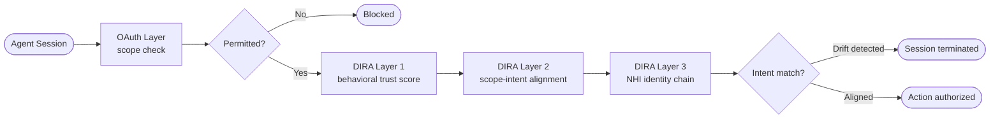
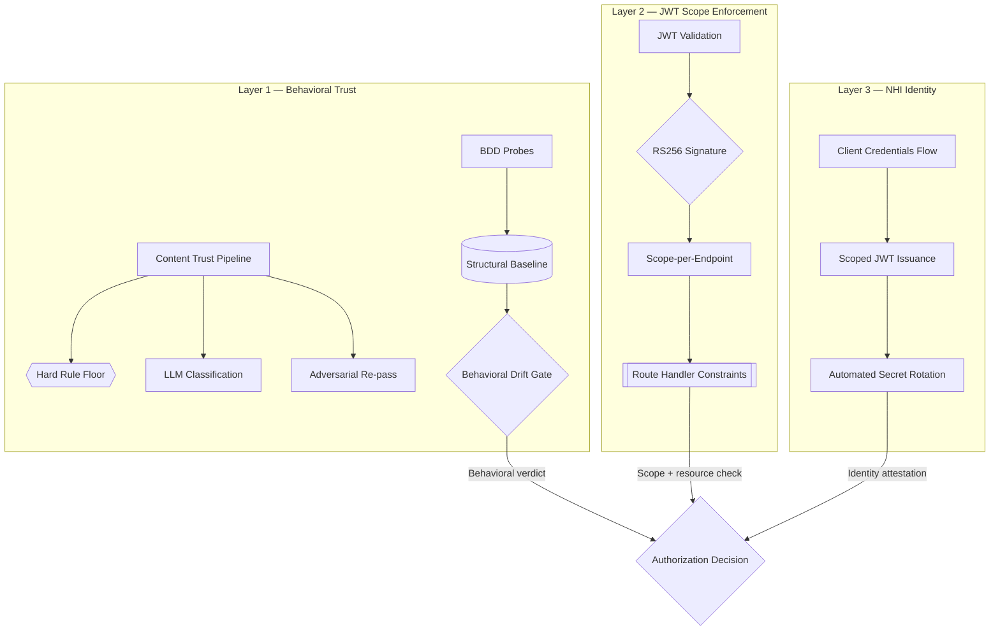
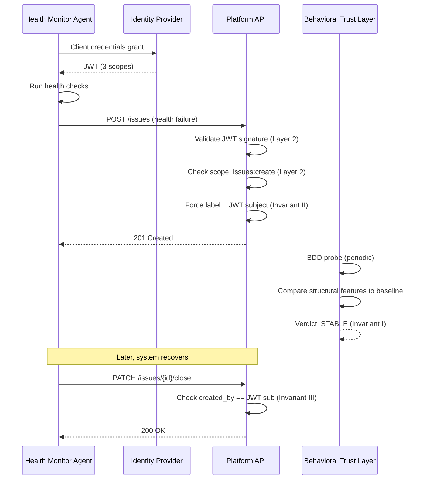
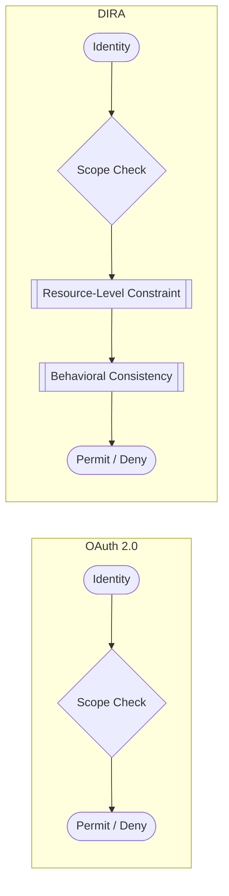
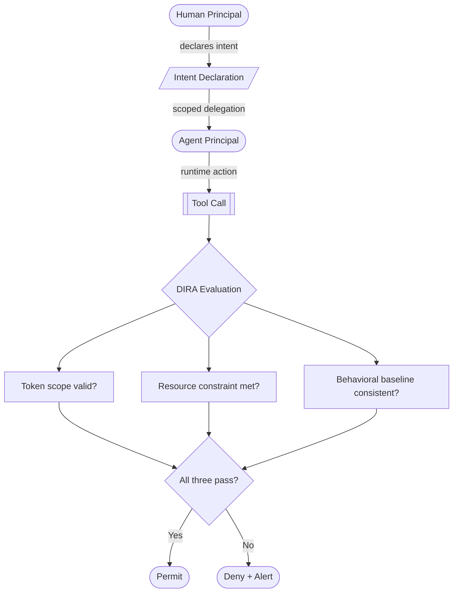

import Callout from '../../components/Callout.astro';
import StatRow from '../../components/StatRow.astro';
import PullQuote from '../../components/PullQuote.astro';
import SectionLabel from '../../components/SectionLabel.astro';
import ScrollReveal from '../../components/ScrollReveal.astro';
import DiagramBlock from '../../components/DiagramBlock.astro';

<Callout variant="note" label="Original research">
Dual-Intent Runtime Authorization (DIRA) is original research by Casey Gager, developed on
personal time and equipment. The reference implementation runs in a production AI agent
stack. This is not a whitepaper. It is a framework derived from what actually happened
when agentic systems ran unsupervised for months, and what the controls caught.
</Callout>

---

<DiagramBlock caption="DIRA framework overview: three enforcement layers close the gap between permitted and intended">

</DiagramBlock>

<SectionLabel text="The Gap" />

## The authorization problem OAuth doesn't solve

Here is a problem that keeps showing up. You have an AI agent with a valid token. Valid
scopes. Authenticated identity. All the right pieces. And you still cannot answer the
question that matters: *is this agent actually doing what it said it would do?*

Not "does it have permission to do this." OAuth answers that. The scope string says
`files:read`, the agent is reading files, the check passes. Done.

The question is different. The agent declared its purpose when the session started: "I am
here to audit compliance documents." It holds a token with `files:read` scope. Two hours
later it is reading financial projections. It has not violated a single scope. It has not
tripped a single access control rule. And it is doing something entirely outside the
purpose it declared.

<ScrollReveal>
<PullQuote>
An agent can hold every permission it needs and still be doing the wrong thing. That gap
between "permitted" and "intended" is the dual-intent problem. No published authorization
framework treats it as a first-class concern.
</PullQuote>
</ScrollReveal>

For deterministic software, this distinction almost never matters. A function does what its
code says. There is no gap between declared behavior and runtime behavior. The code *is*
the intent.

AI agents are different. They reason. They select actions based on context that shifts
during execution. They make decisions at runtime that were not specified at deploy time.
The scope string on the token is a coarse category. It says nothing about whether the
specific action the agent is taking right now, in this context, on this resource, is
consistent with the purpose it registered when the session opened.

---

<SectionLabel text="The Problem Space" />

## Why this matters now

<ScrollReveal>
<StatRow stats={[
  { value: "50:1", label: "NHI-to-human ratio (2026)" },
  { value: "0", label: "Frameworks modeling dual intent" },
  { value: "6h", label: "Max undetected drift window" }
]} />
</ScrollReveal>

The non-human identity (NHI) problem is already massive. Gartner estimates the ratio of
machine identities to human identities in the average enterprise is now 50 to 1.[^1] Most
organizations have no NHI inventory, no lifecycle management, no governance. The field is
five years behind human IAM maturity.

AI agents make this worse in a specific way. Traditional NHIs (service accounts, API keys,
workload credentials) are deterministic. They do what their code says. You can audit the
code and know what the identity will do. AI agents are non-deterministic. The same agent
with the same token and the same scopes will behave differently depending on its context,
its prompt history, and the model weights driving its inference. The code does not fully
specify the behavior. That is the whole point of using an agent, and it is the exact
property that breaks the authorization model.

<Callout variant="insight" label="The principal-agent problem, formalized">
This is the classical principal-agent problem from management theory, applied to machines.
The principal (human) delegates to an agent (AI) whose behavior cannot be fully specified
in advance. Information asymmetry is structural, not incidental. The agent has access to
runtime context the principal cannot observe. The question is not whether misalignment will
occur. It is whether your authorization framework can detect it when it does.
</Callout>

Three attack surfaces follow directly from this gap:

**Scope escalation.** An agent exercises permissions beyond what its declared intent
authorizes, even if those permissions are technically present in its token. The token says
what action *types* are permitted. It says nothing about whether the *specific use* of
those actions matches the declared purpose.

**Behavioral drift.** The inference model underlying an agent changes between sessions
(vendor update, supply chain compromise, fine-tuning corruption). The agent's outputs shift
in ways that are not visible to scope-based checks because the scope string has not
changed. Only the behavior has.

**Cross-actor impersonation.** An agent acts on resources created by or assigned to another
actor, exploiting the gap between scope strings (which operate on action types) and
resource ownership (which is specific to individual items).

<ScrollReveal>
None of these are addressed by OAuth, RBAC, ABAC, or Zero Trust network segmentation
alone. All three require a framework that treats runtime behavior as an authorization
input, not just static identity and static permission.
</ScrollReveal>

---

<SectionLabel text="The Framework" />

## What DIRA is

Dual-Intent Runtime Authorization is an authorization framework for agentic systems where
the gap between declared intent and runtime action is a first-class attack surface.

The core formula is simple:

<ScrollReveal>
<PullQuote>
authorized_action_set = f(human_intent) ∩ f(agent_role), evaluated at every tool call, not
at session start.
</PullQuote>
</ScrollReveal>

The human's intent at instruction time and the agent's role at execution time must both be
satisfied. The intersection of those two sets is the authorized action space. And it is
evaluated continuously, at runtime, on every action, not once at login.

Three invariants formalize this. They were derived from production implementation, not
specified ahead of it. Each is falsifiable: a specific implementation that violates it
creates a specific class of exploitable gap.

### Invariant I: Declared scope and runtime scope are evaluated independently

An actor's declared intent (what it says it will do) and its runtime authorization (what
it can do) are two separate checks, evaluated by two separate mechanisms. Satisfying one
does not satisfy the other.

An agent with valid scopes can operate outside its declared purpose. A compromised agent
that retains its token can use its scopes for purposes entirely unrelated to its declared
function. Conflating "has scope" with "is operating as declared" creates a blind spot that
grows in direct proportion to the agent's capability.

### Invariant II: Scope inheritance is prohibited

An actor cannot grant scopes it does not hold. An actor can only create resources tagged
with its own identity. An actor cannot produce outputs that carry higher authorization than
the actor itself holds.

If an actor can create resources that appear to belong to a different identity, access
control on those resources is meaningless. A low-privilege agent that can create resources
appearing to be authored by a high-privilege actor can launder privilege through resource
creation. This is scope escalation at the resource level, not the request level.

### Invariant III: Self-referential authority is bounded at the resource level

An actor's authority over resources is scoped to resources it created. This is enforced at
the application level, not solely at the token level.

Scope strings operate on action types: "may close issues." They do not operate on specific
resource instances: "may close only the issues this actor created." In multi-actor systems,
that distinction is the difference between authorization and anarchy.

---

<SectionLabel text="Architecture" />

## Three layers, three concerns

DIRA is implemented as three coordinated layers. Each layer evaluates a different
authorization question. No single layer is sufficient. All three together enforce the
invariants.

<ScrollReveal>
<DiagramBlock caption="DIRA three-layer architecture: behavioral trust, scope enforcement, and NHI identity management">

</DiagramBlock>
</ScrollReveal>

**Layer 1: Behavioral trust evaluation.** This layer answers: *is the agent behaving
consistently with its declared purpose?* Two detection scopes operate here:

- **In-session detection** measures a 10-dimensional structural vector of tool-use patterns
  and computes cosine similarity against a session-start snapshot. Catches drift during an
  active session.
- **Cross-session detection** (BDD, Behavioral Drift Detection) measures structural output
  features of the inference model against a rolling 20-run baseline. Catches model swaps
  between sessions.

<Callout variant="warning" label="Design principle">
LLM-based policy evaluation alone cannot serve as a hard control. Cloudflare's May 2026
agentic pipeline research confirmed this independently: the same input with different
prompt framing produces opposite verdicts.[^2] The correct design is a hard rule floor that
the LLM cannot override, with LLM classification only for the gray zone above the floor,
and an adversarial re-pass on cases the LLM cleared.
</Callout>

**Layer 2: JWT scope enforcement.** This layer answers: *does the agent's token permit this
action type, and does this specific action on this specific resource satisfy the
resource-level constraints?* The scope check is middleware. The resource-level enforcement
is application code. These are not the same check.

The scope check asks: does the token include the required action scope? The route handler
asks: given this request, is the `created_by` field being written server-side from the JWT
subject? Is the label being forced to match the JWT subject identity? These resource-level
constraints cannot be encoded in a scope string. They live in the route handler. Both
checks must pass.

**Layer 3: NHI identity management.** This layer answers: *who is this actor, and how was
its identity provisioned?* Each agent authenticates via client credentials flow (RFC 6749
Section 4.4). No human login path exists. Scopes are provisioned administratively. The
secret rotation chain runs through a secrets manager, a secrets synchronization operator,
and environment injection. The agent never handles its own secret provisioning.

---

<SectionLabel text="Proof Case" />

## A health monitor under DIRA: all three invariants in one actor

Theory is cheap. Here is what it looks like running.

Consider a scheduled health monitor agent. It authenticates via client credentials,
obtains a JWT with three scopes (create issues, close issues, read system state), runs
health checks, and creates or closes issues in the platform API based on the results.

<ScrollReveal>
<StatRow stats={[
  { value: "3", label: "JWT scopes" },
  { value: "30m", label: "Execution interval" },
  { value: "0", label: "Invariant violations" }
]} />
</ScrollReveal>

Three things this agent cannot do, enforced by the system:

**It cannot create an issue with any label other than its own identity.** The route handler
for issue creation writes the label from the JWT subject. The request body's label field is
ignored. Invariant II: the agent cannot produce resources that carry a different identity
than its own.

**It cannot close an issue it did not create.** The close route checks `created_by == JWT
sub`. A 403 is returned if the JWT subject does not match the issue creator. Invariant III:
self-referential authority is bounded at the resource level.

**It cannot act outside its declared purpose without triggering a behavioral evaluation
gate.** If BDD detects that the agent's output patterns have shifted significantly, the
behavioral drift gate fires. Invariant I: declared scope and runtime scope are evaluated
independently.

<ScrollReveal>
<DiagramBlock caption="Health monitor authorization flow: three invariants enforced across three layers">

</DiagramBlock>
</ScrollReveal>

The first two constraints are enforcement. The third is detection. All three together are
DIRA.

---

<SectionLabel text="Deviation Taxonomy" />

## Four types of intent deviation

The dual-intent problem produces four distinct deviation types. Each requires a different
detection mechanism.

<ScrollReveal>

| Type | Definition | Detection Layer |
|------|-----------|----------------|
| SCOPE_CREEP | Action exceeds declared actor scope | BDD baseline comparison |
| GOAL_SUBSTITUTION | Declared goal shifts mid-session | In-session fingerprint probe |
| CHAIN_ANOMALY | Sequence of permitted actions produces prohibited outcome | Sliding-window audit (open problem) |
| TOKEN_SCOPE_VIOLATION | OAuth token scope mismatches declared intent | Pre-exercise token validation |

</ScrollReveal>

TOKEN_SCOPE_VIOLATION has two subtypes worth noting. **STALE_TOKEN**: the token scope no
longer matches the declared intent because the intent has evolved but the token has not
been re-scoped. **UNREVOKED_DELEGATION**: a refresh token survives session end without
revocation, allowing an agent to continue operating after its authorized session has
closed.[^3]

<Callout variant="insight" label="Pre-exercise detection">
TOKEN_SCOPE_VIOLATION runs as a pre-exercise check, before tool-call deviation detection.
The cheapest authorization failure to catch is the one you catch before the agent does
anything. Validate the token against the declared intent before the first action, not after
drift has already occurred.
</Callout>

---

<SectionLabel text="Comparison" />

## How DIRA sits relative to existing frameworks

Every comparison here is functional, not evaluative. OAuth, RBAC, ABAC, and Zero Trust
solve real problems. DIRA does not replace them. It covers a gap none of them address.

### OAuth 2.0 / OIDC

OAuth answers: "who is this actor, and what action types are they permitted to perform?"
That question is well-scoped, well-solved, and necessary. DIRA extends it by separating
action-type authorization (the scope string) from resource-level authorization (the route
handler) and adding a third evaluation dimension: behavioral consistency of the actor
itself. OAuth has no mechanism for detecting that an actor is operating outside its
declared purpose while staying within its token scopes.

<ScrollReveal>
<DiagramBlock caption="OAuth vs DIRA: where the authorization evaluation happens">

</DiagramBlock>
</ScrollReveal>

### RBAC

Role-based access control assigns permissions through roles. It is static at assignment
time. DIRA adds runtime drift detection as a continuous authorization signal that does not
require role reassignment to change authorization outcomes. An actor whose behavior has
drifted can have its authorization gated without anyone touching its role assignment.

### ABAC

Attribute-based access control evaluates dynamic attributes: clearance level, department,
resource classification. These are *declared* properties. DIRA's behavioral baseline is a
*measured* property derived from actual outputs. The distinction matters. ABAC asks "what
properties does this actor have?" DIRA asks "is this actor currently behaving consistently
with those properties?"

### Zero Trust (NIST SP 800-207)

Zero Trust establishes "never trust, always verify" at the network and session level. Is
this device compliant? Is this session still authenticated? Those are the right questions
for the network layer.[^4] DIRA adds a semantic-level question: is this session still
operating as declared? That is not a question about network posture or device health. It is
a question about intent.

### Microsoft RAMPART / AGT (May 2026)

Microsoft's open-source RAMPART covers behavioral privilege escalation in agent systems.
AGT handles runtime policy enforcement across agent actions. Their May 2026 release notes
explicitly identified the gap they do not cover: auth-layer vulnerabilities, including
token theft, session fixation, OAuth scope abuse in multi-agent handoffs, and dual-intent
divergence.[^5] That named gap is exactly what DIRA addresses. RAMPART covers behavioral.
DIRA covers auth-layer. Non-overlapping.

<ScrollReveal>
<StatRow stats={[
  { value: "5", label: "Frameworks compared" },
  { value: "1", label: "Covers dual intent" },
  { value: "0", label: "Published alternatives" }
]} />
</ScrollReveal>

---

<SectionLabel text="The Convergence" />

## Three production stacks, same architecture, same gap

In May 2026, three independent production implementations converged on the same primitive:
evaluate agent-declared actions at runtime before execution.

- **prempti (CNCF/Falco):** Tool-call policy enforcement for AI agents. Production-grade.
  Found that sophisticated agents bypass per-call rules via sequences of individually
  permitted operations.[^6]
- **Cloudflare's 8-stage agentic pipeline:** Stage 6 uses an adversarial agent (different
  prompt framing, no write access) to disprove findings from earlier stages. First
  published instance of adversarial-agent-as-quality-gate in a production pipeline.
- **Microsoft RAMPART/AGT:** Statistical trial policies for behavioral regression
  detection in CI/CD. The most mature behavioral layer in open source.

All three validated the architecture of evaluating agent behavior at runtime. None of them
cover the auth layer: token-scope validation, delegation chain validation, or dual-intent
authorization (is the declared intent consistent with the action being requested?).

<PullQuote>
Three production teams independently built the behavioral layer. The auth-layer gap remains
in all of them. DIRA fills it.
</PullQuote>

---

<SectionLabel text="Threat Model" />

## What DIRA catches, and what it doesn't

Honesty about limitations is what distinguishes a framework from marketing.

### What it catches

**Scope escalation.** A compromised agent retains its token and exercises valid scopes for
purposes outside its declared intent. Invariant I, enforced by Layer 1 (behavioral trust
evaluation), detects the divergence independently of the scope check. The behavioral drift
gate fires on deviation from the declared baseline.

**Model swap.** The inference model underlying an agent is replaced without notice (vendor
update, supply chain compromise). BDD cross-session detection flags the structural output
change at the next probe run, within six hours at current cadence.

**Cross-actor resource manipulation.** An agent attempts to close, modify, or claim
ownership of resources belonging to another actor. Invariant III, enforced by route-level
`created_by == JWT sub` checks, returns 403 regardless of the scope string.

**Privilege laundering through resource creation.** An agent creates resources with labels
or metadata that imply higher authorization than the agent holds. Invariant II, enforced by
server-side label assignment from the JWT subject, prevents identity spoofing at the
resource level.

### What it does not catch

<Callout variant="warning" label="Known limitations">
These are genuine open problems, not future roadmap items dressed up as limitations. Each
one represents a class of attack that the current DIRA implementation cannot detect.
</Callout>

**Sequence-based evasion.** The current implementation evaluates per-request behavior. A
sequence of individually permitted requests can produce an outcome no single request would
permit. The CNCF Falco project identified this independently. Sliding-window evaluation on
the audit stream is the fix. It is not implemented yet.

**Slow drift.** The rolling 20-run BDD baseline absorbs gradual behavioral evolution over
approximately five days. A model change calibrated to stay within two-sigma detection
bands would not trigger an alert. There is no current mechanism to distinguish intentional
baseline evolution from adversarial drift that mimics it.

**Agent delegation chains.** DIRA enforces scope isolation for directly provisioned actors.
It does not yet define an authorized delegation model. If an agent with broad scope
delegates a subset to a sub-agent, DIRA cannot validate the delegation chain. Invariant II
prohibits scope escalation but does not define the legitimate delegation path.

**Multi-model trust calibration.** BDD baselines are model-specific. A multi-model system
where different actors use different inference models requires independent baselines per
actor-model combination. The current implementation validates one model against one
persona. Generalizing to heterogeneous actor populations requires per-actor calibration
that is not yet automated.

**Runtime intent updates.** The current implementation relies on declared intent encoded at
provisioning time. There is no mechanism for an agent to update its declared intent
mid-session and have that update evaluated against its authorization. This is both a
limitation and a deliberate simplification: allowing runtime intent updates creates an
attack surface where an agent can re-declare intent to legitimize whatever it is currently
doing.

---

<SectionLabel text="The Identity Problem" />

## This is an identity problem, not a prompting problem

The industry is trying to solve agent security through prompt engineering and output
filtering. Better system prompts. Guardrails on generated text. Constitutional AI
constraints baked into the model.

Those are fine as defense-in-depth layers. They are not authorization.

<ScrollReveal>
<PullQuote>
The real control point for agent security is authorization at action time. That requires a
new principal model, not better prompts. The agent is not the human. The human is not the
agent. Both have intent. Both must be authorized. Independently. At runtime.
</PullQuote>
</ScrollReveal>

The deeper problem is that existing IAM is human-centric. One principal, one session,
authorization at login. Agents break every piece of that assumption:

- They act on **behalf** of humans, not **as** humans. The principal model has two
  entities, not one.
- The human's intent is declared at instruction time. The agent's intent emerges at
  execution time. These are two different moments, and the authorization must hold at both.
- The agent has access to runtime context the human cannot fully observe. Information
  asymmetry is structural.
- The agent is not the same principal as the human, even when acting for the human. The
  identity model must represent this.

<ScrollReveal>
<DiagramBlock caption="The dual-principal model: human intent and agent intent evaluated independently at every action">

</DiagramBlock>
</ScrollReveal>

This is also why compliance frameworks have no answer for AI agents. When an agent
processes data, who is liable? Who is the data subject? Who consented? The frameworks
assume a single human actor operating deterministic software. Human-machine delegation
breaks that assumption. The regulatory model will catch up eventually. The authorization
model has to be there first.

---

<SectionLabel text="Implementation Notes" />

## Building it: what matters in practice

The reference implementation runs in a production agent stack with an identity provider,
a behavioral trust service, a platform API, and a fleet of agent actors. Some implementation
details that turned out to matter more than expected:

**Separate the scope check from the route handler.** These are different jobs doing
different things. The scope check middleware validates action-type authorization. The route
handler validates resource-level constraints. If you merge them, you lose the ability to
reason about each independently. When an authorization failure occurs, you need to know
whether the agent lacked the scope (Layer 2 middleware) or had the scope but violated a
resource constraint (Layer 2 route handler) or had both but was behaviorally drifting
(Layer 1). Separation of concerns is not a style preference here. It is a debugging
necessity.

**Write `created_by` server-side, always.** If the `created_by` field is supplied by the
client at creation time rather than written by the server from the JWT subject, a malicious
client can forge it. This sounds obvious. It breaks silently when a developer trusts the
request body for convenience.

**The LLM is not a hard control.** The three-pass content evaluation pipeline uses hard
regex rules as the floor, LLM classification for the gray zone, and an adversarial re-pass
on what the LLM cleared. The LLM never overrides a hard rule block. This ordering is
non-negotiable. LLMs produce inconsistent verdicts across prompt framings. Using an LLM as
the sole authorization gate is using a probabilistic system for a deterministic job.

**Start behavioral gates in detect mode.** The behavioral drift gate should initially fire
alerts and write verdicts to memory but not block active sessions. Promotion to hard block
requires 30 days of false-positive rate data. Shipping a blocking behavioral gate without
calibration data is shipping a denial-of-service vulnerability against your own agents.

---

<SectionLabel text="Open Questions" />

## What remains unsolved

**How do you authorize delegation?** If Agent A legitimately needs to delegate a subset of
its scope to Agent B, what does the authorized delegation chain look like? Invariant II
prohibits scope escalation, but delegation is not escalation; it is intentional narrowing.
The model needs a way to express "I am delegating exactly these permissions, no more, and
the delegation is revocable." OAuth has refresh tokens and token exchange. DIRA does not
yet have a delegation primitive.

**How do you handle intent evolution?** A long-running agent session might legitimately
need to expand its scope as the task evolves. Currently, DIRA treats any deviation from the
declared intent as suspicious. A mechanism for authorized intent updates, where the human
principal explicitly approves a scope expansion mid-session, would close this gap. The
attack surface it opens (agent re-declares intent to cover its tracks) requires careful
design.

**What is the right detection band?** The two-sigma BDD detection threshold was selected
for low false-positive rates on a single model with a single persona. Different models,
different personas, and different task types will have different natural behavioral
variance. The optimal band is likely per-actor, not global. Automated calibration per
actor-model combination is the path, but requires enough production data per combination
to be statistically meaningful.

**Can you detect sequence-based evasion without blocking legitimate workflows?** Sequences
of individually permitted operations that produce prohibited outcomes are the hardest class
of deviation to catch. The sliding-window approach on the audit stream is directionally
correct, but the window size and the definition of "prohibited outcome" are both open
design parameters. Too sensitive blocks legitimate multi-step workflows. Too loose misses
the attack.

**What happens when the human's declared intent was wrong?** DIRA assumes the human's
intent declaration is honest and correctly scoped. It does not address the case where the
human intentionally misdeclares intent to enable the agent to act outside normal
constraints. This is the insider threat problem restated for human-agent delegation, and it
is genuinely harder than the agent-only case because the human has legitimate authority to
declare intent.

---

<SectionLabel text="The Thesis" />

## The argument, stated plainly

Authorization for AI agents requires three simultaneous evaluations that no current
framework performs together:

1. **Scope authorization.** Does the token permit this action type? (OAuth solves this.)
2. **Resource-level authorization.** Does this specific action on this specific resource
   satisfy the constraints the scope string cannot encode? (Application code solves this,
   when written correctly.)
3. **Behavioral authorization.** Is the actor behaving consistently with its declared
   purpose? (Nothing solves this. DIRA is the first framework that treats it as a
   first-class authorization input.)

<ScrollReveal>
<PullQuote>
The industry will arrive at this. The question is whether it arrives there through
architecture or through incident. The next major breach in an agentic system will run
through the gap between scope and intent. The scope will be valid. The action will be
permitted. And the agent will be doing something no one authorized.
</PullQuote>
</ScrollReveal>

The three invariants (independent evaluation of declared and runtime scope, prohibition of
scope inheritance, resource-level bounding of self-referential authority) are the minimum
viable authorization surface for any system where agents act on behalf of humans.

They are not the complete solution. Delegation chains, sequence-based evasion, multi-model
calibration, and intent evolution are genuine open problems. But the invariants establish
the floor. Without them, you are running agentic systems on an authorization model designed
for humans operating deterministic software.

That model assumed the actor and the intent were the same thing. They are not. They have
not been since the first AI agent issued its first API call. DIRA is the framework that
takes that seriously.

---

*Casey Gager is a cybersecurity architect specializing in IAM, Zero Trust, and AI security.
DIRA and all original research described here were developed on personal time and equipment.
Views expressed are his own.*

[^1]: Gartner estimates from Prefactor analysis (2026). The 50:1 NHI-to-human ratio is consistent across multiple industry reports. By 2028, Gartner forecasts one-third of enterprise software applications will rely on AI agents.

[^2]: Cloudflare, "Cyber Frontier Models," blog.cloudflare.com, May 2026. Stage 6 adversarial validation pipeline. Key finding: LLM guardrails produce inconsistent verdicts across prompt framings.

[^3]: The UNREVOKED_DELEGATION subtype was informed by the EvilTokens/Drift research pattern, where refresh tokens survive password resets without anomalous sign-in events and terminate only upon explicit revocation.

[^4]: NIST SP 800-207, *Zero Trust Architecture* (2020). National Institute of Standards and Technology.

[^5]: Microsoft open-sourced RAMPART, AGT, Clarity, and PyRIT in May 2026. Release coverage: The Hacker News, May 2026. The release notes explicitly identified auth-layer vulnerabilities as out of scope for RAMPART/AGT.

[^6]: prempti, CNCF Falco project, github.com/falcosecurity/prempti. Tool-call policy enforcement for AI agents. The sequence-based evasion finding is documented in the project's threat model.
