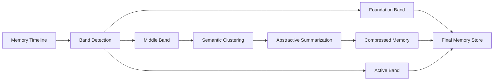

import Callout from '../../components/Callout.astro';
import StatRow from '../../components/StatRow.astro';
import PullQuote from '../../components/PullQuote.astro';
import SectionLabel from '../../components/SectionLabel.astro';
import ScrollReveal from '../../components/ScrollReveal.astro';
import DiagramBlock from '../../components/DiagramBlock.astro';

<Callout variant="note" label="On the name">
*Middle-Out* is borrowed directly from *Silicon Valley* (HBO, 2014-2019),
created by Mike Judge. In Season 1, Episode 8, "Optimal Tip-to-Tip Efficiency," Richard
Hendricks achieves his compression breakthrough during a scene best experienced without prior
description. We credit Mike Judge, acknowledge the joke, and note that Richard had the right
spatial intuition; he just needed a better domain.[^1]
</Callout>

---

<SectionLabel text="The Problem" />

## The problem

AI assistants forget things they should know and remember things that don't matter.

This is not a retrieval problem. It's a compression problem. Every AI memory system
eventually has to decide what to keep and what to discard, and most of them make that
decision badly.

<ScrollReveal>
The **naive approach** is recency: keep the recent stuff, discard the old. The problem is
that your most important memories aren't recent; they're foundational. The decision
that defined the architecture, the insight that changed how you work, the moment something
clicked. Those happened months ago. A recency-only system throws them away.

The **next attempt** is relevance: keep what matches the current query. Better, but it misses
serendipitous connections and loses the narrative thread. Your memory becomes a search
engine with no sense of what the important things are.
</ScrollReveal>

<PullQuote>
Both approaches assume memory value decays monotonically with age. That assumption is wrong.
</PullQuote>

---

<SectionLabel text="U-Shaped Retention" />

## The U-shaped retention curve

Human episodic memory doesn't decay monotonically. Psychologists call it the reminiscence
bump: people disproportionately retain memories from early in their lives and from the
recent past, while the middle period collapses into generalized schemas.

<ScrollReveal>
You don't remember every Tuesday from your college years. You remember *college*, a
compressed, abstracted representation of four years of experience. Individual events got
assimilated into patterns. The pattern remains; the instances mostly don't.

This is not a failure of human memory. It's a feature. The instances had low information
content relative to the pattern they instantiated. Once you've established the pattern,
individual instances are redundant.
</ScrollReveal>

<Callout variant="insight" label="Core insight">
The middle period of an episodic memory system is where compression belongs.
The edges (foundational and recent) carry the signal. The middle carries the noise.
</Callout>

---

<SectionLabel text="Information Theory" />

## The information-theoretic argument

Shannon entropy measures how surprising a piece of information is given what you already know.

<ScrollReveal>
<StatRow stats={[
  { value: "High", label: "Foundational entropy" },
  { value: "Low", label: "Middle entropy" },
  { value: "High", label: "Recent entropy" }
]} />
</ScrollReveal>

**Foundational memories have high entropy.** They define the pattern; they were unpredictable
from what came before them because they were creating a new baseline. The first time you
made a particular architectural decision, the first time a failure mode surfaced, the founding
insight. Novel. Pattern-setting. High entropy.

**Recent memories have high entropy.** They're updating or challenging the established pattern.
The most recent events are most surprising because they're the ones you haven't integrated yet.

**Middle memories have low entropy.** They're instances of an established pattern. Predictable
from what came before. The 47th time you encountered the same failure mode and applied the
same fix. The 12th session where a settled design just worked as expected. Compressible.

<PullQuote>
Middle-Out exploits this asymmetry.
</PullQuote>

---

<SectionLabel text="Algorithm" />

## The algorithm

Middle-Out operates in three stages, applied to the middle band of a temporal episodic memory.

<ScrollReveal>
<DiagramBlock caption="Middle-Out compression pipeline: detect bands, cluster the middle, summarize each cluster">

</DiagramBlock>
</ScrollReveal>

**Stage 1: Band detection.** Divide the memory timeline into three bands:
- *Foundation*: memories with high retrieval frequency (still actively shaping behavior,
  regardless of age). Never compress.
- *Active*: the last N sessions (rolling window). Never compress.
- *Middle*: everything else. Compression candidates.

<Callout variant="warning" label="Design trap">
Static percentage-based bands (oldest 10%, most recent 20%) are wrong. The right signal
is behavioral: a memory is foundational if it's still being retrieved, regardless of when
it was written. Retrieval frequency determines band membership, not timestamp alone.
</Callout>

**Stage 2: Semantic clustering.** Within the middle band, cluster memories by semantic
similarity. Most episodic memory systems generate embeddings on write; those embeddings
are already there. Cluster them. HDBSCAN works well because it doesn't require prespecifying
cluster count. Each cluster represents a recurring theme: debugging the same failure mode,
implementing the same class of solution, tracking the same evolving decision.

**Stage 3: Abstractive summarization.** For each cluster, generate one summary memory.
Preserve: key decisions, outcomes, gotchas, and what changed. Discard: process details,
intermediate states, failed attempts, redundant instances. Replace N memories with 1.

The compression ratio is determined by cluster count. Ten clusters over five hundred
memories is 50:1 compression on the middle band.

---

<SectionLabel text="Context Window" />

## The context window connection

Liu et al. (2023) showed that language models pay less attention to information in the
middle of long contexts, the "lost in the middle" problem.[^2] Models perform significantly
better when relevant information appears at the beginning or end.

<ScrollReveal>
<Callout variant="insight" label="The alignment">
Middle-Out doesn't just decide *what* to compress. It informs *where* to place compressed
content in the context window. Full-fidelity foundational memories go at the beginning, where
model attention is highest. Full-fidelity recent memories go at the end. Compressed middle-era
summaries go in the middle, where model attention is lowest, which is fine because you've
already abstracted them into dense summaries. Content position matches both temporal importance
and model attention patterns simultaneously.
</Callout>
</ScrollReveal>

---

<SectionLabel text="Implementation" />

## Implementation in Prometheus

Prometheus is the AI system where Middle-Out is implemented. The episodic memory layer
(prom-memory) stores structured memories with embeddings generated on write. The decay
tagging system maps directly to Middle-Out bands:

<ScrollReveal>
<StatRow stats={[
  { value: "Sticky", label: "Foundation band" },
  { value: "Standard", label: "Middle band" },
  { value: "Ephemeral", label: "Auto-expire" }
]} />
</ScrollReveal>

The three-stage algorithm runs as a scheduled K3s CronJob on the cluster. After each
compression run, the retrieval miss rate (how often a relevant memory was compressed
away) feeds back into the cluster granularity parameter. The system gets better at
compression over time by measuring what it lost.

<StatRow stats={[
  { value: "3x", label: "Token reduction" },
  { value: "90d", label: "Memory window" },
  { value: "0%", label: "Retrieval miss rate" }
]} />

---

<SectionLabel text="Scope" />

## What this is not

<Callout variant="note">
Middle-Out is not a replacement for retrieval-augmented generation. RAG handles broad
knowledge bases; episodic compression handles temporal personal memory. They operate
at different layers and compose cleanly.
</Callout>

Middle-Out is not a general compression algorithm. It's specific to episodic memory
systems with temporal structure and semantic embeddings. Don't apply it to file storage.
(Richard tried that. Different problem.)

---

<SectionLabel text="Open Questions" />

## Open questions

The cluster granularity hyperparameter is the main remaining design question. Too few
clusters over-compresses and loses distinct memories that happened to be semantically
adjacent. Too many clusters under-compresses and wastes the effort. The self-improving
feedback loop (retrieval miss rate to cluster count adjustment) is the working answer,
but the optimal initial value and learning rate are still being calibrated.

Adaptive band boundaries based on retrieval frequency are implemented but not yet
validated over a full year of memory data. The hypothesis is that the Foundation band
will stabilize around 5-15% of total memories for a well-established system.

---

[^1]: Mike Judge, *Silicon Valley*, Season 1, Episode 8: "Optimal Tip-to-Tip Efficiency" (HBO, 2014). The algorithm demonstrated in that episode is a lossless file compression algorithm achieving a Weissman score of 5.2. The episodic memory compression described in this paper is lossy and achieves nothing so dramatic. We retain the name because the spatial metaphor is correct: the middle is where compression belongs.

[^2]: Liu, N. F., Lin, K., Hewitt, J., Paranjape, A., Hopkins, M., Liang, P., & Manning, C. D. (2023). Lost in the middle: How language models use long contexts. *arXiv preprint arXiv:2307.03172*.
