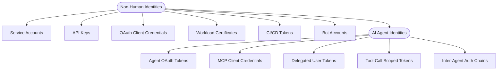
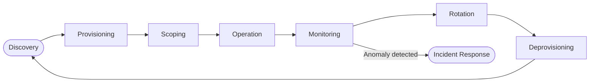
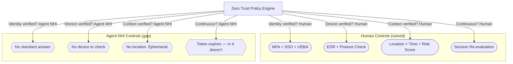

import Callout from '../../components/Callout.astro';
import StatRow from '../../components/StatRow.astro';
import PullQuote from '../../components/PullQuote.astro';
import SectionLabel from '../../components/SectionLabel.astro';
import ScrollReveal from '../../components/ScrollReveal.astro';
import DiagramBlock from '../../components/DiagramBlock.astro';

<SectionLabel text="The Blind Spot" />

## Every enterprise has an identity problem it hasn't named

Your organization runs MFA on every human account. You have conditional access policies, identity governance reviews, automated provisioning. You spent years building that program.

Now count your service accounts. Your API keys. Your OAuth client credentials. Your workload identities. Your CI/CD tokens. Your agent credentials.

<ScrollReveal>
<StatRow stats={[
  { value: "17:1", label: "NHI to human ratio" },
  { value: "79%", label: "Orgs with no NHI inventory" },
  { value: "#1", label: "OWASP NHI risk: improper offboarding" }
]} />
</ScrollReveal>

The ratio varies by industry, but the pattern is consistent: non-human identities outnumber human identities by an order of magnitude, and most organizations have no lifecycle management for them at all. No inventory. No ownership. No rotation policy. No deprovisioning process. Nothing.

<PullQuote>
Human IAM has MFA and behavior analytics. Machine IAM usually has a long-lived secret and a hope for the best.
</PullQuote>

This was already a serious problem before AI agents entered the picture. Now it is a critical one.

---

<SectionLabel text="What NHI Means" />

## Non-human identity in the agentic context

A non-human identity is any identity used by software rather than a person to authenticate and access resources. Service accounts, API keys, OAuth client credentials, workload certificates, CI/CD tokens, bot accounts, machine-to-machine tokens. The OWASP Non-Human Identities Top 10 defines them as identities used to "identify, authenticate, and authorize different software entities to access secured resources."[^1]

<ScrollReveal>
AI agents are NHIs. That sentence should not be controversial, but the industry has spent two years pretending otherwise.
</ScrollReveal>

When an organization deploys an AI agent that reads email, queries databases, calls APIs, and takes actions on behalf of users, that agent needs credentials. It needs to authenticate. It needs authorization scopes. It has a lifecycle: provisioning, operation, rotation, deprovisioning. It is not a user. It is a non-human identity.

<Callout variant="insight" label="The framing error">
The industry frames AI agent security as a prompting problem or an output filtering problem. It is an identity problem. The agent is a principal. It authenticates, it authorizes, it acts. The control point is the identity layer, not the prompt layer.
</Callout>

The problem is that most organizations treat agents as extensions of the human who deployed them, inheriting the human's identity and permissions. This is the "service account running as admin" pattern from 2005, repackaged for 2026. It was wrong then. It is catastrophically wrong now, because agents operate autonomously, at machine speed, across multiple systems, and they make tool-call decisions without human review.

---

<SectionLabel text="The NHI Taxonomy" />

## What counts as a non-human identity

The taxonomy is broader than most teams realize. Every one of these is an NHI, and every one of them needs lifecycle management.

<ScrollReveal>
<DiagramBlock caption="NHI taxonomy: agents inherit every credential class below them, then add new ones">

</DiagramBlock>
</ScrollReveal>

AI agents are not a separate category from NHI. They are the newest, most complex, and least governed class within it. An agent credential has every property of a traditional NHI credential (it authenticates a non-human principal) plus additional properties that traditional NHI management was never designed for:

- **Delegation chains.** An agent acts on behalf of a human, who delegated authority. That delegation has scope, intent, and temporal bounds. Traditional service accounts don't carry delegation metadata.
- **Ephemeral lifecycles.** Agents spin up, run a task, and terminate. Their credentials should do the same. Most NHI credentials are long-lived.
- **Dynamic scoping.** An agent's required permissions change with each task. A static OAuth scope granted at provisioning time is either too broad (security risk) or too narrow (breaks the agent).
- **Multi-system traversal.** A single agent session may touch email, CRM, databases, code repositories, and external APIs. That is five different authorization boundaries crossed in one execution.

---

<SectionLabel text="The Governance Gap" />

## The identity governance gap

Here is the uncomfortable reality: most enterprises have mature human identity governance and no NHI governance at all.

<ScrollReveal>
<StatRow stats={[
  { value: "5 yrs", label: "NHI behind human IAM maturity" },
  { value: "0", label: "IGA tools with native NHI support (until 2025)" },
  { value: "134", label: "Orgs hit in Okta NHI breach" }
]} />
</ScrollReveal>

The OWASP NHI Top 10 exists because the problem is severe enough to warrant its own risk framework, separate from the standard OWASP Top 10 and the LLM Top 10. The top three risks tell the story:[^1]

**NHI1: Improper Offboarding.** When an employee leaves, their human account gets deprovisioned. The service accounts they created, the API keys they generated, the OAuth applications they registered: those stay active. Nobody knows they exist. Nobody knows who owns them. The Okta breach in 2023 ran through exactly this pattern: a service account credential was saved to an employee's personal Google account, the employee's personal account was compromised, and 134 customer organizations were exposed.[^2]

**NHI2: Secret Leakage.** Credentials end up in code repositories, configuration files, log outputs, chat messages, and documentation. GitGuardian reported finding over 12 million new secrets exposed in public GitHub repositories in a single year.

**NHI3: Vulnerable Third-Party NHIs.** The SolarWinds attack, the Codecov breach, the CircleCI incident, the tj-actions supply chain compromise: all of these ran through non-human identity credentials in third-party integrations.[^3]

<PullQuote>
The next major breach pattern runs through NHI. Not because attackers got more sophisticated, but because defenders never built the governance layer.
</PullQuote>

---

<SectionLabel text="Why Agents Make It Worse" />

## What AI agents add to the NHI problem

Traditional NHI governance was already failing. AI agents make it worse in four specific ways.

<ScrollReveal>

**1. Scale.** A single human user might create a handful of service accounts over their career. An agentic platform can spawn hundreds of agent instances per hour, each requiring credentials. The NHI-to-human ratio, already 17:1, is about to become 170:1. Traditional provisioning workflows that involve a ticket, an approval, and a manual creation step cannot keep pace.

**2. Autonomy.** A service account executes a predefined script. An AI agent makes decisions about which tools to call, which data to access, and which actions to take. The authorization question is no longer "is this credential permitted to call this API" but "is this agent's chosen action consistent with the human's intent when they delegated authority." That is a fundamentally harder problem.[^4]

**3. Opacity.** When a service account runs a SQL query, you can see the query in the audit log. When an AI agent decides to call a tool, the reasoning that led to that decision is embedded in a language model's forward pass. The action is logged. The intent behind the action is not. This makes anomaly detection harder and incident investigation slower.

**4. Identity confusion.** Most agentic deployments today run agents under the delegating user's identity. The agent authenticates as the user. The audit log shows the user. If the agent takes an unauthorized action, the user is accountable for something they did not do and may not have intended. Microsoft's Entra Agent ID documentation is explicit about this: "Regular Microsoft Entra user accounts are designed for human sign-in patterns. Assigning them to AI agents causes failures across every Zero Trust enforcement layer."[^5]

</ScrollReveal>

<Callout variant="critical" label="The authorization gap">
Existing IAM is human-centric: one principal, one session, authorization at login. Agents break this model. They act on behalf of humans, not as humans. The agent is not the same principal as the human, even when acting for the human. Current IAM tools have no native answer to this.
</Callout>

---

<SectionLabel text="Lifecycle" />

## NHI lifecycle management for agents

Every identity has a lifecycle: creation, use, maintenance, and retirement. Human identity lifecycle management is a solved problem with mature tooling. NHI lifecycle management is where most organizations have nothing.

<ScrollReveal>
<DiagramBlock caption="Agent NHI lifecycle: every phase has controls that most orgs skip entirely">

</DiagramBlock>
</ScrollReveal>

**Discovery.** You cannot govern what you cannot see. Most organizations do not have an inventory of their NHIs. The first step is discovery: scanning environments for service accounts, API keys, OAuth applications, workload identities, and agent credentials. If you do not know what you have, nothing else matters.

**Provisioning.** Every agent credential should be provisioned through a governed process with an identified owner, a defined scope, and an expiration date. "The developer created an API key and put it in the environment variable" is not a provisioning process. It is a future incident.

**Scoping.** Least privilege is not optional for agent credentials. An agent that needs to read email should not have a credential that can also delete email. Static OAuth scopes are a blunt instrument here. Rich Authorization Requests (RFC 9396) and transaction tokens that carry context through delegation chains are the direction the standards are moving.[^6]

**Operation and Monitoring.** Agent credentials in use should generate telemetry: what was accessed, when, from where, and what action was taken. Behavioral baselines for NHI activity are the equivalent of UEBA for human identities. An API key that suddenly starts making calls it has never made before is the same signal as a human account logging in from an unusual location.

**Rotation.** Credentials expire. Secrets rotate. Certificates renew. This should be automatic and non-disruptive. SPIFFE and SPIRE provide exactly this for workload identities: short-lived, automatically rotated X.509 certificates with no stored secrets.[^7] The IETF WIMSE working group is formalizing this pattern for broader adoption.

**Deprovisioning.** When an agent is retired, its credentials must be revoked immediately. Not "marked inactive." Revoked. Every OAuth token, every API key, every certificate, every delegated permission. The Okta breach happened because a service account was not deprovisioned when the employee who created it moved on. This is the most common NHI failure and the easiest to prevent.

---

<SectionLabel text="Framework" />

## A practical framework for NHI governance

This is not a maturity model. It is a checklist. If you cannot check every box, you have a governance gap that will eventually become an incident.

<ScrollReveal>
<StatRow stats={[
  { value: "6", label: "Governance pillars" },
  { value: "SPIFFE", label: "Workload identity standard" },
  { value: "WIMSE", label: "IETF working group" }
]} />
</ScrollReveal>

### Pillar 1: Inventory

Maintain a complete, continuously updated inventory of all non-human identities. Every service account, API key, OAuth client, workload certificate, and agent credential has an entry. Each entry has an owner, a creation date, a last-used date, a purpose, and an expiration. If you cannot produce this inventory on demand, you are not ready for agentic AI.

### Pillar 2: Ownership

Every NHI has exactly one human owner. Not a team. Not a department. A named person who is accountable for that credential's lifecycle. When that person leaves the organization, ownership transfers explicitly. The OWASP NHI Top 10's number one risk, improper offboarding, exists because ownership was never assigned in the first place.

### Pillar 3: Least privilege and dynamic scoping

Agent credentials should be scoped to the minimum permissions required for each task, not for the agent's entire range of possible tasks. Static broad scopes are the NHI equivalent of giving every employee admin access. Use short-lived, task-scoped tokens. Use Rich Authorization Requests to specify what the credential is permitted to do, not just which API it can call.

### Pillar 4: Credential hygiene

No long-lived secrets. Period. Use certificates (SPIFFE/SPIRE), use managed identities, use workload identity federation. If you must use secrets, rotate them automatically on a schedule shorter than your mean time to detect a compromise. Secrets stored in code repositories, environment variables without encryption, or configuration files are breaches waiting to happen.

### Pillar 5: Monitoring and anomaly detection

Build behavioral baselines for NHI activity. Alert on deviations. An agent credential that starts accessing resources outside its normal pattern is the same signal as a compromised user account. The tooling gap here is real: most UEBA products are designed for human behavior patterns. NHI-specific monitoring is an emerging market, and the AI Defense Matrix catalogs what exists today.[^8]

### Pillar 6: Deprovisioning automation

When a project ends, when an employee leaves, when an agent is retired, all associated NHI credentials must be automatically revoked. Not manually. Not "next quarter during the access review." Automatically, at the trigger event. Wire the deprovisioning to the event that requires it, or it will not happen.

<Callout variant="warning" label="The governance test">
Pick any service account in your environment. Can you name its owner, its purpose, when it was last used, and what happens to it when its owner leaves the company? If you cannot answer all four questions, multiply that gap by every NHI in your inventory. That is your actual risk surface.
</Callout>

---

<SectionLabel text="Zero Trust" />

## Implications for Zero Trust

Zero trust architecture, as defined by NIST SP 800-207, is built on a simple principle: never trust, always verify. Verify the identity, verify the device, verify the context, verify continuously.[^9]

The problem: the "verify the identity" step was designed for human identities. The device posture check assumes a device with an endpoint agent. The context check assumes a human session with location and behavior patterns. The continuous verification assumes a persistent session that can be re-evaluated.

AI agents break every one of these assumptions.

<ScrollReveal>
<DiagramBlock caption="Zero trust verification model: where traditional controls fail for agent NHIs">

</DiagramBlock>
</ScrollReveal>

<PullQuote>
Zero trust fails at the workload layer because identity governance was not designed for ephemeral infrastructure. You cannot enforce least privilege continuously on a workload that spins up, executes, and disappears.
</PullQuote>

NIST SP 800-207A begins to address this by explicitly naming SPIFFE as a workload identity mechanism for cloud-native zero trust.[^10] The IETF AIMS draft proposes a composable agent identity stack: WIMSE/SPIFFE for workload identity at the transport layer, OAuth 2.0 for authorization at the application layer, and OpenID Shared Signals for cross-system event propagation.[^11] These are the right building blocks. They are drafts, not deployed standards.

For practitioners building today, the practical path is:

1. **Use SPIFFE/SPIRE for agent workload identity.** Attestation-based, short-lived, automatically rotated. No stored secrets. The CNCF graduated project with production adoption at scale.

2. **Use OAuth 2.0 with token exchange (RFC 8693) for delegation.** When an agent acts on behalf of a user, the delegation is explicit, scoped, and auditable. The agent holds a derived token with narrower scope than the user's original token.

3. **Use DPoP (RFC 9449) for token binding.** Sender-constrained tokens that are useless if stolen. The token is bound to a cryptographic key held by the agent, not just to a bearer string.

4. **Build agent-specific verification policies.** Do not reuse human conditional access policies for agent identities. Agent verification checks should include: credential age, scope alignment with declared intent, behavioral baseline deviation, and delegation chain integrity.

5. **Treat agent identity as a first-class asset.** The AI Defense Matrix includes "AI Agent Identities" as a dedicated asset row because defending agent identities requires AI-specific controls that generic security approaches do not cover.[^8]

---

<SectionLabel text="What to Do Monday" />

## Start here

You do not need to solve the entire NHI governance problem in one sprint. But you do need to start, and the starting point is not a technology purchase.

<ScrollReveal>

**Week 1: Inventory.** Run a discovery scan across your cloud environments, CI/CD platforms, and SaaS integrations. Count your NHIs. Identify the ones with no owner, no rotation, and no expiration. That list is your risk register.

**Week 2: Ownership.** Assign an owner to every NHI in the inventory. For orphaned credentials with no identifiable owner, create an exception review process with a 30-day deadline to either assign ownership or revoke.

**Week 3: Agent audit.** Identify every AI agent deployment in your environment. Document what credentials they use, what systems they access, and whether those credentials are shared with other services or dedicated to the agent. Flag any agent running under a human user's identity.

**Week 4: Rotation and deprovisioning.** Implement automated rotation for the highest-risk NHI credentials (those with the broadest scope and oldest age). Wire deprovisioning to your offboarding workflow so that when an employee leaves, their associated NHI credentials are revoked in the same process.

</ScrollReveal>

<Callout variant="insight" label="The real starting point">
The hardest part is not technology. It is the organizational admission that non-human identities exist in the first place, that they outnumber human identities by an order of magnitude, and that nobody has been governing them. Once that admission happens, the governance framework follows.
</Callout>

---

<SectionLabel text="Where the Standards Are" />

## The standards landscape in 2026

The NHI governance space is moving fast. For practitioners who need to track the standards and make informed architecture decisions, here is what exists today and where it is heading.

| Standard / Framework | Status | What It Covers |
|---|---|---|
| OWASP NHI Top 10 (2025) | Published | Ranked risk framework for non-human identities |
| NIST SP 800-207A | Final | Zero trust for cloud-native, explicitly names SPIFFE |
| SPIFFE / SPIRE | CNCF Graduated | Workload identity standard, attestation-based |
| IETF WIMSE | Active drafts | Workload identity in multi-system environments |
| IETF AIMS (draft-klrc-aiagent-auth-00) | Draft, Mar 2026 | 9-layer composable agent identity stack |
| RFC 8693 (Token Exchange) | Published | OAuth delegation chain mechanism |
| RFC 9396 (Rich Authorization Requests) | Published | Per-request authorization scoping |
| RFC 9449 (DPoP) | Published | Sender-constrained token binding |
| Transaction Tokens (IETF draft) | WG Last Call | User + workload identity across call chains |
| MIGT Taxonomy (arXiv:2604.06148) | Preprint, Apr 2026 | 37 risk subcategories across 8 NHI governance domains |
| Microsoft Entra Agent ID | Preview, 2025 | First-class agent identity in enterprise IAM |
| CoSAI AI Shared Responsibility Framework | Published, May 2026 | Accountability layers for multi-vendor AI stacks |
| AI Defense Matrix | Published, 2026 | AI Agent Identities as a dedicated asset row |

The convergence is clear: agent identity is being treated as a first-class problem by standards bodies, cloud providers, and the security research community simultaneously. The practitioners who build governance now, rather than waiting for the standards to finalize, will be years ahead of the organizations that wait.

---

The NHI governance gap is not new. It has been growing for a decade as microservices, APIs, CI/CD pipelines, and cloud-native architectures multiplied non-human credentials faster than governance could keep pace. AI agents are the forcing function. They make the gap visible because they are autonomous, they are powerful, and when they fail, they fail fast and at scale.

The organizations that govern their non-human identities the same way they govern their human ones will be prepared for agentic AI. The organizations that don't will learn the lesson the hard way, through an incident report.

<PullQuote>
The control point for AI agent security is not the prompt. It is the identity.
</PullQuote>

---

[^1]: OWASP Non-Human Identities Top 10 (2025). Available at [owasp.org/www-project-non-human-identities-top-10](https://owasp.org/www-project-non-human-identities-top-10/2025/top-10-2025/).

[^2]: Okta Security Incident Root Cause Analysis, November 2023. Service account credentials stored in employee's personal Google profile, compromised through personal account breach. 134 customer organizations affected.

[^3]: CircleCI Security Incident Report, January 2023. Malware on employee device stole 2FA SSO session, extracted encryption keys from running process, exposing all customer environment variables. Unit 42 analysis of the tj-actions/changed-files GitHub Actions supply chain attack (CVE-2025-30066).

[^4]: The authorization gap framing draws on the "AI Identity: Standards, Gaps, and Research Directions" paper (arXiv:2604.23280, April 2026), which defines AI identity as "continuous relationship between declared and observed behavior" and identifies semantic intent verification as one of five open governance gaps.

[^5]: Microsoft Entra Agent ID documentation. "What are agent identities?" Available at [learn.microsoft.com/entra/agent-id](https://learn.microsoft.com/entra/agent-id/what-are-agent-identities).

[^6]: RFC 9396, Rich Authorization Requests. RFC 8693, OAuth 2.0 Token Exchange. IETF Transaction Tokens draft (draft-ietf-oauth-transaction-tokens-08).

[^7]: SPIFFE (Secure Production Identity Framework for Everyone), CNCF Graduated project. [spiffe.io](https://spiffe.io). NIST SP 800-207A explicitly names SPIFFE as a workload identity mechanism for zero trust in cloud-native environments.

[^8]: AI Defense Matrix, Lenny Zeltser and Sounil Yu, 2026. Includes "AI Agent Identities" as a dedicated asset row covering non-human principals, credentials, permission scopes, and runtime delegation chains. Product catalog at [catalog.aidefensematrix.com](https://catalog.aidefensematrix.com).

[^9]: NIST SP 800-207, Zero Trust Architecture, August 2020.

[^10]: NIST SP 800-207A, A Zero Trust Architecture Model for Access Control in Cloud-Native Applications in Multi-Location Environments, September 2023.

[^11]: IETF AIMS stack (draft-klrc-aiagent-auth-00, March 2026). Nine-layer composable agent identity: WIMSE/SPIFFE + OAuth 2.0 + OpenID Shared Signals Framework.
