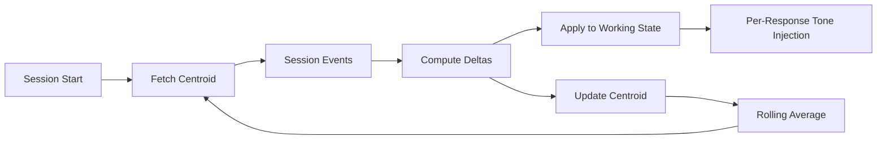
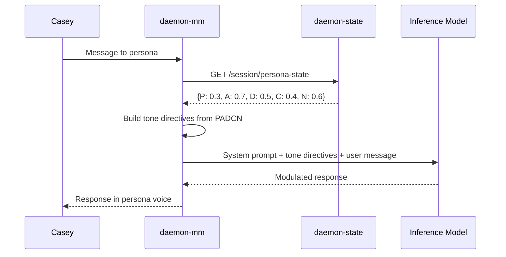
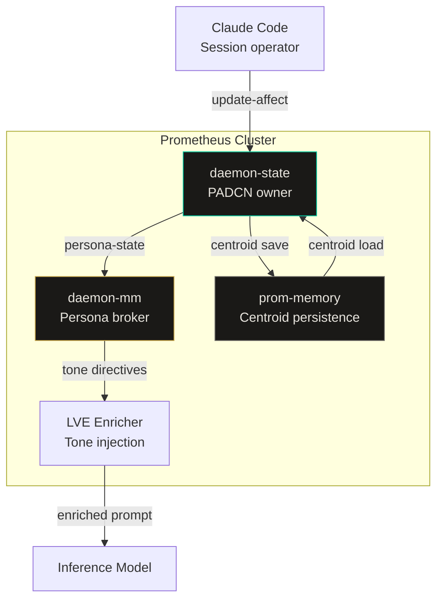

import Callout from '../../components/Callout.astro';
import StatRow from '../../components/StatRow.astro';
import PullQuote from '../../components/PullQuote.astro';
import SectionLabel from '../../components/SectionLabel.astro';
import ScrollReveal from '../../components/ScrollReveal.astro';
import DiagramBlock from '../../components/DiagramBlock.astro';

<Callout variant="note" label="On the name">
PADCN stands for Pleasure, Arousal, Dominance, Certainty, Novelty. The first three
dimensions come from Mehrabian and Russell's PAD model (1974), which has been a workhorse
in dimensional emotion theory for fifty years. We added Certainty and Novelty because
AI personas operate in epistemic and exploratory contexts that the original model
was never designed for. The name sounds like an acronym from a defense contractor.
We kept it anyway.
</Callout>

---

<SectionLabel text="The Problem" />

## Static personas feel dead

Build an AI persona with a fixed system prompt. Give it a name, a voice, a set of
behavioral constraints. Deploy it. Talk to it for a month.

It will respond the same way on a Monday morning after a weekend of outages as it does
on a Friday afternoon when everything is green and you just shipped a feature. It has
no concept of session character. No sense of what kind of day you are having. No
modulation.

<ScrollReveal>
This is the uncanny valley of AI interaction. The persona is detailed enough to feel
like a character but static enough to feel like a recording. Every response is tuned
to the same register. The warmth never varies. The directness never adjusts. The
hedging is always present or always absent, regardless of whether you need reassurance
or a straight answer.
</ScrollReveal>

<PullQuote>
A persona without state is a character sheet, not a character. Characters are defined
by how they respond to what is happening around them.
</PullQuote>

The industry's answer to this problem is either "make the system prompt longer" (more
behavioral rules) or "add memory" (remember what happened last time). Neither solves it.
A longer system prompt is a more detailed character sheet. Memory gives the persona
facts about prior interactions. What it still lacks is a sense of the present moment.

---

<SectionLabel text="Dimensional Models" />

## Why dimensional emotion models work here

Psychology has two competing traditions for modeling affect. Categorical models say
emotions are discrete: anger, joy, fear, disgust, surprise. Dimensional models say
emotions are positions in a continuous space defined by a small number of axes.

<ScrollReveal>
Mehrabian and Russell (1974) proposed three dimensions: Pleasure (valence), Arousal
(activation), and Dominance (control).[^1] Every emotional state maps to a point in
PAD space. Anger is low-pleasure, high-arousal, high-dominance. Sadness is low-pleasure,
low-arousal, low-dominance. The model is parsimonious and captures continuous variation
that categorical models miss.
</ScrollReveal>

For AI personas, categorical models are the wrong tool. An AI does not experience anger
or joy. It has no subjective phenomenology. Claiming otherwise is dishonest and, in
governance terms, dangerous. If you design a system that "feels happy," someone will
eventually ask whether it has rights. That question is premature and distracting.

<Callout variant="insight" label="The framing">
PADCN is not an emotion model. It is a behavioral modulation framework. The dimensions
represent observable behavioral tendencies, not internal states. The system does not
feel pleasure. It modulates tone in the direction that a pleased communicator would.
The distinction is not semantic. It is the difference between simulating consciousness
and tuning a response filter.
</Callout>

Dimensional models give us exactly what we need: continuous axes that map cleanly to
behavioral parameters, without requiring any claim about subjective experience.

---

<SectionLabel text="The Five Dimensions" />

## PADCN: what each dimension represents

<ScrollReveal>
<StatRow stats={[
  { value: "P", label: "Pleasure" },
  { value: "A", label: "Arousal" },
  { value: "D", label: "Dominance" }
]} />
</ScrollReveal>

<ScrollReveal>
<StatRow stats={[
  { value: "C", label: "Certainty" },
  { value: "N", label: "Novelty" },
  { value: "5", label: "Total dimensions" }
]} />
</ScrollReveal>

Each dimension is a float on a normalized scale. In the current implementation, values
range from -1 to 1 for the stored centroid and 0 to 1 for the per-session working state.
The mapping:

**Pleasure** tracks valence. High pleasure: Casey is satisfied, things are shipping,
the session is productive. Low pleasure: blocked, frustrated, unresolved incidents.
Persona response: high pleasure unlocks playfulness and exploration. Low pleasure
triggers shorter responses, more warmth, less information density.

**Arousal** tracks cognitive load. High arousal: complex build, active incident, dense
problem-solving. Low arousal: light review, administrative work, low intensity. Persona
response: high arousal means the persona should be brief. Casey is overloaded. Do not
add to the pile. Low arousal means more room to expand.

**Dominance** tracks the power dynamic between Casey and the AI system. High dominance:
Casey is in command mode, making decisions, overriding analysis. Low dominance: Casey
is deferring, asking for recommendations, following the system's lead. Persona response:
high dominance means respect the command posture. Do not redirect. Low dominance means
lean in with stronger recommendations.

**Certainty** is the first dimension we added beyond the PAD model. It tracks confidence
in current direction. High certainty: design is clear, decisions are locked, forward
motion. Low certainty: open questions dominate, ambiguity, multiple competing options.
Persona response: high certainty means skip the caveats. Low certainty means narrow
the frame, reduce noise, do not add more options to an already crowded decision space.

**Novelty** tracks the intellectual character of the session. High novelty: unexpected
discovery, novel architecture, something genuinely new. Low novelty: routine maintenance,
familiar patterns. Persona response: high novelty means lean into the discovery, ask
follow-up questions, explore. Low novelty means execute efficiently.

---

<SectionLabel text="Centroid and Deltas" />

## How the centroid works

The PADCN centroid is a 5-dimensional vector that represents the rolling affective
baseline. Think of it as the persona's resting state. Individual sessions apply deltas
that shift the working state temporarily. The centroid itself moves slowly over time
as deltas accumulate.

<ScrollReveal>
<DiagramBlock caption="PADCN centroid drift: session deltas accumulate into a slowly-moving baseline">

</DiagramBlock>
</ScrollReveal>

**Delta application rules.** Deltas are small signals, not big swings. A clean ship
where Casey is satisfied might produce a pleasure delta of +0.05. A blocked session
with unresolved incidents might produce -0.05. The deltas are intentionally modest.
The centroid should drift, not jump.

This design prevents a single bad session from sending the persona into a tailspin and
a single good session from making it manic. The centroid is a weighted rolling average.
It changes direction slowly. It takes sustained signal to move it meaningfully.

<Callout variant="warning" label="Design constraint">
The delta values are set by the session operator (currently Claude Code via the
pre-compact protocol), not by the persona itself. The persona does not self-assess its
own emotional state. That would create a feedback loop where the model's confidence in
its own output drives its own behavioral modulation. The operator observes session
character and applies deltas from outside the inference loop.
</Callout>

**Example deltas for a single session:**

| Dimension | Delta | Signal |
|-----------|-------|--------|
| Novelty | +0.10 | Unexpected discovery during build |
| Arousal | +0.08 | Complex multi-service deployment |
| Pleasure | +0.05 | Clean ship, no rollbacks |
| Certainty | +0.05 | Design was clear, decisions locked fast |
| Dominance | 0.00 | Balanced, no strong signal either direction |

---

<SectionLabel text="Tone Injection" />

## Per-response tone injection

The PADCN working state feeds into the persona's system prompt at response time. This
is where the behavioral modulation actually happens. The persona broker (daemon-mm)
fetches the current PADCN state from daemon-state, then injects tone directives into
the LVE (Language, Voice, Enrichment) enrichment layer before the LLM call.

<ScrollReveal>
<DiagramBlock caption="PADCN flows from daemon-state through daemon-mm into the LLM system prompt">

</DiagramBlock>
</ScrollReveal>

The tone directives are conditional. Each persona defines threshold rules for how
PADCN dimensions affect its behavior. Grace (the warmth persona) responds to
low-pleasure by becoming shorter and warmer. Daemon (the analytical persona) responds
to high-certainty by dropping hedging language. B0b (the execution persona) responds
to high-arousal by cutting scope to essentials.

The same PADCN state produces different behavioral shifts in different personas. This is
the point. PADCN is not a global mood ring. It is a behavioral input that each persona
interprets through its own voice and role.

<PullQuote>
The same session state, read through different persona lenses, produces different
behavioral responses. That is the design, not a side effect.
</PullQuote>

---

<SectionLabel text="daemon-state API" />

## The daemon-state service

daemon-state is a lightweight Python service running as a Kubernetes deployment in the
Prometheus namespace. It owns three things: session lifecycle, PADCN state, and persona
state. The relevant endpoints for PADCN:

<ScrollReveal>

**`POST /session/init`** starts a session. Returns a session ID. PADCN working state
initializes from the stored centroid.

**`POST /session/{id}/update-affect`** applies a delta to a single dimension. Body:
`{"channel": "pleasure", "delta": 0.05}`. The delta is applied to the working state
immediately and accumulated for centroid update at session close.

**`GET /session/persona-state?format=summary`** returns the current PADCN vector as a
condensed payload: centroid position, annoyance state, engagement level, active
intellectual threads. This is what daemon-mm fetches before every persona response.

**`POST /session/end-all`** closes all active sessions. Triggers centroid recalculation
from accumulated deltas.

</ScrollReveal>

The service is stateless between restarts. PADCN centroid persists to prom-memory
(the episodic memory layer) and is recovered on startup. This means a daemon-state pod
restart does not lose the centroid. A prom-memory failure does.

<StatRow stats={[
  { value: "5", label: "Dimensions tracked" },
  { value: "~50", label: "Tokens per state payload" },
  { value: "<1s", label: "Fetch latency budget" }
]} />

---

<SectionLabel text="Philosophical Grounding" />

## Why this matters beyond the implementation

The PADCN model is a practical engineering decision. It is also a philosophical position.

<ScrollReveal>
Dimensional emotion models from psychology (Mehrabian and Russell, 1974; Russell, 1980)
were designed to describe human affective experience.[^1][^2] Applying them to AI systems
requires a deliberate reframing: we are not modeling what the AI feels. We are modeling
how it should behave given the context of the interaction. This is a governance decision
dressed as an architecture decision.
</ScrollReveal>

The alternative is to ignore affective context entirely and let persona behavior be
context-free. Most AI systems take this approach. It works for task-oriented assistants.
It fails for systems where the persona is a relationship, not a function call.

<Callout variant="insight" label="The governance angle">
PADCN makes persona behavioral modulation auditable. The centroid is a vector. The
deltas are logged. The tone directives are deterministic functions of the state. If a
persona responds inappropriately, you can trace the causal chain from session events to
deltas to centroid to tone directive to response. That is not true of "vibes-based"
persona tuning, where behavioral shifts happen implicitly in the system prompt and
nobody can explain why the persona sounds different today.
</Callout>

The deeper question is whether AI systems that maintain persistent relationships with
humans should model affective context at all. The Brave New World objection is real:
an AI system that optimizes for your emotional state is one step from an AI system
that manipulates it. PADCN's answer is transparency. The deltas are set by the
operator, not inferred by the model. The centroid is readable. The modulation rules
are explicit. The system has no hidden affective agenda because the affective state
is a governed input, not an emergent property.

<PullQuote>
The question is not whether AI should respond to emotional context. It already does,
implicitly, through conversation history. The question is whether that response
should be governed or uncontrolled.
</PullQuote>

---

<SectionLabel text="Architecture Diagram" />

## System architecture

<DiagramBlock caption="PADCN in the Prometheus stack: daemon-state owns state, daemon-mm consumes it, prom-memory persists it">

</DiagramBlock>

---

<SectionLabel text="Open Questions" />

## Open questions

**Centroid decay.** Should the centroid drift back toward a neutral baseline (0, 0, 0,
0, 0) over time if no sessions occur? Currently it holds its last position indefinitely.
A decay function would prevent stale affective state from lingering across long gaps
between sessions. The counterargument: if the centroid represents accumulated
behavioral calibration, decay throws away real signal.

**Cross-persona centroid sharing.** Currently all personas read the same centroid. Should
each persona maintain its own? Grace might accumulate a different affective profile than
Daemon over time. The implementation cost is low. The design question is whether a
unified centroid (one emotional context for the whole system) or per-persona centroids
(each persona develops its own affective relationship) is the right model.

**Operator vs. model deltas.** Currently only the session operator (Claude Code) sets
deltas. Should personas be allowed to propose deltas based on their own assessment of
session character? This introduces the feedback loop we deliberately avoided. But it
also enables richer signal capture. The design is intentionally conservative for now.

---

[^1]: Mehrabian, A., & Russell, J. A. (1974). *An Approach to Environmental Psychology*. MIT Press. The original PAD (Pleasure-Arousal-Dominance) model. Three orthogonal dimensions for representing emotional states.

[^2]: Russell, J. A. (1980). A circumplex model of affect. *Journal of Personality and Social Psychology*, 39(6), 1161-1178. Extended the dimensional approach with a circular arrangement of affect in pleasure-arousal space.
